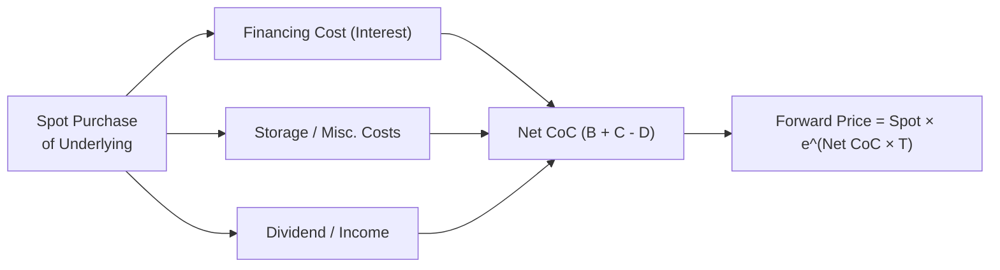

## Overview

Have you ever wondered why forward and futures contracts sometimes trade at a premium or discount to an asset’s spot price? Well, it’s often due to something called the “cost of carry” or CoC for short. I vividly recall my first time grappling with this concept, when I was in a study group for the CFA Program: one of my colleagues insisted that futures prices had to be higher than spot prices just because of interest rate costs—only to realize we also had to consider dividends and storage fees!

In this section, we’ll dive headfirst into the cost of carry model and see how it helps us figure out the fair value of forwards and futures. By the end, you’ll be able to apply these insights across a broad range of asset classes (equities, commodities, currencies, even bonds). More importantly, you’ll see how any deviation from theoretical fair value creates an opening for arbitrage—risk-free profit in an ideal world. Let’s get going!

## The Concept of Cost of Carry

At its core, the cost of carry approach states that the forward (or futures) price of an underlying asset is mostly determined by the following factors:

• The spot price of the asset right now.  
• The net financing cost (or opportunity cost) of buying and holding that asset.  
• Any direct costs of physically maintaining or storing the asset.  
• Any income, dividends, or yield that the asset generates while you own it.  
• For some commodities, a “convenience yield,” which represents the intangible benefit of actually having the physical commodity on hand.

If we think about it intuitively: if you want to purchase an asset today and hold it until a certain future date (the maturity of the forward or futures contract), you have to pay for it (which might involve borrowing money, incurring interest), possibly store it, and protect it (for a commodity, maybe you need insurance). At the same time, you might earn some yield if that asset pays dividends or interest.

When you throw all of these into one formula, you get a theoretical forward or futures price. If an actual contract’s market price drifts away from that theoretical price, well, that’s basically a green light to do an arbitrage trade (often called “cash-and-carry” or “reverse cash-and-carry”) so you can pocket a nearly risk-free profit. 

## Key Components of Cost of Carry

### Financing Cost

• Also known as the interest cost or opportunity cost, this is the cost you incur if you borrow money to buy the underlying asset.  
• For many derivatives markets, this financing cost is based on short-term interest rates (e.g., LIBOR in the past, or the relevant risk-free reference rate after the LIBOR transition).  
• If you have the funds and don’t need to borrow, this “cost” is essentially the lost opportunity to earn interest on that money elsewhere.  

Mathematically, if S₀ is the current spot price, and r is your relevant interest rate (continuously compounded for simplicity), then over T years, your financing cost is approximately S₀ × (e^(rT) – 1). In discrete compounding terms, you’d look at S₀ × (1 + rT) if T is small. The chosen convention depends on your modeling preference or the market norms.

### Storage and Insurance Costs

• For commodities like oil, corn, or gold, you might need to physically store the asset. That means paying rent or storage fees, plus insurance to protect against damage, theft, or spoilage.  
• Storage costs can be significant for bulky commodities (e.g., metals or grains) and minimal for intangible assets like equities (though one could view custody fees as an analog for “storage” in the equity world).  
• These costs generally shift the forward (or futures) price upward because they’re an additional expense of holding the asset.

### Income Yield (Dividends, Coupons, etc.)

• Some assets pay dividends (e.g., equities) or coupons (e.g., fixed-income securities). If you hold the underlying, you benefit from that income.  
• This effectively reduces the net cost of carry. Put differently, if you expect to receive a dividend ℓ during the life of a forward contract, that expected dividend will lower the forward price relative to a non-dividend-paying stock.  
• The same logic applies to coupon-bearing bonds used as the underlying for bond futures.  

### Convenience Yield

• Convenience yield is mostly relevant in commodity markets. It represents the non-financial benefits of actually having the physical commodity in your possession.  
• Think of a refiner that needs crude oil to maintain operations. Having physical crude on hand might prevent costly shutdowns (a potential intangible benefit).  
• Convenience yield reduces the effective cost of storing the commodity, thus pulling the forward or futures price downward.

### Putting It All Together

One common representation for the fair value of a forward price F₀, for maturity at time T (in a continuously compounded world), is:

F₀ = S₀ × e^((r + u – y)T)

Where:  
• S₀ = The current spot price  
• r = The risk-free or financing rate  
• u = The net storage costs (and possibly insurance) as a continuous rate  
• y = The income yield (dividend yield, coupon yield, or convenience yield)  

In a simpler discrete context, you might see:

F₀ = S₀ × (1 + r – y + u)^T

Of course, each market has its own conventions and exact formula tweaks, but the logic is the same: start with spot, add costs, subtract yields.

## Forward vs. Futures: A Quick Note

Before we jump into deeper examples, there’s a subtlety you should keep in mind:  
• Forwards typically settle at maturity and have no interim cash flows or margin requirements.  
• Futures are marked to market daily and require margin, so the interest you earn on your cash might vary.  

When interest rates are constant, the difference between forward and futures prices is often negligible. But in markets with significant rate volatility or correlation with the underlying, futures pricing can deviate slightly from the standard cost of carry formula. For now, we’ll keep it straightforward.

## Cost of Carry for Different Asset Classes

### Equities

Suppose you want to price a forward on a stock that pays an annual dividend yield of d. If you label r as the continuously compounded risk-free rate, the cost of carry formula says:

F₀ = S₀ × e^((r – d)T)

Interpretation:  
• You pay interest r for tying up the capital to buy the stock.  
• You gain dividend d from holding the stock. So net cost is (r – d).  

If the forward price in the market is higher than that theoretical fair value, you’d sell the forward (locking in the high price) and buy the stock on the spot market (funded by borrowing). The difference after paying interest and receiving dividends can lead to a risk-free gain at settlement.

### Commodities

For physical commodities like oil, gold, or agricultural products, the formula extends to:

F₀ = S₀ × e^((r + s – c)T)

Where:  
• s is the storage cost (expressed as a percentage of the commodity value).  
• c is the convenience yield.  

Gold, for instance, usually has relatively modest storage fees compared to something big and bulky like wheat. Plus, gold might have a lease rate in the precious metals lending market, which effectively reduces your carry costs. This is sometimes accounted for in c or as negative storage cost.

### Currencies

Foreign exchange forward pricing has a well-known cost of carry interpretation. If we let:

• S₀ = current spot exchange rate (domestic currency per unit of foreign currency),  
• r_d = domestic risk-free rate,  
• r_f = foreign risk-free rate,  
• T = time to maturity,

then the forward price F₀ is:

F₀ = S₀ × e^((r_d – r_f)T)

In discrete compounding, you might see:

F₀ = S₀ × (1 + r_d)^T / (1 + r_f)^T

This is covered under the concept of “covered interest rate parity.” If there’s a deviation from this relationship, arbitragers would borrow in one currency, convert, lend in another currency, and simultaneously enter into forward contracts to lock in a sure profit. In practice, large financial institutions do this daily, ensuring the spot–forward markets remain efficient.

### Bonds

For bond forwards (like a Treasury bond forward), you’d consider:  
• The opportunity cost of tying up capital.  
• The coupon payments the bond will pay until maturity.  

If the bond has a clean price S₀, you can simply discount each expected coupon to the present and incorporate that into your forward valuation. Alternatively, it can be framed in the same cost-of-carry logic:

F₀ = (S₀ – PV of coupons) × e^(rT)

(assuming continuous compounding and no storage or convenience yield for bonds).

## Arbitrage: The Engine That Brings Prices in Line

Cost of carry logic underlies why we often say, “If futures or forwards diverge from fair value, an arbitrage opportunity arises.” Let’s break down the two main flavors of arbitrage here:

1. **Cash-and-Carry Arbitrage**  
   - You see that the futures price is “too high” relative to the cost-of-carry-derived fair value.  
   - You borrow money at rate r to buy the asset in the spot market, incur storage costs (if any), and simultaneously sell the futures contract at the inflated price.  
   - At futures expiry, you deliver the underlying asset into your short futures position, repay the loan (plus interest), and keep any leftover as profit.  
   - Because you locked in your future selling price, the profit is (nearly) risk-free, ignoring transaction and storage complexities.

2. **Reverse Cash-and-Carry (or “Carry-and-Cash”)**  
   - You see that the futures are “too low.”  
   - You short-sell the asset in the spot market, invest the proceeds at rate r, and buy the futures contract.  
   - At maturity, you take delivery from your long futures position and use it to close out your spot short.  
   - Again, you pocket a spread if the forward/futures price is sufficiently low relative to theory.

In practice, these trades can get complicated with margin requirements, liquidity constraints, transaction costs, etc. Also, you might not always be able to short the underlying easily (e.g., a particular commodity for which shorting is complex). But from a theoretical vantage, any persistent mispricing invites arbitrageurs to come in and trade away the discrepancy.

## A Diagram Illustrating Cost of Carry

Here’s a quick Mermaid diagram to visualize the flow of costs and benefits in a simple scenario (e.g., equity with a dividend):

• Financing and storage costs flow in one direction, raising your net cost, while dividends or yields flow back in the opposite direction, reducing the net cost.  
• The sum total effectively sets the forward price.

## Practical Examples

### 1) Forward on a Non-Dividend-Paying Stock

• Spot price (S₀) = $100.  
• Annual risk-free rate (r) = 5% (assume continuous compounding).  
• Time to maturity (T) = 6 months (0.5 years).  

Using the simplified cost of carry:

F₀ = 100 × e^(0.05 × 0.5)  
   ≈ 100 × e^(0.025)  
   ≈ 100 × 1.0253  
   ≈ $102.53  

If the actual forward in the market is at $103, you might sell the forward at $103, borrow $100 at 5% for 6 months, buy the stock for $100. After six months, you deliver the stock to the forward buyer, and repay the loan. Assuming everything goes smoothly, that small difference from $102.53 to $103 is pure arbitrage profit (ignoring transaction costs).

### 2) Gold Futures

Let’s say:  
• Spot price of gold is $1,800/oz.  
• Risk-free rate = 2% per year (continuously compounded).  
• Storage + insurance = 1% per year.  
• Lease rate or convenience yield (if we treat it as c) = 0.5% per year.  
• T = 1 year.  

So net carrying cost = r + s – c = 2% + 1% – 0.5% = 2.5%.

Hence:

F₀ = 1,800 × e^(0.025 × 1)  
   = 1,800 × e^(0.025)  
   ≈ 1,800 × 1.0253  
   ≈ $1,845.54

If the market trades gold futures at $1,850, that’s only about a $4.46 difference from the theoretical fair value. This small difference might be gobbled up by transaction costs. If it’s more than enough to overcome commissions, storage intricacies, and embedded financing costs, an arbitrage is possible.

### 3) FX Forward

Suppose:  
• Spot USD/EUR = 1.2000 (meaning $1.20 per €1).  
• Domestic USD interest rate (r_d) = 1%.  
• Euro interest rate (r_f) = –0.5%.  
• T = 1 year, continuous compounding.  

Forward:

F₀ = 1.20 × e^((0.01 – (–0.005))×1)  
    = 1.20 × e^(0.015)  
    = 1.20 × 1.0151  
    ≈ 1.2181  

This would be the no-arbitrage forward price for a 1-year USD/EUR forward contract, ignoring transaction costs. If the forward is at 1.22, the difference is close enough that many times you’ll see institutions trying to do covered interest rate arbitrage.

## Common Pitfalls and Practical Considerations

• **Transaction Costs:** If these are large, they can wipe out your theoretical arbitrage profits.  
• **Short-Selling Constraints:** If you need to short an asset but find it’s not readily available, the arbitrage may not be feasible.  
• **Credit Risk and Margin Requirements:** In derivatives markets, you’ll face initial margin, variation margin, and potential risk of counterparty default.  
• **Uncertainty in Yields and Storage Costs:** Dividends might be uncertain (a company can change its dividend policy), or convenience yield can vary drastically.  
• **Funding Rates vs. Risk-Free Rates:** In reality, your borrowing rate might be higher than the risk-free rate. That changes your net carry cost.  

Despite these real-world nuances, the cost of carry framework remains the fundamental building block for understanding and pricing forward or futures contracts.

## Exam Relevance and Final Tips

• **CFA Relevance:** You’ll see the cost of carry show up in forward/futures pricing problems, as well as in multi-asset arbitrage questions. Familiarity with these concepts is crucial whether you’re dealing with fixed-income forward contracts, equity index futures, or currency forwards.  
• **Constructed-Response (Essay) Format:** Be prepared to outline the formula, walk through each cost component, and discuss how an arbitrage might be executed if there’s a pricing discrepancy.  
• **Item Set (Vignette) Format:** Expect to read a scenario with given rates, yields, or costs, and then identify if the forward/futures is underpriced or overpriced.  
• **Time Management:** In your exam, keep these formulas at your fingertips. A quick calculation can often reveal whether an arbitrage is possible—but don’t get bogged down. Show your steps methodically.  

## References and Further Reading

- CFA Program Curriculum, Derivatives Readings on Forward and Futures Pricing  
- Hull, J. C. “Fundamentals of Futures and Options Markets.” Pearson  
- Fabozzi, F. “The Handbook of Fixed Income Securities.” McGraw-Hill  
- Global regulatory frameworks & accounting standards (IFRS and US GAAP) on derivative disclosures  
- “Covered Interest Rate Parity” articles in leading finance journals  

---

## Test Your Knowledge: Cost of Carry Model for Pricing



### Which of the following best describes the “cost of carry”?

- [ ] The net profit from executing a carry trade in FX markets.
- [x] The total cost or benefit associated with holding the underlying asset, including financing, storage, and yield.
- [ ] The accounting charge allocated to overhead costs for derivative positions.
- [ ] The notional amount of a forward contract as reported in financial statements.

> **Explanation:** The “cost of carry” refers to the expenses and benefits (financing costs, storage fees, dividends, etc.) of holding an underlying asset until the expiration of a forward/futures contract.

### If the futures price is below the fair value suggested by cost of carry, which strategy might an arbitrageur employ?

- [x] Reverse cash-and-carry arbitrage (short the spot asset, invest proceeds, go long futures).
- [ ] A standard cash-and-carry arbitrage (buy spot, short futures).
- [ ] Write a covered call option and wait for convergence.
- [ ] Immediately purchase physical commodities to store until contract maturity.

> **Explanation:** When the futures price is too low, you generally short the spot asset and go long the futures (“reverse cash-and-carry”) to exploit the mispricing.

### In a continuously compounded model, which of the following formulas typically represents the forward price when there is a dividend yield (y) but no storage cost or convenience yield?

- [ ] F₀ = S₀ × e^((r + y)T)
- [ ] F₀ = S₀ × e^((r – s + c)T)
- [x] F₀ = S₀ × e^((r – y)T)
- [ ] F₀ = S₀ × e^((y – r)T)

> **Explanation:** The correct formula for a dividend-paying asset is F₀ = S₀ × e^((r – y)T), as the dividend yield offsets part of the financing cost.

### Convenience yield is best explained as:

- [ ] A special type of interest earned on physical assets or commodities stored at a bank.
- [ ] A legal fee associated with storing physical commodities in bonded warehouses.
- [x] A non-monetary benefit or advantage gained from physically holding a commodity.
- [ ] The difference between spot price and forward price during a market squeeze.

> **Explanation:** Convenience yield is the intangible benefit of owning a physical commodity (e.g., ensuring continuous production or avoiding delivery uncertainties).

### In the FX market, covered interest rate parity implies which relationship?

- [ ] F₀ = S₀ × (1 + r_f) / (1 + r_d)
- [ ] F₀ = S₀ / (1 + r_f)^T
- [x] Forward Price = Spot × e^((r_d – r_f)T) (or the discrete version (1 + r_d)^T / (1 + r_f)^T)
- [ ] F₀ = S₀ × (1 + r_d)^T × (1 – r_f)^T

> **Explanation:** Covered interest rate parity states that the forward exchange rate should reflect the interest rate differential between the domestic and foreign currencies.

### An asset that pays no dividends and has no storage costs shows a futures price higher than theoretical fair value derived using the risk-free rate. Which arbitrage strategy would most likely be employed?

- [x] Borrow cash, buy the asset in the spot market, and short the futures contract.
- [ ] Short the asset in the spot market, invest proceeds, and go long the futures contract.
- [ ] Buy the asset and take no derivatives position.
- [ ] Short both the asset and the futures contract simultaneously.

> **Explanation:** This is standard cash-and-carry arbitrage: you borrow to buy the asset and simultaneously short (sell) the overpriced futures.

### Which of the following best describes how storage and insurance costs affect the forward price of a commodity?

- [ ] They decrease the forward price because they reduce the total demand for the commodity.
- [x] They increase the forward price because they add to the overall cost of carrying the commodity.
- [ ] They have no impact if the commodity generates no income.
- [ ] They only matter if convenience yield is zero.

> **Explanation:** Storage and insurance costs contribute to an overall higher “carrying cost,” thereby increasing the fair value of forward/futures prices.

### An equity index features a known and constant dividend yield. How is this reflected in the cost of carry model for its futures contract?

- [ ] Dividend yield has no place in the cost of carry model for equity indices.
- [ ] It is added to the carrying charge to get the net cost of carry.
- [x] It offsets part of the financing cost, reducing the futures price.
- [ ] It is only relevant if the index also pays coupons.

> **Explanation:** The dividend yield lowers the effective cost of holding the index, thus reducing the futures price relative to a non-dividend-paying asset.

### A reverse cash-and-carry arbitrage typically does NOT require:

- [ ] Short-selling the underlying spot asset.
- [ ] Investing the proceeds at a risk-free (or low-risk) rate.
- [ ] Buying the futures contract.
- [x] Paying a coupon or dividend.

> **Explanation:** A reverse cash-and-carry doesn’t inherently involve receiving or paying coupons or dividends. Instead, it involves short-selling the underlying and going long the futures, with proceeds invested at the risk-free rate.

### True or False: If actual market forward prices are exactly equal to the cost-of-carry-derived fair value, no arbitrage opportunities exist.

- [x] True
- [ ] False

> **Explanation:** When the forward or futures price matches the theoretical cost-of-carry fair value, there’s no mispricing to exploit. Hence, no arbitrage strategy can yield risk-free profit.


