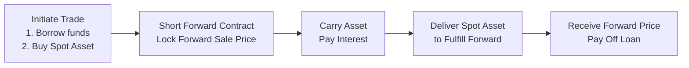
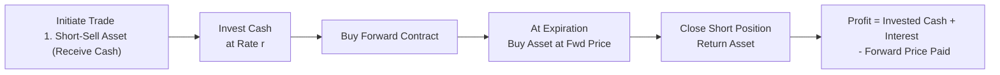

## Introduction
Sometimes, when discussing arbitrage in derivatives, I like to recall a time in my early trading days when I first stumbled upon the concept of “cash-and-carry.” This strategy sounded like a no-brainer to me: buy an asset today, tuck it away (carrying it), and lock in a profit by selling it forward at a higher price. However, as I learned, there’s more to it than meets the eye. In this section, we’ll study why these strategies exist, how they align forward and futures prices with fair values, and the pitfalls to watch out for.  

We’ll dive into the standard cash-and-carry strategy first, then flip things around and examine its opposite—the reverse cash-and-carry trade. Along the way, we’ll flesh out the cost-of-carry model and see how interest, storage, and short-sale constraints can shape our final result. Let’s get started.

## The Cost-of-Carry Principle
At its core, cash-and-carry depends on a cornerstone idea known as the cost-of-carry. In earlier discussions on forward and futures pricing, you might recall that the fair forward price F₀ for an asset with no income or storage costs can be written as:

 F_0 = S_0 \times (1 + r)^T 

where:  
• S₀ is the current spot price of the underlying asset.  
• r is the appropriate financing rate (the cost of borrowed funds).  
• T is the time to maturity (in years).  

For commodities or other assets requiring storage or generating income, you might see adjustments for storage costs (let’s denote them C) and for any yield or dividend the asset might pay (denote such income by Y). A more general formula for the forward price could look like:

 F_0 = (S_0 + C - Y) \times (1 + r)^T. 

If you’re dealing with continuous compounding, you may see:

 F_0 = (S_0 + C - Y) \times e^{rT}, 

but the intuition remains the same. Whenever the actual forward or futures price diverges from this theoretical no-arbitrage level, a profit opportunity may arise through either a cash-and-carry or a reverse cash-and-carry strategy.

## Mechanics of Cash-and-Carry Arbitrage
At a high level, a cash-and-carry strategy involves (1) buying the asset in the spot market, (2) simultaneously entering a short position in a forward (or futures) contract on that asset, and (3) financing the spot purchase with borrowed funds (if no internal capital is available). The “carry” part refers to the cost of holding the asset until the forward contract expires.

Imagine a scenario in which the forward price is significantly higher than the cost-of-carry formula suggests. This discrepancy indicates the forward contract might be overpriced relative to the spot.

Below is a step-by-step breakdown:

• Step 1: Borrow funds at interest rate r and purchase the asset in the spot market at price S₀.  
• Step 2: Immediately enter into a short forward contract that obligates you to deliver the asset on the settlement date at price F₀ (the forward price).  
• Step 3: Over time, you “carry” the asset, incurring borrowing costs (and possibly storage costs or other holding expenses).  
• Step 4: At expiration, deliver the previously purchased asset into the forward contract. You receive F₀ from the forward contract and use part of that cash to pay back the borrowed principal plus accrued interest.  

The profit (ignoring transaction and storage costs for simplicity) is:

Profit = Forward Price Received – (Spot Price + Financing Costs).

If the forward price is above the sum of your spot purchase price and cost of carry, you lock in a risk-free gain.

## Example: A Basic Cash-and-Carry
Suppose you notice the following conditions for a one-year period:  
• The asset’s current spot price S₀ = \$100.  
• A risk-free interest rate r = 5% per annum, simple interest.  
• The forward price F₀ quoted in the market for one-year delivery is \$107.  

Using the simplified cost-of-carry model, the fair forward price theoretically should be:

F₀ (fair) = 100 × (1 + 0.05) = \$105.

But the market is quoting \$107, which is higher. Your steps:

1. Borrow \$100 at 5% for one year.  
2. Buy the asset at \$100.  
3. Short a forward contract to deliver the asset in one year at the forward price of \$107.  

At the end of one year:  
• You owe the bank \$105 (the borrowed \$100 plus \$5 interest).  
• You deliver the asset into the forward contract and receive \$107.  
• Your net profit is \$107 – \$105 = \$2.  

Under perfect market conditions, this \$2 is effectively risk-free once you’ve locked in your trades. If transaction and storage costs are negligible, you pocket the \$2. Easy, right? Well, real life might present complications such as:

• Funding constraints and collateral.  
• Margin requirements.  
• Storage or insurance fees.  
• Potential short-selling bans or constraints in certain markets.  

But theoretically, that’s how a cash-and-carry trade is supposed to work.

## Mermaid Diagram: Cash-and-Carry Flow
Below is a visual representation of the cash-and-carry flow, from trade inception to expiry, in a mermaid diagram.

## The Reverse Cash-and-Carry Strategy
Now let’s talk about the other side of the coin, commonly referred to as a reverse cash-and-carry. This strategy arises when the forward price for an asset is too low relative to the cost of carry.  

A reverse cash-and-carry can be understood as “short the spot, buy the forward.” In other words:

• Step 1: Short-sell the asset in the spot market (so you receive cash upfront from the sale).  
• Step 2: Lend the cash proceeds at rate r (or invest them in some risk-free instrument) if you choose.  
• Step 3: Enter a long position in the forward contract to buy back the asset at maturity at forward price F₀.  

If the forward price is significantly below the sum of the spot price and cost-of-carry, you can lock in a profit. By the time the forward contract expires, you naturally buy back the asset under the forward contract (at the lower forward price), then return the shares (or the borrowed asset) to close out your short position, pocketing any difference.  

## Example: Reverse Cash-and-Carry in Action
Imagine the following:

• Spot price S₀ = \$100.  
• Annual interest rate r = 5%.  
• Forward price F₀ in the market = \$103 (underpriced compared to the fair theoretical \$105).  

You might short-sell the asset at \$100, obtaining \$100 in cash. You invest that \$100 at 5%. Simultaneously, you purchase a forward contract at F₀ = \$103. After one year, you’ll have:

• \$100 × (1 + 0.05) = \$105 from your short-sale proceeds invested at 5%.  
• You buy back the asset at \$103 (paying \$103).  
• Return this asset to close your short position.  

Your net profit is \$105 – \$103 = \$2. Again, this is the simplified case ignoring transaction costs, potential short-sale fees, or the possibility of margin calls. The basic insight is that if the forward price is too low, you lock in gains by effectively “carrying” a short position on the asset until expiry.

## Additional Considerations
Cash-and-carry and reverse cash-and-carry sound straightforward in theory, but real markets add complexities:

• Margin Requirements & Collateral:  
  In futures markets, you’ll often need to post initial margin, and you’ll face margin calls if your position moves against you. This can tie up capital or affect your overall expected return.  

• Transaction & Carrying Costs:  
  Expect to pay transaction fees when opening positions, plus any relevant commission. When dealing with commodities, there might be storage, insurance, or spoilage costs that can shift the break-even points significantly.  

• Short Sale Constraints:  
  Some assets are easier to short than others. If borrowing fees to short-sell are high, part of your theoretical profit might get eaten up. Some equities or markets also impose restrictions or bans on short sales, complicating the feasibility of a reverse cash-and-carry.  

• Funding Liquidity:  
  Your borrowing cost might differ from the theoretical risk-free rate—especially if your credit profile or available lines of credit command a higher (or lower) rate. This difference can tilt the viability of the trade.  

• Market Impact:  
  Large trades can move prices, especially in less liquid markets, so the actual forward or spot quotes you get might differ from the quotes you see on the screen once you start placing orders.  

• Volatility & Timing:  
  While arbitrage is theoretically risk-free at expiration if you hold your positions throughout, there could be short-term volatility or cash-flow demands that create practical risks.  

Despite these real-world factors, when you net everything out, the presence of even small arbitrage strategies helps keep prices in line with theoretical fair values.

## Another Mermaid Diagram: Reverse Cash-and-Carry Flow
To illustrate the reverse cash-and-carry flow:

## Alignment with the CFA Institute Code and Standards
From an ethics and professional standards perspective, the principal concern with arbitrage activities typically relates to ensuring no misuse of nonpublic information (Standard II(A)) and upholding market integrity and client interests. So if you spot a mispricing in open markets using publicly available information, you’re well within ethical boundaries to execute a legitimate cash-and-carry. Just be cautious about the sources of data you rely on, and follow standard best practices in your trading.

## Common Pitfalls and Best Practices
Below are a few points to keep in mind when engaging in arbitrage-based strategies in a real trading environment:

• Underestimating Costs: Even seemingly small fees—trading spreads, borrowing costs, or short-sale fees—could completely eat up a “guaranteed” riskless profit.  
• Unexpected Corporate Actions: For equity-based assets, dividends, share repurchase programs, and corporate announcements can alter effective forward prices or spot availability.  
•Liquidity Shocks: Sudden market sell-offs might change the cost of borrowing or even push up the short-sale fee.  
• Regulatory Issues: Different jurisdictions have varied rules on short-sales and margin requirements, so if you operate cross-border, ensure your firm’s compliance is rock-solid.  

## Putting It All Together
Cash-and-carry and reverse cash-and-carry trades underscore the heart of derivatives arbitrage: a forward or futures price must converge to its fair, no-arbitrage value, or else arbitrageurs swoop in to exploit the gap. While the pure theory looks simple, real life is, well, complicated. Transaction costs, collateral requirements, short-sale fees, and other friction points mean that not every small discrepancy is profitable to exploit—but large ones sure can be.

In advanced portfolio management contexts (such as those encountered in exotic markets or multi-asset funds), these strategies can be used to:

• Lock in risk-free returns when conditions are just right.  
• Construct synthetic long or short positions if it’s more cost-effective than directly buying/selling.  
• Hedge exposures by combining forward/futures and spot market transactions in an integrated approach.  

## Conclusion and Exam Tips
For CFA Level III exam candidates, cash-and-carry and reverse cash-and-carry strategies often appear as either short-essay or item-set questions in which you identify mispricings and calculate a potential arbitrage profit. Here are some tips:

• Always check if the forward (or futures) price is trading above or below its fair theoretical cost-of-carry value.  
• Calculate the implied forward price from the spot, factoring in (1) interest or financing cost, (2) storage or convenience yield, and (3) dividends or yield on the underlying.  
• Compare the theoretical fair forward to the actual market forward price to see if there is a discrepancy you can exploit.  
• Lay out your steps carefully, detailing the initial cash flows and the final cash flows. The net difference is your arbitrage profit.  
• Watch out for errors in annualizing rates—misapplied interest rates (simple vs. compounding) can lead to big mistakes.  
• Mention possible practical constraints when discussing real-life applicability.  

By mastering these concepts, you not only gain an effective risk-free profit framework but also develop a solid understanding of how derivative markets self-correct for pricing inefficiencies.

## References and Further Reading
• Hull, John C. “Options, Futures, and Other Derivatives.” Chapters on Forward and Futures Pricing.  
• Kolb, Robert W., and James A. Overdahl. “Futures, Options, and Swaps.” Wiley.  
• CFA Institute. 2025 Curriculum, Derivatives and Portfolio Management for the CFA Program.  

## Test Your Knowledge: Cash-and-Carry and Reverse Cash-and-Carry Arbitrage



### Which of the following best describes a cash-and-carry arbitrage opportunity?
- [x] Buying the underlying asset in the spot market and shorting a forward contract to lock in a risk-free profit.
- [ ] Short-selling the underlying asset and selling a forward contract to lock in a risk-free profit.
- [ ] Buying a forward contract and simultaneously shorting a futures contract of the same underlying.
- [ ] Entering a long futures position without taking any position in the spot market.

> **Explanation:** Cash-and-carry involves buying the spot asset (potentially financed by borrowing) and taking a short position in a forward or futures on the same asset.

### A cash-and-carry strategy is profitable when:
- [x] The forward price exceeds the spot price plus financing and carrying costs.
- [ ] The spot price is significantly below the fair value implied by interest rates.
- [ ] The forward price is equal to the spot price minus carrying costs.
- [ ] The forward price is lower than the spot price plus carrying costs.

> **Explanation:** If the forward price is higher than (Spot + carrying costs), an arbitrageur can buy the spot, short the forward, and earn a riskless profit.

### In a reverse cash-and-carry scenario, how does an arbitrageur typically begin the trade?
- [x] By short-selling the asset and simultaneously going long a forward contract.
- [ ] By buying the asset in the spot market and financing it with borrowed funds.
- [ ] By posting margin on an existing futures contract in the same market.
- [ ] By engaging in spread trading between two different expiry futures contracts.

> **Explanation:** The reverse cash-and-carry starts with a short sale of the spot asset and a long forward contract, aiming to exploit a forward price that is too low.

### Which of the following costs is generally most relevant when evaluating a cash-and-carry trade on physical commodities?
- [x] Storage and insurance fees.
- [ ] Dividend yield on the stock.
- [ ] Conversion factor adjustments.
- [ ] Bond duration mismatch cost.

> **Explanation:** Physical commodities often entail storage, insurance, or spoilage costs, which must be factored into the overall cost-of-carry.

### When short-selling is heavily restricted or costly, which arbitrage strategy becomes practically more difficult?
- [x] Reverse cash-and-carry arbitrage.
- [ ] Cash-and-carry arbitrage.
- [ ] Net option-based arbitrage.
- [ ] Synthetic call creation using forward contracts.

> **Explanation:** Reverse cash-and-carry often requires short-selling the asset, which becomes more expensive or impossible if heavy restrictions are in place.

### The general no-arbitrage condition for a forward contract on a non-dividend-paying stock using single-period compounding is:
- [x] F₀ = S₀ × (1 + r)^T.
- [ ] F₀ = S₀ + (r × T).
- [ ] F₀ = S₀ × e^(-rT).
- [ ] F₀ = (S₀ - Dividend) × (r).

> **Explanation:** For a non-dividend-paying stock under simple compounding, the forward price must equal the spot price times (1+r)^T to avoid arbitrage.

### In a classical cash-and-carry trade, the arbitrageur’s profit at maturity is given by:
- [x] Forward Price received – [Spot Price + Financing Cost].
- [ ] Forward Price received + [Spot Price + Financing Cost].
- [ ] (Spot Price + Financing Cost) – Forward Price received.
- [ ] The difference between the risk-free rate and the yield on the asset.

> **Explanation:** The arbitrageur sells the underlying at the forward price and must repay the borrowed spot price plus any incurred borrowing (financing) cost to calculate the net profit.

### If the forward price is set exactly at the cost-of-carry fair value, which statement is accurate?
- [x] No arbitrage opportunity exists, as there is no mispricing.
- [ ] A cash-and-carry trade guarantees a small but positive return.
- [ ] A reverse cash-and-carry trade guarantees a small but positive return.
- [ ] Both cash-and-carry and reverse cash-and-carry are profitable.

> **Explanation:** When the forward market price aligns perfectly with the theoretical cost-of-carry, neither a standard nor a reverse arbitrage creates a profit.

### Suppose you’re analyzing a reverse cash-and-carry arbitrage that requires short-selling a difficult-to-borrow underlying. Which factor could render this trade infeasible?
- [x] High short-selling fees that exceed potential arbitrage profits.
- [ ] A fundamental shift in interest rate policy by the central bank.
- [ ] A pre-existing long position that offsets the short sale.
- [ ] Low transaction costs in the futures market.

> **Explanation:** Steep borrowing fees for the short sale can erode or eliminate the profit from a reverse cash-and-carry strategy.

### True or False: Cash-and-carry arbitrage opportunities can exist indefinitely without attracting market participants.
- [x] True
- [ ] False

> **Explanation:** Actually, in well-functioning markets, these opportunities are quickly exploited and disappear. However, if market frictions or regulatory barriers are severe, the mispricing could persist longer than expected. That said, typically, investors are drawn to risk-free profits, so these opportunities don’t last.


