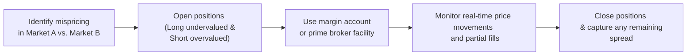

## Introduction

Imagine sitting at your trading desk, coffee in hand (okay, maybe I much prefer tea, but that’s just me), observing multiple screens packed with live quotes. Suddenly, you notice that a particular stock trades at $100 on Exchange A but is simultaneously quoted at $101 on Exchange B. Your immediate thought is: “Hey, there’s a quick buck here if I can buy low and sell high!” That, in its simplest sense, is arbitrage. But the real world? Well, it can be trickier than a neat textbook example.

In this section, we’ll investigate the nitty-gritty of arbitrage strategies and how they really get implemented. From margin accounts and short-selling to dealing with clearinghouses and partial fill risk, it’s all about bridging that gap between neat theoretical formulas and the messy realities of trading.

## Setting Up Arbitrage Trades in Real-World Environments

### Margin Accounts and Borrowing

Before you can jump into an arbitrage trade, you’ll typically need a margin account. A margin account is a type of brokerage account where you can borrow money based on the value of your existing holdings. Arbitrage strategies—especially those involving simultaneous long and short positions—often rely on accessing leverage. This is because you need immediate funding to purchase the underpriced asset while potentially shorting the overpriced one.

• Margin Call Dynamics: When you hold a leveraged position, if market moves go against you, the broker may require extra capital to meet margin requirements. Timing is everything. If you fail to post margin, they’ll close out your trade, sometimes at an inopportune moment—your possible “risk-free” profit might vanish in a flash.

• Prime Broker Services: If you’re a hedge fund or large institutional trader, you’ll likely work with a prime broker. Your prime broker helps clear your trades, keep custody of your assets, and (hopefully) provide attractive financing rates. This arrangement reduces operational frictions and speeds up the entire process.

### Short-Selling Logistics

In many classic arbitrage strategies, you short the overpriced security and buy the underpriced one. That means you’ll need to borrow shares (or bonds, or whatever asset you’re shorting) from someone else, typically facilitated by your broker or custodian.

1. Locating and Borrowing Assets: 
   – The broker finds someone willing to lend the securities (it could be a pension fund or insurance company that has a large holding).  
   – You pay a fee for borrowing these securities, often referred to as a stock borrowing fee or repo rate if we’re talking fixed-income instruments.  
   – Because availability can be tight, you might pay an unexpected premium. That premium, in turn, can erode your would-be arbitrage profit.

2. Collateral Requirements:  
   – The lender generally requires collateral (like cash or high-grade bonds) equal to or exceeding the current market value of the borrowed securities.  
   – Your prime broker typically handles these details, updating collateral needs if prices fluctuate.

3. Partial Fill Risk:  
   – If you plan on shorting 1,000 shares but the market only has 400 shares available to borrow, you might get stuck with a partial fill. This partial fill could reduce or even ruin the trade’s profitability.

## Electronic Trading and Algorithmic Execution

### Rapid Detection of Pricing Discrepancies

Humans are quick. Computers, though, are relentless. In today’s markets, specialized algorithms run at blazing speeds to detect minuscule divergences in price across different trading venues. This approach—often called “latency arbitrage”—relies on getting the information fractionally earlier than everyone else. It sounds eerily like science fiction, but it’s just modern finance.

Algorithmic trading strategies typically incorporate:

• Data Feeds: High-speed market data.  
• Smart Order Routing: Automated selection of the best trading venue.  
• Real-Time Position Monitoring: Instant feedback if trades fail to fill or if margin is nearing a limit.  
• Risk Checks: Automated cutoff triggers if the market moves abruptly.

### The Challenge of Lead and Lag

Let’s say your arbitrage model signals a pair trade between two equity index futures on different exchanges—possibly in Chicago and London. If your network connection to London is slightly slower, you might lose a crucial fraction of a second. Maybe that doesn’t sound like a big deal. But trust me, in high-frequency trading, that fraction can mean the difference between profit and a complete miss.

## Role of Clearinghouses, Broker-Dealers, and Banks

### Clearing Risk

A clearinghouse stands in the middle of the transaction, guaranteeing both sides of a trade. For exchange-traded instruments (like futures), the clearinghouse effectively becomes your counterparty, which reduces counterparty risk. However, the clearinghouse also has margin and collateral requirements:

• Variation Margin: Mark-to-market losses must be offset by daily payments into your margin account.  
• Initial Margin: You deposit a capital cushion upfront.  
• Additional Haircuts: For thinly traded or risky assets, the clearinghouse might impose even higher collateral demands.

### Settlement Cycles and Capital Costs

Not all markets settle at the same pace. Some might clear trades in one day, while others take two or three business days. This mismatch can create funding costs or complicate the timing of your open positions. When a settlement delay occurs, you might need additional liquidity—often borrowed at a cost—to cover the interim period. This is real money that slices into your theoretical arbitrage profit.

## Real-Life Factors That Complicate Arbitrage

### Transaction Costs

No matter the market, trades cost money. You pay bid–ask spreads, commissions, exchange fees—sometimes even taxes. Those expenses can quickly erode the theoretical risk-free returns. Worse yet, if the market’s spread widens at the moment you want to trade, your entire strategy might become unprofitable in seconds.

### Execution Risk and Partial Fills

Imagine you plan to buy 1,000 shares on Exchange A at $100 and sell 1,000 shares on Exchange B at $101. But you only get 300 shares sold on Exchange B before the price over there starts dropping—so you have a leftover 700 shares on the buy side. Now you have a partially hedged position, and the price advantage might have evaporated while you were trying to complete the second leg.

### Settlement Risk

Even if you successfully execute your two-leg arbitrage trade, what if the other party fails to deliver? In large, well-regulated markets, settlement failures are rare. Yet it can happen—especially in over-the-counter (OTC) environments with lower credit-quality counterparties. If you rely on your prime broker to mitigate these risks but they pull your credit line, that’s another potential blow to your capital needs.

## Advanced Technologies for Near-Instantaneous Arbitrage

### High-Frequency Trading (HFT)

Some institutional traders utilize colocation facilities—fancy data centers physically close to the exchange servers—to shave off microseconds of latency. Groups employing these strategies might trade millions of shares a day just to squeeze out small price inefficiencies. The key is speed. And not just speed in detecting the mispricing, but also in placing and confirming the orders.

### Smart Order Routing

Smart order routing (SOR) algorithms help decide where and how to execute trades. If an exchange’s order book is thin, the order might be directed elsewhere, or it might be split among multiple venues. SOR tries to optimize fill rates and price execution in real time, toggling among different possible trade destinations.

### Real-Time Arbitrage Monitoring

Large players often program their systems to track cross-asset relationships automatically. For instance, an algorithm might watch for mispricings between a stock index futures contract and the basket of underlying shares, or between an American Depository Receipt (ADR) and its foreign-listed counterpart. The system attempts to exploit these discrepancies the moment they appear, essentially running a continuous watch for “free lunches.”

## Diagram: Typical Arbitrage Workflow

Below is a simplified flowchart illustrating the typical steps in executing an arbitrage trade, from spotting a mispricing to locking in a profit. Of course, reality may require constant monitoring in case the trade goes awry!

## Case Example: Stock Index Arbitrage

Let’s walk through an example (though a bit simplified) of stock index arbitrage:

1. You notice a futures contract on a major stock index is trading at a premium above its fair value (spot index plus cost of carry).  
2. You buy the underlying basket of stocks cheaply (spot) and short-sell the overpriced index futures.  
3. Over the next few weeks, as expiration approaches, the futures price converges to the fair value of the underlying spot index.  
4. You close both positions and lock in the difference, which represents your arbitrage gain—minus, of course, transaction fees and financing costs.

The complication? Borrowing all the underlying stocks at scale might be tough. And if your aggregator doesn’t replicate the index perfectly, or if you can’t short enough futures contracts, your payoff might not exactly match the theoretical predictions taught in Chapter 7.4 (Cash-and-Carry and Reverse Cash-and-Carry Strategies).

## Best Practices and Pitfalls

• Keep an Eye on Liquidity: Make sure you can open and close trades at volume. Illiquid markets can deliver big price moves just when you need to unwind your position.  
• Diversify Your Funding Sources: Relying on a single prime broker for credit lines can backfire if they tighten your limits right when you need more capacity.  
• Regulatory and Taxation Nuances: Different jurisdictions have different taxes (like stamp duties) that might kill your profits. Also, watch out for short-selling restrictions.  
• Use Automated Systems Responsibly: Algorithmic trading can be extremely powerful, but a software glitch can create a fiasco if there’s no built-in circuit breaker.

## Glossary

• Prime Broker: A financial institution offering clearing, custody, financing, and often advanced trading tools.  
• Margin Account: A brokerage account allowing you to borrow funds against your existing holdings.  
• Partial Fill Risk: Only part of your intended trade is executed, eroding the expected arbitrage profit.  
• Algorithmic Trading: Automated trading that executes strategies based on pre-programmed logic.  
• Execution Risk: The chance that market conditions (like price or liquidity) move against you while you’re trying to complete a trade.  
• Clearing Risk: The chance a trade doesn’t settle, or that a clearinghouse’s margin requirements change the economics of your trade.  
• Latency Arbitrage: Profiting from a small lead in data processing or order execution speed.  
• Smart Order Routing: Dynamically directing orders to the optimum market venue for pricing or liquidity.

## Conclusion

Arbitrage is often framed as a foolproof, risk-free opportunity. And in those pure, frictionless textbook models, it more or less is. But in practice—what with margin calls, clearing constraints, partial fills, and the constant race for speed—arbitrage is no walk in the park. You need robust infrastructure, adequate capital, and a well-oiled operational setup to exploit fleeting price discrepancies. So if you find yourself lured by “free money,” just be sure you’re prepared for the real-world hurdles that come with it.

## References & Further Reading

• Johnson, Barry. “Algorithmic Trading and DMA.” 2nd ed. London: Institutional Investor, 2010.  
• Hirschey, Nicholas, et al. Various articles on execution quality and market microstructure.  
• CFA Institute, “Standards of Practice Handbook” for guidelines on professional conduct in trading and markets.  
• Previous sections in this Volume, especially 7.1 (Principles of No-Arbitrage) and 7.4 (Cash-and-Carry Strategies).

---

## Test Your Knowledge: Mechanics of Arbitrage in Practice



### Which of the following best describes the role of a margin account in arbitrage transactions?

- [ ] It eliminates all counterparty risk for arbitrageurs.
- [ ] It allows traders to borrow assets without posting collateral.
- [x] It provides leverage by allowing traders to borrow against existing holdings.
- [ ] It is solely used for overnight lending between banks.

> **Explanation:** A margin account gives traders leverage by letting them borrow against their existing investments. Amplified returns can be earned, but margin calls also introduce additional risk.

---

### Why might short-selling be required in a typical two-legged arbitrage strategy?

- [ ] Because buying undervalued securities is illegal in most jurisdictions.
- [ ] To avoid having to post collateral on long positions.
- [ ] It ensures the trader only pays capital gains taxes on the trade.
- [x] It enables the trader to profit from the overpriced security by selling it at a higher price.

> **Explanation:** In a standard mispricing scenario, the trader buys the underpriced asset and simultaneously shorts the overpriced one. Short-selling is essential to capture the profit from the overpriced side.

---

### Which of the following is most likely to reduce an arbitrageur’s theoretical profit in practice?

- [ ] No transaction costs.  
- [ ] Perfect liquidity in all markets.  
- [x] High bid–ask spreads and exchange fees.  
- [ ] Synchronous settlement cycles.

> **Explanation:** Transaction costs—like bid–ask spreads and fees—eat into the risk-free spread that arbitrageurs aim to capture, potentially making a seemingly attractive strategy unprofitable.

---

### Latency arbitrage strategies generally rely on:

- [x] Gaining a tiny time advantage in receiving or processing market data.  
- [ ] Eliminating settlement risk through daily margin calls.  
- [ ] Borrowing large amounts of capital from multiple prime brokers.  
- [ ] Tax exemptions that permit immediate returns.

> **Explanation:** Latency arbitrage is all about speed. Traders with faster data feeds or lower-latency infrastructure can see price changes before others and execute profitable trades more quickly.

---

### If an arbitrage trade requires you to receive a large stock loan for short-selling, which of the following fees do you most likely face?

- [ ] Dividends on the shorted stock.  
- [ ] Additional licensing fees from regulators.  
- [x] A borrowing cost or stock-lending fee.  
- [ ] A performance fee from your prime broker.

> **Explanation:** When you borrow stocks to short, you pay a borrowing fee to the lender. This fee can be an important factor in whether the trade remains profitable.

---

### What is partial fill risk in arbitrage?

- [ ] The chance of regulatory fines for partial disclosure.  
- [ ] Risk that a rival arbitrageur spots the same mispricing.  
- [x] The possibility that only a portion of your intended position is executed.  
- [ ] Exposure to foreign exchange rate fluctuations.

> **Explanation:** Partial fill risk stems from not being able to fully execute the planned size or volume of the trade. This incomplete position can compromise the trade’s overall profitability.

---

### Why might settlement cycles affect arbitrage outcomes?

- [ ] All global markets have a single universal settlement cycle.  
- [ ] Settlement cycles are purely notional and have no real impact on trades.  
- [x] Mismatches in settlement timing can force the arbitrageur to hold positions longer or incur greater funding costs.  
- [ ] Settlement cycles are set by the prime broker based on clearing risk.

> **Explanation:** Different settlement windows can cause timing mismatches that affect funding costs or the need for additional collateral, thereby influencing arbitrage returns.

---

### Algorithmic and high-frequency traders often locate servers physically close to major exchanges. What is the key goal of this practice?

- [ ] To gain regulator permission to short stocks.  
- [x] To reduce transmission times and enhance speed in executing trades.  
- [ ] To qualify for lower transaction taxes.  
- [ ] To permanently avoid margin requirements.

> **Explanation:** By colocating servers at or near exchange data centers, traders reduce data travel times, which can lead to faster trade execution—crucial for latency-sensitive strategies.

---

### Which factor below can cause increased margin requirements and higher capital costs for arbitrageurs?

- [ ] Temporary alignment of spot and futures prices.  
- [ ] Unusually high liquidity in the market.  
- [ ] Zero volatility in the underlying assets.  
- [x] Increased volatility or a stressed market environment.

> **Explanation:** Clearinghouses often raise margin requirements when markets become volatile, as they want extra protection against large, rapid price moves. This can make arbitrage more costly.

---

### True or False: In true textbook theory, arbitrage offers a guaranteed risk-free profit, but real-world constraints like transaction costs and settlement complexities introduce risk.

- [x] True
- [ ] False

> **Explanation:** While pure arbitrage in theory is risk-free, practical trading faces many frictions—transaction costs, margin demands, short-selling constraints—thus creating real-world risks.


