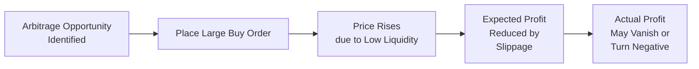
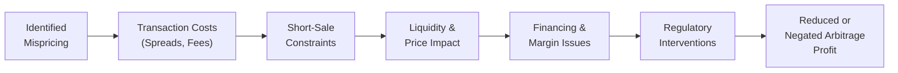

## Introduction

Well, let’s start by recalling the idealized notion of arbitrage: you spot a mispricing between two or more assets, you buy the cheap one, sell the expensive one, and — boom — you lock in a risk-free profit. It sounds almost too easy, right? In an efficient market with no trading costs or constraints, any significant mispricing would be quickly neutralized by armies of eager arbitrageurs. 

However, the real world is rarely that kind. Once we add in transaction fees, bid–ask spreads, short-sale constraints, regulatory hurdles, and other “market frictions,” many textbook arbitrage opportunities shrink or vanish altogether. In some cases, these obstacles can even flip a seemingly profitable trade into a money-losing misadventure. 

In this section, we’re going to dig into these real-world headaches — sometimes called the “limits to arbitrage.” We’ll also examine the practical realities of placing large arbitrage trades, and how investor psychology and regulatory surprises can complicate (or completely derail) a well-intentioned strategy. 

## Market Frictions: The Core Obstacle

When we talk about “market frictions,” we’re talking about all the practical barriers that prevent free, costless trading. Among them are brokerage commissions, stock-borrowing fees for short sales, taxes, and the dreaded bid–ask spread. There are also more intangible limitations like liquidity shortages, lockup periods in certain funds, and capital constraints that hamper nimble repositioning. 

### Bid–Ask Spread

Bid–ask spread is that small (or sometimes not-so-small) difference between the price a buyer is willing to pay (bid) and the price a seller is willing to accept (ask). If you think about it, every time you enter a trade, you “lose” the spread immediately. This cost can be enormous for active traders who frequently open and close positions. For an arbitrageur juggling multiple legs of a trade, the cumulative impact of the bid–ask spread across all positions can slice profits — or even kill them outright.

For instance, suppose you see a mispricing in an index futures contract relative to the basket of underlying stocks. You plan a cash-and-carry arbitrage: buy the stocks, short the futures, and try to lock in a riskless profit. But you might pay the ask price when buying the stocks and receive only the bid price when selling the future — meaning your initial entry cost is effectively higher than you might have predicted from a purely theoretical standpoint. And the exit, eventually unwinding these positions, also has its own spread. That net difference can sometimes wipe out the apparent profit. 

### Short-Sale Constraints

Short-selling constraints can be a huge headache for arbitrageurs, especially if part of the strategy relies on profiting from an overvalued security. In theory, if an asset is overpriced, you short it and buy a correlated or alternative asset that is underpriced. Great idea. But in reality, large short positions may require:

• Finding a broker who can locate shares to lend.  
• Paying borrowing fees that might spike if the shares are scarce.  
• Facing potential recall of borrowed shares if the lender decides to pull back the loan.  
• Working under short-sale restrictions or bans imposed by regulators during times of market stress.

Even seemingly moderate borrowing fees can eat away at your expected return. If the short position is large and borrowing is expensive, the arbitrage might not carry a positive expected profit. Plus, in a crisis or a market meltdown, regulators sometimes impose short-sale bans to stabilize markets. That can abruptly shut down your strategy entirely.

### Transaction Costs, Commissions, and Taxes

Let’s face it: every trade you place is going to cost something. It might be a commission to your broker, exchange fees, or potential taxes on capital gains or even per-transaction fees in certain jurisdictions. If you’re implementing a multi-leg arbitrage strategy with frequent rebalancing, these costs accumulate fast.

Imagine you are implementing a synthetic forward arbitrage, “buying the underlying + short call + long put” model. That’s three sets of transaction costs just to set up the position. And if you need to adjust your hedge or roll into a new contract, that’s more trades. Multiply that across multiple instruments and markets, and you see how friction can drastically degrade your upside.

### Price Impact and Slippage

Another big challenge is price impact. Frankly, if you see an arbitrage opportunity in a lightly traded stock or an obscure derivative, there’s a decent chance that other participants haven’t swarmed it because it’s not super liquid. The moment you place a large buy order, for instance, the price might jump upward, instantly making your once-enticing spread narrower. 

Slippage is the term often used to describe the difference between the expected transaction price and the actual one that you get. In illiquid markets, that slippage can be nasty. You end up chasing the price, paying more than you wanted, and losing part of that “free lunch” that looked so good when you ran your pre-trade analytics.

Below is a brief diagram illustrating how price impact and slippage can affect your profits during an arbitrage trade:

## Financing and Margin Constraints

### Margin Calls and Mark-to-Market

One of the scarier aspects of real-world trading is the risk of margin calls. Arbitrage strategies might need leverage to magnify small spreads, but that leverage can turn on you quickly if the position moves against you. Many arbitrage strategies—especially those involving derivatives—are subject to daily or even intraday mark-to-market. 

In other words, if your trade is temporarily “out of the money” during a period of market noise (or “noise trader risk,” as some call it), you might get a margin call requiring more collateral. If you can’t meet that call in time, guess what? Your broker may close you out at a loss. That forced exit can mean you never realize the eventual convergence you predicted, even if you turned out to be correct in the long run. 

And it’s not always about personal capital constraints. Sometimes risk managers at large brokerages or hedge funds will impose limits or forcibly close your positions if they detect excessive portfolio risk. That means you might lose the trade way before prices converge to the fundamental value.

### Lockup Periods and Capital Lock-In

Some funds impose lockup periods during which investors cannot withdraw capital. That might help a fund manager hold onto capital long enough to ride through short-term volatility, but it can also hamper your ability to rebalance quickly if you’re an investor in such a fund. If your arbitrage strategy relies on being able to deploy or withdraw funds on short notice — say, to exploit fleeting mispricings — then being locked up can be a real limitation.

Likewise, if you’re the fund manager and rely heavily on short-term financing lines to maintain your positions, a credit crunch can disrupt that. If your lenders pull the plug or raise interest rates dramatically, that changes your cost structure and might force you to close positions prematurely.

## Noise Trader Risk and Behavioral Influences

Not every investor out there is a calm, perfectly rational agent. “Noise traders” can push prices away from equilibrium for reasons unrelated to fundamentals: maybe it’s frenzy, perhaps it’s speculation, or it could be just new retail flow chasing a hot momentum stock. In the short term, these flows can push the mispricing even further, causing painful mark-to-market losses to arbitrageurs who bet on a swift correction. 

There’s a classic case: Some hedge funds short “meme stocks,” believing them grossly overvalued, only to see those stocks double yet again as retail traders pile in. The arbitrage thesis may be correct eventually, but if you get margin called or your boss freaks out at the huge paper losses, you might have to bail well before prices return to normal. 

## Government and Regulatory Interventions

Government or exchange-level interventions can literally rewrite the rules of the game overnight. We’ve seen short-sale bans introduced temporarily in certain markets during periods of extreme volatility or crisis conditions. If you had planned a perfect short strategy as part of your arbitrage, such a ban can kill your trade’s viability or dramatically raise the cost of implementing it. 

Similarly, a central bank might impose capital controls, restricting currency conversions or limiting cross-border flows. That’s obviously a death sentence for a cross-currency arbitrage if you can’t freely move funds and assets between countries at market rates. 

Regulations targeting “manipulative” trading can also cast a wide net. If a strategy involves very large positions in a thinly traded security, you risk regulatory scrutiny or even allegations of manipulation.

## Example: Proposed Arbitrage with Futures and Underlying Stock

Let’s walk through a quick hypothetical that shows how these limitations can come together:

1. You notice a 1% apparent mispricing between a stock index and the futures contract on that index. The futures are trading at a discount, suggesting a potential cash-and-carry arbitrage.  
2. You plan to buy (go long) the futures and short-sell the basket of underlying stocks.  
3. The short-sell requires you to pay a decent borrowing fee because several of those constituent stocks are in high demand for shorting. That might consume 0.3% of your theoretical profits.  
4. The bid–ask spreads on many of those individual stocks, plus exchange fees, plus the eventual cost to close the positions, might eat another 0.4%.  
5. If you plan on using leverage, you’ll face margin interest, which could easily consume some 0.2–0.3%, depending on the interest rate environment.  
6. After all that, your 1% “risk-free” spread might dwindle to only 0.1%.  
7. If the market moves unexpectedly and your positions drift further out of line, you might face margin calls or might lose on daily mark-to-market adjustments. 

In the end, your once-promising arbitrage might not be worthwhile under real-world conditions — especially when factoring in the possibility that other participants jump in and compete away the remaining spread.

## Mermaid Diagram of Common Limitations

The following mermaid diagram offers a concise summary of the main limitations we’ve discussed and how each one can erode an arbitrage opportunity:

Each node feeds into the next, showing how a seemingly obvious profit can be chipped away by one friction after another, ultimately leading to an unprofitable or too-risky position. 

## Practical Implications for Derivatives and Portfolio Management

Arbitrage isn’t just about “free profit.” It’s also a key mechanism that keeps markets aligned, leading to consistent pricing relationships between cash and derivatives markets, between spot FX and forward FX, and so on. Knowing the real-world barriers helps practitioners do two things:

• Interpret persistent mispricings or anomalies in the market. Sometimes, these anomalies are real — but the reason they persist is because arbitrageurs can’t push them away due to high friction or constraints.  
• Manage risk in complex strategies. If you’re a portfolio manager using derivatives to hedge or replicate exposures, a naive assumption that markets are always perfectly efficient can lead to unexpected slippage or forced liquidation. Factoring in the potential for short-selling constraints and liquidity squeezes is especially important.  

In a worst-case scenario, if regulators step in with broad interventions (e.g., short-sale bans, new taxes on derivatives), you must be ready to pivot. That might mean unwinding positions quickly or adjusting your hedge to more capital-friendly instruments.

## Final Exam Tips for CFA Candidates

1. Be explicit about costs: Whenever you see a question on the exam about arbitrage or mispricing, remember to incorporate transaction costs, bid–ask spreads, and short-sale fees into your final calculation.  
2. Beware of forced unwinds: If an exam scenario mentions margin calls or liquidity constraints, check how that might force an early close of what otherwise looked like a perfect arbitrage.  
3. Observe regulatory hints: Pay attention to any mention of new rules, taxes, or short-sale restrictions. These can be the hidden twist that changes your recommended trade or hedge.  
4. Don’t ignore “noise trader risk”: Even if your fundamentals-based approach is correct, short-term pressure can push price further out of whack. The exam might ask how you’d respond to that scenario.  
5. Keep track of financing costs: In the exam, you might see swaps, repurchase agreements, or margin interest as part of the cost structure. 

Understanding these broad categories of market frictions will pay off in real-life trading and, hopefully, on your exam day, too.

## References

• Shleifer, Andrei, and Robert Vishny. “The Limits of Arbitrage.” Journal of Finance.  
• CFA Institute Blog. (Various articles on short-sale restrictions and the impact on arbitrage strategies.)  
• CFA Institute Level I Curriculum, Derivatives Volume, “Arbitrage, Replication, and Cost of Carry.”  

## Test Your Knowledge: Practical Limitations to Arbitrage



### Which of the following best describes “short-sale constraints” in arbitrage?

- [x] Rules or fees that limit a trader’s ability to profit from price declines by shorting assets
- [ ] Regulatory oversight that prevents market makers from offering tight bid–ask spreads
- [ ] A prohibition on trading derivatives involving futures and swaps
- [ ] A central bank restriction on currency conversions for multinational banks

> **Explanation:** Short-sale constraints refer specifically to difficulties in borrowing shares and related regulatory or cost barriers that keep traders from effectively establishing short positions.

### What is the primary effect of mark-to-market requirements on arbitrage positions?

- [x] They can lead to forced closure of a position if interim losses result in a margin call.
- [ ] They completely eliminate the need to post collateral.
- [ ] They minimize transaction costs by bundling trades.
- [ ] They increase overall position leverage without limit.

> **Explanation:** Mark-to-market means positions are revalued frequently. If the value of your position declines, you may face additional margin requirements. Failure to meet a margin call can force you to close out the position prematurely.

### Which real-world factor can most directly cause the “price impact” problem for large arbitrage trades?

- [ ] Government short-sale bans
- [x] Low liquidity and market depth
- [ ] Zero bid–ask spreads
- [ ] Abundant supply of borrowed stock

> **Explanation:** When liquidity is low, a large order can significantly move the price, causing unfavorable execution and slippage, diminishing the profits from arbitrage.

### A fund with a 1-year lockup period for investor capital might struggle to:

- [x] Redeploy capital quickly to exploit a fleeting arbitrage opportunity.
- [ ] Benefit from stable financing costs.
- [ ] Accept more investor funds after the lockup expires.
- [ ] Prepare audited annual statements.

> **Explanation:** Lockup periods prevent withdrawal or quick redeployment of capital, impairing the flexibility needed for time-sensitive arbitrage strategies.

### How can regulatory risk unexpectedly alter the feasibility of an arbitrage strategy?

- [x] By imposing new rules that restrict trades or raise costs
- [ ] By guaranteeing unlimited liquidity in illiquid markets
- [x] By changing interest rates globally only after a major crisis
- [ ] By preventing margin calls in normal conditions

> **Explanation:** Regulations may introduce transaction taxes, short-sale bans, or other barriers that significantly raise the cost or even prohibit the arbitrage strategy.

### When an arbitrage is said to be “eroded by market frictions,” it typically means:

- [x] Transaction costs, bid–ask spreads, and other real-world fees reduce or negate the profit margin.
- [ ] Spreads are so large that the position generates huge profits for the trader.
- [ ] Regulators pay subsidies to encourage more arbitrage.
- [ ] The arbitrage capture is amplified by additional leverage.

> **Explanation:** Market frictions drive a wedge between the theoretical and actual profitability of an arbitrage by imposing costs and constraints that reduce the available profit.

### How does “noise trader risk” impact an arbitrage strategy?

- [ ] It guarantees the arbitrageur sells at the top and buys at the bottom of the market.
- [x] Prices can deviate further from fundamental value, inducing interim losses and potential margin calls.
- [ ] It lowers all fees, facilitating easier hedging.
- [x] It creates a guaranteed no-risk profit.

> **Explanation:** Noise traders can cause unpredictable price movements. Even if the arbitrageur is correct about fair value, short-term volatility can cause the position to show losses and potentially trigger margin closures.

### Which statement best explains the role of bid–ask spreads in arbitrage?

- [ ] They have no effect in a well-regulated market.  
- [x] They represent a direct cost to entering and exiting trades, reducing arbitrage profits.  
- [ ] They are subsidies provided by market makers to encourage trading.  
- [ ] They primarily reflect hedging errors by portfolio managers.

> **Explanation:** A bid–ask spread is the difference between the highest price a buyer is willing to pay and the lowest price a seller is willing to accept. Arbitrageurs pay these differentials, reducing profit.

### In the context of futures arbitrage, which of the following best illustrates the effect of short-sale fees?

- [x] They increase the cost of establishing a short position, reducing net profit.
- [ ] They cause a collapse in futures prices across all maturities.
- [ ] They make it impossible to short any futures contract on stock indexes.
- [ ] They adjust the notional value of futures to reflect daily settlement.

> **Explanation:** Short-sale fees increase expenses for arbitrageurs who short the underlying asset in a cash-and-carry or reverse cash-and-carry strategy. This added cost narrows profitability.

### Suppose a new regulation completely bans short sales in a particular equity market. True or false: This ban can effectively eliminate many arbitrage strategies that depend on short positions.

- [x] True
- [ ] False

> **Explanation:** Without the ability to short sell, most price convergence or reverse-cash-and-carry strategies become infeasible. Hence, a total ban can stifle critical arbitrage activity.


