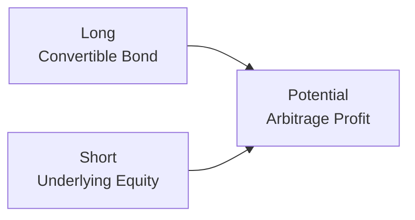

## Introduction

Have you ever watched a few different markets——equities, bonds, commodities, currencies——all moving in seemingly predictable lockstep, only to see them suddenly diverge in a way that just screams “mispricing”? That divergence is often the playground of multi-asset arbitrage strategies. In a nutshell, multi-asset arbitrage means simultaneously trading two or more assets in different markets to profit from temporary price discrepancies, all while (ideally) having minimal exposure to broad market swings. Sometimes, you might be convinced you’re fully hedged, only to discover a subtle correlation breakdown at the worst possible moment. This is part of what makes multi-asset arbitrage such a fascinating (and occasionally nerve-racking) field.

Multi-asset arbitrage leverages the principle of no-arbitrage introduced in prior sections (see 7.1 Principles of No-Arbitrage and the Law of One Price) and expands it beyond a single market or instrument. Traders seek to exploit pricing anomalies across multiple asset classes—like equities vs. bonds, or crude oil vs. refined gasoline (the “crack spread”)—to generate (hopefully) riskless gains. Realistically, “riskless” might be too strong a word; cross-hedging can get complicated, correlations can drift, and the macro environment can shake up two or three markets at once. Still, the core goal is to isolate a relative value mispricing and lock in the spread with minimal market direction risk.

Below, we explore key components of multi-asset arbitrage, provide examples of common strategies, and look at how risk management is essential for these trades. We’ll also discuss correlation breakdowns, cross-hedging, and why sophisticated modeling is often required to handle the nuances of multi-asset deals.

## Core Concepts of Multi-Asset Arbitrage

Relative value is what drives all forms of arbitrage. Whether you’re going long corporate bonds and shorting Treasury futures, buying convertible bonds while shorting the underlying stock, or setting up a cross-commodity “crush” or “crack” spread, you’re essentially betting on the idea that the relationship between two (or more) pricing streams is temporarily off and will eventually revert to its fair value.

Just like we learned in earlier sections on arbitrage fundamentals (especially 7.5 Mechanics of Arbitrage in Practice), the viability of multi-asset strategies depends on how closely related the assets are and how precisely you can pin down that relationship. If you can track the factors tying them together—such as interest rates, credit spreads, correlation with macro drivers, or processing yields (in the case of oil refining)—then spotting a deviation from historical or implied fair levels might reveal an opportunity.

### Convertible Bond Arbitrage

One classic form of multi-asset arbitrage involves convertible bonds. A convertible bond is essentially a bond that can be exchanged for a predefined number of the issuer’s shares. It typically has both an equity component (the conversion option) and a fixed-income component. In a convertible bond arbitrage strategy, a trader might:

• Buy (go long) a convertible bond.  
• Short (sell) the underlying stock.  
• Continuously adjust the hedge ratio as the equity price shifts or the bond’s implied volatility changes.

By doing this, the trader attempts to lock in a mispricing between the bond’s credit-related value, the embedded call option on the issuer’s stock, and the actual price and volatility of the stock itself. Properly executed, convertible bond arbitrage can produce profits relatively uncorrelated with broad equity markets—though “relatively” is the key word here. If equity volatility spikes or credit markets freeze, you might see the best-laid hedging plan go haywire.

Below is a simplified illustration of the pairing mechanism in convertible bond arbitrage:

The idea is that the long position in the bond plus the offsetting short position in the common equity helps isolate the mispricing of the embedded option vs. the market’s assumption.

### Cross-Commodity Arbitrage

Multi-asset spreads aren’t limited to equities and bonds. Commodity markets provide another major arena for arbitrage, especially when the production chain links two or more instruments. The crack spread in oil refining is a common example, where traders simultaneously enter positions in crude oil, gasoline, and distillates to exploit pricing anomalies in the refining margin.

Likewise, agricultural commodities offer countless pairing opportunities. You might see a soybean processor going long soybeans (the raw input) while shorting soybean meal or soybean oil (the processed outputs) if they think the “crush spread” is misaligned. Essentially, they’re betting that the difference between the input price and the combined output prices will revert to a typical level or reflect actual production costs and yields.

### Statistical Arbitrage Across Assets

Though “statistical arbitrage” might conjure images of pairs trading in equities, plenty of multi-asset “stat arb” funds look for tiny divergences across indices, bond futures, commodity exchange-traded products, currency pairs—even newer instruments like volatility swaps. Often, they track correlation matrices or factor loadings—maybe the model says gold and the Australian dollar (AUD) track each other when real interest rates are in a certain range. If that correlation breaks, the algorithm might sense an arbitrage opportunity.

Naturally, you have to be careful: correlation breakdowns can happen for good reasons. If you assume a meltdown in gold implies a meltdown in AUD and then the market decides “these items have decoupled,” that can be an unwelcome surprise.

## Identifying Mispricings and Execution

Identifying a cross-asset mispricing generally involves both qualitative and quantitative analysis:

• Historical Relationship: You can compare current price differences to the historical average. If the difference between the convertible bond’s implied volatility and the stock’s realized volatility is unusually large, that might hint at a mispricing.  
• Fundamental Drivers: For commodities, that might mean supply and demand data. For currencies, interest rate differentials or purchasing power parity. For equities, earnings or credit spreads.  
• Model-Derived Fair Value: Many arbitrageurs rely on advanced pricing models (e.g., for convertible bonds, a lattice model that accounts for interest rates, credit risk, and the embedded option).  
• Execution Tactics: Having identified the trade, you then need to execute it cost-effectively—often meaning you buy one asset on one exchange, short another asset on another venue, and manage financing or margin in multiple places simultaneously.

The biggest challenge is timing. Anomalies can persist for weeks (or vanish in seconds), and transaction costs or financing rates might eat away any potential profit. In multi-asset arbitrage, you also face basis risk: the slight differences or unexpected movements in the “hedge” asset relative to the “exposure” asset. For example, you might short an equity index future to hedge a basket of convertible bonds, but each bond could respond differently if the macro environment changes.

## Correlation Breakdowns and Macro Events

Like it or not, correlations can shift drastically, particularly in times of market stress. Maybe a central bank’s policy changes invert a yield curve, sending bond and equity markets in new directions that no one predicted. Or a geopolitical crisis disrupts commodity flows.

Let’s say you’re running a cross-commodity strategy that profits from the historical price spread between North Sea Brent Crude and West Texas Intermediate (WTI). Suddenly, a pipeline disruption or shipping bottleneck might cause that spread to balloon or vanish. Your entire premise (that the spread neatly hovers near a definable equilibrium) could break down. When these “decouplings” happen, they can create fleeting opportunities——or cause enormous losses if you’re on the wrong side and your hedge no longer functions.

## Risk Management in Multi-Asset Arbitrage

Exploiting multi-asset mispricing demands a robust risk-management process. While outright market exposure might be “hedged,” real-world correlation risk persists:

• Basis Risk: The risk your hedge doesn’t move in perfect tandem with the underlying asset.  
• Funding & Margin Needs: Multi-legged transactions across asset classes can tie up significant capital, especially if a clearinghouse imposes higher margin requirements for cross-asset positions.  
• Liquidity Risk: Even if your core assets are liquid, that might not hold true for your hedge instruments or emergency unwinds. Liquidity can dry up quickly in stressed environments.  
• Counterparty and Settlement Risk: For OTC trades, you must evaluate your counterparty’s creditworthiness, especially in meltdown scenarios.  
• Adaptive Hedging: Conventional delta-hedging or ratio-based hedging might need constant recalibration as volatility and correlations evolve.

In my first experience with convertible bond arbitrage, I learned the hard way that the best theoretical hedge ratio can shift with volatility. I was happily “fully hedged,” but an unexpected jump in implied volatility changed the bond’s sensitivity to the underlying equity. That’s a typical day in the life of a multi-asset arbitrageur.

## Best Practices and Implementation Details

People sometimes glamorize multi-asset arbitrage as “risk-free money.” It might look that way on a spreadsheet, but as you layer on transaction costs, potential correlation shifts, credit risk, and the possibility of black swan events, you’ll see the real complexities. Here are a few best practices:

• Thorough Funding Analysis: Ensure you can carry the entire structure if the trade goes against you.  
• Dynamic Hedging Protocols: Set up real-time or near real-time rebalancing to address fluctuations in correlation, volatility, or interest rates.  
• Stress Tests and Scenario Analysis: Model historical crises (e.g., 2008 meltdown, 2020 pandemic) to see how your cross-asset positions might behave under major liquidity squeezes.  
• Diversified Counterparties: If you’re dealing partly in OTC derivatives, working with multiple counterparties can reduce large exposures to any single entity.  
• Systematic Monitoring: Automated triggers or alerts that detect when the spread you’re monitoring hits a certain threshold can help you act quickly.

## Real-World Illustrations

1. Convertible Bond Vs. Equity: If the convertible’s option is overpriced relative to the market’s implied volatility, you can short the stock. As the market normalizes, you might capture a “volatility premium.”  
2. Cross-Commodity “Crack” Spread: A refiner can buy crude oil futures and sell gasoline futures and heating oil futures if the refining margin looks artificially low. If it recovers to normal levels, the trader profits.  
3. Equity-Bond Correlation Breakdown: Over certain macro cycles, equities and bonds exhibit negative correlation. If that correlation breaks unexpectedly (e.g., fear of inflation causes both to sell off), a multi-asset arbitrage model might have been short one and long the other, expecting a reversion to typical correlation.  
4. Currency-Futures Imbalance: Suppose an interest rate difference between two countries is not fully reflected in forward currency rates. A cross-currency arbitrage might exploit this until the forward curve aligns with actual rate differentials.

## Putting It All Together

Multi-asset arbitrage is a dynamic, often data-intensive approach to trading that attempts to isolate relative mispricing. Some of these trades can be super short-lived, triggered by ephemeral market dislocations. Others, like convertible bond arbitrage, can stay on for months. Although the goal is to remain as market-neutral as possible, in practice, you’ll always encounter some risk from correlation drift, basis risk, and macro events. Being disciplined with risk management—proper hedging, robust scenario analysis, and an eagle eye on stress points—can help turn these fleeting moments of mispricing into profitable trades.

If you’re new to multi-asset arbitrage, start by practicing with less complex strategies (maybe a simpler pairs trade in equities or a basic cross-commodity spread) and gradually add layers. Of course, always keep a healthy respect for the idea that the market can behave in unexpected ways just when you think you’ve got it all figured out.

## References and Further Reading

• Kolb, Robert W. Understanding Futures Markets, Wiley.  
• Schoenbucher, Philipp. Credit Derivatives Pricing Models.  
• CFA Institute: Recommended readings on multi-asset portfolio hedging and correlation analysis in derivative markets.  
• Text material from Chapter 7.1–7.6 in this Volume, for a review of arbitrage fundamentals, replication strategies, and the cost-of-carry model.

## Test Your Knowledge: Multi-Asset Arbitrage Strategies



### A multi-asset arbitrage strategy most commonly seeks to:
- [ ] Maximize leverage through outright directional bets in multiple markets.
- [ ] Hedge only one side of the trade (long or short) while exposing the other side to full market risk.
- [x] Exploit pricing discrepancies across instruments and hedge out broad market exposure.
- [ ] Concentrate exposure in volatile assets to benefit from momentum.

> **Explanation:** Multi-asset arbitrage attempts to profit from relative mispricing while minimizing directional risk, typically through offsetting positions in correlated or related assets.

### Which of the following best illustrates convertible bond arbitrage?
- [x] Buying a convertible bond and shorting the underlying equity to isolate the mispricing in the embedded option.
- [ ] Buying a convertible bond and a straight bond of the same issuer to maximize credit exposure.
- [ ] Shorting a convertible bond and buying emerging market bonds.
- [ ] Buying only the convertible bond and holding until maturity.

> **Explanation:** Convertible bond arbitrage typically involves taking a long position in the convertible bond and shorting the related stock. This approach attempts to capture discrepancies in the bond’s pricing, embedded option, and the stock’s implied volatility.

### What is basis risk in the context of multi-asset arbitrage?
- [ ] The risk that you fail to secure enough financing to initiate the trade.
- [x] The risk that the hedge instrument doesn’t move perfectly with the underlying.
- [ ] The risk that market directions become correlated over time.
- [ ] The risk that you cannot close your position before maturity.

> **Explanation:** Basis risk arises when the asset used to hedge does not track the price movements of the primary asset precisely. Even if two assets are closely correlated, minor deviations can create unanticipated losses.

### In a cross-commodity “crack spread” arbitrage strategy:
- [ ] A trader attempts to benefit from wide bid-ask spreads between crude oil and copper futures.
- [ ] A trader only goes long on refined products because demand is always higher in the long run.
- [x] A trader simultaneously trades crude oil futures and industry-refined products (like gasoline or heating oil) to exploit refining margin mispricings.
- [ ] A trader speculates solely on the direction of crude oil prices, ignoring refined product prices.

> **Explanation:** The crack spread arbitrage is all about “cracking” (refining) crude oil into various products. By buying or selling the raw input and offsetting positions in the refined outputs, the trader aims to capture inefficiencies in the spread.

### When correlation breakdown occurs in a multi-asset arbitrage strategy:
- [ ] The strategy becomes immune to macro shocks.
- [x] The expected relationship between assets may fail, potentially causing losses or missed opportunities.
- [ ] All correlations will move to +1 or -1 within a few days.
- [ ] It has no impact on multi-asset arbitrage if you are fully hedged at inception.

> **Explanation:** If assets that historically moved together suddenly diverge (or vice versa), a hedged position based on stable correlations may fail. This is a prime risk in multi-asset arbitrage.

### Which best describes an important driver in identifying cross-asset mispricing?
- [ ] Focusing only on headline news and ignoring historical data.
- [ ] Using fundamental analysis on one asset class while ignoring related assets.
- [x] Comparing current spread levels to historical averages or model-based fair values.
- [ ] Relying solely on rumor-based trades in illiquid markets.

> **Explanation:** Traders frequently compare observed price relationships to historical trends or model-derived fair value. If a spread substantially deviates from norms, that discrepancy can signal a mispricing.

### In a convertible bond arbitrage trade, which hedge ratio adjustment is commonly required?
- [x] Adjusting the ratio of long bond to short equity as volatility and the bond’s delta change.
- [ ] Keeping the same ratio of long bond to short equity for the life of the bond.
- [ ] Reducing the hedge only if interest rates rise above a certain threshold.
- [ ] Eliminating the hedge position altogether if you see a short-term equity rally.

> **Explanation:** As stock prices move and implied volatilities shift, the embedded option’s sensitivity changes. Traders must rebalance the hedge ratio to keep the trade aligned with intended risk exposures.

### A key disadvantage of multi-asset arbitrage is:
- [ ] It requires very little capital to implement effectively.
- [x] It can be complicated to manage multiple positions, especially if correlations shift unexpectedly.
- [ ] It always results in higher risk and lower reward.
- [ ] It excludes the use of derivatives in the hedge.

> **Explanation:** Multi-asset arbitrage typically necessitates managing multiple, interrelated exposures. Correlation shifts and basis risks can complicate the strategy.

### Why is robust margin and funding analysis crucial for multi-asset arbitrage?
- [ ] Because multi-asset arbitrage never requires margin.
- [ ] Because regulators often prohibit cross-asset margin offsets.
- [x] Because multiple positions across asset classes can incorporate higher margin requirements and settlement risks.
- [ ] Because if you have adequate capital, margin considerations are irrelevant.

> **Explanation:** Engaging in hedged positions across multiple markets can create complex margin requirements, especially if each clearinghouse or broker calculates margin independently. Adequate planning ensures you can carry the trade through all market conditions.

### Multi-asset arbitrage strategies generally:
- [x] Aim to exploit relative value discrepancies without taking a strong view on market direction.
- [ ] Require choosing a single asset to maximize directional returns.
- [ ] Avoid cross-hedging to keep operational complexity low.
- [ ] Ignore statistical models in favor of pure fundamental analysis.

> **Explanation:** The essence of multi-asset arbitrage is isolating relative mispricing, not relying on a directional bet. Traders often rely on quantitative, fundamental, or combined frameworks to justify and manage these complex trades.


