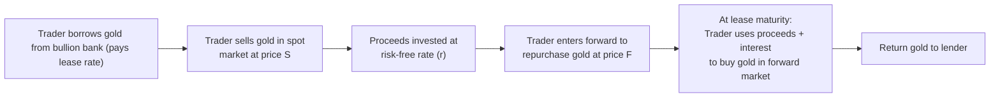

## Introduction
It’s always kind of fun when you come across what seems like a “free lunch” in the financial markets—though, as we’ve all heard, there’s no such thing as a truly free lunch. Lease rate arbitrage is one of those strategies that can feel close to it when market conditions align just right. The idea is pretty simple: if the lease rate on a precious metal (like gold, silver, or platinum) diverges from what theory tells us it should be, then a trader might earn a near risk-free spread. 

This phenomenon often pops up in the context of gold. Many of the world’s central banks hold vast stores of gold and, from time to time, they lend that gold to bullion banks. When they do, they charge a lease rate on the metal. If that lease rate—plus the other costs or benefits of holding gold—is out of sync with forward prices, then an arbitrage opportunity emerges. 

But before we dive in deeper, we should set out the foundation. We’ll talk about how it works, who participates, and how lease rates reflect broader market forces. We’ll also walk through some potential pitfalls, because, let’s be honest, “cheap and easy” in finance can sometimes be illusions.

## The Lease Rate Arbitrage Concept
Lease rate arbitrage, at its core, mirrors the logic of other cost-of-carry models, but with a twist: rather than dealing only with storage costs, dividends, or convenience yields, we tack on a lease rate. Here, the lease rate is effectively the cost of renting a physical asset (like gold) for a certain period.

In a typical cost-of-carry model for a storable commodity, the forward price (F) for settlement in T years, starting from a current spot price (S), might be expressed as:


F = S \times e^{(r + u - y) T},


where:  
• r = risk-free interest rate  
• u = storage costs  
• y = convenience yield  

But consider that gold can be borrowed from some large central bank or bullion bank at an annualized lease rate L. In that case, the carrying cost changes because you effectively shift the ownership timeline of the physical gold. If the forward price in the market doesn’t reflect this lease rate, there’s a crack in the no-arbitrage relationship.

## Mechanics of the Lease Rate Arbitrage Strategy
Let’s imagine you’re a trader at a major financial institution, and you spot an opportunity. You see that the forward price for gold is out of line with what you calculate it should be after factoring in both the risk-free rate and the lease rate. Here’s the kind of process you might carry out:

1. Borrow the gold (lease it) from a lender (often a central bank or bullion bank) and agree to pay the lease rate (L).  
2. Sell that borrowed gold immediately in the spot market, receiving S × (borrowed quantity).  
3. Invest the proceeds from the sale at the risk-free rate (r) for the lease’s duration.  
4. Simultaneously, enter into a forward contract to buy gold back at a future price F on the same maturity date as the lease.  
5. At maturity, take your invested proceeds (which earn interest at r), use them to buy the gold in the forward market at price F, and return the gold to the original lender.  

If the difference between that forward price and the implied no-arbitrage forward (which includes the lease rate) is large enough, your profit is essentially locked in. Under perfect conditions—no frictions, perfect liquidity, unlimited borrowing—this is basically a riskless trade. Of course, in real life, there are transaction costs, haircuts on collateral, potential reputational or credit risk, and more.

### A Visual Overview
It often helps to see how the money and gold flow. Below is a Mermaid diagram that summarizes the transaction at a high level:

From this diagram, we see a cycle: gold is borrowed, sold, proceeds invested, gold is purchased forward, and returned. The key is that the cost of borrowing (the lease rate) plus the forward buyback price must be less than the final wealth generated from investing the proceeds. If that condition holds, the trader profits.

## Market Participants and Key Drivers
Although retail investors might attempt versions of this via derivatives, lease rate arbitrage in its truest form is usually dominated by big institutions. Here are the main players:

• Central Banks and Bullion Banks: They hold large inventories of gold, motivated by portfolio needs and sometimes macroeconomic strategies. Their willingness to lease metal sets the supply side of the lease market.  
• Hedge Funds and Proprietary Trading Desks: They hunt for price discrepancies and have the capital and infrastructure to execute complex trades across different markets quickly.  
• Commodity Merchants and Refiners: They may naturally hold inventory for operational needs and can become lessors themselves if they believe it’s profitable to lend out their metal.  

### Why Would Central Banks Lend Gold?
Central banks typically hold gold as part of their foreign exchange reserves. If they believe a portion can be leased without compromising monetary objectives, they can earn extra yield. Should many central banks decide to offer more gold for lease, supply in the lease market goes up, which pushes lease rates down.

When central banks reduce their supply of lendable gold, or if there’s a sudden surge in demand for physical gold (maybe because of geopolitical turmoil), then lease rates can spike. That’s often when the forward prices deviate from “fair value,” creating new arbitrage possibilities.

## Practical Examples and Case Study
Let’s walk through a stylized numerical illustration—just something to give you the flavor:

• Spot Gold Price (S): $1,900 per ounce  
• Lease Rate (annual): L = 1.2%  
• Risk-Free Rate (annual): r = 2.5%  
• Time to Maturity: 1 year  

### Step-by-Step
1. You lease 1,000 ounces of gold at 1.2% annualized. That means at year-end, you owe 1,000 ounces back plus your lease payment expressed in gold ounces or sometimes paid in cash, depending on the lease contract’s terms.  
2. You sell that gold at the current spot price, so you collect $1,900 × 1,000 = $1,900,000.  
3. Invest the $1,900,000 at 2.5% for one year. By year-end, you’ve got about $1,947,500 (ignoring compounding for simplicity).  
4. Meanwhile, you locked in a forward contract to buy back 1,000 ounces of gold at maturity. Let’s say you found a forward quote of $1,938 per ounce, so you’ll need $1,938,000 to buy 1,000 ounces.  

When the lease matures, you use your $1,947,500 to buy 1,000 ounces for $1,938,000. Suppose you owe a small gold lease fee in ounces, or a cash equivalent. Let’s assume the total cost in gold ounces is 1,000 plus 12 ounces for the 1.2% lease rate, or the cost in cash is $1,938,000 plus some small interest in gold terms. If the math works out so that your final proceeds exceed all these costs, that difference is your profit. Because you locked everything in from day one, you had minimal exposure to gold price fluctuations.

In real trades, you must account for margin, collateral requirements, bid-ask spreads, and potential storage or transport costs (though those might be low for gold, especially if it just sits in a vault). Still, the concept stands: the difference between the forward price and the implied forward price given by spot plus financing minus lease cost can yield a (virtually) risk-free payoff.

## Potential Risks and Pitfalls
It’s crucial to emphasize that although lease rate arbitrage often sounds like an easy win, there are real risks and annoyances:

• Counterparty Risk: If you’re leasing gold from a central bank, that risk might be low. But if you’re dealing with smaller counterparties, they might default, or their gold might be encumbered.  
• Liquidity Constraints: During times of financial stress, not all markets remain liquid at the same time. You might find it harder to exit a position or roll it over.  
• Changes to Lease Rate or Policy: Central banks may alter their gold leasing programs rapidly. If your trade is open, it could face unexpected costs or forced unwinds.  
• Transaction Costs: Spreads, brokerage, and operational overhead can eat into what initially appears to be a generous arbitrage margin.  

One of my acquaintances once joked that sometimes you can see an apparent arbitrage in gold forwards, but by the time you factor in all the fees—clearing, shipping, interest, haircuts on collateral, not to mention the overhead of dealing desks—the trade might become dime-on-the-dollar territory. So, be cautious.

## Concluding Remarks and Exam Tips
Lease rate arbitrage is a classic illustration of how forward markets, financing rates, and physical commodity costs interact. It’s a great example to keep in your back pocket for exam questions involving no-arbitrage principles, cost-of-carry, and the behavior of precious metals. 

In exam scenarios, especially if you see a question with relationships between spot prices, forward prices, risk-free rates, and lease rates, you might be asked to:  
• Calculate the theoretical forward price given the lease rate.  
• Identify if an arbitrage opportunity exists and outline the steps to exploit it.  
• Discuss factors that could eliminate or reduce the profit from the trade.  

Best practice is to remember that the forward price must incorporate not just storage costs but also the lease rate. If the forward price is somehow “too high” or “too low” relative to spot after factoring in the cost of borrowing or leasing the metal, that’s your sign to start scribbling out an arbitrage strategy. 

For the exam, manage your time carefully if such a question shows up. Lay out the formula first, define each variable, and systematically walk through the calculations, double-checking that you track all relevant fees (lease rate, interest, transaction costs). That thorough approach usually nets the most points, especially in an essay-style question or a multi-part item set.

## References
• Kabance, Paul. "Precious Metal Leasing and Swaps," Commodity Research Bureau.  
• Fabozzi, Frank, et al. “Handbook of Commodity Investing.” Wiley.

## Test Your Knowledge: Lease Rate Arbitrage and Precious Metals



### In a lease rate arbitrage scenario, which of the following best describes the initial step taken by an arbitrageur seeking to profit from a mispricing?

- [ ] Purchasing gold in the spot market and lending it at the lease rate  
- [ ] Buying gold forward and selling gold spot immediately  
- [x] Borrowing (leasing) physical gold from a bullion bank and selling it in the spot market  
- [ ] Investing the proceeds in storage services to lower overall costs  

> **Explanation:** The standard approach for lease rate arbitrage begins with borrowing (or leasing) gold from a lender, then selling it in the spot market to invest the proceeds.

### A trader observes that the market forward price of gold is significantly lower than the implied forward price (after accounting for the risk-free rate and lease rate). Which action is most likely to generate an immediate arbitrage profit?

- [ ] Borrow gold, sell at spot, and buy it back at the overvalued forward price  
- [ ] Purchase gold in the spot market, short the forward, and invest the proceeds  
- [x] Purchase gold forward and simultaneously borrow gold to sell at spot  
- [ ] Lease gold and store it until physical demand rises  

> **Explanation:** If the market forward price is too low, the arbitrageur would want to lock in buying gold at the cheap forward price. Simultaneously borrowing gold and selling spot helps finance the operation, capturing the discrepancy between the forward and implied forward.

### Which of the following market participants typically has the largest influence on gold lease rates?

- [ ] Retail investors holding gold coins in personal safes  
- [x] Central banks and large bullion banks with significant gold reserves  
- [ ] Individual jewelry manufacturers  
- [ ] Small-scale commodity brokers  

> **Explanation:** Central banks and large bullion banks have substantial vault holdings of gold and are prime lenders. Their supply-and-demand decisions drive lease rates.

### One of the major risks associated with lease rate arbitrage is:

- [x] Sudden changes in the lease policies of central banks or large bullion banks  
- [ ] Excessive supply of gold reserves around the world  
- [ ] Global equities outperforming the commodities sector in the short term  
- [ ] High transaction volume leading to narrower bid-ask spreads  

> **Explanation:** Central banks can abruptly change their gold leasing programs, potentially forcing early unwinds or adjusting rates, thus eliminating profits.

### Suppose a trader can lease gold at 1% annually and invest proceeds at 2% risk-free, with negligible storage costs. If the forward market is in line with an implied forward price of 1.5% above spot, which statement is correct?

- [ ] There is a clear arbitrage because 2% > 1.5%  
- [ ] There is no arbitrage because the sum of lease cost plus risk-free return is greater than the forward price  
- [ ] The trader should buy gold forward because the forward price is higher than the cost of leasing  
- [x] There is no immediate arbitrage since 1% lease plus 2% investment is balanced by a 1.5% forward projection (once carry costs are factored in)  

> **Explanation:** If the forward price lines up with the implied forward price when considering lease rate plus risk-free rate, there's no mispricing that yields a riskless profit.

### When the forward price is out of line with the cost-of-carry plus the lease rate, it primarily indicates:

- [ ] Storage costs have declined dramatically  
- [ ] The convenience yield has vanished  
- [x] An arbitrage opportunity for traders who can lease metal and invest proceeds  
- [ ] Net lease costs are negative  

> **Explanation:** The key no-arbitrage condition in commodity markets is that the forward price should reflect the underlying carrying costs and lease rates. Deviations signal potential arbitrage.

### If an investor suspects the forward price of gold is overpriced after accounting for lease rates and storage, a common lease rate arbitrage approach would be:

- [x] Borrow gold, sell it spot, and lock in buying back at the inflated forward price  
- [ ] Purchase gold spot, store it, and wait until forward prices align with fair value  
- [x] (Also correct) Rent gold from a bullion bank and simultaneously enter a forward sale  
- [ ] Only buy gold forward with no spot sale  

> **Explanation:** If the forward price is too high, the arbitrageur borrows the physical metal, sells it spot, and enters a forward contract to repurchase it at that high price—pocketing the difference in a (nearly) risk-free manner.

### Which entity below is most likely to borrow substantial volumes of physical gold for short-term financing or trading needs?

- [x] A bullion bank with a hedging operation and metal trading desk  
- [ ] A local jewelry store  
- [ ] A day trader using only derivatives  
- [ ] A private individual buying gold bars to hold at home  

> **Explanation:** Bullion banks manage large inventories and regularly borrow and lend gold to facilitate trades and market-making activities.

### Why might transaction costs be especially relevant for lease rate arbitrage strategies?

- [ ] They only affect trades in equity contracts  
- [ ] Lease rate arbitrage strategies require no repeated transactions  
- [x] Thin arbitrage margins can be quickly eroded by bid–ask spreads, storage fees, and operational costs  
- [ ] Transaction costs are always zero in precious metals markets  

> **Explanation:** While lease rate arbitrage is theoretically risk-free, real-world frictions like transaction costs and storage fees can offset or destroy any potential profit.

### True or False: Lease rate arbitrage is risk-free as long as an entity can always borrow large amounts of gold at a stable lease rate, freely invest proceeds at the risk-free rate, and execute forward contracts without slippage.

- [x] True  
- [ ] False  

> **Explanation:** In a frictionless environment with unchanging rates and no credit or market risk, the arbitrage would be risk-free. However, in reality, factors like counterparty risk, liquidity, and sudden shifts in lease or interest rates introduce real-world risk.


