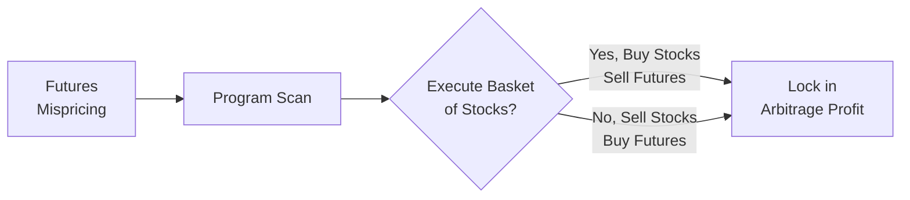

## Overview
Index arbitrage is often viewed as the “classic” arbitrage trade in equity futures markets. Essentially, you compare the futures price on a particular equity index to the aggregate value of the underlying basket of stocks that make up that index. If a mispricing pops up (say, the futures are trading too high relative to fair value), you simultaneously trade the actual stocks and the futures contract to lock in a low-risk profit. That’s the big idea, anyway! In today’s realm of lightning-fast markets, these opportunities don’t typically last more than a few moments, but they can still pop up more often than you might imagine—especially during periods of market stress or at times around index rebalancing.

I remember back in my junior trading days—um, that was quite a while ago—when a friend on a proprietary desk kept bragging about how quickly his arbitrage algorithms would “scrape pennies out of the market.” Those pennies could really add up, though. During a major index rebalance, the “basket trade” and the futures price would sometimes diverge enough that even a fraction of a basis point difference was worth capturing thousands of times a day. It was wild to see.

Below, we’ll walk through the heart of index arbitrage, discuss its cost-of-carry underpinnings, and explore some mechanics of program trading and how high-frequency traders exploit fleeting pricing gaps.

## Key Elements of Index Arbitrage

### The Basic Concept
Let’s break down the logic. An equity index (like the S&P 500) is basically a big basket of individual stocks. The price of the index is a weighted sum of those stocks’ prices, and an index futures contract is simply a derivative that allows you to buy or sell this entire “basket” at some future date.

If the futures price diverges significantly from its “theoretical” or “fair value” price, you can:
• Buy the cheaper asset (the underpriced side).  
• Sell the overpriced asset (the side that’s trading too high).  
• Lock in a nearly riskless profit.

In practice, that can mean simultaneously buying a basket of 500 stock names (to mirror the index) while selling one S&P 500 futures contract. Or vice versa, selling all the underlying stocks short while buying the futures, if the futures are momentarily cheap relative to the index. The difference between the actual cost of carrying that stock basket (considering financing costs, dividends, and time) and the futures contract cost creates the no-arbitrage boundary.

### Cost-of-Carry and Fair Value
The fair value of a stock index futures contract is driven by something called the “cost-of-carry” model. At a high level, it’s:

Futures Price ≈ Spot Index Level × e^(r - d)T

…where:  
• r is the low-risk (or risk-free) rate,  
• d is the dividend yield on the index,  
• T is time to expiry (in years).

In simpler terms, if you hold a basket of stocks, you pay financing costs but also earn dividends. By contrast, if you hold a futures contract, you put up margin but don’t lay out the full cost, so your “financing cost” is different. The fair value equation just ensures these two routes to “owning exposure” to the index remain broadly equivalent, ignoring execution slippage and trading frictions. If the futures are “too high” (higher than spot index plus cost of carry), you could short the futures and buy the underlying stocks cheaply and, ideally, capture a profit.

### Program Trading and High-Frequency Execution
Index arbitrage can happen manually—but usually doesn’t these days. Thanks to extremely tight time windows for profitable trades, high-frequency trading (HFT) algorithms do the heavy lifting. These algorithms monitor both the real-time futures price and the implied spot level of the index that’s derived from the actual stock quotes. The moment they spot a discrepancy, they can fire off a “program trade,” which sends buy or sell orders to every stock in the index at once and offsets with a futures order. You often hear folks refer to the orders on the underlying stocks themselves as “basket trades”—since you’re trading an entire basket in one shot.

Below is a simple mermaid diagram illustrating the flow:

It’s that fast. One minute, everything’s in line; the next minute, the futures creeps up relative to the underlying stocks, and “boom”—the algorithm unleashes a barrage of trades that swiftly closes the gap. Because of all this robotic efficiency, index futures and the underlying indices are usually in sync. But “usually” isn’t “always,” so that’s the point of index arbitrage.

## Mechanics in Real Markets

### Settlement Basis
The “basis” is simply the difference between the current index futures price and the spot index level. In a frictionless market, you can measure that basis relative to the cost-of-carry-based fair value. For instance, if the fair value suggests the futures price should be, say, 2,510.00 but the actual futures trade at 2,512.00, the basis is 2 points above the fair value. In that scenario, you might sell the futures and buy the underlying index stocks to capture those 2 points—as long as transaction costs or other frictions don’t wipe out the potential gain.

Remember that the basis can shift throughout the day due to intraday dividends, order flow, or short-term funding rates. HFT algorithms watch these changes like hawks.

### Index Re-balancing Arbitrage
Index rebalancing—when an index sponsor (like S&P Dow Jones Indices) adds or removes companies—can create temporary mispricing. The stocks being added often jump in price, while the ones being removed might dip. Meanwhile, the futures contract that references the “before” basket may briefly lag behind, especially if the changes create a rush to buy or sell. Active arbitrageurs can exploit these short bursts of imbalance. But be warned: with everyone eyeing the same trade, prices do snap into alignment quickly.

### Closing Auction and End-of-Day Effects
At day’s end, index levels often settle based on closing auction prices of the constituent stocks. Because so many orders flow in at the close—especially from institutional investors and funds matching the benchmark—there can be short-lived divergences between the futures price and the spot index. An index arbitrage strategy might see the futures price become misaligned if large buy or sell imbalances push the underlying stocks one way or another. Once again, automated strategies that trade right into the close can respond.

## Potential Risks and Pitfalls
Even though index arbitrage is often considered “low-risk,” it’s definitely not risk-free. A few pitfalls:

• Execution Timing: If you’re too slow (think: microseconds slow), the mispricing can vanish by the time your trades go through.  
• Transaction Costs: Commissions, bid–ask spreads, market impact—these can eat up your profit if the mispricing is tiny.  
• Model Risk: Calculating real-time fair value can be challenging. If your cost-of-carry estimate is off or your dividend estimates are inaccurate, you might be pursuing phantom opportunities.  
• Stock-Specific or News Risk: Even though you’re theoretically neutral on the index, unexpected news on a big constituent can still cause basis movement that might affect your basket’s immediate fill prices.  

## Practical Example
Let’s consider a hypothetical S&P 500 index at 4,000. Suppose you calculate that given 2% annual interest rates, a 1.5% dividend yield, and a 3-month horizon, the fair value for the index futures contract is about 4,015. If, however, the actual futures live quote is 4,030, that suggests the futures are overvalued by 15 points relative to your fair value calculation.

If market conditions permit, you would:  
• Short 1 futures contract at 4,030.  
• Buy all 500 stocks in the index in the correct proportion such that your “mini-portfolio” tracks the S&P 500.  

If a few hours or days later, the futures price moves back down toward 4,015, you cover your short at 4,015, netting 15 index points (minus any financing and transaction costs). Meanwhile, your basket of S&P 500 stocks should have performed in line with the index. If everything goes as expected, you lock in that difference and exit the positions with a (relatively) riskless gain.

## Best Practices for Index Arbitrage
• Maintain Ultra-Fast Data Feeds: Real-time quotes on every stock in the index are essential. Delays of even a fraction of a second ruin the trade.  
• Use Efficient Execution Algorithms: You might engage specialized “basket trading” or “program trading” algorithms designed to handle large, multi-stock orders quickly and stealthily.  
• Accurately Project Dividends: Underestimating dividend payouts can lead to overestimating or underestimating the future index level. This might cause you to see “mispricings” that aren’t there.  
• Watch Liquidity During Events: Corporate events, index rebalances, or macroeconomic announcements can cause fleeting opportunities but also spikes in volatility.  
• Risk Controls: A glitch in your program trading software can lead to large, unintended exposures if your hedges don’t line up. Carefully tested systems are crucial.  

## Evolving Landscape
In modern markets, high-frequency traders typically do the bulk of index arbitrage, scanning the entire market in search of basis changes between the index futures and real-time “synthetic index” prices. Regulations, transaction taxes, or changes in margin requirements can periodically disrupt typical cost-of-carry relationships. Moreover, as interest rates move or new futures contracts get listed (like micro or mini futures), your cost-of-carry assumptions may shift.

Still, the fundamental principle remains: if the futures get too far from fair value, someone will step in, buy one side and sell the other, pulling the price back in line. That’s how the markets stay efficient—or at least how they try to remain efficient!

## References
• Hasbrouck, Joel. “Empirical Market Microstructure.” Oxford University Press.  
• CFA Institute materials on Equity Index Futures and Market Efficiency.  

## Test Your Knowledge: Index Arbitrage in Equity Futures



### In index arbitrage, the “basket” typically refers to:  
- [ ] A selection of high-dividend stocks.  
- [ ] A combination of futures and options.  
- [x] The underlying stocks comprising an equity index.  
- [ ] A mix of corporate and government bonds.  

> **Explanation:** The basket is simply all (or most) of the stocks in the index that traders buy or sell to replicate the index’s performance.

### Which of the following is most critical to determining the fair value of an index futures contract?  
- [ ] Historical volatility of the index.  
- [x] Financing cost and dividend yield over the contract period.  
- [ ] Beta of the index to the broader market.  
- [ ] The correlation of index constituents to one another.  

> **Explanation:** The cost-of-carry approach is primarily driven by interest rates (as financing cost) and expected dividends over the life of the futures contract.

### High-frequency traders engage in index arbitrage primarily to:  
- [x] Exploit very short-lived mispricings between the index futures and the underlying stocks.  
- [ ] Chase long-term value in undervalued equities.  
- [ ] Increase market volatility for speculative purposes.  
- [ ] Trade government bonds in a cross-market arbitrage.  

> **Explanation:** HFT firms use ultra-fast market data and execution capability to act on pricing discrepancies within split seconds, capturing tiny but frequent profits.

### What is “program trading” in the context of index arbitrage?  
- [ ] Manually executing a large buy order in a single day.  
- [ ] Using limit orders to purchase just one stock until it’s fairly priced.  
- [x] Automated or semi-automated trading involving simultaneous orders on many stocks.  
- [ ] A discretionary approach relying solely on fundamental analysis.  

> **Explanation:** Program trading involves simultaneous trades in multiple securities, often to replicate an index or to lock in arbitrage, typically executed by an algorithm.

### When an index futures contract is overpriced relative to fair value, the standard index arbitrage approach is to:  
- [ ] Buy the futures and buy the basket of stocks.  
- [ ] Sell the futures and sell the basket of stocks.  
- [x] Sell the futures and buy the basket of stocks.  
- [ ] Buy put options on the futures.  

> **Explanation:** If the futures is overpriced, arbitrageurs short the futures (the expensive side) and go long the comparatively cheaper basket of stocks.

### One of the main risks in index arbitrage is:  
- [x] Execution slippage and transaction costs eroding the profit margin.  
- [ ] Earning too large a dividend on the underlying stocks.  
- [ ] Having a guaranteed arbitrage gain.  
- [ ] Eliminating the need for any market data automation.  

> **Explanation:** Execution slippage—delays, partial fills, or high transaction costs—can wipe out the small profit differential that index arbitrage seeks.

### Which piece of data is most essential for real-time index arbitrage?  
- [x] Real-time quotes for each stock in the index.  
- [ ] Historical stock valuations over the last decade.  
- [ ] Analysts’ price targets for the index constituents.  
- [ ] The Federal Reserve’s long-term inflation forecast.  

> **Explanation:** Because index arbitrage relies on immediate discrepancies, up-to-the-second quotes for all constituent stocks are vital.

### In the cost-of-carry formula for equity index futures, the dividend yield:  
- [x] Reduces the futures price relative to the spot.  
- [ ] Has no effect on the futures price.  
- [ ] Increases the futures price relative to the spot.  
- [ ] Only matters if the interest rate is zero.  

> **Explanation:** If an investor holds the actual stocks, they earn dividends; this lowers the implied cost of carry, thereby reducing the theoretical futures price.

### Index rebalancing can create arbitrage opportunities because:  
- [ ] It standardizes all company stock prices.  
- [x] Sudden changes in index constituents can cause misalignment between the futures and the spot basket.  
- [ ] New index constituents remain inert to large institutional buying.  
- [ ] Dividends become completely predictable during rebalancing.  

> **Explanation:** During index rebalancing, some stocks see large price movements from institutional flows, which momentarily shifts the index’s implied spot level away from the futures price.

### In an ideal, frictionless market, index arbitrage would:  
- [x] Keep the futures and spot index nearly in sync by eliminating major price discrepancies.  
- [ ] Lead to permanent divergences in the futures and spot index.  
- [ ] Render short selling entirely unnecessary.  
- [ ] Only be performed manually by individual retail traders.  

> **Explanation:** The presence of arbitrageurs typically enforces the cost-of-carry relationship, thus aligning futures and spot prices in efficient markets.


