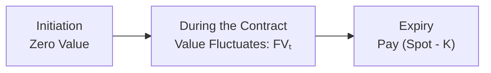

## Introduction

Forward contracts, as covered in Chapter 1 (especially Sections 1.1 and 1.2), are binding agreements to buy or sell an underlying asset at a specified future date and price. Now, in Section 8.1, we dig deeper into how these contracts are actually valued—both at inception (when the contract is created) and during the contract’s life as the market moves. We’ll also look at what that value is right at expiry. The concepts described here are foundational for many other derivatives, so let’s walk through them step by step.

Sometimes I recall my first exposure to a forward contract: I was super excited because it felt like I'd discovered a secret game—where the “price” is seemingly locked in, yet the contract’s “value” can fluctuate like crazy as market prices change. You might think forward contracts are complicated, but they’re not too bad once you get the hang of the math and the underlying logic. Let’s dive in.

## Forward Contracts: Fundamentals Refresher

A forward contract is a customized agreement between two parties (often referred to as the long and the short) to buy or sell an underlying asset at a future date (maturity) for a price established now (the forward price). Key points:

- No money typically changes hands at inception.  
- The forward price is set such that the initial contract value is zero.  
- Value of the contract does not necessarily stay at zero. As soon as the spot price of the underlying moves, the contract will have a positive or negative mark-to-market value (an unrealized gain or loss).  

In more formal terms:

• Forward Price (K): The agreed-upon price at which the underlying asset will be exchanged at maturity.  
• Value of the Forward (FVₜ) at any time t: The contract’s market value, which can be positive or negative.  

## Valuation at Initiation

Right at the start—when the forward is created—its value is set to zero for both parties. This might seem strange, but it’s logical if you think about it: both sides are agreeing on fair terms, so neither side should be in an advantageous or disadvantageous position at the outset.

### Intuition

Assume you and I decide on a commodity forward: we must set our forward price so that, after considering potential storage costs, interest rates, and any income from holding the asset, we’d both be indifferent between entering the forward contract or not. If the price is too high, the short party (the seller of the underlying) would be at a disadvantage, and, well, nobody would sign that contract. If the price is too low, I wouldn’t sign up on the long side. So the fair price is typically:

(1)  
K = S₀ × e^(r × T)  

…for a non-dividend-paying asset (assuming continuous compounding), where:  
• S₀ is the current spot price,  
• r is the risk-free rate,  
• T is the time to maturity (in years).  

Yes, there can be additional factors like dividends, storage costs, and convenience yields, but in the simplest case, that’s the formula used to make the value fair (i.e., exactly zero) at inception.

### A Quick Example

Let’s say a stock is priced at USD 100 today (S₀ = 100), the annual risk-free interest rate is 5% (continuously compounded), and we want a 1-year forward contract (T = 1). Then the fair forward price K for a non-dividend-paying stock is:

K = 100 × e^(0.05 × 1) ≈ 100 × 1.05127 ≈ 105.13  

If you and I sign a forward contract at K = 105.13, it should have zero initial value (neglecting transaction costs, etc.). If the contract were written at K = 110, the short side would love to lock in that high selling price, while I (as the long) might find it unfair unless there's some reason to believe the spot will surpass 110 by maturity.

## Valuation During the Life of the Contract

The second the contract is in place, the underlying’s spot price starts moving, sometimes wildly. That movement leads to an unrealized profit or loss for either party, even though they haven’t yet exchanged money.

### Market Value vs. Forward Price

It’s important to distinguish between:  
- The forward price K that was locked in at initiation (that never changes).  
- The contract’s current value, FVₜ, which fluctuates based on the difference between the forward price and what the market thinks is a fair forward price now.

The standard approach to value a forward at time t (where 0 < t < T) is:

(2)  
FVₜ = Sₜ − K × e^(−r × (T − t))  

…for a basic non-dividend-paying asset with continuous compounding. Essentially, you take the current spot price Sₜ, subtract the discounted amount you’d pay at maturity (K discounted from T to t). If that difference is positive, the long has a gain; if negative, the short is in a better position.

### Logical Explanation

- Sₜ is the cost if you wanted to buy the underlying immediately in the market.  
- K is what you’ve agreed to pay at T. Because you don’t have to pay it until T, you discount it back to the present.  

### Visualizing the Life Cycle

Here’s a simple flowchart illustrating a forward contract’s life cycle:

From the moment we enter to the time the contract expires, the actual value of the contract for each party will keep changing in line with changes in the underlying’s spot price and market interest rates.

### Example in Action

Let’s extend our earlier example. Suppose three months into our forward on that USD 100 stock, the stock’s spot price has risen to USD 108. Let’s also assume that the continuously compounded risk-free rate remains at 5%, and we now have 9 months left (T − t = 0.75 years).

• The contract’s forward price K is still 105.13 (it doesn’t change).
• The contract’s value from the perspective of the long at time t:

FVₜ = 108 − (105.13 × e^(−0.05 × 0.75))  

We have to discount 105.13 by e^(–0.05 × 0.75). Let’s approximate:

105.13 × e^(–0.0375) ≈ 105.13 × 0.96318 = 101.26  

Hence,

FVₜ = 108 − 101.26 = 6.74  

That means the long side could theoretically sell the forward contract for around USD 6.74. If you had originally gone long, you’re effectively “in the money” by USD 6.74 today.

## Valuation at Expiry

As time marches on and we reach maturity (t = T), no more discounting is required. The forward’s value simply becomes the difference between the spot price at maturity, Sᴛ, and the agreed forward price K (for a deliverable forward).

(3)  
FVₜ = Sᴛ − K  

### Physical Delivery vs. Cash Settlement

- In physical delivery, the long pays K and receives the asset, effectively gaining Sᴛ − K if Sᴛ > K (or losing if K > Sᴛ).  
- In cash-settled forwards, the long party receives Sᴛ − K if positive, or zero if negative (depending on contract terms—some might require net payments from the loser to the winner).  

In either case, at expiry, the forward contract value converges directly to Sᴛ − K. If Sᴛ is greater than K, the long wins; if Sᴛ is lower than K, the short wins.

## Early Termination

Let’s say life gets complicated halfway through the contract, and you just want out. There’s no centralized marketplace like for futures, but you can effectively cancel by entering an offsetting forward (going short if you’re currently long, or going long if you’re currently short) with the same maturity and notional. By doing so, you lock in your gain/loss at that moment.

• The existing forward has a certain positive or negative value.  
• You enter into a new forward at the current forward price in the market.  
• The net result is that your combined position—long and short—cancels out at maturity.  

This is a bit like walking away from a bet by placing an equal but opposite bet at the current odds. You can’t literally vanish from your original contract, but your net financial exposure is offset.

## Cost of Carry Considerations

In more complex scenarios (which we dive into in Section 7.3 on the Cost of Carry Model), you might have:

- Storage costs (commodity).  
- Convenience yield (commodity).  
- Dividends or yield on the underlying (equities or bonds).  
- Foreign interest rates (in currency forwards).  

All these can shift the forward price determination. For instance, if the asset provides a yield, the forward price is lower, because holding the asset confers benefits. But the general logic doesn’t change: you discount the forward price back to find the contract’s current value.

## Practical Application (Personal Story)

I once entered a forward contract on a copper position because I was worried about price fluctuations for an industrial project. That contract turned out to be quite valuable when copper’s spot price jumped mid-year—suddenly, it felt like I was saving my team a fortune. The deal had a cost-of-carry built in, primarily involving storage fees and insurance for the metal. But all the same principles we’ve discussed applied: zero value at inception, an evolving “mark-to-market” as prices moved, and eventually a final payoff at delivery.

## Balance Sheet and Reporting

For accounting purposes (e.g., IFRS or US GAAP requirements):
- A forward can be recognized at its fair value on the balance sheet if it’s designated as a derivative.  
- Periodic gains or losses may flow through net income or other comprehensive income depending on whether it qualifies as a hedge.  

In practice, there’s a variety of approaches. However, from the exam perspective, the key idea is to understand that forward value is typically recognized at fair value, changing as market prices move.

## Risk Management Insights

From a risk management standpoint (see also Chapter 6), forward contracts help hedgers lock in prices. But keep in mind:

- Counterparty risk: If your counterparty fails, you could lose the value of your forward.  
- Liquidity risk: Exiting or modifying a forward contract prior to maturity can be more cumbersome compared to an exchange-traded future.  
- Mark-to-market risk: Even though forwards usually don’t involve daily margin calls like futures, significant moves can create large payoffs or potential losses.  

## Best Practices and Pitfalls

• Always confirm that the forward contract is fairly priced at initiation.  
• Keep track of factors like storage costs or dividends—they can make a big difference.  
• For exam questions, watch out for subtle differences in compounding (continuous vs. discrete).  
• Dropping the discounting for partial periods is a common error; always discount the payoff if t < T.  

## Putting It All Together

When you see a forward contract question on the CFA® exam, expect to:

1. Determine the fair forward price at inception, often requiring you to consider interest rates, dividends, or storage costs.  
2. Compute the value of the contract at some point before expiration. Typically, you take the current spot price minus the discounted forward price.  
3. Understand what happens at expiry—where the payoff is simply Sᴛ − K.  

You’ll likely be asked to show how these values (and any realized gains or losses) fit into a hedging, speculation, or arbitrage scenario. Recognizing the difference between “price” and “value” is paramount.

## Exam Tips

• Carefully label each variable in your formula. The exam often tests your ability to pick the “right r” (risk-free rate) and time horizon (T − t).  
• Confirm which compounding convention the problem is using. Don’t mix up discrete and continuous compounding.  
• If the question references a commodity or stock that pays yields, revise the forward pricing formula accordingly.  
• Always double-check whether it’s a deliverable forward or a cash-settled forward.  

You might find item sets where you’re given partial information about interest rates, storage costs, or other fees. Work systematically to isolate each factor’s effect on the forward price.  

## References and Further Reading

- Hull, John. “Options, Futures, and Other Derivatives.”  
- CFA Institute: Derivatives Readings and Practice Problems (https://www.cfainstitute.org/)  
- Kolb, Robert W., and Overdahl, James. “Understanding Futures Markets.”

---

## Test Your Knowledge: Forward Contract Valuation



### The value of a forward contract at inception is generally:
- [ ] Equal to the current spot price of the underlying asset.  
- [x] Zero, because the contract is set so that neither party has an advantage initially.  
- [ ] Equal to the present value of the agreed-upon forward price.  
- [ ] Uncertain, depending on market conditions.  

> **Explanation:** At contract initiation, the forward price is set so that the initial value of the contract is zero.

### Which of the following best describes the formula for valuing a non-dividend-paying forward during its life, using continuous compounding?
- [ ] FVₜ = Sₜ − K  
- [ ] FVₜ = Sₜ × e^(r(T−t)) − K  
- [x] FVₜ = Sₜ − K × e^(−r(T−t))  
- [ ] FVₜ = S₀ × e^(rT) − K  

> **Explanation:** The conventional formula for a forward’s value at time t is the current spot minus the discounted forward price.

### What happens to the forward contract value as it approaches expiry?
- [ ] It remains constant because the time premium decays.  
- [x] It converges to the difference between the spot price and the forward price.  
- [ ] It increases at the risk-free rate.  
- [ ] It drops to zero automatically.  

> **Explanation:** At maturity, the contract value is Sᴛ − K, meaning it equals the spot minus the original forward price.

### When a forward contract is cash settled at expiration, the payoff to the long is:
- [x] Max(Sᴛ − K, 0) if the contract specifies no negative cash flow for the long.  
- [ ] Sᴛ − K, always positive.  
- [ ] K − Sᴛ, always positive.  
- [ ] Dependent on an unrelated reference rate.  

> **Explanation:** Several cash-settlement agreements are structured so that the long either receives Sᴛ − K if positive, or zero otherwise. Exact terms can vary, but typically the long’s payoff is at least Sᴛ − K if Sᴛ > K.

### To terminate a forward contract early, a party generally:
- [x] Enters into an offsetting forward contract at the then-current forward price.  
- [ ] Pays a penalty equal to the notional amount.  
- [x] May accept or pay the contract’s fair market value upon termination.  
- [ ] Must deliver the asset immediately.  

> **Explanation:** Common practice is to create an offsetting position that locks in the existing gain or loss. In some cases, counterparties agree mutually to settle the fair market value in cash.

### The cost-of-carry framework includes which of the following elements?
- [x] Storage costs, interest rates, dividends, convenience yields.  
- [ ] Only storage costs.  
- [ ] Only interest rates and intangible factors.  
- [ ] Mark-to-market gains or losses on daily settlement.  

> **Explanation:** In a cost-of-carry model, you account for all costs and benefits of holding the underlying (storage, financing costs, dividends, etc.).

### At inception, the forward price is typically chosen such that:
- [ ] The buyer immediately pays a premium.  
- [ ] The seller ensures a guaranteed profit.  
- [x] The contract’s value is zero for both parties.  
- [ ] The contract’s maturity date is extended automatically.  

> **Explanation:** By definition, the forward price is set to make the contract’s initial value zero.

### In valuing a forward contract after initiation, one should remember:
- [x] The original forward price K remains fixed, but the contract’s value changes.  
- [ ] The notional amount is recalculated daily.  
- [ ] The forward price is reset to the new market forward.  
- [ ] The contract does not change in value until maturity.  

> **Explanation:** The forward price K from inception remains constant. However, the market conditions change, causing the contract’s value to become positive or negative.

### If a forward on a non-dividend-paying stock has a forward price higher than fair value, an arbitrageur could:
- [x] Buy the stock in the spot market and short the forward, locking in a riskless profit.  
- [ ] Short the stock and go long the forward.  
- [ ] Ignore it because no real arbitrage is possible.  
- [ ] Increase the forward price further.  

> **Explanation:** The standard cash-and-carry strategy involves buying the asset, financing it (if needed), and taking the opposite forward position when the forward price is too high.

### True or False: At maturity, the value of a deliverable forward is Sᴛ − K, regardless of whether Sᴛ is above or below K.
- [x] True  
- [ ] False  

> **Explanation:** By expiration, the contract’s payoff for the long is literally the spot price minus the agreed-upon delivery price. If that difference is negative, the long faces a loss.



---

**Final Exam Tip:** Watch how your time is allocated if you see a multi-part item set on forwards. Usually, you’ll need to calculate the forward price, then the value at multiple time points, and finally interpret the impact on a hedged position. Work carefully through the timeline in each question set, noting any embedded assumptions about cost of carry, discounting, and the exact settlement terms.

Stay sharp on fundamentals, keep your discounting (and compounding) conventions straight, and remember that “forward price” and “value of the forward” are not the same thing. Good luck!

