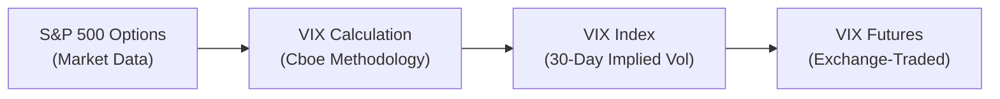

## Overview and Context  

Volatility index futures—best known through the Cboe’s VIX (Volatility Index) futures—have become a cornerstone of modern derivatives markets. The VIX is sometimes referred to as the “Fear Index,” because, historically, it has tended to spike when equity markets plunge. At a high level, volatility index futures track the implied volatility of underlying markets (often the S&P 500) for a specified horizon.  

But it’s not just about the VIX: Various similar indexes exist—like the VSTOXX for European equities, VXFXI for China’s large-cap equity market, and so on—which investors also trade using futures or options. Volatility trading has become a critical element of both risk management and speculative strategies, especially at the portfolio level for institutional investors.

Often, these futures are used alongside (or in lieu of) options-based volatility strategies. Some folks I’ve known swear by them for hedging tail risk. Others use them for short-term directional bets on the overall “fear factor” of the market. Either way, there’s never a dull moment when “fear” is an investment asset.

## Understanding the VIX  

The VIX is a real-time market index that represents the market’s expectation of 30-day forward-looking volatility based on near- and next-term S&P 500 Index (SPX) option prices. Traders and risk managers often interpret a high VIX as an indication that significant gyrations (and possibly big drawdowns) may lie ahead. Conversely, a low VIX suggests a calmer market environment, though it does not guarantee stability—markets can surprise even when the VIX is low.

### How the VIX Is Constructed  

In broad terms, the VIX calculation incorporates SPX option prices spanning a range of strike prices. The formula aggregates the weighted prices of out-of-the-money calls and puts to arrive at a forward-looking measure of implied volatility. If you’ve ever priced or hedged equity index options, you’ll know how crucial implied volatility inputs can be—well, the VIX is basically that concept, aggregated across multiple strikes.

Here is a simplified diagrammatic view of how we move from S&P 500 options to the VIX and, ultimately, to VIX futures:

## Contract Specifications and Cash Settlement  

VIX futures themselves are cash-settled, referencing the final settlement value of the VIX on the expiration day. Because you can’t really deliver “volatility” in a physical sense, cash settlement is the norm. When the futures expire, any open position is either credited or debited based on the difference between the futures price and the final settlement VIX level.

• Contract Size: Each VIX futures contract typically represents 1000 times the VIX index.  
• Minimum Price Fluctuation: Often 0.05 index points, but it can vary by exchange (Cboe sets contract specs).  
• Settlement Method: Cash-settled to a special opening calculation of the VIX index.  

## Other Volatility Indexes: VSTOXX, VXFXI, and More  

While the VIX focuses on U.S. large-cap equity volatility, many markets feature their own “volatility indexes.” The Euro Stoxx 50’s volatility gauge, known as VSTOXX, is widely used by European portfolio managers looking to hedge or speculate on Eurozone equity volatility. Emerging markets have also spawned specialized volatility indexes to track local implied vol. Even commodity markets have “volatility indexes”—like the Oil VIX (OVX)—all designed to measure expected price fluctuations over a near-term horizon.

Regardless of the region or asset, the fundamental mechanics remain similar: The index is derived from relevant option prices, giving you a snapshot of what the market projects in terms of upcoming volatility.

## Pricing Dynamics and Typical Contango  

“But why do these volatility futures often appear so expensive?” is a question many novices ask. The short answer: They’re often in contango. Contango means longer-dated futures prices are higher than shorter-dated ones. In volatility space, the forward implied volatility tends to exceed current realized volatility (and often current implied volatility as well). This phenomenon is sometimes referred to as the “volatility risk premium,” where implied vol tends to be priced higher than the volatility that eventually realizes.  

Some investors exploit this by systematically shorting VIX futures along the curve, hoping to capture the “roll yield,” though this can be dangerous if the market sees a sudden volatility spike. There’s nothing quite like a surprise meltdown to punish that kind of short volatility trade.  

## Term Structure of Volatility  

The term structure for VIX futures shows the implied volatility for different maturities (e.g., one-month, two-month, three-month, etc.). It can shift from contango to backwardation (when near-term futures are higher priced than longer-dated contracts) if the market expects a short-lived but intense volatility spike.  

Being able to read (and interpret) the term structure helps portfolio managers decide whether to hedge with shorter-dated or longer-dated contracts. If, for instance, you expect near-term event risk—like a major central bank announcement—shorter-dated VIX futures might be the hedging vehicle of choice. If you expect an extended period of market turmoil, longer-dated futures can provide a more sustained hedge.

## Uses for Risk Management and Speculation  

• Hedging: VIX futures can serve as an overlay to an equity portfolio, offering a hedge against sudden market sell-offs. During abrupt market declines, implied volatility tends to surge, causing VIX-linked assets to jump, offsetting equity losses (at least partially).  

• Speculation: With volatility indexes, you can go long (anticipating a surge in volatility) or short (anticipating stable or declining volatility). Some managers dial up or down exposure to these instruments to capture short-term opportunities around earnings seasons, macro events, or just general shifts in risk sentiment.  

• Arbitrage: Volatility arbitrage strategies (like “variance swaps” or “calendar spreads” in VIX) attempt to profit from discrepancies between implied and realized volatility or from the shape of the term structure. These can get quite sophisticated—some folks even combine currency volatility futures with equity volatility positions to balance cross-asset risk.  

## Volatility Premium and Mean Reversion  

Academic research and market practice consistently show that implied volatility usually trades higher than realized volatility—though not always. The difference, referred to as the “volatility risk premium,” reflects how much traders are willing to pay for insurance. Because fear can spike quickly, many actively choose to pay that premium for peace of mind.  

However, the market for volatility is in constant flux. If realized volatility surpasses implied volatility, short positions in VIX futures can be hammered. But in calmer times, short-volatility strategies may collect consistent premiums.  

## Practical Example: Portfolio Overlay  

Imagine you manage a well-diversified U.S. equity portfolio and you’re convinced that the market is complacent. You suspect potential volatility from an upcoming election or perhaps an unresolved trade dispute. So, you decide to hedge by buying VIX futures.  

• Entry Price: Suppose the front-month VIX futures trade at 18.  
• Position Size: You buy 10 contracts, each representing 1000 times the index. That’s an underlying notional of 10 × 1000 × 18 = 180,000.  
• Outcome: If volatility spikes and the VIX futures jump to, say, 30, your payoff is (30 – 18) × 1000 × 10 = 120,000. This gain could offset at least some of the losses from your equity portfolio, which presumably fell in value.  

Of course, if the market remains calm and the VIX settles lower at expiration—perhaps at 15—you’d incur a loss on the futures. For a manager who wants to pay a premium for tail-risk protection, though, that might be a perfectly acceptable cost (akin to paying an insurance premium).

## Market Microstructure and Liquidity  

In terms of liquidity, VIX futures attract substantial institutional participation. The bid–ask spread can still widen during big volatility events, but under normal circumstances, the market is fairly efficient. Caveat: If you’re dabbling in less popular volatility indexes (like specialized sector vol indexes), slippage and wide bid–ask spreads can be a problem.

## Best Practices and Potential Pitfalls  

• Rolling Risk: If you’re long VIX futures and you roll them month after month in contango, the cost of “rolling” can erode profits.  
• Leverage: Volatility instruments can move extremely fast. Over-leveraging is a sure way to amplify losses (and gains, but at very high risk).  
• Timing: Volatility can be notoriously stubborn. It won’t always spike on your schedule, and calm periods can last longer than many expect.  
• Cross-Asset Correlations: In a full-blown crisis, everything can correlate. However, the VIX often has an inverse correlation to equities—that correlation is an assumption that might not hold if the market environment changes drastically.  

## Regulatory and Ethical Considerations  

Because VIX futures are regulated under the Commodity Futures Trading Commission (CFTC) in the U.S., you’ll want to adhere to position limits, margin requirements, and reporting standards. The CFA Institute’s Code of Ethics and Standards of Professional Conduct also emphasize transparent disclosures of derivative strategies, especially those involving potentially high leverage, to ensure that clients understand the risks.

## Exam Relevance and Preparation  

At the CFA Level III stage, exam questions might ask you to demonstrate how volatility futures can be integrated into a hedging program, or how to structure a portfolio overlay strategy that addresses tail risk. You could be presented with a scenario about an impending market event—like corporate earnings or a central bank policy decision—and asked to evaluate whether to buy or sell VIX futures (or other volatility index futures).  

You might also see item sets focusing on reading volatility term structures, analyzing contango versus backwardation, or identifying mispricing in the VIX relative to realized volatility. Be prepared to explain how to roll futures efficiently, how to measure the cost of carry for a volatility position, or how you might combine short-term and long-term VIX futures to achieve a particular risk profile.

## Final Exam Tips  

• Understand the Mechanics: Know how the index is derived from option prices.  
• Practice Term Structure Analysis: Be ready to interpret contango or backwardation in the context of event risk, and weigh the cost of rolling your position.  
• Watch Correlations: The VIX is typically negatively correlated with equities, but it can also be influenced by other factors, such as macroeconomic announcements or currency market turbulence.  
• Real-World Context: The exam might ask for a rationale for using VIX futures versus S&P 500 puts (or vice versa) in a hedging context.  
• Ethics and Disclosure: Remember the Code and Standards. Over-leveraging or inadvertently misrepresenting a derivative’s risk profile to a client may violate the duty of prudence and fairness.

## Glossary  

• VIX (Cboe Volatility Index): A measure of the market’s expectation of near-term (30-day) volatility for the S&P 500 Index.  
• Term Structure of Volatility: The relationship between implied volatility levels at different maturities.  
• Volatility Premium: The difference between implied volatility and subsequently realized volatility.  

## References  

• Whaley, Robert E. “Understanding the VIX,” Journal of Portfolio Management.  
• Cboe Website (https://www.cboe.com/) for official specifications and educational material on VIX and other volatility indexes.  
• CFA Institute Code of Ethics and Standards of Professional Conduct (for best practices in derivative disclosure and risk management).  

## Assess Your Understanding of Volatility Index Futures



### Which of the following best characterizes the VIX?

- [ ] A measure of 30-day realized volatility of the S&P 500  
- [ ] A measure of the immediate past volatility of the S&P 500  
- [x] A gauge of the implied volatility on the S&P 500 for the next 30 days  
- [ ] A predictor of inflation rates in U.S. equities  

> **Explanation:** The VIX is derived from the near-term implied volatilities of S&P 500 Index options, capturing the market’s expectation of 30-day volatility.

### Why are VIX futures typically quoted at higher levels than spot VIX in a stable market environment?

- [x] Because of the volatility risk premium leading to contango in the term structure  
- [ ] Because the market often underestimates future volatility  
- [ ] Because regulatory rules require a markup for certain volatility contracts  
- [ ] Because realized volatility is usually higher than implied volatility  

> **Explanation:** VIX futures commonly reflect a volatility risk premium that pushes near-term implied volatility above current spot rates, creating upward-sloping (contango) term structures.

### Which best explains “cash-settled” in the context of VIX futures?

- [x] The contract is settled by a monetary payment based on the final settlement value of the VIX at expiration  
- [ ] The contract is settled by delivery of S&P 500 Index shares  
- [ ] The contract is settled by delivery of basket options on the S&P 500  
- [ ] The contract is never settled; it trades indefinitely  

> **Explanation:** VIX futures are settled in cash, as you cannot physically deliver volatility. The adjustment is purely monetary, based on the index’s final settlement value.

### If an investor believes volatility will drop significantly over the next month, which of the following trades might be most appropriate?

- [x] Take a short position in near-term VIX futures  
- [ ] Take a long position in near-term VIX futures  
- [ ] Buy out-of-the-money put options on the VIX  
- [ ] Swap VIX for a basket of dividend-paying stocks  

> **Explanation:** A short position in VIX futures profits if volatility declines and the VIX futures price decreases.

### Contango in the VIX term structure can lead to which primary cost for a long futures position?

- [x] Roll yield losses when rolling from a lower-priced expiring contract into a higher-priced new contract  
- [ ] Excess returns if the trader remains long for multiple months  
- [x] Higher implied volatility but immediate realized volatility gains  
- [ ] Steady risk-free returns regardless of volatility movements  

> **Explanation:** In a contango environment, repeatedly rolling a long position into the next month often entails buying more expensive futures, causing a roll yield loss.

### What happens to a VIX futures position if realized market volatility turns out to be significantly higher than the implied volatility priced in at inception?

- [x] A long position in VIX futures may become profitable if the futures price adjusts upward  
- [ ] A long position in VIX futures automatically settles at a loss  
- [ ] The exchange invalidates or cancels the contract  
- [ ] The contract cannot rollover if realized volatility is excessive  

> **Explanation:** If realized volatility surpasses the implied volatility discounted into the futures contract, the price of VIX futures may increase, potentially generating gains for long positions.

### A portfolio manager wants a hedge against a short-term market sell-off. Which maturity VIX futures are generally more suitable?

- [x] Shorter-dated VIX futures closer to events like announcements and earnings  
- [ ] Longer-dated VIX futures to account for multiple roll periods  
- [x] They should not use VIX futures at all  
- [ ] Only weekly equity options are appropriate  

> **Explanation:** When seeking short-term event protection, near-term VIX futures are more sensitive to imminent volatility spikes, often providing a more direct hedge.

### In a market meltdown, how do VIX futures generally behave relative to equity prices?

- [x] They often increase in price as equities fall  
- [ ] They tend to move in tandem with equity prices  
- [ ] They become arbitrarily disconnected from the spot VIX  
- [ ] They usually decrease because of negative carry  

> **Explanation:** During an equity sell-off, implied volatility tends to rise, driving up the value of the VIX and associated futures.

### For the exam, which aspect of VIX futures is most important to understand in a hedging context?

- [x] The cash settlement mechanism, the sensitivity to near-term events, and the term structure  
- [ ] The location of the Cboe offices in Chicago  
- [ ] The effect of 52-week high trading volumes on margin requirements  
- [ ] The corporate governance structure of Cboe  

> **Explanation:** In hedging applications, you must understand how VIX futures settle, how quickly they respond to changes in implied volatility, and how to navigate their term structure.

### True or False: VIX futures can show backwardation if the market anticipates a near-term volatility spike that is projected to subside over the longer term.

- [x] True  
- [ ] False  

> **Explanation:** VIX futures may indeed invert (backwardation) if the market prices in a temporary surge in volatility that is expected to dissipate.


