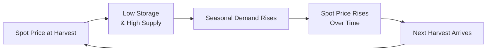

Understanding seasonality in commodity markets can feel like juggling multiple open windows on a windy day—just when you think you have everything in order, an unexpected gust (often in the form of weather changes or shifting demand) sweeps through. Still, seasonality remains a critical tool in the pricing, valuation, and risk management of forwards and futures. It’s not only about identifying times of year when prices historically rise or fall, but also about understanding the fundamental reasons behind those repeated patterns. In this article, we’ll explore how seasonal factors illuminate price behavior, shape futures curves, and guide hedging strategies in real-world scenarios. We’ll keep it slightly conversational along the way, because trust me, if you’ve ever tried to navigate, say, the corn harvest cycle in real time, you know a dash of real talk and personal insight can be invaluable.

## Why Seasonality Matters

Seasonality refers to the predictable, recurring fluctuations in supply and demand across various commodities over the course of a year. Think of heating oil prices in the winter, or the rise and fall of fresh produce costs during harvest season. Those cyclical forces can significantly impact both spot and futures markets.

• Weather-related factors: Heating oil, natural gas, and electricity demand spike during cold winters or sweltering summers.  
• Harvest cycles: Agricultural commodities, such as wheat, soybeans, or coffee, are harvested in predictable windows. This influences spot market availability and the shape of the forward curve.  
• Inventory management: Storage facilities and pipeline capacities might be restricted at certain times of the year, boosting the price for immediate delivery relative to future months—or vice versa.  

For example, in agriculture, every harvest season can bring an avalanche of supply, often pushing spot prices downward. As the year progresses, dwindling inventories might push prices back up until the next harvest arrives. Futures contracts reflect these supply-demand outlooks through the shape of the curve—sometimes we’ll see a steep contango roll in the months just before the new harvest, or a mild backwardation might emerge as old inventories deplete.

## Identifying Seasonal Patterns

One big challenge is pinpointing where seasonality ends and unusual one-off events begin. If coffee prices spike in January every year, you’ll want to know if that’s due to festival demand in certain producing regions, shipping bottlenecks, or a naturally lower supply. The fundamental data—weather forecasts, inventory reports, and consumer demand trends—should guide your analysis.

From a modeling standpoint, historical data can be decomposed into four major components:

1) Trend: The long-term movement in average prices over years or decades.  
2) Cyclical effects: Economically driven upswings or downswings that can last multiple years but are not strictly seasonal.  
3) Seasonal patterns: The predictable intra-year fluctuations.  
4) Random noise or irregular events: The real surprises, like catastrophic weather, global pandemics, or abrupt policy changes.

When you suspect seasonality, you can tease it out with simple charting—plot monthly (or even weekly) price averages over multiple years and look for repeating peaks or troughs around the same time periods. More advanced statistical methods include regression with seasonal dummy variables, ARIMA models with seasonal terms (SARIMA), and advanced machine learning approaches that can highlight repeated patterns over time. 

Below is an example of a very simplified formula that might show how you can incorporate seasonal adjustments (S) into a general pricing model (P) using a trend (T) and an error term (ε):


P_{t} = T_{t} + S_{t} + \varepsilon_{t}


Where:  
• \\( T_{t} \\) is the underlying long-term trend component (e.g., steady growth in demand for soybeans).  
• \\( S_{t} \\) is the seasonal component (e.g., the harvest spike).  
• \\( \varepsilon_{t} \\) is the residual or error term.  

## Seasonality and the Forwards/Futures Curve

In Chapter 8, we know that forward and futures pricing relies heavily on cost-of-carry relationships, storage costs, convenience yields, and the short-term interest environment. Seasonality also plays a starring role, creating distinct patterns in the term structure:

• Contango might become more pronounced just before new supply enters the market (say, right before a big harvest).  
• Backwardation may emerge if the market expects near-term tightness, which then eases as new inventory arrives later in the year.  
• The convenience yield—especially relevant in storable commodities—can fluctuate with seasonality. When supply is tight now (e.g., late winter for natural gas), the convenience yield might rise, pushing the front-month futures higher relative to farther-out months.

The shape of a commodity’s futures curve can be especially dramatic in seasonal markets. Natural gas futures, for instance, often feature settlement prices that vary significantly between summer and winter contracts. If you model or forecast these contracts without incorporating such seasonal “lumps,” you might get whiplash from the resulting price surprises. 

Below is a brief conceptual diagram illustrating how seasonal factors might overlay with typical cost-of-carry forces:



In this simplified cycle, the spot price starts low right after harvest (due to high supply and insufficient storage capacity). Over time, the commodity is consumed, supply tightens, and spot prices rise. Then a new harvest arrives, restoring supply, and the cycle continues.

## Hedging and Trading Strategies With Seasonality in Mind

Seasonality offers a variety of hedging and speculation opportunities. If you’re dealing with agricultural commodities, you might arrange your hedges to match the seasonal production timeline. For example, a grain processor could lock in input prices for wheat futures prior to the harvest, or a cotton producer might use futures to protect revenue streams during the times of year the crop is out of the ground.

Similarly, energy companies and large-scale energy consumers watch weather forecasts like hawks. If you know winter is going to be particularly cold, you might purchase call options on heating oil or natural gas earlier in the year, or even enter a calendar spread strategy. 

• Calendar spreads or seasonal spreads: Traders buy one delivery month and sell another, hoping to profit from a widening or narrowing of the price differential across months that typically shows seasonal patterns.  
• Inventory hedges: If the commodity in question is easily storable, a physical producer or buyer might store the commodity when prices are relatively low and unwind that position when seasonality pushes spot prices higher.

Here’s an anecdote: I worked with a soft-commodity trader who specialized in coffee. About a month before the rainy season in Brazil, she’d always start watching local weather data and environmental logs. One time, she was so convinced by historical weather patterns (and a big run of hot, dry weather in the region) that she established a long position in coffee futures. Sure enough, the early rains were delayed by close to three weeks. The production shortfall in some areas caused a significant bump in coffee prices, netting a solid gain. She attributed her success to digging into local meteorological data—classic seasonal intelligence that many larger macro players hadn’t fully priced in.

## Incorporating Seasonality Into Quantitative Models

In advanced modeling, seasonality can be integrated by introducing time-series methods that explicitly account for repeated patterns. You might see something like a seasonal ARIMA (SARIMA) approach, where the difference between data points a full year apart is analyzed to remove seasonal illusions.

If you’re into Python and want to run a quick check on, say, monthly commodity prices, you could do something like:

```python
import pandas as pd
import statsmodels.api as sm

# We'll run a SARIMAX model to capture seasonality

model = sm.tsa.statespace.SARIMAX(df['Price'], order=(1,1,1), seasonal_order=(1,1,1,12))
results = model.fit(disp=False)

print(results.summary())
```

This snippet is obviously just a starting point, but it reveals how a seasonal parameter can be factored into a classical ARIMA framework. In short, if there’s a recurring pattern every 12 months, the model tries to incorporate that factor rather than lumping everything into random noise.

## Case Studies: Agriculture and Energy

1) Agricultural Commodities: In many grains, like wheat or corn, harvest time is the key determinant of supply. Right after harvest, you see higher inventories and often lower spot prices, unless some exogenous shock hits. After a few months, everyone starts to worry about the next harvest’s weather conditions—hello, risk premiums. Forward and futures prices incorporate that uncertainty, often creating noticeable patterns in the forward curve.

2) Energy: Heating oil, natural gas, and even electricity in some markets can experience huge seasonal swings. For instance, natural gas usage can explode in winter, reflecting the need for indoor heating. Prices for near-month futures often rise significantly relative to the next spring or summer. By analyzing historical data of winter-summer spreads, traders might place calendar spread trades that exploit known demand cycles.

## Best Practices and Pitfalls

Seasonality is a powerful concept, but it can also seduce you into ignoring other market dynamics:

• Confirm the pattern with fundamentals: If a price typically spikes in March, ask “why?” Demand from a holiday season? Low supply from a typical weather event? If you can’t articulate the reason, the pattern might be coincidental.  
• Align your hedge horizons: If you’re hedging a physical commodity, does that hedge line up with the time frame of your exposure? Seasonality can shift from one year to the next, so be prepared to roll your contracts if needed.  
• Watch out for anomalies: Seasonal patterns can break if a macro shock or policy change disrupts normal cycles. Give yourself a margin of safety.  
• Don’t just rely on historical averages: A 10-year average might smooth over major events. Seasonality can become less predictable over time as markets evolve.

For more advanced cross-referencing, you might jump back to the broader discussion of contango and backwardation in the term structure of futures (Section 8.7). Seasonal influences can intensify or diminish those phenomena, and understanding that synergy is crucial if you’re, say, rolling your hedges across multiple delivery months.

## Conclusion

Seasonality matters—a lot. If you’re trying to price commodity forwards or futures without factoring in cyclical patterns, you might find yourself caught off guard by unanticipated spot market moves. By identifying key seasonal drivers, analyzing robust historical data, and adjusting your models (and trading strategies) accordingly, you can calibrate your exposure more effectively. That includes adopting specialized hedging approaches and using market-based or fundamental signals to confirm your assumptions about cyclical price swings.

In exam contexts, seasonality questions frequently appear in scenarios with agricultural or energy commodities, pressing you to calculate how seasonal supply or demand patterns influence forward prices or hedging strategies. Expect to address how to incorporate these patterns into risk modeling, how to handle abrupt changes in seasonal demand, and how to evaluate the relationship between spot and futures prices when cyclical supply shocks are around the corner.

Always remember: historical patterns can break. But more often than not, understanding seasonality gives you a little bit of a head start. It’s like seeing the tide coming in—sure, something unpredictable might happen, but at least you’re not standing knee-deep, oblivious to the water.

## Glossary

Seasonality  
• Regular, predictable changes in commodity supply and demand based on factors such as harvest cycles, weather, and consumer behavior patterns.

Weather-Driven Markets  
• Commodity markets (often energy) that witness demand spikes or dips due to extreme or mild weather conditions, affecting both spot and futures prices.

## References & Further Reading

• “Seasonality in Futures Markets,” Journal of Futures Markets.  
• Agricultural Outlook Reports, USDA website (https://www.usda.gov/).  
• Chapter 8, Sections 8.7 and 8.3 in this text for contango/backwardation and spot-forward relationships.

---

## Test Your Knowledge: Seasonality in Commodity Pricing



### When analyzing a commodity's price behavior over time, which factor primarily explains regular, predictable fluctuations within a year? 
- [ ] Cyclical effects
- [x] Seasonal patterns
- [ ] Random shock events
- [ ] Long-term trend
> **Explanation:** Seasonal patterns describe yearly recurring price swings, whereas cyclical effects can last multiple years and random shocks are not predictable.

### How might seasonality impact the shape of the futures curve in an agricultural market?
- [ ] It eliminates the convenience yield.
- [ ] It reverses contango into backwardation permanently.
- [x] It drives predictable contango or backwardation patterns before or after harvest.
- [ ] It eliminates storage costs.
> **Explanation:** Agricultural commodities often see pronounced contango or backwardation around harvest times due to predictable changes in supply and demand.

### A natural gas trader expects a colder-than-usual winter. Which strategy best exploits the expected seasonal price spike?
- [x] Going long near-month natural gas futures ahead of winter
- [ ] Short selling spot natural gas in the spring
- [ ] Buying far-month futures during the winter
- [ ] Purchasing put options on natural gas during peak winter demand
> **Explanation:** If the trader expects tight supply and high demand in winter, going long near-month or winter delivery futures is a common approach to profit from the anticipated price rally.

### Which method is often used to incorporate seasonal factors in a time-series model?
- [ ] Standard ARIMA without modifications
- [x] SARIMA (Seasonal ARIMA) with appropriate seasonal orders
- [ ] Linear regression without date variables
- [ ] Ornstein-Uhlenbeck processes only
> **Explanation:** SARIMA explicitly includes seasonal terms, allowing it to capture regular, repeating patterns over a year or quarter.

### A large grain processor wants to hedge expected wheat purchases. Which time period is typically most advantageous to lock in a lower price?
- [x] Just before a major harvest, when supply is about to surge
- [ ] Right after harvest, when inventory is low
- [ ] In mid-spring, regardless of the planting season
- [ ] There is never a seasonal advantage in wheat
> **Explanation:** Right before a bumper crop is harvested, the market often anticipates an influx of supply, potentially depressing futures prices.

### What is a key risk when relying on historical seasonal patterns for trading or hedging decisions?
- [ ] That no other traders have access to historical data
- [ ] That seasonal swings are always stable
- [x] That unexpected macro shocks or policy changes could break the pattern
- [ ] That demand is fully predictable
> **Explanation:** While historical patterns can guide strategies, major disruptions such as new regulations, extreme weather, or global events can upend typical seasonality.

### In practice, which fundamental factor often drives the predictable demand surge for heating oil in cold climates?
- [x] Lower temperatures during winter
- [ ] Shifts in interest rates
- [ ] Seasonal changes in farmland equipment
- [ ] Summer harvest cycles
> **Explanation:** Heating oil demand spikes due to cold temperatures, making it a weather-driven market.

### What concept explains why immediate access to a commodity can be more valuable during seasonal supply tightness?
- [ ] Deferred convenience
- [ ] Zero carry cost
- [x] Convenience yield
- [ ] Negative spot premium
> **Explanation:** Convenience yield reflects the benefit of having immediate possession of the commodity, especially when near-term supply is constrained.

### A commodity shows clear seasonal peaks each March. Which question should a hedger consider to confirm that this pattern is truly seasonal?
- [x] “Is there an identifiable demand boost or supply shortfall in March each year?”
- [ ] “Are commodity index funds shorting it?”
- [ ] “Do interest rates always rise in springtime?”
- [ ] “Will cyclical factors last several years?”
> **Explanation:** If the spike truly stems from cyclical supply-demand or weather factors each March, that’s strong evidence it’s seasonal. Otherwise, it might be coincidence or external events.

### True or False: Deterministic seasonal behavior can be fully captured by looking at a single week’s price data.
- [ ] True
- [x] False
> **Explanation:** You need a robust data set covering multiple years to confirm a recurring pattern. A single week of data might not reveal true seasonality.


