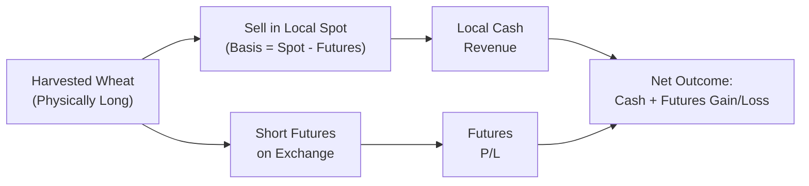

## Overview

One afternoon, I was sitting with a friend who runs a small corn-farming operation. We were sipping coffee—well, I was sipping, he mostly gulped—and he said, “You know, I’ve got a nice futures hedge on my corn production, but I’m worried about something called the basis.” He paused, looking slightly puzzled. “If the cash price at my local elevator moves differently than the futures price on the exchange, I might get surprises in my bottom-line revenue.”

That’s precisely the heart of basis trading: a puzzle that merges local market realities with global futures prices. The “basis” is simply the difference between the local cash price of a commodity (sometimes called the spot price) and the prevailing futures price. For hedgers and speculators alike, it’s a powerful force behind profits, losses, and risk management—yet it’s often overshadowed by more glamorous topics like option greeks and pricing models.

In this section, we’ll walk through what basis means, how it’s calculated, why it moves, and how traders, producers, and end users attempt to capitalize on or hedge basis changes. We’ll keep an encouraging tone, highlight best practices, and even share cautionary tales. Let’s dive in.

## Defining the Basis

The foundation for all basis trading is this core relationship:


\text{Basis} = \text{Local Cash Price} - \text{Futures Price}


When the basis is positive, it means the local cash price is higher than the futures price. If the local cash price is below the futures price, the basis is negative. Now, that might sound fairly straightforward—just some basic arithmetic. But in practice, a strong or weak basis can make or break a hedger’s strategy.

• A “strengthening basis” or “narrowing basis” typically means the spread between the cash price and the futures price is becoming more positive (or less negative).  
• A “weakening basis” or “widening basis” means the opposite: the spread is decreasing in positivity or increasing in negativity.

Producers and buyers can lock in revenues or costs, not only by using futures to hedge the outright price movement but also by focusing on how the basis might evolve over time. The key is: they’re not betting on whether the general market price of, say, corn or crude oil or gold is going to rise or fall. Instead, they’re looking at how the local market’s cash price evolves relative to the futures market.

## Why Basis Matters

Ever wonder why local gasoline prices at your neighborhood station sometimes remain high even though crude oil futures have dropped significantly? Part of that phenomenon can stem from basis. Factors like transportation bottlenecks, unique local demand (maybe your city is in a tourist season), and the timing of deliveries can all drive a wedge between local prices and the standardized exchange price for a commodity.

For producers, basis is a core puzzle piece in revenue forecasting. They can hedge production on a futures exchange, but if their local prices weaken compared to the exchange prices, they lose out on the local side even if the futures hedge performed as expected. For a speculator, basis can be an opportunity to profit if they can anticipate changes in local supply-demand conditions that might outpace the futures market’s adjustments.

## Influences on the Basis

A variety of factors can push the basis in one direction or another:

- Local Supply and Demand: When local supply is abundant (a bumper crop for an agricultural product), the local cash price may tumble, driving the basis more negative. In contrast, if local demand surges for a commodity, local cash prices might rise, leading to a stronger basis.
  
- Quality and Grade Differences: The futures contract specifies certain standards (e.g., #2 yellow corn with a certain moisture content). If the local commodity quality is better or worse, it can lead to price differentials that affect the basis.

- Transportation Costs: Picture an area that has limited rail capacity or trucking routes. If it’s more costly or time-consuming to get a commodity from the local farm to the delivery point specified in the futures contract, that cost will be reflected in the basis.

- Storage Costs and Convenience Yield: For storable commodities like wheat, soybeans, or crude oil, the relationship between spot and futures (and thus the basis) is affected by storage fees, insurance, interest on borrowed capital, and intangible convenience yields. While these factors also relate to the classic cost-of-carry model, the local availability of storage can specifically impact basis distinct from the broader market.

- Market Structure: In a contango market (futures prices are higher than spot prices), the basis might be deeply negative if local supply is tight, or it might flip around as time passes. Conversely, in a backwardation market (futures are lower than spot), a local oversupply can pull the basis more negative. The interplay of contango/backwardation with local conditions can produce complicated patterns of basis movements.

## Mechanics of a Basis Hedge

Let’s say you are a wheat producer, and you notice that the basis in your region for Hard Red Winter Wheat is about \$0.30 per bushel under (meaning the local price is \$0.30 below the futures). You’re worried it could get worse as harvest approaches. So, you decide to “lock in” that basis. Wait—how do you lock in basis?

You already plan to harvest and sell physical wheat in your regional market, so you’re naturally “long” the physical commodity. To lock in a certain basis, you might short-sell the futures contract. Once you deliver your crop to the local elevator, you buy back the futures. Essentially, you’re hedging the difference between local spot and futures. If the local basis worsens (spot price drops more relative to futures), your local revenue might go down, but gains in your short futures position offset some of that. Likewise, if the basis improves, you might lose on the futures side but get that extra advantage in the physical side. The net effect is to reduce overall risk that your local price underperforms the broad futures market.

Below is a conceptual diagram showing how a producer, short the commodity physically, might also short futures to manage basis risk:

In this diagram:  
• You have physically owned wheat (A). Once you sell it locally (B), you receive the local spot price, which is subject to basis.  
• Simultaneously, you short futures (C). Any futures gains/losses (E) combine with your local cash revenue (D) to produce your net result (F).  

If the basis moves favorably (strengthens), you might lose on your short futures but gain more in the local market revenue. If it weakens, you gain on the short futures but lose on the local revenues. This balancing effect is the essence of basis trading.

## Strengthening vs. Weakening Basis

Just to get a bit more official with the lingo:

• A Strengthening Basis is when the difference (Spot minus Futures) is becoming larger in a positive sense or less negative. For a producer who is short the commodity, a strengthening basis can lead to better local prices, potentially boosting revenues. However, if they are also short futures, that additional local revenue might be partially offset by losses on the futures. The net effect depends on how well the hedge ratio was set up.

• A Weakening Basis means that the local spot price is dropping relative to futures (becoming more negative or less positive). For a producer, that’s not great news on the cash side. But if they were short futures, part of that negative move might be offset by a gain on the short futures position.  

Traders often talk about going “long the basis” (buying the spot and selling futures) or “short the basis” (selling the spot and buying futures) if they believe a local supply-demand imbalance is set to normalize. But either approach involves basis risk—the possibility that the basis will move in the opposite direction than you expect.

## Case Study: Soybean Farmer in a Weakening Basis

Imagine a soybean farmer, Lily, who noticed that last season the basis in her region was consistently \$0.45 under the futures during harvest. To protect against a potentially weaker basis this coming season, Lily decided to hedge a portion of her crop by shorting soybean futures when it was \$0.50 under, effectively “locking in” a basis at \$0.50. Let’s see what happens if the basis ends up at \$0.70 under at the time of harvest (meaning the local market’s cash price is \$0.70 below the futures price). That’s a weaker basis than she locked in.

• Lily sells her beans at the local elevator for \$0.70 under futures. She receives that lower-than-expected cash price.  
• However, her short futures position yields a relative gain, because the futures price is now relatively higher compared to the local price.  
• The net effect is that Lily effectively ends up with about \$0.50 under the futures market, as planned, minus any transaction costs or slippage.

So, if Lily had not hedged her basis risk, she would have dealt with a noticeably worse transacted price. This scenario highlights how basis hedging can smooth out local market volatility.

## Contango and Backwardation Revisited

Since futures markets can be in contango (futures above spot) or backwardation (futures below spot), the term structure of futures will interact heavily with local supply-and-demand imbalances. For instance, if you have a corn market that’s deeply in contango, sometimes local storage is profitable, so the local spot price might trade slightly lower relative to near-month futures. But if gatherers (elevators or silos) are near full capacity, the local spot price can plummet, making the basis more negative. Conversely, if the futures are in backwardation and local supply is limited, the spot price might push upward, strengthening the basis. Understanding these dynamics is crucial for any basis trader.

## Strategy, Best Practices, and Pitfalls

• Anticipate Local Demand: Don’t just watch the headline futures price. Track local inventory levels, upcoming harvest forecasts, or anticipated seasonal surges in demand.

• Manage Transportation Bottlenecks: In some regions, rail or truck capacity can be the difference between a profitable basis hedge and a painful mismatch. If you lock in a basis but cannot physically deliver your product to the normal location specified, you might face an unplanned basis discount.

• Watch Your Hedge Ratio: Over-hedging or under-hedging can leave you vulnerable to more basis risk than you’d prefer. It’s not always a 1-for-1 relationship across all grades and delivery points, so be sure to account for quality differences.

• Mind Your Counterparty and Liquidity: Basis trading can be done on-exchange or in bilateral markets. If you’re dealing with an over-the-counter arrangement or a lesser-traded futures contract, watch out for potential liquidity constraints, wide bid-ask spreads, or credit risk of the counterparty.

• Keep an Eye on Seasonality: Certain commodities, especially agricultural goods, exhibit strong seasonal patterns in demand and supply, which can create recurring swings in basis. Familiarize yourself with historical data, but remember that every season has unique conditions.

• Potential for Double Whammy: In times of market stress, you might see the local spot price fall faster than the futures price due to local supply gluts (leading to a very negative basis). If you miscalculated the ratio or if your hedge is the wrong contract month or the wrong location, your hedge might not offset these moves as expected.

## Risk Management and Margin Calls

Though basis trading is often seen as reducing certain forms of risk, keep an eye on margin requirements. If you’re short futures and the futures price spikes (even if your local price doesn’t spike as much), you might face margin calls, which can drain liquidity. Make sure you have a robust liquidity plan for meeting margin obligations.

Also, in the real world, we can’t ignore partial correlations: sometimes the local price also moves up in a supply squeeze scenario. If you’re short futures, you might face margin calls at precisely the moment your local deliveries aren’t yet sold. That mismatch can be nerve-racking—like having your left foot on the brake and your right foot on the accelerator at the same time.

## Practical Example: Cost-of-Carry and Basis

Basis can be thought of in light of cost-of-carry relationships, which incorporate storage costs, financing costs, and convenience yield. The difference between spot and futures in a textbook cost-of-carry model is:


F = S \times e^{(r+u-y)T}


where:  
• \\( S \\) = spot price  
• \\( r \\) = risk-free rate  
• \\( u \\) = storage costs  
• \\( y \\) = convenience yield  
• \\( T \\) = time to maturity  

But the local basis can deviate from this theoretical relationship if, for instance, local storage costs or local interest rates differ from the broader market assumptions, or if there are local supply constraints. The difference between theoretical fair value and local reality is often the trading opportunity in basis trading.

## Personal Anecdote on Overconfidence

I remember the first time I “thought” I locked in a basis for some soft red wheat. The futures side was profitable at first, but the local elevator cut the premium on our wheat due to an unexpected surge of deliveries in the region (and maybe some quality concerns). The basis “blew out” more than I'd accounted for, and to be honest, it taught me a lesson in humility. The markets don’t always do what your spreadsheet says they will—local realities can throw a wrench into grand theories.

## Final Exam Tips

• Ensure you understand how basis is calculated and how it changes in contango vs. backwardation markets.  
• Be able to walk through a hedging scenario: short hedger, long hedger, or even a speculative “long basis” or “short basis” position.  
• Always connect the local fundamentals (like supply, demand, transportation, and storage) with the broader futures price movement.  
• In exam essay or item set questions, you may be asked to identify how a basis movement impacts a hedged position’s net outcome. Practice computing and explaining the final payoff.  
• Don’t forget that basis risk is never zero—it’s simply a different risk from outright price risk.  

## References

- Peck, Anne. “Futures Markets: Theory and Practice.”  
- Commodity Basis Publications (Agricultural Extension Services, Various Regions).  
- CFA Institute. (2025). CFA® 2025 Level I Curriculum, Volume 7: Derivatives.  

--------------------------------------------------------------------------------

## Test Your Knowledge: Basis Trading in Commodity Markets



### Which of the following best describes the basis for a commodity?

- [x] The difference between the local cash price and the futures price.
- [ ] The ratio of futures price to the local cash price.
- [ ] The difference between spot prices of two competing commodities.
- [ ] The yield paid on overnight loans.

> **Explanation:** Basis = Spot (cash) price – Futures price. It is a simple subtraction that indicates how the local price deviates from the standardized futures.

### If a corn producer is naturally long physical corn and also short corn futures, which of the following is true?

- [x] The producer reduces price risk, but still faces basis risk.
- [ ] The producer has no exposure to either price or basis risk.
- [ ] The producer is only exposed to margin calls but not basis volatility.
- [ ] The producer is speculating on future price increases.

> **Explanation:** Being long the physical commodity and short futures is a typical hedging setup, which reduces outright price risk but leaves the producer exposed to changes in the local basis.

### A “strengthening basis” occurs when:

- [ ] The local cash price falls relative to the futures price.
- [x] The local cash price rises relative to the futures price.
- [ ] Futures prices rise faster than the local cash price.
- [ ] Contango transitions to backwardation.

> **Explanation:** A strengthening basis means the spread (Spot – Futures) is becoming larger positively (or less negative).

### Which factor is most likely to cause a local soybean basis to weaken?

- [ ] A sudden reduction in local supply.
- [x] A large influx of grain deliveries flooding the regional market.
- [ ] A surge in local consumer demand for soybeans.
- [ ] Elevated transportation costs that constrain movement to markets.

> **Explanation:** When extra supply arrives in the local market, the local spot price can drop relative to futures, causing the basis to weaken.

### When a market is in backwardation, the futures prices are typically:

- [x] Lower than the spot price for each successive contract date.
- [ ] Higher than the spot price for each successive contract date.
- [ ] Equal to the spot price, but only at contract expiration.
- [ ] Below the spot price only on the first nearby contract.

> **Explanation:** Backwardation arises when near-term prices are higher than more distant maturities.

### What key lesson was illustrated by the anecdote where a trader tried to lock in a basis but encountered unexpected local conditions?

- [x] Local supply and demand factors can worsen basis unexpectedly.
- [ ] Futures contracts solve all local cash price issues.
- [ ] It is unnecessary to track local elevator policies.
- [ ] Price risk is worse than basis risk.

> **Explanation:** Even with a perfectly executed spreadsheet model, real-life factors like elevator discounts or local oversupply can cause bigger-than-expected deviations in the basis.

### Which of the following is least likely to be a driver of local basis levels?

- [ ] Storage capacity in the region.
- [ ] Road or rail transport constraints.
- [ ] Local seasonal demand patterns.
- [x] Overnight Federal Funds rate trends in Europe.

> **Explanation:** The Federal Funds rate (especially in Europe) is less directly relevant to local basis formation compared to supply, demand, storage, and transportation constraints.

### The net outcome for a short hedger (short futures, physically long commodity) in a strengthening basis scenario is:

- [x] Higher local cash revenue but losses on the short futures.
- [ ] Lower local cash revenue but gains on short futures.
- [ ] A guaranteed higher total return than the unhedged producer.
- [ ] The same as if the farmer never hedged.

> **Explanation:** A strengthening basis benefits the local revenue but erodes gains on the short futures position.

### In a contango commodity market, the futures term structure:

- [x] Exhibits higher futures prices for more distant contract expirations.
- [ ] Exhibits lower futures prices for more distant contract expirations.
- [ ] Collapses local basis risk entirely.
- [ ] Is always profitable for storage holders.

> **Explanation:** Contango indicates upward-sloping futures prices over time.

### True or false: Basis risk is entirely eliminated if a producer exactly matches physical production with a short futures position.

- [x] True
- [ ] False

> **Explanation:** This is a trick question. Even though having a short futures position locks in price risk to a large extent, there is always some basis risk because local supply, demand, and other conditions might cause the local spot price to deviate unpredictably from the reference futures contract.


