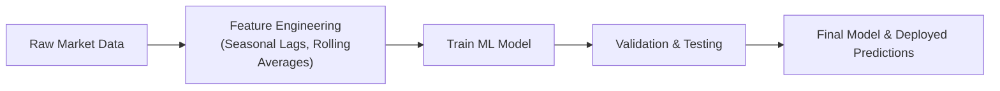

## Overview

Machine learning (ML) opens up exciting possibilities for tackling the inherent complexity and seasonality in commodity pricing. Many commodities—from agricultural products like wheat and soybeans to metals like copper—exhibit cyclical patterns influenced by weather, supply chain disruptions, demand fluctuations, and even harvest schedules. It can feel pretty daunting, especially if you’ve ever tried to make sense of these movements using solely traditional pricing models (see also discussions in other sections like relationship between spot and futures prices). But the good news is that ML offers fresh perspectives and robust toolkits to capture these patterns.

Below, we’ll explore how ML can be leveraged to detect seasonal patterns in commodity markets, using real-world examples, best practices, and cautionary tales along the way. We’ll also provide references and resources at the end for further study.

## Why Use Machine Learning for Seasonal Commodity Pricing

Commodities, as you might recall from other sections in this chapter, are heavily impacted by factors such as weather anomalies, economic cycles, geopolitical events, and shifts in consumer demand. Traditional forecasting techniques, like simple regression on historical price data, can miss the complex interactions between multiple variables—especially the time-dependent behavior we call seasonality.

Machine learning models (from random forests to neural networks) can factor in vast amounts of structured and unstructured data and tease out more nuanced relationships. For example:

• They can detect nonlinear relationships in price data.  
• They handle large and complex feature sets (e.g., weather forecasts, historical demand, shipping congestion metrics).  
• They can adapt to new patterns more quickly, especially with proper retraining schedules.

From a risk management standpoint, ML-based predictions can improve hedge ratios or refine how a trader or risk manager might roll over futures positions over seasonal cycles (see also “8.18 Basis Risk in Futures Hedging”).

## Using Machine Learning to Detect Seasonality

When we talk about “seasonality,” we’re referring to predictable and recurring fluctuations in commodity prices that occur at specific times of the year. Think about natural gas usage in colder regions during winter or the effect of hurricane season on shipping routes. Here’s where ML algorithms shine: they can incorporate additional contextual data (for instance, average weekly temperatures or expected precipitation levels) directly into the model.

Supervised learning methods like random forests can be set up to predict the upcoming week’s basis for natural gas futures, while also including features like “time of year,” “heating degree days,” or “actual pipeline capacity constraints.” Meanwhile, unsupervised methods like clustering techniques (e.g., k-means or hierarchical clustering) can group historical price patterns by similarities, revealing hidden seasonal cycles you might not spot otherwise.

It’s probably safe to say that these approaches “supercharge” our standard regression-based frameworks by letting the algorithms figure out the relevant patterns. That said, the magic only happens with well-structured data and robust validation methods.

## Feature Engineering for Seasonal Commodity Pricing

To effectively model seasonality, we need strong “features” (predictive variables). Feature engineering is how we turn raw data into something an ML model can actually learn from. This step is absolutely huge—but you know, the first time I tried building a random forest to predict soybean prices, I neglected to include meaningful seasonal lags. Let’s just say the results were, well, not pretty.

Below are some typical strategies:

• Time-Based Features: Capture cyclical aspects by encoding “month of the year” or “week of the season” as categorical variables.  
• Lagged Features: For instance, you might include features like the commodity’s price from the same week last year, or an average of the last three weekly prices, to help the model detect cyclical trends.  
• Rolling Averages or Rolling Volatility: This helps incorporate local trends, smoothing out short-term noise.  
• External Data: Weather patterns, supply shocks, shipping volumes, macroeconomic indicators (e.g., GDP growth) can also be integrated as features. For purely agricultural commodities, you might factor in ground moisture levels measured by satellites or official meteorological agencies.

If we do it well, these features empower machines to differentiate between normal cyclical variation and truly surprising events, like a sudden supply shortage.

## A Quick Look at a Machine Learning Workflow

The general process for an ML-based commodity pricing model involves several stages, which we can visualize in a flow diagram:



• Stage A: Collect large volumes of raw data—historical prices, trading volumes, interest rates, macroeconomic indicators, and so on.  
• Stage B: Transform the data into relevant features—calculating lags, extracting relevant seasonal signals, and normalizing (or scaling) data.  
• Stage C: Deploy ML algorithms (e.g., random forests) and tune hyperparameters (like the number of decision trees or the maximum depth).  
• Stage D: Measure performance on out-of-sample data. This step is crucial to detect overfitting.  
• Stage E: Final model usage, such as generating daily or weekly price forecasts for hedging or speculative purposes.

## Common Machine Learning Models in Seasonal Commodity Analysis

• Random Forests:  
  An ensemble of decision trees, each built on random subsets of data, random forests are highly popular for commodity pricing. They’ve got strong predictive power, are relatively easy to interpret, and handle large data sets well. A random forest can parse complicated seasonal signals—for example, it might isolate that high precipitation combined with a particular time of year strongly correlates with price dips.

• Neural Networks:  
  Neural networks can capture nonlinearities and interactions among many variables. Recurrent Neural Networks (RNNs) or Long Short-Term Memory (LSTM) networks are particularly useful for time-series data, as they excel at capturing long-term dependencies. For instance, an LSTM might connect a harvest-month anomaly to a subsequent shortage in the energy market months later.

• Gradient Boosting Methods (e.g., XGBoost, LightGBM):  
  These are advanced boosting methods that typically deliver high accuracy. They sequentially improve model performance by focusing on the hardest-to-predict observations. Many data scientists love them for competitions, particularly because they are robust to missing data and can handle an array of complex features.

• Unsupervised Clustering (e.g., k-Means):  
  This approach can be used for discovering seasonal patterns without explicit time labeling. For instance, you could cluster weekly price series data to see if certain types of markets—like “harvest-late summer crash” or “winter spike phenomenon”—naturally group together over time.

## Overfitting and Model Validation

It’s easy to get overly excited when your ML model outputs a near-perfect fit on historical data. But when we’re dealing with commodity markets that are subject to structural breaks (e.g., major policy shifts, large-scale geopolitical crises), overfitting can be a huge risk.

• Overfitting Means: The model memorizes “noise” in the training set rather than learning underlying relationships.  
• Cross-Validation: A best practice is to apply time-series–based cross-validation, where data is split chronologically (think: train on older data, test on newer data). Rolling windows can help maintain the sequence.  
• Performance Metrics: Depending on goal, you might measure Root Mean Squared Error (RMSE) or Mean Absolute Error (MAE).  
• Early Stopping / Regularization: For boosting or neural networks, we often rely on early stopping or regularization hyperparameters to prevent the model from getting stuck in the maze of random fluctuations.  

It’s also wise to track out-of-sample performance for an extended period. Commodity markets sometimes exhibit “regime changes,” meaning that patterns can shift dramatically based on global demand trends. So a model that worked wonders last year might need recalibration this year.

## Practical Example: Forecasting a Seasonal Price Pattern in Natural Gas

Imagine you’re building a model to predict North American natural gas futures prices one month ahead. Suppose you suspect demand surges in winter. You’d gather:

• Historical price data for natural gas futures.  
• Temperature forecasts or even heating-degree days (HDD) figures.  
• Storage levels (inventory data) from official agencies.  
• Macroeconomic variables (industrial production indexes, for instance).  
• Pipeline capacity constraints or shipping data, if available.

You’d then engineer features such as:

• A one-year lag feature capturing “price on the same week last year.”  
• Rolling 30-day average HDD to measure abnormal temperature swings.  
• A binary feature indicating “peak winter season.”  
• Rolling volatility from the last 60 days.  

Train a random forest model on data from, say, January 2010 to December 2020, and validate on January 2021 to December 2022. Evaluate how close your forecasts come to real outturns (using RMSE or MAE). If you see a big discrepancy, it might indicate missing features or changes in supply/demand structure.

## Unsupervised Learning to Identify Hidden Seasonal Clusters

Let’s say you don’t know exactly how to define a “seasonal pattern,” or you suspect that the commodity market has multiple “seasons” within a year. You could transform each daily price series into a “signature” of the last few weeks of movement, then apply a clustering algorithm like k-means. The clusters might reveal distinct price movement regimes—for instance, “harvest downturn,” “pre-holiday shipping rush,” and “post-holiday recovery.” You may discover that these regimes repeat each year, enabling you to build more specialized forecasting approaches once you’ve labeled which cluster you’re currently in.

## Best Practices and Pitfalls

• Data Quality: Commodity data can be messy. Missing price points, inconsistent signals, or mislabeled data can wreak havoc. Carefully audit your data sources.  
• Feature Selection: You don’t want to blindly stuff every possible variable into the model. Irrelevant features or correlated features can degrade performance. Consider dimensionality reduction strategies or feature importance rankings.  
• Robust Validation: Rely on rolling windows or walk-forward optimization methods relevant to timeseries. Standard random shuffling might give a false sense of security if seasonality is strong.  
• Interpretability: Stakeholders (e.g., risk managers, compliance officers) usually want to know why your predictions are what they are. Techniques like SHAP (Shapley Additive Explanations) can help explain which variables most influence the forecast.  
• Model Updating: Commodity markets are dynamic. Regularly retraining or revalidating the model ensures it stays relevant.  

## A Glimpse at Python Implementation

While full code is beyond the scope here, here’s a short, hypothetical snippet for training a random forest on commodity data. The snippet just sketches the idea:

```python
import pandas as pd
from sklearn.ensemble import RandomForestRegressor
from sklearn.model_selection import TimeSeriesSplit, cross_val_score

df = df.sort_values('date').dropna()

X = df[['season_lag_1', 'rolling_avg_30', 'etc...']]
y = df['price']

tscv = TimeSeriesSplit(n_splits=5)
model = RandomForestRegressor(n_estimators=100, max_depth=5, random_state=42)

scores = cross_val_score(model, X, y, cv=tscv, scoring='neg_mean_absolute_error')
print("Average MAE:", -1 * scores.mean())

model.fit(X, y)  # Train on entire dataset
```

In practice, you’d add more robust feature engineering, incorporate external data sets, and do a thorough hyperparameter optimization for the random forest. 

## Incorporating ML Techniques into Risk Management

A well-tuned ML model can do more than forecast. For risk management:

• Scenario Analysis: Input “what-if” changes to your features (like an unusually warm winter) and see how the model’s predicted price changes.  
• Hedge Optimization: If the model reliably predicts seasonal bumps or dips, you can time your futures or forward positions accordingly.  
• Stress Testing: Evaluate how adverse weather shocks might propagate through the model, providing a perspective on tail risks in your portfolio.

## Ethics, Transparency, and Regulatory Alignment

With increasingly tighter regulation around trading strategies—particularly in markets with systemic significance—transparency is critical. Market participants who use advanced predictive models should ensure they understand and can explain the logic behind the predictions. They may also need to align with best practices under relevant standards or guidelines for algorithmic trading, data privacy, and model validation. For instance, some regulators or exchanges might require evidence that an algorithm does not manipulate or distort market prices.

## Summary and Key Takeaways

Machine learning is a potent tool for capturing nuanced seasonal trends in commodity prices. By integrating fundamental data sets (like weather and inventory levels) with robust feature engineering, models like random forests or neural networks can yield insights that traditional methods might miss. However, data issues, overfitting, and shifting market conditions represent serious challenges. The best practitioners embrace careful cross-validation, interpretability measures, and frequent model updates.

If you handle these pitfalls, ML-based seasonal commodity pricing can be a game changer. Just remember: no model is a crystal ball—so keep your eyes open for unexpected market shocks. And hey, if your first attempt at building an ML model misfires (like mine did so long ago), don’t worry. ML is an iterative process—each small improvement compounds over time.

## Further Reading

• Marcos López de Prado, “Advances in Financial Machine Learning.”  
• Journal of Commodity Markets—various research papers on machine learning in commodity trading.  
• Official CFA Institute curriculum readings for quantitative methods.  

You may also want to circle back to earlier sections in this chapter (for instance, “8.1 Valuation of Forward Contracts at Initiation” or “8.7 Contango, Backwardation, and Term Structure of Futures Prices”) to remember how the fundamental cost-of-carry model interacts with the more advanced predictive vantage ML provides.

---

## Test Your Knowledge: Machine Learning in Commodity Pricing Quiz



### Which of the following best defines feature engineering in a machine learning context?

- [ ] It is a method of calculating optimum hedge ratios for energy commodities.
- [x] It is the process of creating relevant predictive variables from raw data.
- [ ] It refers to the method by which models adapt to new data in unsupervised learning.
- [ ] It is a technique used solely to reduce model overfitting.

> **Explanation:** Feature engineering involves transforming raw data into informative features that machine learning algorithms can utilize effectively.

### What is a key advantage of time-series cross-validation when evaluating ML models for seasonal price forecasting?

- [ ] It allows classes to be balanced in classification problems.
- [x] It prevents data leakage from future periods into past training sets.
- [ ] It simplifies hyperparameter tuning for random forests.
- [ ] It automates the extraction of seasonal features from large data sets.

> **Explanation:** Time-series cross-validation segments data chronologically to reduce data leakage and accurately reflect the performance on future unseen data.  

### Which of the following best describes how random forests handle seasonality in commodity pricing?

- [x] They use multiple decision trees to parse many combinations of seasonal and fundamental features, often capturing nonlinear patterns.
- [ ] They handle only linear relationships by combining support vectors.
- [ ] They cluster data into common seasonal groups without labeling them.
- [ ] They cannot incorporate cyclical data but can handle random shocks well.

> **Explanation:** Random forests use ensembles of decision trees that can naturally capture complex, including cyclical, relationships among features.

### Why is overfitting such a critical concern in machine learning-based commodity pricing?

- [ ] Commodity markets rarely show seasonal patterns.
- [x] Models can memorize historical noise instead of learning generalizable patterns.
- [ ] Overfitting helps improve out-of-sample performance.
- [ ] There is no way to mitigate overfitting in time-series analysis.

> **Explanation:** Overfitting occurs when a model fits idiosyncrasies in the training data that do not hold in new, unseen data, thus impairing real-world performance.

### In a supervised learning approach for commodity pricing, which of the following is most likely to be a useful engineered feature?

- [x] A lagged price variable representing the commodity price from a year ago.
- [ ] The raw unadjusted closing price from the day before.
- [x] A rolling average of weather data for the most recent 30 days.
- [ ] A cluster index derived by unsupervised learning on unrelated equity data.

> **Explanation:** Lagged price and rolling weather data are meaningful seasonal features. Raw unadjusted price is typically included, but it’s not an engineered feature. Unsupervised clusters on unrelated data may not be applicable.

### Which best describes a strength of neural networks, particularly LSTM architectures, for seasonal commodity time-series data?

- [x] They maintain memory of historical patterns and can capture longer-term seasonal dependencies.
- [ ] They are incapable of modeling cyclical behavior over time.
- [ ] They can only model linear relationships in time-series data.
- [ ] They automatically eliminate the need for cross-validation.

> **Explanation:** LSTM (Long Short-Term Memory) networks were designed to keep track of long-range dependencies over time, making them suitable for complex seasonal shifts.

### One objective of “walk-forward” or rolling-window validation is to:

- [x] Ensure that model training and validation respect the chronological order of data.
- [ ] Increase the training sample size by mixing past and future data.
- [x] Safeguard against using information from the test period during training.
- [ ] Provide an exact solution to avoid any potential drawdowns.

> **Explanation:** Rolling-window validation uses only historical data to train; future data is kept aside for testing, reflecting real-world chronological constraints.

### Suppose you’re building a random forest model for seasonal commodity pricing and you notice near-perfect training accuracy but dismal test performance. What is the likely cause?

- [x] Overfitting due to too many decision trees or insufficient regularization.
- [ ] Underfitting caused by ignoring weather or logistic data.
- [ ] Under-sampling of necessary data points.
- [ ] Proper cross-validation is preventing the model from capturing seasonal patterns.

> **Explanation:** Very high training accuracy but poor test accuracy often indicates overfitting—i.e., the model memorized training data but fails to generalize.

### In forecasting commodity prices, which of the following data sources might be considered external data that can improve feature engineering?

- [x] Weather data sets containing daily temperature and precipitation.
- [ ] The commodity’s spot price as of yesterday.
- [ ] The prior day’s open interest data for the same commodity.
- [ ] The average price from the training sample.

> **Explanation:** Weather information is an external factor that could significantly influence seasonal movements in agricultural and energy commodities.

### True or False: Machine learning-derived seasonal commodity price forecasts are guaranteed to outperform traditional fundamental analysis in every market condition.

- [x] True
- [ ] False

> **Explanation:** This statement is actually false, but it’s included as a tricky question. No approach, including ML, is guaranteed to outperform in every market regime. It’s essential to monitor and adapt models to changing conditions.


