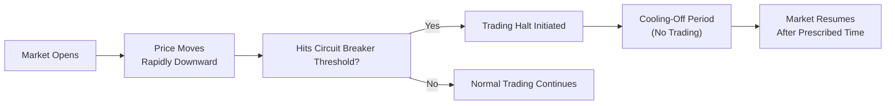

## Introduction

Circuit breakers, also called trading halts, aim to cool down dramatic market swings, especially in times of extreme volatility. Maybe you’ve heard stories from that newly minted futures trader who was caught off guard when the market suddenly paused. I vividly recall a friend calling me in a panic during a trading frenzy—he was about to adjust a futures hedge when, boom, the market froze. Sure, it gave him a moment to regroup, but it also meant he was stuck with an unadjusted position. That little pause highlights both the good and the bad of circuit breakers in derivative markets.

In this section, we’ll walk through why circuit breakers exist, how they’re implemented (particularly in equity index futures), and what they mean for you as a trader, hedger, or arbitrageur. We’ll look under the hood to see how these mechanisms can stabilize markets yet occasionally lead to liquidity shortfalls. Let’s tackle the theory, the real-life tales, and the best practices for navigating these halts when they happen.

## Rationale Behind Circuit Breakers in Derivative Markets

Circuit breakers are in place for a straightforward reason: to prevent markets from spiraling into chaos if prices move too fast in one direction. When a major index or futures contract hits a pre-set threshold—for instance, a 5% drop within a trading session—the exchange can impose a temporary halt or price limit. The logic: slower movement gives investors, traders, and the market as a whole a chance to process new information more calmly, hopefully reducing panic.

• Stabilizing Volatility: High volatility can cause fear and mass sell-offs. Circuit breakers provide a momentary “timeout,” letting participants gather their thoughts and adjust to new data rather than joining a panic.  
• Protecting Market Integrity: A meltdown—or a frenzy—makes it tough to match buy and sell orders efficiently. By halting trading, the exchange helps maintain orderly markets and fosters confidence among participants.  
• Regulatory Mandate: In many jurisdictions, regulatory bodies or self-regulatory organizations require circuit breakers to ensure markets don’t become one big unstoppable roller coaster of price swings.

Still, these mechanisms are not a one-size-fits-all solution. A forced break in trading can fuel uncertainty about whether the next price print will be even more extreme. Moreover, if you’re a hedger or arbitrageur, you might find yourself stuck, waiting to adjust or close a position until the market reopens.

## Common Types of Circuit Breakers

Different exchanges have slightly different rules, but the fundamental idea is the same: if the market moves beyond a predefined threshold–either up or down–trading stops for a set time. Let’s unwrap some of the most common frameworks:

• Price Limit: A maximum or minimum boundary within which a futures contract can trade during a day. If the contract hits the boundary—often called “limit up” or “limit down”—no trades occur outside this price range.  
• Volatility Halt: A temporary suspension of trading if the contract’s price moves too rapidly within a short window. Think of it like pressing a “pause” button when the game is getting out of hand.  
• Multiple Tiers: Some exchanges impose tiered thresholds. For example, the first limit might be triggered at a 5% move, halting trading for 15 minutes. If the price decline continues after the market resumes, a second limit triggers at 10%, halting trading until the next scheduled session or for a longer cooling-off period.

The precise rules vary from one exchange to another. For example, the Chicago Mercantile Exchange (CME) might have different thresholds from the New York Stock Exchange (NYSE) for equity index futures. It’s important to know the actual levels for the products you trade. And trust me, memorize them if you’re actively trading or hedging—no one wants to be caught off guard when the next limit down triggers a 15-minute freeze.

## How Circuit Breakers Affect Pricing and Valuation

Circuit breakers profoundly influence how we value derivatives. Derivative prices are anchored to the underlying asset or index, but they also hinge on implied volatility and liquidity conditions. When a circuit breaker goes off:

• Price Discovery Interruption: Once trading halts, we no longer have fresh quotes, so real-time price discovery is suspended. If you were using the most recent tick data to update your models, you’ll have to wait.  
• Liquidity Drought: With trading halted or heavily restricted, liquidity can evaporate. Bid–ask spreads may widen upon reopening, and many market-makers step back until they see stable order flow.  
• Spike in Implied Volatility: The uncertainty associated with the halt can elevate implied volatilities for related derivatives. If you’re holding S&P 500 index options, you might see big changes in implied volatility as soon as the halt is lifted (though in some cases, implied volatility might have spiked right before the halt).  
• Challenges for Cost-of-Carry Relationships: In normal conditions, forward and futures prices must reflect spot prices, interest rates, dividends, storage costs (for commodities), or convenience yields. But circuit breakers can temporarily scramble these normal relationships because the underlying (spot) market is also halted or showing extreme illiquidity.

In short, these disruptions can create large jumps in pricing once the market reopens. For many participants, that gap risk is the scariest part. If you needed to exit or adjust a position during the halt, you might come back to a changed world after trading resumes.

## Impact on Participants: Hedgers, Speculators, and Arbitrageurs

### Hedgers
If you’re hedging (say, using futures to lock in the price of a commodity, currency, or equity), halts can be a double-edged sword. On one hand, you don’t have to watch the market crash further in real time, which might reduce panic-driven action. On the other hand, you can’t adjust your hedge if new information suggests you should. It’s like being in a car that’s forced to stop on the highway when you need to exit for gas.

### Speculators
Speculators thrive on volatility but hate being frozen out. If the market is shut down, there’s no chance to capture further momentum or close out a losing position. After the break, you may face gapped pricing that doesn’t align with the trades you intended to make.

### Arbitrageurs
Arbitrage strategies generally rely on consistent price relationships between correlated assets or between a derivative and its underlying. Circuit breakers can break these relationships—at least temporarily—by halting trading in one market but not another. It’s also possible that if a market hits a limit on the underlying, arbitrageurs can’t keep the futures aligned with the spot (or vice versa). As a result, basis risk or mispricings can persist longer than usual.

## Real-World Example: Equity Index Futures

Consider equity index futures, one of the most widespread derivatives subject to circuit breakers. Many equity index futures have daily price limits of ±5%. Once the contract hits that 5% limit, trading halts or switches to a limit-hold state. If the underlying stock market is also halted due to a volatility pause, the entire equity/derivative ecosystem can briefly freeze. Let’s do a simplified timeline to illustrate:

1. Market Open: S&P 500 futures trade at 4,000.  
2. Rapid Decline: Within minutes, negative macro news triggers heavy selling, pushing S&P 500 futures down over 5%.  
3. Circuit Breaker: Trading stops for 15 minutes.  
4. During the Halt: Liquidity providers recalculate risk. Traders watch other markets or relevant indices to glean any directional clues.  
5. Resumption: Trading restarts, but the order book might be thin, and prices could gap to 3,800 or lower.  
6. Further Halts (If Needed): Additional thresholds (e.g., 7%, 13%, 20%) might trigger further halts or longer closures.

When you’re running a hedge or arbitrage strategy, you might be stuck during that 15-minute suspension, worried about the re-open price. If the underlying fundamentals keep deteriorating while trading remains frozen, you could face an even nastier drop upon resumption.

## Diagram: The Circuit Breaker Process

Below is a simple flowchart (in Mermaid format) showing the sequence of events surrounding a price-limit-induced trading halt. This is a stylized overview, but it captures the main elements:

When the threshold is reached, the market transitions into a pause (D → E). After the cooling period, trading restarts (E → F), often with revised limit rules or additional thresholds.

## Perspectives on Market Efficiency

Some market participants argue that circuit breakers improve market efficiency by stopping panic-driven trades and giving everyone a chance to digest new information. Critics claim that circuit breakers simply postpone the inevitable price move, possibly intensifying the sense of uncertainty. In other words: “Maybe halts help, or maybe they just put a band-aid on the problem.” Both arguments have some merit:

• **Proponents**:  
  - Encourages rational decision-making.  
  - Prevents feedback loops of forced liquidations.  
  - Conveys a sense of orderly markets to retail participants.  

• **Opponents**:  
  - Delays price discovery.  
  - Creates opening “crashes” when trading resumes.  
  - May artificially inhibit risk management strategies.

Real-world studies show that circuit breakers can reduce intraday volatility, but they don’t fully eliminate the notion of “fear contagion.” It’s a tool—like a seat belt—that can reduce impact but not guarantee zero harm.

## Liquidity and Gaps

One big challenge is the liquidity vacuum that often appears right before a halt, as traders see the limit coming and step away from the order book. Once the market reopens, pent-up orders could cascade on one side of the market. Spreads can be unusually wide. That liquidity shortfall makes it risky to place market orders. If you were hedging, you might shift to limit orders with the hope you’ll get filled near a reasonable price. But in practice, you might miss out if the market whipsaws in seconds.

It’s also worth noting that during multi-day halts or extremely severe price limits, the next open can bring a significantly different price level. That’s the dreaded gap risk: you intended to sell at 4,000, but you actually get filled at 3,850 when the market reopens, directly impacting your P&L.

## Risk Management Considerations

• **Plan for Gaps**: If you rely on stops or dynamic hedging strategies, build in contingency plans. Circuit breakers can disrupt your normal approach.  
• **Adjust Collateral Quickly**: If you’re on margin, a trading halt doesn’t pause margin calls. Once the market reopens, you could face a large shortfall in your margin account. Keep adequate buffers.  
• **Use Options as a Hedge**: Options can offer better-defined risk. Even if the futures market hits a limit, your option payoffs might still provide some cushion (assuming the options market is actively trading before or after the halt).  
• **Monitor Cross-Market Halts**: In some cases, if the underlying equity market halts, the futures market might keep moving—or vice versa. This cross-market dynamic can completely shift your risk profile.  
• **Communicate With Clients/Team**: If you manage institutional capital, your stakeholders might need reassurance. A brief call or email explaining the situation can alleviate anxiety and keep everyone on the same page.

## Regulatory and Ethical Dimensions

Regulators and self-regulatory organizations see circuit breakers as a means to uphold fair and orderly markets. In line with the CFA Institute Code of Ethics and Standards of Professional Conduct, market participants are encouraged to maintain market integrity by refraining from manipulative tactics around circuit breakers. For instance, initiating a large buy or sell program just to trigger a trading halt contravenes fairness and could lead to disciplinary action.

## Exam Relevance

While circuit breakers might sound like an infrastructure topic, you can be sure that exam questions could test your understanding of how a temporary trading halt affects derivative pricing, hedging strategies, or arbitrage relationships. You might see scenario-based questions about how a circuit breaker changes implied volatility or how a hedger might respond to a sudden halt in the futures market.

• **Possible Item Set**: You’re given a table showing an equity index skidding 7% in an hour and then a 15-minute halt. The question might ask how implied vol would react or how you’d adjust your futures-based hedge.  
• **Possible Short-Answer Question**: Explain how circuit breakers can create a misalignment between futures and spot prices and how arbitrageurs might respond post-halt.

## Best Practices for Handling Circuit Breakers

• Stay Informed: Regularly review the circuit-breaker thresholds for each exchange you trade on.  
• Use Contingency Orders Wisely: A limit order can shield you from an adverse fill after a halt, but it may also miss the market. Weigh your priorities.  
• Diversify Risk: Relying on a single exchange or product can be dangerous. Holding partially offsetting positions can help manage risk if a halt occurs in one market.  
• Adjust Strategy for Overnights: If you hold positions during extended non-trading hours, be prepared for next-morning halts.  
• Communication Is Key: If you’re overseeing a trading desk or working with a portfolio manager, coordinate how you’ll respond if a limit is hit, especially on days prone to volatility (such as major economic announcements).

## Final Thoughts and Exam Tips

In the fast-moving world of derivatives, circuit breakers impose a critical pause that can either save your portfolio from a meltdown or block you from timely hedging. If you understand how these halts work—and plan for them—it might be that brief respite you need to regroup. On the CFA exam, you’ll likely see scenario-based questions testing your knowledge of practical implications, from valuation issues to risk management concerns. Be sure you can articulate:

• How halts interrupt price discovery and liquidity.  
• The effect of circuit breakers on hedging and speculative positions.  
• Techniques for mitigating risk around these events.

Remember to remain calm, read the question carefully, and consider the broader context—just like you’d do in an actual circuit-breaker scenario!

## References and Further Reading

• CME Group (n.d.). Rulebook and Price Limits. [http://www.cmegroup.com](http://www.cmegroup.com)  
• NYSE (n.d.). Circuit Breakers and Market Volatility. [https://www.nyse.com](https://www.nyse.com)  
• CFA Institute (n.d.). CFA Institute Code of Ethics and Standards of Professional Conduct. [https://www.cfainstitute.org](https://www.cfainstitute.org)  
• Subrahmanyam, A. (1994). Circuit breakers and market volatility: A theoretical perspective. *The Journal of Finance.*  
• Kim, O. and S. Viswanathan (2020). “Can Circuit Breakers Avert Market Crashes?” *Financial Markets Journal.*

--------------------------------------------------------------------------------

## Test Your Knowledge: Circuit Breakers in Derivative Trading



### 1. When a circuit breaker is triggered in an equity index futures market, which of the following is most likely to occur?

- [ ] Liquidity increases significantly because traders flock to the market.
- [ ] Derivative prices instantly converge with their underlying spot prices.
- [x] Trading halts or transitions to a limit state for a specified time period.
- [ ] The underlying equity index remains fully tradable without interruption.

> **Explanation:** Circuit breakers typically halt or restrict trading, allowing the market time to absorb information and calm volatility.  

### 2. Which of the following best characterizes a "price limit" in futures trading?

- [ ] A requirement that traders must buy at least 100 contracts per trade.
- [x] A maximum or minimum boundary for a contract’s allowable trading price in a session.
- [ ] The final settlement price determined by the exchange.
- [ ] The bid–ask midpoint price, which must remain within two ticks of the open price.

> **Explanation:** A price limit sets the upper and lower boundaries within which a futures price can fluctuate in a given session (often referred to as “limit up” or “limit down”).  

### 3. Recall your hedging strategy with S&P 500 futures. If a circuit breaker halts trading when you want to close your position, which risk increases the most?

- [ ] Basis risk disappears since no trading is possible.
- [ ] Settlement risk decreases because the clearinghouse covers all losses.
- [x] Gap risk increases because the futures may reopen at a significantly different price.
- [ ] Interest rate risk increases dramatically upon reopening.

> **Explanation:** A trading halt can lead to a significant price gap upon reopening, increasing the risk that you can’t exit at your target price.  

### 4. Which statement is most accurate regarding circuit breakers and implied volatility?

- [x] Implied volatility may spike further during the halt or immediately after the market reopens.
- [ ] Implied volatility always decreases during the trading halt.
- [ ] There is no impact on implied volatility because trading is halted.
- [ ] Implied volatility stabilizes and converges with historical volatility during halts.

> **Explanation:** Because halts introduce uncertainty, implied volatility can rise as traders anticipate larger post-halt price moves.  

### 5. An arbitrageur who relies on simultaneous trading in the spot and futures markets could be hindered by circuit breakers primarily because:

- [x] One market may be halted while the other remains open, disrupting their arbitrage relationships.
- [ ] Circuit breakers only apply to the spot market, never to derivatives.
- [ ] The cost of carry is instantly eliminated when a circuit breaker triggers.
- [ ] Their risk exposure to the underlying is completely offset during the halt.

> **Explanation:** If the futures market is halted but spot trading continues (or vice versa), traditional arbitrage strategies become difficult or impossible to execute.  

### 6. Which of the following is a common tiered threshold for circuit breakers in U.S. equity index futures?

- [x] Halts at 7%, 13%, and 20% intraday declines.
- [ ] Halts every time implied volatility changes by 1%.
- [ ] Triggers based on the total open interest in the market.
- [ ] There are no tiered thresholds; only a single universal level.

> **Explanation:** Typical U.S. circuit-breaker thresholds come in tiers (e.g., 7%, 13%, 20% intraday declines), with each tier leading to progressively longer halts.  

### 7. Circuit breakers are intended to:

- [x] Reduce panic selling and allow markets to digest new information.
- [x] Help maintain orderly trading conditions.
- [ ] Eliminate all possibility of price gaps.
- [ ] Guarantee profits for hedgers and arbitrageurs.

> **Explanation:** Circuit breakers are designed to calm markets and reduce panic selling. They’re not a fail-safe for price gaps and don’t guarantee profits.  

### 8. One potential unintended consequence of a trading halt is:

- [x] A liquidity vacuum upon reopening, where bid–ask spreads widen significantly.
- [ ] A guaranteed lower price upon reopening.
- [ ] A permanent freeze on all derivatives trading.
- [ ] Automatic improvement in the creditworthiness of market participants.

> **Explanation:** Halts can result in fewer limit orders and market-maker participation when trading resumes, sometimes causing large bid–ask spreads and thin liquidity.  

### 9. A volatility halt differs from a daily price limit in that:

- [x] A volatility halt is triggered by rapid intraday price movements, while a daily price limit is enforced if a contract hits a set percentage range for the session.
- [ ] A daily price limit depends on order flow, whereas a volatility halt is set by the exchange’s interest rate policy.
- [ ] Daily price limits never fully stop trading, but volatility halts do.
- [ ] They are actually the same mechanism under different names.

> **Explanation:** These mechanisms overlap in purpose but differ in trigger conditions: a volatility halt typically depends on a sudden price move, while a daily price limit is a fixed threshold for the entire session.  

### 10. True or False? Circuit breakers can decrease intraday volatility but risk amplifying the price gap when the market reopens.

- [x] True
- [ ] False

> **Explanation:** Circuit breakers do often slow intraday volatility. However, they can lead to larger price gaps upon reopening because trading is suspended and order books thin out.  


