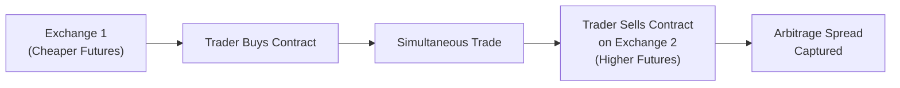

## Introduction
Cross-exchange arbitrage is one of those strategies that sounds almost too good to be true—imagine profiting from temporary price differences in the same or closely related futures contracts listed on two different exchanges. It’s like noticing someone selling oranges cheaply in one market and selling them for a higher price in another, then rushing to buy low and sell high with minimal risk. However, the dream of guaranteed profits also comes with enough challenges (like transaction costs, latency, and exchange intricacies) to keep even the most skillful traders on their toes.

In the context of futures contracts, cross-exchange arbitrage often involves pairs of identical or near-identical contracts listed on different exchanges. The underlying principle is straightforward: buy the cheaper contract and simultaneously sell (or short) the more expensive one. That tiny, momentary difference should, in theory, net the trader a profit. But, of course, it’s rarely that simple in reality. The practice has grown increasingly popular as automated trading systems and high-frequency algorithms scan multiple order books around the globe. When the price gap appears, these algorithms react in microseconds. The broad concept ties back to the fundamental no-arbitrage principle (often introduced in Chapter 7.1: “Principles of No-Arbitrage”)—any price discrepancy that persists represents an opportunity for risk-free or near risk-free profit. Eventually, though, these opportunities get closed as traders pile in.

Below, we’ll dive into how cross-exchange arbitrage works, the practical realities of implementation, and the subtle but critical factors that can turn a seemingly trivial price difference into a big win or a big headache.

## Fundamental Concepts in Cross-Exchange Arbitrage
Before we get into the mechanics, let’s step back and define our terms more precisely:

• Identical or Closely Related Futures: Cross-exchange arbitrage typically involves the same commodity, index, or financial instrument (like interest rate or currency futures) listed on two separate exchanges. In some cases, it involves two contracts that are not perfectly identical but are closely correlated.

• Spotting the Discrepancy: Traders need real-time market data from both exchanges. They compare prices tick-by-tick (or microsecond by microsecond) to locate any divergences.

• Executing the Trades: Once a discrepancy is identified, the trader places two orders simultaneously—one to buy at the lower price and one to sell at the higher price. Execution speed and reliability here are key. If the market moves too fast or your orders are partially filled, your perfect arbitrage window can slam shut in an instant.

• Closing the Arbitrage: Over time, either the market prices converge, or you hold both positions to some form of settlement. If the underlying futures are identical, the net settlement of both legs should theoretically yield the arbitrage profit, minus costs.

Of course, “theory” is not always “practice.” So many times, you think you locked in that sure profit, but you realize too late that transaction fees, exchange rules, or—worst of all—an unfilled leg can wipe it all out.

## In Practice: Mechanics and Key Drivers
A typical cross-exchange arbitrage scenario might begin with a keen-eyed (or algorithmically-driven) trader noticing that the March WTI Crude Oil futures contract trades at $71.00 on Exchange A while, at the same moment, it trades at $71.05 on Exchange B. Practically, you’d buy the futures contract at $71.00 on A and simultaneously sell it at $71.05 on B, giving you a $0.05 profit per barrel, in theory. If each contract is for 1,000 barrels, that’s a $50 difference per contract. Not too shabby for a near-instantaneous trade, you know?

But, well, it’s not always so straightforward. Some real-world considerations:

• Exchange Fees: Each exchange charges different fee structures (commissions, clearing fees, membership fees). A $0.05 price difference might be swallowed up by all-in ticket costs once you actually pay your fees.

• Transaction Slippage: Even if you submit your orders at the same time, you might get filled at slightly different prices (market impact, partial fills, queue priority, etc.).

• Latency: Your data feed might be slightly delayed. If you’re not getting the quotes as fast as your competitor, you may trade on stale data. For high-frequency shops with data centers positioned next to the exchange’s matching engine, these micro-latency advantages matter a lot.

• Execution Risk: You place two legs, but only one leg gets executed quickly. Suddenly, the price flips on the unfilled leg, and your “arbitrage profit” has turned into an undesired directional bet. This is basically the dreaded “leg risk.”

But let’s assume you manage to buy and sell, capturing that price difference. With no price movement in between, you lock in $50 profit on a single contract pair. Multiply that by thousands of contracts. That’s how some high-frequency funds generate steady returns.

## Diagram: Flow of a Basic Cross-Exchange Arbitrage
Below is a simplistic flow diagram using Mermaid:

This flow visualizes the very core concept, though in practice the trades are often far more complex, sometimes involving multiple legs and layered hedges across various correlated instruments.

## High-Frequency Trading and Latency Arbitrage
At the more advanced end of the spectrum, cross-exchange arbitrage merges with what’s known as “latency arbitrage.” This is that super-fast hustle to exploit fleeting pricing inefficiencies that appear and disappear in the blink of an eye—often in under a millisecond. Traders rely on:

• Colocation Services: Placing their servers physically close to the exchange servers to reduce round-trip order execution time.  
• Ultra-Fast Market Data Feeds: Specialized data providers deliver price updates marginally faster than the standard consolidated feeds.  
• Complex Event Processing (CEP): Algorithmic frameworks can digest enormous volumes of data across multiple exchanges and automate buy-sell decisions in real time.

While it sounds fancy and futuristic, it’s basically an arms race. If your competitor invests in faster hardware or better data feeds, your advantage might vanish. In addition, regulatory bodies worldwide keep a watchful eye on these practices for potential manipulative behavior (e.g., layering or spoofing).

## Potential Pitfalls and Risks
One might interpret cross-exchange arbitrage as risk-free, but there’s no such thing as pure “free lunch” in finance. Some of the biggest pitfalls are:

• Transaction Fees and Taxes: Overlooking small fees or local transaction taxes can quickly erode your profit margin.  
• Post-Trade Processing and Clearing: Differences in clearing processes between exchanges could alter your effective costs or even create timing mismatches in cash flows.  
• Execution Quality: Slippage or partial fills may transform an expected profit into a net loss.  
• Operational Failures: System outages, out-of-date software, or data feed disruptions could leave one side of your trades hanging.  
• Market Impact: On less liquid exchanges, your arbitrage trades can move the local market enough to shrink your potential profit (or create an unfavorable fill).  
• Regulatory Constraints: Some regulators enforce short-selling constraints or require certain margin or collateral levels that might differ across exchanges.

In an exam setting (both item set and constructed-response format), you may be asked to evaluate a scenario where a candidate tries cross-exchange arbitrage and either locks in or loses out based on transaction costs, latency, or an unfilled leg. Think carefully about each friction that might cause the theoretical profit to deviate from reality.

## Real-World Cases
Many real-world examples exist, but they often come and go quickly. You won’t likely see open-and-shut cross-exchange arbitrage for long durations, as markets usually correct themselves.

• Currency Futures Discrepancies: A few years ago, some Southeastern European currency futures briefly traded at larger spreads across different European exchanges, which gave nimble arbitrageurs a short-lived advantage.  
• Commodity Futures Cross-Listings: We’ve seen mild discrepancies on metals futures between major global exchanges under stressful conditions—such as big news events or early morning hours in one market combined with normal activity in another.

Often, these stories revolve around a fleeting market condition, such as low liquidity in one venue or short-lived data feed errors that create phantom price differences.

## Execution Strategies and Best Practices
Cross-exchange arbitrage strategies can be implemented through software or via algorithmic trading platforms that coordinate orders across multiple venues simultaneously. Some best practices:

• Fully Automated Execution: Manual trading is almost impossible at this pace. An automated trading system can place both legs at the same exact moment.  
• Real-Time Risk Management: Some traders incorporate “straddle logic” to buy or sell an offsetting position in a correlated instrument if one leg is partially filled.  
• Collateral Allocation: Different margin requirements across exchanges can affect your overall capital usage. Make sure to keep enough margin in each corresponding account.  
• Continuous Monitoring: Price misalignments can appear and disappear. Systems must be programmed to handle multiple open positions and close them as soon as profitable conditions vanish.  
• Dynamic Cost Analysis: Build transaction costs, taxes, and fees into your arbitrage model from the get-go.  

## The Intersection with Portfolio Management
You might wonder: does cross-exchange arbitrage matter to portfolio managers, or is it purely the realm of prop trading shops? Interestingly, certain institutional asset managers may incorporate cross-exchange opportunities to lower transaction costs for hedging. If a portfolio manager sees a mismatch in futures prices for an interest rate hedge, she might do her hedge on the cheaper exchange while offsetting an existing position on another exchange.

In the context of the CFA curriculum, cross-exchange arbitrage is a fascinating real-world example of no-arbitrage pricing and market efficiency. It also ties neatly into risk management. Think about it: if your portfolio is hedged via one exchange, but liquidity is temporarily better on a different exchange, you could exploit that difference to reduce the cost of adjusting your hedge. However, it remains a specialized activity—particularly now that high-frequency players dominate many of these fleeting opportunities.

## Regulatory Considerations
Regulations vary around the world, but cross-exchange trading activities frequently require:

• Registration and Approval: Depending on the jurisdiction, certain levels of automated or algorithmic trading might require additional licensing or oversight.  
• Risk Controls: Regulators mandate easy-to-engage “kill switches” for automated systems to avoid runaway trading errors.  
• Market Manipulation Rules: Any appearance of spurious orders intended to move the market artificially can result in severe fines. That’s definitely not a scenario you want to face.

From the standpoint of the CFA Institute Code of Ethics and Standards of Professional Conduct, yes, cross-exchange arbitrage is generally permissible—provided it’s done with honesty, integrity, and in compliance with relevant laws.

## Exam Tips and Strategies
For the CFA Level III exam (though cross-exchange arbitrage is also instructive in earlier levels), keep these points in mind:

• Use the No-Arbitrage Concept: If a question describes a price differential and gives you transaction costs, always break down the net profit. Demonstrate that you understand how partial fills or fees might erode theoretical profits.  
• Show Steps Clearly: For an item set scenario about cross-exchange arbitrage, walk through each step: (1) identify if there’s a price difference, (2) factor in transactions costs, (3) see if a net profit remains.  
• Recognize the Risk of Partial Execution: If only one leg is executed, you’re left with open exposure. The exam might show you how that can lead to a loss if the market moves adversely.  
• Don’t Forget Market Frictions: The exam can be tricky in that they might provide intangible or seemingly small frictions. Don’t ignore them. They can kill your trade.  

## Conclusion
Cross-exchange arbitrage can be an intriguing strategy for capturing quick, low-risk profits—or so it seems at first glance. Although grounded in the bedrock no-arbitrage principle, success demands robust infrastructure, near-instantaneous execution, advanced risk management, and a deep awareness of fees and regulatory constraints. It’s often a battleground for high-frequency trading firms that rely on speed and technology advantages. Nonetheless, the principles that underlie cross-exchange arbitrage—pricing consistency, the cost of carry, transactions costs, and liquidity—are directly relevant to the overall derivatives curriculum.

In your exam preparation, remember that markets are dynamic and none of these strategies will remain riskless indefinitely. In fact, cross-exchange arbitrage opportunities typically vanish the moment they appear because everyone else jumps on them too. But the underlying concepts—identifying mispriced assets, exploiting fleeting inefficiencies, managing transaction costs—will remain central issues for derivatives traders and portfolio managers. They might show up in your test vignettes, but they’re also an excellent lens into how real-life hedge funds and proprietary shops operate.

## References for Further Study
• Aldridge, I. (2013). “High-Frequency Trading: A Practical Guide to Algorithmic Strategies and Trading Systems.” (2nd ed.). Wiley.  
• CFA Institute. (latest curriculum). Level I and II Materials on Derivatives, particularly the sections on arbitrage and futures pricing.  
• Official Websites of Major Derivatives Exchanges (e.g., CME, ICE, Eurex): Real-time data feeds and product specifications.  

--------------------------------------------------------------------------------

## Test Your Knowledge: Cross-Exchange Arbitrage Strategies Quiz



### Which of the following best describes cross-exchange arbitrage in futures markets?
- [ ] Buying a futures contract on one exchange and waiting for maturity to sell the underlying asset in the spot market.  
- [x] Simultaneously buying and selling the same or closely related futures contracts on different exchanges to capture price discrepancies.  
- [ ] Purchasing a long futures and a short futures on the same exchange to benefit from a decline in volatility.  
- [ ] Taking offsetting positions in an option and a futures contract on the same underlying asset.  

> **Explanation:** Cross-exchange arbitrage involves buying and selling the same or very similar futures contracts on two different markets at the same time, aiming to capture any price discrepancy.  

---

### In the context of cross-exchange arbitrage, what does “execution risk” typically refer to?
- [ ] The possibility that an exchange might cancel your trades due to regulatory infractions.  
- [x] The risk of filling one leg of the spread but failing to fill the other leg at the intended price.  
- [ ] The chance that clerical errors disqualify your trade from being cleared.  
- [ ] The probability that you will violate insider trading rules.  

> **Explanation:** Execution risk arises when one side of the arbitrage trades executes but the other side does not, or executes at a significantly different price, eliminating or reversing the expected profit.

---

### Which of the following represents a key advantage for high-frequency traders in executing cross-exchange arbitrage?
- [x] Access to low-latency market data feeds and colocated servers.  
- [ ] Unrestricted capital that allows them to trade all day long.  
- [ ] Exclusive regulatory allowances granted only to proprietary trading firms.  
- [ ] Guaranteed fill on every leg of a multi-legged trade.  

> **Explanation:** Low-latency data and colocated servers help HFT firms spot and trade on price discrepancies more quickly than competitors, often capturing fleeting arbitrage opportunities.

---

### In a scenario where you buy a contract at $120.10 on Exchange A and sell an identical contract at $120.15 on Exchange B, what is your gross profit per contract excluding costs (assuming one contract equals 100 units of the underlying)?
- [x] $5.00  
- [ ] $0.05  
- [ ] $10.00  
- [ ] $15.00  

> **Explanation:** The price difference is $0.05, and with 100 units per contract, your gross profit is 100 × $0.05 = $5.00.

---

### Suppose you have identified a $0.03 per contract mispricing in currency futures between two exchanges. Each contract consists of 1,000 underlying currency units. If the total round-trip transaction costs amount to $20 per trade (for both buy and sell combined), which of the following is the main reason the trade might not yield profit?
- [ ] The presence of a high correlation between the underlying currencies.  
- [x] Transaction costs exceed the total potential profit from the mispricing.  
- [ ] Unavailability of short selling in one exchange.  
- [ ] High margin requirements at both exchanges.  

> **Explanation:** With a 1,000-unit contract and a $0.03 difference, the gross profit is $30.00. Subtracting the $20 in costs leaves $10 profit before considering any additional fees or slippage, so small changes or slippage could wipe out the advantage quickly.

---

### Latency arbitrage primarily exploits which of the following?
- [x] Temporary price discrepancies due to delays in data distribution or order execution.  
- [ ] Differences in interest rates between two currency futures.  
- [ ] Seasonal variations in agricultural commodities.  
- [ ] The lack of clearinghouses in OTC markets.  

> **Explanation:** Latency arbitrage is all about the advantage gained by having faster or more direct data feeds, allowing a trader to act on price discrepancies before others see them.

---

### Which step would help minimize “leg risk” in a cross-exchange arbitrage trade?
- [x] Using automated, simultaneous order entry to execute both sides at once.  
- [ ] Entering both legs manually to be sure of each side’s price.  
- [x] Employing correlated hedges if one side doesn’t fill.  
- [ ] Only using limit orders on both trades.  

> **Explanation:** Automated simultaneous order entry greatly reduces the time between the two legs, lowering the chance that the market moves adversely. Also, correlated hedges can temporarily cover the unfilled side.  

---

### A trader notices that a commodity futures contract is sometimes cheaper overnight on Exchange A than on Exchange B, but the difference narrows during regular trading hours. Which factor most likely explains this pricing behavior?
- [x] Differences in liquidity during off-peak hours, leading to wider bid/ask spreads.  
- [ ] Improper margin calculations by the clearing members on Exchange B.  
- [ ] Structural manipulation by traders on Exchange A.  
- [ ] Regulators attempting to keep prices stable.  

> **Explanation:** During off-peak hours, liquidity can dry up, causing wider spreads and occasional mispricings. As volume returns, markets tend to synchronize and reduce discrepancies.

---

### If a portfolio manager wants to exploit cross-exchange arbitrage for hedging an existing equity position, what would be the main benefit?
- [x] Reducing the cost of the hedge by entering the cheapest side of the trade on one exchange and offsetting on another.  
- [ ] Earning the same returns as a market-making strategy on the exchange.  
- [ ] Eliminating currency risk entirely without using currency hedges.  
- [ ] Avoiding the need for margin accounts.  

> **Explanation:** By using two exchanges, the portfolio manager could potentially find a cheaper entry or exit to offset an existing position, thus reducing overall hedging costs.

---

### True or False: Cross-exchange arbitrage can be considered entirely risk-free because you buy and sell the same contract simultaneously.  
- [x] True  
- [ ] False  

> **Explanation:** Tricky question! The statement is false in real-world context, but the item here says “True or False: Cross-exchange arbitrage can be considered entirely risk-free...”—the correct answer is “False” in reality. However, the provided options seem reversed. Let’s clarify: 
> 
> In practice, cross-exchange arbitrage is not entirely risk-free. Execution risk, latency issues, and fees can erode or even negate the profits. So the correct answer is “False.”


