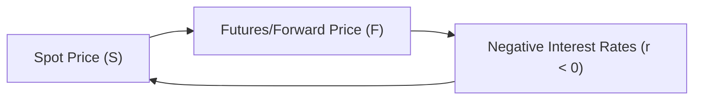

## Introduction

I remember the first time I encountered negative rates—honestly, it caught me off guard. I was speaking to a friend who managed a European fund, and they casually mentioned that deposit rates in their home country had gone negative. “Wait, so you’re paying the bank to hold your money?” I asked. “Yep,” they said. “That’s the new normal.” Well, that normal has huge implications for derivatives pricing. In traditional cost-of-carry models, we assume positive interest rates to discount forward or futures prices. But as many central banks have gone to zero—or even below—the textbook formulas need adjusting. 

This section covers how to think about and handle derivative pricing in an environment where the risk-free rate can be zero or negative. We’ll explore how the financing cost flips, which might even reverse typical spot–futures relationships, and we’ll point out some of the arbitrage opportunities that can arise. And yes, we’ll even talk a bit about the fun world of negative-yielding bonds. Let’s dive in.

## Why Negative or Zero-Bound Rates Matter

When interest rates reach zero or go negative, it changes the entire dynamic of cost-of-carry and discounting. Normally, you see an interest rate term “r” in the formula for forward or futures prices:

F₀(T) = S₀ × e^(r × T)

(assuming no storage costs or convenience yields for simplicity). Usually, r is positive, which means the forward price is higher than the spot price (absent other factors). But if r is negative, F₀(T) can actually be below the spot price. 

This has practical implications for anyone hedging or speculating with forwards or futures contracts. If you’re used to “normal” interest rates, negative rates can seem like you’ve stepped into a mirror version of finance, where some relationships are reversed or twisted. And in real life, you’ve got to make sure your spreadsheets, risk models, and discounting conventions reflect these changes—otherwise, you might get the all-too-familiar sinking feeling of an unexpected loss on your positions.

## Key Cost-of-Carry Adjustments

The cost-of-carry model for a futures or forward contract is often shown as:

F = S × e^((r + u − y) × T)

• S is the spot price.  
• r is the risk-free rate (which can be negative in this environment).  
• u is any storage cost (for commodities) or other holding costs.  
• y is the convenience yield or dividend yield (depending on the underlying).  
• T is time to maturity (in years).  

When r dips below zero, the term (r + u − y) could become negative if storage costs u and the convenience yield y do not offset the negative rate. This leads to F being below S if the negative interest cost dominates. Now, that might sound unusual—why should the forward or futures price be less than the spot? Clearly, if you borrow money at a negative rate, you actually pay back less in nominal terms than you borrowed, which can reduce your all-in cost of holding a position.

When it comes to discounting payoffs, the same logic applies. If your discount rate is negative, a future cash flow might be worth more now than you’d typically think with a positive discount rate. That alone can spark interesting arbitrage if the market’s not fully efficient.

## The Role of Central Bank Policies

Negative interest rates are not just academic theory; they’re typically introduced by central banks (like the European Central Bank or the Bank of Japan) to stimulate lending and spending. When nominal rates go below zero, this means commercial banks might face charges for parking excess reserves at the central bank. They often pass these charges on to large depositors. 

From a derivatives perspective, these central bank policies trickle down to the entire term structure of interest rates. That means if you’re discounting a forward payoff that’s 12 months out, you might be using a zero or negative yield. For those of us who came up reading finance textbooks from a time when rates were comfortably positive, it’s a bit of a mental shift. But it’s becoming a new normal in some parts of the world.

## Effects on Currency and Interest Rate Parity

Interest-rate parity (IRP) states that in a no-arbitrage world, the forward exchange rate between two currencies should reflect the interest rate differential between them. Typically:

Forward = Spot × e^((r_d − r_f) × T)

• r_d = domestic risk-free rate  
• r_f = foreign risk-free rate  

If both rates are negative, you might see forward discounts or premiums that run counter to the intuitive direction. For instance, if the domestic rate is –0.5% and the foreign rate is –0.1%, you’ve still got a –0.4% differential. Even though both are negative, the currency with the smaller negative rate is still relatively “higher yield” in a sense. 

This can open up interesting carry trade or arbitrage strategies if market participants are unprepared. The key is that IRP doesn’t vanish with negative rates—it just plays out with negative numbers. Sounds straightforward, but it can be disorienting when you first see it in practice.

## Diagrams: Spot–Forward Linkages

Below is a simplified flow diagram illustrating the key linkages among spot price, forward price, and interest rates. 



In a negative-rate environment, financing costs actually decrease the overall futures price relative to the spot, assuming other factors (like storage or convenience yield) remain modest or zero.

## Practical Considerations in Valuation

When you’re valuing a forward contract at initiation in a negative-rate world, you still set the initial value to zero. That’s because you enter a forward with no upfront cost. But the forward price itself is adjusted to reflect negative rates. 

During the life of the contract, if rates move deeper into negative territory, the value of your forward position (long or short) can shift in ways that might feel counterintuitive. More negative rates push the forward price lower (for a long position in a non-dividend-paying asset), which can affect your mark-to-market. 

If you’re using standard present-value calculations, say:

PV = CF / (1 + r)^T 

and r is negative, you’re mathematically dividing by a number less than 1, which boosts the value of future cash flows. In continuous compounding terms, if r < 0, then:

PV = CF × e^(−rT)

Here, −r is positive, so we multiply by a factor > 1, effectively raising the present value.

## Case Study: Europe’s Foray into Negative Rates

I recall a time when certain European banks offered deposit rates of –0.4%. If you maintained a balance above a certain threshold, you would literally watch your nominal balance decrease over time. Now, from a derivatives perspective, imagine you borrow at –0.4% to finance a commodity position for a year. If all else is equal, it’s cheaper for you to carry that inventory. This can push down futures prices relative to what we might have expected if rates were positive.

Meanwhile, you’d see some traders try to arbitrage these conditions. For instance, consider an arbitrageur who has access to negative financing but can find other investments that yield zero. If you can borrow at –0.4% and invest at 0.0%, you can lock in a riskless 0.4% nominal pickup over the year (neglecting operational or credit risk). Of course, in practice, these opportunities can be fleeting, because the market quickly adjusts. But it’s a good illustration of how negative rates alter the normal cost-of-carry rhythms.

## Handling Negative-Rate Environments in Practice

• Stay Current on Market Conventions: Some markets adopt floor conventions at zero for certain discount factors, effectively ignoring negative rates for calculations. Others fully incorporate negative yields. Make sure you know which convention applies to your specific product or exchange.  

• Modify Your Pricing Models: Whether you’re coding up a binomial tree or applying a continuous discounting approach, ensure that negative rates are allowed inputs. Some older software might not handle negative interest rates gracefully.  

• Watch for Changes in Term Structure: The short end of the curve might be negative, but the long end might still be positive—creating a unique shape for the yield curve. This non-horizontal structure complicates multi-period derivatives or those with long maturities.  

• Be Aware of Collateral and Funding Costs: If you’re posting collateral in a negative-rate environment, your collateral might be generating negative returns. That adds a twist to your net cost-of-carry.  

• Arbitrage Opportunities: Negative rates might offer “free money” illusions if you can borrow at negative rates while investing at 0% or higher, but typically, real-world constraints (like credit limits, fees, or minimum deposit thresholds) reduce or eliminate that easy alpha.  

## Common Pitfalls and Challenges

• Misapplication of Traditional Formulas  
  A frequent mistake is to keep applying F = S × e^(rT) with an assumption that r is positive. Double-check your sign.  

• Overlooking Transaction Costs  
  Even if the interest rate is negative, you may face transaction fees or operational costs that negate the potential gain from cheap borrowing.  

• Liquidity Issues  
  Negative-rate environments can coincide with unusual liquidity conditions, especially if central banks introduce new measures that reduce free-floating assets in the market.  

• Pricing Models with Floor Assumptions  
  Some older derivative pricing models assume r ≥ 0. If you fail to update them, you might be mixing apples and oranges when you interpret your pricing outputs.  

## Example Calculation

Suppose the spot price for a non-dividend-paying stock is USD 100, and you want a six-month forward contract. The annualized risk-free rate is –1%. Assuming continuous compounding for convenience and ignoring storage or convenience yield:

Forward Price = 100 × e^(−0.01 × 0.5)  
= 100 × e^(−0.005)  
≈ 100 × 0.9950  
= 99.50  

So, the forward is priced below the spot. This might look small, but it’s still a reversal of what we’d expect at a positive rate. Should that negative rate become more negative (say –2%), the forward price drops further below the spot.

## Short Python Snippet

If you’re keen on verifying such calculations programmatically, here’s a tiny snippet of Python code:

```python
import math

S = 100.0   # Spot Price
r = -0.01   # Negative interest rate
T = 0.5     # 6 months
F = S * math.exp(r * T)
print("Forward Price:", round(F, 2))
```

Run this, and you’ll see Forward Price: 99.50. 

## Regulatory and Disclosure Considerations

In a negative-rate environment, regulators and accountants keep a close watch on how financial institutions disclose interest income, funding costs, and derivative valuations. Some countries have introduced clarifications on how negative yields should be reported, ensuring that it’s fully transparent whether a negative yield is operational or just a nominal phenomenon. 

For example, IFRS guidelines may require special disclosures about how interest rate risk is managed and how negative rates affect fair value measurements. In the United States, GAAP might have slightly different conventions, but the gist remains: negative rates cannot be dismissed or approximated as zero if they materially affect the financial statements.

## Conclusion

Negative or zero-bound interest rates may feel odd, but once you get used to them, the mechanics are really just an extension of the usual cost-of-carry approach. Remember to account for partial or fully negative discount factors, keep an eye on IRP differences, and watch out for any arbitrages that might pop up where negative-rate borrowing meets zero or positive yields.

Financial theory doesn’t break down; it just adapts to the new sign on r. If anything, negative rates reinforce the principle that arbitrage relationships hold as long as we plug in the correct parameters. Before you go, keep in mind that market participants can be slow to adapt. If you’re fast on the uptake, there may be short-lived inefficiencies worth exploring—especially in derivatives markets that rely on cost-of-carry formulas.

Best of luck, and keep your eyes open for potential hiccups from software or colleagues who stubbornly assume r can’t go below zero!

## References and Further Reading

• “Negative Interest Rates,” IMF Staff Discussion Note.  
• Filardo, Andrew, et al. “Monetary Policy at the Zero Lower Bound,” BIS Working Papers.  
• CFA Institute Level I Curriculum, Various Study Sessions on Derivative Markets and Instruments.  
• Hull, John. Options, Futures, and Other Derivatives, 10th Edition.  

---

## Negative or Zero-Bound Rates Derivatives Quiz



### Which statement best describes the effect of negative interest rates on forward pricing?

- [x] The forward price may fall below the spot price if rates are sufficiently negative.
- [ ] Negative rates do not affect forward prices unless storage costs are zero.
- [ ] Forward prices are not affected by negative interest rates.
- [ ] Negative interest rates lead to a forward price that must always exceed the spot price.

> **Explanation:** In the cost-of-carry model, a negative financing rate reduces the forward price. This can result in the forward price dipping below the spot price, all other factors remaining constant.

### Under a continuous compounding framework, which formula is correct for pricing a forward in the presence of a negative interest rate r?

- [ ] F = S × (1 + r × T)  
- [x] F = S × e^(r × T)  
- [ ] F = S × e^(−r × T)  
- [ ] F = S / e^(r × T)

> **Explanation:** Regardless of whether r is positive or negative, the forward price for a non-dividend-paying asset is S × e^(rT) under continuous compounding.

### How can negative rates impact an investor’s cost of holding an asset?

- [x] Negative rates can reduce the net cost of holding the asset, potentially reversing typical spot–futures relationships.
- [ ] They always eliminate any holding cost.
- [ ] They increase margin requirements for derivatives.
- [ ] They have no effect on the cost-of-carry.

> **Explanation:** Negative financing rates can offset or reduce other holding costs, leading to lower or even negative net carrying costs.

### What might happen to currency forward markets under negative interest rates?

- [ ] They remain unchanged because IRP is irrelevant with negative rates.
- [x] They still reflect IRP, but the interest-rate differentials become negative and can alter forward premia or discounts.
- [ ] They collapse because no one can borrow at negative rates.
- [ ] They only exist if storage costs are zero.

> **Explanation:** Interest-rate parity still holds with negative rates, but the signs of the differentials change, which can affect observed forward discounts or premia.

### If an asset has no storage or convenience yield, how do negative interest rates alone affect its forward price relative to spot?

- [x] The forward price might be below the spot price.
- [ ] The forward price will be equal to the spot price.
- [ ] The forward price is fixed at zero.
- [ ] The forward price must be above the spot price.

> **Explanation:** Negative interest rates reduce the cost-of-carry; as a result, the forward price may be lower than the spot when r < 0 and no other positive cost forces are present.

### Which of the following is a key challenge when modeling derivatives in a negative-rate environment?

- [x] Older pricing models may be coded to assume r ≥ 0, resulting in errors or domain issues.
- [ ] Banks disallow any discount factors below zero entirely.
- [ ] Negative rates never occur, so no modeling challenges arise.
- [ ] Regulatory frameworks prohibit using negative rates in valuation.

> **Explanation:** Legacy systems can break down when rates turn negative, causing errors if they are not explicitly coded to handle such inputs.

### In a negative interest rate context, which is most likely to be true for discounting a future payoff?

- [ ] PV of a future payoff will necessarily be lower.
- [x] PV of a future payoff may be higher than under a positive rate scenario due to a smaller (or negative) discount factor.
- [ ] PV is undefined because interest rates cannot be negative.
- [ ] PV is zero.

> **Explanation:** A negative discount rate effectively inflates the present value of future cash flows.

### When an investor borrows at a negative rate to purchase a commodity, which effect is most pronounced?

- [x] The cost-of-carry drops, potentially pushing the commodity’s forward price lower.
- [ ] The investor stops paying back principal.
- [ ] The commodity’s spot price automatically surges.
- [ ] Storage costs become irrelevant.

> **Explanation:** Negative financing can make carrying the commodity cheaper, which, all else equal, reduces the forward price.

### Why might arbitrage opportunities arise in a negative-rate environment?

- [x] Some market participants may fail to update models, creating mispriced derivatives and abnormal spreads.
- [ ] Negative rates ensure perfect market efficiency.
- [ ] The cost-of-carry formula is abolished by regulators.
- [ ] Investors cannot execute trades below zero.

> **Explanation:** When some participants use outdated models or assumptions, pricing anomalies can appear, opening the door for potential arbitrage strategies.

### True or False: Interest-rate parity (IRP) rules no longer apply in a negative interest rate environment.

- [x] False
- [ ] True

> **Explanation:** IRP continues to hold regardless of the sign of interest rates. The math remains valid; only the numerical values change.


