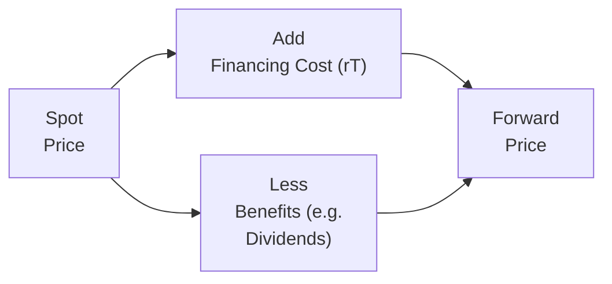
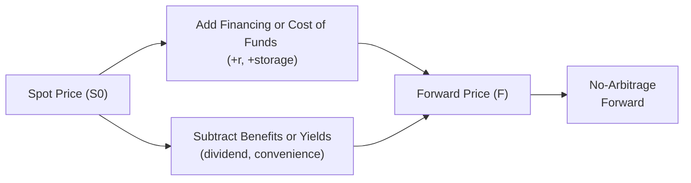

## Overview

When we talk about forward pricing—especially at the advanced (or, shall we say, “capstone”) level of CFA study—we’re essentially discussing the cost of entering an agreement today to buy or sell an asset at a future date. I remember the first time I encountered forwards early in my trading career—I naively thought it was just “the future price you guess,” but oh boy, was I in for a surprise. There’s an entire theory behind how forward prices are determined, grounded in the idea of no-arbitrage and the cost-of-carry model. 

Here, we take a comprehensive look at forward pricing for different asset types—be it equities, physical commodities, currencies, or interest rates—while also highlighting common pitfalls that candidates often encounter. In real-world markets, we must adjust the simplistic cost-of-carry model for dividends, storage costs, or convenience yields when we deal with physical commodities, and for interest rate differentials when it comes to currencies. You’ll see how these different “tweaks” come together so that the forward price is fair, rational, and free from arbitrage opportunities.

## Cost-of-Carry Basics

The foundational concept behind forward pricing is the idea that holding or “carrying” an asset through time comes with various costs and benefits. If you choose to buy the asset now and store it, that’s a capital outlay. You might also incur storage or financing expenses. Meanwhile, you might receive some benefit from holding the asset—like an income stream (dividends or coupon payments) or a “convenience yield,” especially in commodities.  

In mathematical terms (assuming continuous compounding for advanced finance applications), the simplest version of the cost-of-carry model states:

(1) Forward Price = Spot Price × e^(rT)

Where:  
• r is the continuously compounded risk-free rate (or appropriate financing rate).  
• T is the time to maturity (in years).  

Under this baseline assumption, we consider no storage costs, no income (dividends), and no convenience yields. It’s a neat, tidy formula, but real-world assets usually require more detail.

Below is a Mermaid diagram illustrating the basic cost-of-carry relationships:



The general idea is that you start with the spot price, add financing costs, and then subtract any benefits you might get from holding the underlying asset (or equivalently, add net expenses if any). The result is the fair forward price.

## Adjustments for Dividends

When we talk about equity forwards—say, the forward contract on a stock or even an equity index—things get interesting because stocks often pay dividends. If you hold the stock through time, you physically (or electronically) receive dividend payments, which offset some of your cost of carrying. Hence, from a no-arbitrage perspective, the forward price must be lower than the baseline cost-of-carry formula if there are dividend payments along the way.

Let’s consider a stock that pays discrete dividends. Let’s assume these dividends are known or can be estimated with reasonable accuracy (which is often the case for large, stable companies or certain indices). The forward price (under continuous compounding) can be adjusted by subtracting the present value (PV) of expected dividends, DV, as follows:

(2) Forward Price = (Spot Price − PV(Dividends)) × e^(rT)

In real markets, if dividends are paid continuously or if we assume a continuous dividend yield δ, we often write:

(3) Forward Price = Spot Price × e^((r−δ)T)

So that’s the advanced version for equities. If you know you’re going to receive a 3% dividend yield, you can reduce your cost of carrying. Maybe you can put it this way: every dividend you collect means you effectively outlay less net capital to maintain the position.

## Storage Costs and Convenience Yields for Commodities

Unlike equity forwards—with predictable cash distributions—commodity forwards have two unique facets: storage costs and convenience yields (or lease rates). I’ll never forget the first time I had to literally pay for a warehouse to store bushels of corn (well, my firm did, but I learned the pinch). Storage costs increase the forward price. Meanwhile, if you hold the physical commodity, you might enjoy a convenience yield because physical possession can be valuable—think of an oil refiner wanting guaranteed supplies of crude.  

Hence, the forward price for a commodity that pays no dividends, but carries storage costs \\(u\\) and yields convenience yield \\(\gamma\\), can be expressed as:

(4) Forward Price = Spot Price × e^((r + u − γ)T)

Here:
- \\(u\\) represents storage costs (percent of value or a continuous rate).  
- \\(\gamma\\) is the convenience yield.  

Some trickier real-world scenarios also incorporate a “lease rate” (often used for precious metals). This lease rate effectively allows the holder of the commodity to lend it out—earning interest or a fee—and that reduces the net cost-of-carry.

If the convenience yield is high, it offsets part (or all) of your storage and financing costs, resulting in a lower forward price (relative to the no-storage scenario). If you ask me, this is elegantly symmetrical with the dividend yield scenario in equities—anything you gain from holding the underlying lowers your forward price.

## Currency Forwards and Interest Rate Differentials

Currency forward contracts are typically described by covered interest rate parity. In the currency world, it’s the interest rates of the two currencies that matter. Let’s denote:
- \\(S_0\\): the spot exchange rate (home currency per unit of foreign currency).  
- \\(r_d\\): the domestic risk-free interest rate.  
- \\(r_f\\): the foreign risk-free interest rate.  
- \\(F_0\\): the forward exchange rate (home currency per unit of foreign currency) for delivery at time \\(T\\).  

Under continuous compounding, the no-arbitrage condition for currency forwards is:

(5) \\(F_0 = S_0 \times e^{(r_d - r_f)\,T}\\)

Intuitively: if the domestic interest rate is higher than the foreign interest rate, the forward price for buying foreign currency should reflect an expected depreciation in the home currency, and vice versa. If not, we’d have an arbitrage.  

At times, in real markets with discrete compounding, you see the formula:

\\(F_0 = S_0 \times \frac{(1 + i_d)^T}{(1 + i_f)^T}\\),

where \\(i_d\\) and \\(i_f\\) are periodic interest rates over the same horizon. Either approach ensures that if you borrowed one currency and lent the other, you won’t lock in a riskless profit. And if you do see a riskless profit, be sure that some algorithmic trading shop is waiting to pounce on it.

## Interest Rate Forwards (FRAs)

Interest rate forwards, typically known as Forward Rate Agreements (FRAs), let you lock in an interest rate for a future period. For instance, you can arrange an FRA that starts in three months and ends in six months, effectively locking in a borrowing or lending rate for that three-month window.  

The FRA price is best thought of in terms of an implied forward interest rate. Let’s say you have:
- \\(L(t_1, t_2)\\) as that implied forward rate from \\(t_1\\) to \\(t_2\\).  
- \\(r\\) as the relevant risk-free or reference rates, depending on the curve.  

An FRA’s “price” is typically stated as an annualized percentage, just like a standard interest rate quote. You can back it out from the observed zero-coupon yield curve or from short-term interest rate futures. Specifically:

(6) \\(1 + L(t_1, t_2)\,(t_2 - t_1) = \frac{(1 + z_{0,t_2})^{t_2}}{(1 + z_{0,t_1})^{t_1}}\\),

where \\(z_{0,t_1}\\) and \\(z_{0,t_2}\\) are zero rates (or discount factors) for maturities \\(t_1\\) and \\(t_2\\).  

In practice, also recall that FRAs are typically cash-settled at the beginning of the contract period, applying discount factors accordingly. The core principle, though, remains: the forward interest rate ensures no arbitrage between borrowing/lending in the cash market or using the forward agreement.

## Putting It All Together

We can represent the relationships among the adjustments for various underlyings in a single diagram. While the exact formula can vary, the structure remains consistent: Spot plus any net financing cost, minus the value of any yield or beneficial “income.”



At the exam level (and in real portfolio management), understanding which factors to include—dividends, storages, convenience yields, or interest rate differentials—helps you quickly identify potential mispricings or check given data for reasonableness.

## Practical Example: Stock Forward with Discrete Dividends

Let’s run a quick example with numbers. Suppose you have a stock trading at USD 100 today (spot price). The risk-free rate is 5% (continuously compounded), and the stock is expected to pay two discrete dividends: USD 1 in three months and USD 1 in six months. The forward contract matures in nine months.  

1. Calculate the present value (PV) of the dividends:
   - The first dividend is paid in 0.25 years. PV of that dividend = \\(1 \times e^{-0.05 \times 0.25}\\).
   - The second dividend is paid in 0.50 years. PV of that dividend = \\(1 \times e^{-0.05 \times 0.50}\\).

2. Sum these present values. Subtract from the spot to get an “adjusted spot.”  
3. Then apply exponential growth at the risk-free rate for 0.75 years to get your fair forward price.

It might look like this in Python (though in the exam you obviously do it by calculator, but let’s illustrate):

```python
import math

spot = 100
r = 0.05
div1 = 1
div2 = 1
t1 = 0.25
t2 = 0.50
T = 0.75

pv_div1 = div1 * math.exp(-r * t1)
pv_div2 = div2 * math.exp(-r * t2)
adjusted_spot = spot - (pv_div1 + pv_div2)
forward_price = adjusted_spot * math.exp(r * T)

print("Adjusted Spot:", round(adjusted_spot, 2))
print("Forward Price:", round(forward_price, 2))
```

This approach is straightforward once you have the mental framework of cost-of-carry.  

## Common Pitfalls

• Ignoring Dividends or Storage Costs: It’s easy to forget these if you come from a purely theoretical background or if you’re used to simplified formulas.  
• Misapplying Rates (Discrete vs. Continuous): On the exam, keep an eye out for how interest rates are quoted and whether you should convert them to continuous compounding.  
• Mixed Time Conventions: Real markets see monthly quotes, quarterly settlement, annual data. Make sure everything is on the same time basis.  
• Overlooking Convenience Yield: Particularly crucial in commodity markets where the supply chain might need immediate access to the physical underlying.  
• Forward Rate vs. Future Rate: For interest-bearing assets, the difference can matter if there’s marking-to-market (futures) vs. no marking-to-market (forwards). However, the basic cost-of-carry logic remains similar.

## Real-World Considerations

• Rolling Forwards: In practice, an investor or corporation often “rolls” forward contracts as old ones expire—sometimes incurring additional costs or trading slippage.  
• Regulatory & Clearing: For major currencies/commodities, standardized forwards or futures might be centrally cleared, reducing counterparty risk.  
• Accounting Standards: Under IFRS or US GAAP, the way gains/losses on forwards are recognized can vary, especially if designated for hedging. Recognize the relevant rules if the question hints at hedge accounting.  
• Ethical and Professional Standards: If you’re dealing on behalf of clients, be sure you comply with CFA Institute Standards of Professional Conduct, particularly regarding risk disclosures (Standard III: Duties to Clients).

## Final Exam Tips

• Show No-Arbitrage Steps Clearly: If you’re asked to find a forward price, walk through the no-arbitrage reasoning or cost-of-carry formula.  
• Keep Track of Timelines: Carefully mark the timelines for dividends, storage costs, or interest accrual.  
• Confidence in Continuous vs. Discrete: If the exam question states an annual rate with quarterly compounding, convert it properly if you want to use exponential forms.  
• Be Ready for Trick Questions: They might slip in missing data for dividends or storage. Double check what’s “given” vs. “assumed” in the question.  
• Time Management: For constructed-response (essay) questions, be concise but thorough in showing your calculations and justifying them.  

## References for Further Exploration

• Chance, Don M. “Analysis of Derivatives for the CFA Program.”  
• Geman, Hélyette. “Commodities and Commodity Derivatives.”  
• Hull, John C. “Options, Futures, and Other Derivatives.”  
• CFA Institute. “2025 Level I and Level III Curriculum, Derivatives Readings.”

----------------------

## Test Your Knowledge: Forward Prices for Various Underlyings



### In the basic cost-of-carry model (with continuous compounding and no storage or income), which formula correctly represents the forward price for an asset?

- [ ] Forward Price = Spot Price × e^(-rT)
- [x] Forward Price = Spot Price × e^(rT)
- [ ] Forward Price = Spot Price × (1 + rT)
- [ ] Forward Price = Spot Price / e^(rT)

> **Explanation:** The classic no-arbitrage cost-of-carry formula for a non-dividend-paying asset is F = S × e^(rT), assuming a risk-free rate r and time to maturity T.

---

### Which factor, when higher, acts to reduce the forward price of a physical commodity all else being equal?

- [ ] Storage costs
- [x] Convenience yield
- [ ] Financing rate
- [ ] Handling fees

> **Explanation:** A high convenience yield effectively provides an implicit benefit to holding the physical commodity, reducing the net cost-of-carry and thus lowering the forward price.

---

### In the case of a stock paying a continuous dividend yield δ, which formula captures the forward price under continuous compounding?

- [ ] Forward Price = Spot Price × e^(-δT)
- [ ] Forward Price = Spot Price × e^((δ - r)T)
- [x] Forward Price = Spot Price × e^((r - δ)T)
- [ ] Forward Price = Spot Price × e^(δT)

> **Explanation:** With a continuous dividend yield δ, the forward price is Spot × e^((r - δ)T). Dividends reduce the effective cost of carrying the stock.

---

### Which term or concept is most closely associated with the non-monetary benefit of holding a physical commodity?

- [ ] Dividend yield
- [ ] Interest rate parity
- [x] Convenience yield
- [ ] Repo rate

> **Explanation:** The convenience yield represents the additional advantage or “convenience” gained from holding the actual commodity rather than a paper claim on it.

---

### A forward rate agreement (FRA) is best described as:

- [ ] A contract to deliver a physical commodity in the future.
- [ ] A currency exchange contract.
- [x] A contract that sets an interest rate to be paid on a notional amount in the future.
- [ ] An option where you can choose to borrow or lend at a future date without obligation.

> **Explanation:** An FRA locks in an interest rate for a future period, typically settled in cash, based on the notional interest over that future interval.

---

### In determining the forward price of a currency, which principle generally applies?

- [ ] High-inflation currencies must always trade at a forward premium.
- [ ] The forward rate must always match the spot rate.
- [x] Covered interest rate parity, which sets forward rates according to interest rate differentials.
- [ ] Uncovered interest rate parity, which sets forward rates purely on inflation expectations.

> **Explanation:** Covered interest rate parity ensures no arbitrage by linking forward exchange rates to the relative interest rates in each currency.

---

### When an asset provides a known yield or payout during the life of a forward contract, how does this typically affect the forward price?

- [ ] Increases the forward price because it indicates higher cost to carry.
- [x] Decreases the forward price by offsetting part of the carrying cost.
- [ ] Has no effect on forward pricing.
- [ ] It completely eliminates the need for cost-of-carry.

> **Explanation:** If an asset pays a known dividend or yield, the present value of that income offsets some of the financing cost, reducing the forward price.

---

### Assume a forward contract on a commodity that has significant storage costs and negligible convenience yield. Compared to the spot price, the forward price would likely be:

- [x] Higher, due to higher net cost-of-carry.
- [ ] Lower, due to ignoring the convenience yield.
- [ ] Equal, because no benefits offset storage costs.
- [ ] Indeterminate without more data.

> **Explanation:** When storage costs are significant and the convenience yield is small, the net cost-of-carry is greater, pushing the forward price above the spot price.

---

### Which of the following is generally the driving force behind forward pricing models?

- [ ] Speculation
- [x] No-arbitrage principles
- [ ] Regulatory mandates
- [ ] Tax optimization

> **Explanation:** The key principle underlying forward (and all derivative) pricing models is no-arbitrage. Arbitrage ensures market prices remain consistent with cost-of-carry relationships.

---

### In a forward agreement on a stock index with a known continuous dividend yield δ, if the risk-free rate is lower than δ, which of the following statements is most likely correct?

- [x] The forward price could be below the current spot level.
- [ ] The forward price will always be greater than the spot.
- [ ] The forward price will equal the spot.
- [ ] No dividend yield influences forward pricing.

> **Explanation:** If the continuous dividend yield δ on the index exceeds the risk-free rate, the term (r - δ) is negative. Hence, the forward price = Spot × e^((r - δ) T) may be below the current spot level over time.




