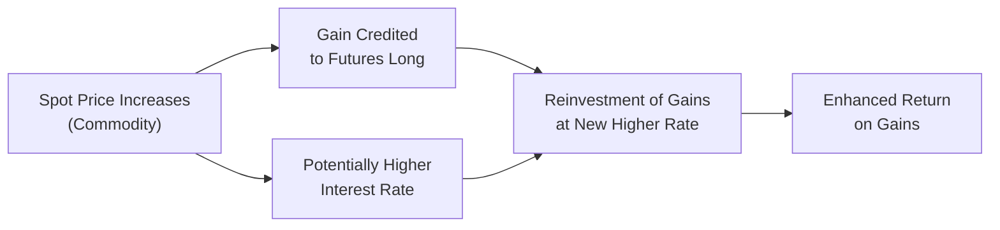

## Overview

In the world of derivatives, it’s important (and actually quite fascinating) to understand how the spot price of an asset, its forward price, and its futures price all fit together in the grand puzzle of market pricing. I remember in my early days analyzing commodity markets—back when I was a bit wide-eyed about the complexity of daily price fluctuations—it seemed that forward and futures contracts were essentially the same. They both allowed me to lock in a price in the future, right? So why would we have two different instruments for essentially the same deal?

Well, as you probably suspect, there’s a subtle but crucial twist. Forwards typically settle at maturity, while futures get marked-to-market daily. This simple difference means that money changes hands every single day under a futures contract—an experience that can be surprisingly unsettling the first time you see your margin balance. This daily cash flow can lead to slight price discrepancies between forwards and futures, especially if interest rates fluctuate or if there’s some correlation between the asset’s spot price and interest rates. In this section, we’ll talk about how and why these discrepancies arise, and what they might mean for you in practice.

## The No-Arbitrage Foundation

One of the cornerstones of derivative pricing is the concept of no-arbitrage. If markets are efficient, you can’t get a free lunch (though wouldn’t that be nice). Arbitrage refers to a riskless profit made by exploiting price discrepancies between markets or instruments. If such a discrepancy exists momentarily, traders will rush in to profit, pushing prices back in line. Consequently, when we say the forward price or futures price for a particular underlying must satisfy no-arbitrage conditions, we’re basically saying the market quickly corrects any “free money” opportunities.

A simplified way to see this is:

• If the forward or futures price is too high, you can short the forward (or futures) and buy the spot, storing or financing the asset until delivery/maturity.  
• If the forward or futures price is too low, you can buy the forward (or futures) and short the spot for immediate cash, reversing the position at delivery.  

The forced alignment of these trades keeps the market in check. In that sense, forward and futures prices should be roughly consistent with something often called the “cost of carry” model.  

Mathematically, for many (though not all) assets, we can express a theoretical forward or futures price as:


F_0 = S_0 \times e^{(r - q - c)T}


Where:  
• \\( S_0 \\) is the current spot price of the asset.  
• \\( r \\) is the risk-free rate (annualized).  
• \\( q \\) is the continuous dividend yield (if applicable).  
• \\( c \\) is any storage cost (or convenience yield) adjusted for continuous compounding.  
• \\( T \\) is the time to maturity (in years).

In many real-world settings, we’re more used to a discrete compounding approach like:
  

F_0 = S_0 \times (1 + r - q)^T


depending on how precisely you want to handle compounding. Either way, the no-arbitrage condition ensures that the forward (or futures) price is anchored to the spot price and the cost or benefit of holding the underlying over time.

## Spot Price vs. Forward Price: The Basic Connection

Let’s imagine you see a stock trading today at \$100 (this is your spot price). You’d like to buy it in 6 months. But the market also offers a forward contract allowing you to lock in the stock purchase price in 6 months, at, say, \$103. That \$103 is the “forward price.” If it’s a perfectly competitive, frictionless market, you can compare the cost of paying \$100 now (and financing that purchase if necessary, plus factoring in dividends you’d collect) versus deferring the purchase to 6 months. These forces collectively drive the forward price.

Under the no-arbitrage principle, the forward price must produce the same outcome, financially, as if you had decided to buy the stock now and hold it until the forward’s maturity. If these two paths weren’t equivalent, you could lock in a riskless profit. Traders do not typically let that happen.

Because forward contracts settle only at maturity, the buyer and seller simply have a binding agreement: no money normally changes hands until that settlement date arrives.

## Futures: The Twist of Mark-to-Market

Futures, on the other hand, have a daily settling up process known as mark-to-market. If you’re long a futures contract on, say, a commodity, and the market price of that futures contract rises, you’ll see a credit in your margin account. If it drops, you’ll see a debit. This daily settlement continues until you offset or the contract expires. This dynamic means that your actual monetary gains and losses are realized day by day rather than at the contract’s end.

In a stationary world with constant interest rates and zero correlation between interest rates and the underlying spot price, the forward price equals the futures price, all else being equal. One simple reason is: if you invest those daily gains or pay interest on your daily losses at a fixed rate each day, the net effect is the same as a single settlement at maturity (assuming perfect credit markets). Concretely, you’re not “better off” or “worse off” in a futures contract than a similar forward contract if interest rates are constant and uncorrelated with the underlying.

## When Futures and Forwards Deviate

Now, you might be thinking, “So if they’re the same in perfect markets, why do I constantly hear that futures quotes differ from forward quotes?” Indeed, in the real world (where life is messy), interest rates can be downright finicky. If there’s a positive correlation between the spot price of the underlying asset and the short-term interest rate, or if we just happen to be in a volatile interest rate environment, you can actually see some persistent pricing differentials.

### The Role of Interest Rate Volatility and Correlation

Think of it this way: if the asset’s price spikes upward and simultaneously short-term interest rates climb, a futures holder receives a daily cash flow (mark-to-market gain) just when the cost of reinvesting that gain is higher. That could be beneficial. Conversely, if the asset’s price drops and interest rates drop, the futures holder’s losses occur when the financing environment might be cheaper. This interplay of event timing means that a futures contract might be slightly more or less valuable than an equivalent forward.

In a scenario where the spot price is positively correlated with interest rates:  
• Gains from mark-to-market come in precisely when you can reinvest at favorable rates.  
• Losses occur when interest rates have dropped, but that at least partially offsets your cost of financing any margin call.

If spot prices and interest rates are negatively correlated, the effect is reversed. So, from a strict no-arbitrage vantage point, we can’t say that the forward and futures prices have to be identical once we admit non-constant, uncertain interest rates that are correlated (positively or negatively) with the asset’s returns.

For example, in an environment where interest rates sharply spike on days when gold prices surge, gold futures could trade at a slight premium to gold forwards due to the additional potential for reinvestment income. Conversely, if rates fall on days when gold rallies, that premium might vanish or reverse.

## Practical Example

Let’s suppose a commodity’s spot price is \$50 today. The annualized risk-free rate is ~5%, but it’s not locked in—it varies daily with market conditions. In a frictionless world with constant rates and no correlation with the commodity price, the 6-month forward/futures price (annualized horizon) might approximate:


F_0 \approx 50 \times (1 + 0.05)^{0.5} \approx 50 \times 1.0247 \approx \$51.24


If, however, the short-term rate has a strong, positive correlation with that commodity’s price, then on days when the commodity’s price jumps, interest rates also jump, and a futures holder who is long would receive positive mark-to-market gains to reinvest at a higher rate. Over time, those gains compound. As a result, the futures price might trade marginally higher than \$51.24 to reflect this expected benefit.

On the flip side, if the correlation is negative (i.e., rates drop whenever the commodity price jumps), the effective return from daily settlement might be lower than the forward scenario, nudging the futures price slightly below \$51.24. This difference might only be a few cents, but it’s not zero.

## A Visual Representation

To see how the daily mark-to-market process interacts with possible interest rate paths, consider the following simplified Mermaid diagram. It shows spot price changes, daily mark-to-market settlements, and the interest rate environment feeding into the cash flows of a futures contract.

In this diagram, whenever the spot price of the commodity goes up, the futures contract accrues a mark-to-market gain for the long position. If interest rates also increase at that time, the gains can be reinvested at a higher rate, boosting the overall profitability for a futures holder relative to a forward holder, who will only extract profit at contract maturity.

## Arbitrage Boundaries

Even though such correlations can make futures prices differ slightly from forward prices, we should remember these differences typically stay small. If the gap becomes notably large, arbitrageurs will jump in:

• If the futures price is “too high” relative to the forward price, they could short the futures and go long the forward, capturing daily gains and crystallizing a near riskless profit.  
• If the futures price is “too low,” they could reverse the trade.  

The presence of active arbitrage virtually guarantees that, absent transaction costs, very large divergences won’t persist. Markets are always trying to weed out any freebies.

## Mark-to-Market Risk and Cash Flow Implications

From a practical standpoint, the daily settlement for a futures contract also imposes certain risk management responsibilities that forward contracts do not. If you’re on the losing side of a futures trade, you’ll face margin calls. This can create a liquidity crunch if you’re not well-capitalized. Meanwhile, forward contracts are typically privately negotiated, so the only real settlement occurs at maturity (barring any collateral agreements). That can be a double-edged sword: you might not need to pay margin daily, but if the market moves against you heavily, you might face a large payment at the end.

## Relationship to Hedging Strategies

In hedging scenarios—whether you’re an importer trying to lock in a currency rate or a farmer trying to protect the price of your harvested crop—the distinction between forward and futures pricing can impact your bottom line:

• A small hedger with limited liquidity might prefer the forward, even if that means sacrificing some flexibility, because daily margin calls can be disruptive.  
• A large institutional hedger might prefer the exchange-traded transparency and liquidity of futures, even if it incurs daily mark-to-market obligations.

In a stable interest rate environment with no strong correlation to your underlying asset, you might not fuss much about the difference. But in times of uncertain rates, these differences can become more pronounced.

## Real-World Complications

In real markets, complexities multiply quickly:

• Credit risk matters. If you have reason to suspect counterparty default risk in a forward contract, you might prefer standardized futures.  
• Transaction costs matter, including brokerage fees, bid-ask spreads, and capital charges.  
• Storage, convenience yields, and even regulatory constraints can all cause day-to-day variations in forward vs. futures quotes.  
• If you’re dealing with global assets and cross-currency swaps, you’ll find that local interest rates and currency movements create a messy chain of correlated factors influencing forward and futures prices.

In short, perfect frictionless markets are more of a neat thought experiment than a real phenomenon. But these ideas—no-arbitrage, cost of carry, daily mark-to-market—are the reference points that help us evaluate where reality deviates and why.

## Summarizing Key Takeaways

• In a world of constant interest rates and zero correlation between rates and the underlying asset, forward and futures prices should theoretically match.  
• Daily mark-to-market on futures means gains/losses are realized throughout the contract’s life, whereas forwards settle at maturity.  
• If there is a correlation between the asset’s price and interest rates, futures prices can deviate from forwards for the same maturity.  
• Arbitrage typically keeps large price differentials in check.  
• Real-world factors like credit risk, storage costs, transaction costs, and liquidity needs will also shape the differences between forward and futures prices.  

All these nuances set the stage for how you might choose one instrument over the other in a real business scenario, or how you’d expect them to behave in normal market conditions versus times of high volatility.

## Exam Tips and Pitfalls

• Always remember the no-arbitrage principle. It’s the foundation for so much of derivatives pricing.  
• When analyzing a question that asks why futures might be priced differently from forwards, the correct response usually revolves around interest rate volatility and correlation, unless the question references more exotic reasons (like credit risk, convenience yields, or exchange restrictions).  
• Many exam-style problems will assume “constant continuously compounded risk-free rates” unless stated otherwise, in which case forward and futures prices are the same. But watch out for that small detail about correlation in exam questions; that’s often a clue that they want you to discuss daily mark-to-market cash flows.  
• If a question highlights how margin calls can be a “problem” or “benefit” for certain investors, that’s probably a hint to talk about how being forced to pay or receive daily mark-to-market amounts can shift the effective rate of return or cost.  

On the exam, try to keep your answers structured:  
1. Briefly highlight the no-arbitrage principle.  
2. Mention the cost-of-carry formula.  
3. Note the role of daily settlement in futures.  
4. Include the effect of correlation with interest rates (if relevant).  

If you’re consistent in those steps, you’ll typically cover the main points that the graders expect (especially in scenario-based or constructed-response questions).

## References

Below are a few references you may find helpful if you’d like to dive deeper into these topics:

• McDonald, Robert. “Derivatives Markets.” (Comprehensive chapters on forward and futures pricing.)  
• CFA Program Curriculum, Derivatives: Pricing and Valuation of Forward and Futures Contracts.  
• Hull, John C. “Options, Futures, and Other Derivatives.” (A classic that covers many advanced topics in no-arbitrage relationships.)  

And, well, that’s it for now. No matter what your path in finance—trader, risk manager, or just an enthusiast—it definitely pays to understand how spot, forward, and futures prices interact. It might mean the difference between a well-hedged position and a not-so-pleasant surprise.

---

## Test Your Knowledge: Spot, Forward, and Futures Pricing



### 1. In a frictionless market with constant interest rates, which statement best describes the relationship between forward and futures prices?

- [x] They should theoretically be equal.
- [ ] Futures should always trade at a premium to forwards.
- [ ] Futures should always trade at a discount to forwards.
- [ ] Forwards should be more expensive than futures due to settlement risk.

> **Explanation:** In a perfect market with constant interest rates and no correlation with the underlying asset, forward and futures prices converge under the no-arbitrage principle.

### 2. What is the primary cause of potential price disparities between forward and futures contracts on the same asset?

- [ ] Differences in credit risk between buyer and seller.
- [ ] Underlying assets often stop trading.
- [x] The daily mark-to-market in futures and its interaction with interest rate volatility.
- [ ] Government regulation that bans forward contracts.

> **Explanation:** While credit risk and market liquidity can matter, the main theoretical cause is the daily mark-to-market mechanism in futures, especially if interest rates are volatile and/or correlated with the underlying asset’s price changes.

### 3. Which of the following most accurately characterizes mark-to-market?

- [ ] A method of annual settlement for futures.
- [x] A process in which gains and losses in a futures contract are settled daily in cash.
- [ ] A penalty for late margin payments.
- [ ] A valuation method for illiquid forwards.

> **Explanation:** Mark-to-market is the daily process of settling gains or losses on a futures contract, ensuring that any unrealized profit or loss becomes realized in the trader’s margin account.

### 4. When the underlying asset’s price increases simultaneously with short-term interest rates, a long position in a futures contract may be more appealing than a forward contract because:

- [x] The long position can reinvest daily gains at higher rates.
- [ ] The forward contract has no settlement at maturity.
- [ ] Interest rates have no impact on futures prices.
- [ ] The long position does not need to fund any margin account.

> **Explanation:** With a positive correlation between price moves and interest rates, daily gains are received exactly when rates are higher, allowing beneficial reinvestment.  

### 5. A commodity is trading at \$100 in the spot market. Assuming a 10% annualized risk-free rate (continuous compounding), zero storage costs, and zero dividends, which is the approximate 1-year forward price under no-arbitrage assumptions?

- [ ] \$100  
- [ ] \$105  
- [x] \$110.52  
- [ ] \$110.00  

> **Explanation:** The forward price is computed as \\(100 \times e^{0.10 \times 1} \approx 100 \times 1.1052 = 110.52\\).

### 6. Which of the following is typically viewed as a potential disadvantage of a futures contract compared to a forward?

- [ ] Lower liquidity.
- [x] Requirement of daily margin posting.
- [ ] Higher interest rate risk.
- [ ] Inability to trade on an exchange.

> **Explanation:** Futures contracts require that positions be marked-to-market daily, and margin must be maintained accordingly. This can pose a liquidity challenge.

### 7. If a trader notices that the futures price is significantly above the theoretical forward price, all else equal, what might they do to exploit the discrepancy?

- [x] Sell the futures and buy the forward, capturing the difference.
- [ ] Buy the futures and sell the forward, hoping the mismatch grows.
- [ ] Refuse to trade until prices converge.
- [ ] Close out their cash positions immediately.

> **Explanation:** By selling the overpriced futures and buying the corresponding forward, the trader may earn a near riskless profit once prices converge.

### 8. Which scenario will most likely reduce the difference between futures and forward prices?

- [ ] Highly volatile interest rates and underlying prices.
- [x] Stable interest rates and no correlation with the asset price.
- [ ] Increased bid-ask spreads in the spot market.
- [ ] Periods of low trading volume and illiquidity.

> **Explanation:** If interest rates remain stable and show no correlation with the underlying spot price, the daily mark-to-market does not affect overall returns differently than a forward’s single settlement.

### 9. In the presence of positive correlation between the asset price and interest rates, which statement is true?

- [x] Futures prices tend to be slightly higher than forward prices.
- [ ] Forward prices tend to be slightly higher than futures prices.
- [ ] Futures and forwards will always trade at exactly the same price.
- [ ] Interest rates have no bearing on pricing differentials.

> **Explanation:** A positive correlation implies that when the underlying asset price increases, interest rates also increase, enabling futures traders to reinvest daily gains at higher rates, favoring the futures contract.

### 10. True or False: Mark-to-market payments do not affect the overall profitability of a futures position if rates are constant and uncorrelated with the asset’s price.

- [x] True
- [ ] False

> **Explanation:** When interest rates are constant and have zero correlation with the underlying price changes, the daily settlement is effectively the same net result as settling at a single future point in time.


