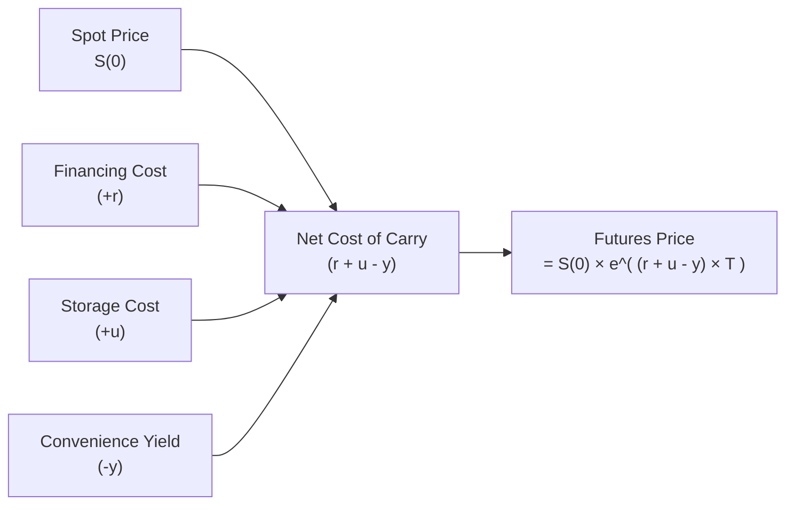

## Introduction

Well, let’s start with a quick personal story: years ago, I traded a small amount of cocoa futures. I was too intrigued by the prospect of owning real cocoa—like, physically—because I’m a big fan of chocolate. But then I realized that if I actually took delivery, I'd need to store the cocoa beans somewhere safe, maybe temperature- and moisture-controlled, and obviously I'd be paying for that convenience. Ah, the joys of unexpected costs, right?

That little anecdote highlights two intertwined elements in commodity pricing: storage costs and convenience yields. In this section, we’ll investigate how these factors push and pull on forward and futures prices. We’ll also see why markets sometimes flip between “contango” (when distant futures are priced higher than near-term or spot) and “backwardation” (when futures are cheaper than the spot). By the end, you’ll have a deeper appreciation of how real-life considerations—like storing cocoa in an expensive warehouse—factor into how prices are set for these derivative contracts on agricultural products, metals, energy, and beyond.

## Understanding Storage Costs

Storage costs, also referred to as “carrying costs” for physical commodities, cover expenses like warehousing, insurance, spoilage risk, and sometimes even specialized security. For many commodities—think of precious metals, petroleum products, or grains—these fees can stack up over time. When you hold a physical commodity, it’s not just the purchase price that matters; ensuring its safekeeping and preserving its quality can be material.

From a pricing perspective, storage costs effectively raise the expense of holding the underlying asset over the life of a derivative contract. In a no-arbitrage world, these costs must be reflected in forward or futures prices. Otherwise, savvy traders would exploit any mismatch between the cost of storing the physical commodity and the implied cost in derivatives markets.

### Key Points About Storage Costs

• They can be a fixed fee per unit or a percentage of the commodity’s value.  
• They vary dramatically by commodity type. Storing gold in a professional vault might be less complicated than storing perishable fruits.  
• They increase the forward or futures price because the holder of the derivative does not incur these physical-holding outlays directly.  

## Convenience Yield: The Hidden Benefit of Holding the Physical

Convenience yield is a slightly intangible concept—kind of like having a secret advantage in your back pocket by owning the actual commodity. It represents the non-financial or intangible benefits of physically holding an asset, such as:

• Ensuring continuity of production processes (for manufacturers).  
• Gaining immediate access if there’s a supply disruption.  
• The psychological or strategic comfort of securing inventories during uncertain times.  

Some might even phrase convenience yield as the “option value” of having the commodity on hand. If you’re a manufacturer relying on raw materials, you can’t always wait for your futures contract to expire and deliver the commodity. You might need the raw material right away if a shock hits the market. That immediate availability can be worth quite a bit, effectively acting like a yield on holding the physical good.

### Why Convenience Yield Matters

• Convenience yield reduces the forward or futures price because it’s an inherent advantage of holding the physical good over just holding a futures contract.  
• It’s generally higher in short-supply conditions or when quick access to the asset confers a large benefit.  

## Net Cost of Carry Model

In earlier sections of this text (for example, Chapter 7 on Arbitrage, Replication, and Cost of Carry), we saw that forward and futures prices often reflect a “cost of carry.” This cost of carry usually bundles together:  
• The financing cost (interest rate, r),  
• Plus storage costs (u),  
• Minus convenience yield (y).

If we assume continuous compounding for simplicity, the forward price F(0,T) for time T is modeled as:


F(0,T) = S(0) \times e^{(r + u - y) T}


Where:  
• S(0) is the current spot price of the commodity.  
• r is the risk-free rate (the opportunity cost of capital).  
• u is the storage cost (sometimes quoted as a cost per unit time).  
• y is the convenience yield.  

Sure, it looks a little math-y, but the idea is straightforward: If the total cost of carry (r + u - y) is positive, the forward price should be above the spot price. If it’s negative (which can happen if convenience yield is huge relative to interest and storage costs), you might see a forward price below the spot.

### Visualizing the Relationship

In this flowchart, we combine spot price, financing costs, and storage costs, then subtract convenience yield. The outcome is our net cost of carry, which—when exponentiated over time—gives the appropriate futuress or forward price.

## Contango and Backwardation

Storage costs and convenience yields lie at the heart of the concepts known as contango and backwardation in commodity markets:

• Contango: This is a term describing a market where futures prices are higher than the current spot price (or short-dated futures). It often occurs when the cost of carry (r + u - y) is significantly positive, meaning it’s more expensive to hold the commodity physically than to buy a futures contract. With non-perishable commodities like gold, contango can be fairly common when storage costs are stable and the convenience yield is moderate.

• Backwardation: This scenario arises when futures prices are lower than the spot. Backwardation typically persists when convenience yield is high (or supply is short), overshadowing the other costs (financing and storage), resulting in a net negative cost of carry. Industries that require immediate physical access—and thus are willing to pay a premium for spot over future delivery—can drive such a market. A shortage in a key commodity (like a sudden disruption in oil supply) might push the market into backwardation because everyone wants the stuff right now.

It’s a delicate balance. Sometimes you’ll see a market swing between contango and backwardation if variables like supply, demand, and inventory levels change. Interestingly, such shifts can happen quickly, especially for volatile commodities like energy products.

## Practical Examples and Case Studies

### Gold Storage Example

I (perhaps foolishly) once thought about buying physical gold bars as an investment. The local bank offered a safe deposit box for a fee, but I realized that the total cost—insurance, the box rental, plus a bit of inconvenience—wasn’t trivial. Meanwhile, the futures contract on gold gave me price exposure without those direct physical storage headaches. Gold can be in contango if the net cost of carry is positive: a moderate storage cost plus the risk-free rate overshadow its relatively low convenience yield. Indeed, some investors just want gold for crisis scenarios, which might add a small convenience yield, but typically it’s not super high. If the convenience yield is minimal, you can expect normal (contango) conditions.

### Agricultural Commodities

Agricultural goods often bring big storage challenges—spoilage risk, temperature control, moisture control, plus insurance. Harvest cycles can create seasonal patterns in storage and convenience yields. For instance, right after a harvest, the supply might be plentiful, so convenience yields are low. As supply tightens later in the year, convenience yields can increase, pushing the market toward backwardation if the physical commodity becomes scarce.

### Energy Commodities (Oil)

Crude oil has a significant place in derivatives markets. Storage costs (think tank farms or floating storage on tankers) can be several dollars per barrel per month, and that’s before we account for the possibility of supply shocks. In times of supply disruptions—a major pipeline fails or a geopolitical event—convenience yield can spike because refiners and distributors want immediate access. This shift can turn the market from contango into backwardation almost overnight.

## Implications for Risk Management, Hedging, and Speculation

1. Hedgers (like producers or industrial consumers) need to factor in storage costs and convenience yields when deciding whether to enter forward or futures positions. Ignoring them can lead to suboptimal hedges or unanticipated costs and margin calls.  
2. Speculators might look for profitable trades when the market is in deep contango or backwardation. For example, in extreme contango, a “cash-and-carry” strategy could be profitable: buy the physical commodity, store it, and short the futures. If the contango is steep enough to cover your storage and financing costs (plus a profit), it’s an arbitrage.  
3. Arbitrageurs often keep these markets roughly in line with the cost-of-carry model. If you notice the forward price too far above or below the theoretical no-arbitrage level, someone’s likely going to step in quickly to profit from the mispricing.

## Best Practices and Common Pitfalls

• Best Practice: Always gather reliable cost estimates for storage. This isn’t just about the raw rental cost. Factor in insurance, shrinkage/spoilage, and financing overhead.  
• Best Practice: Estimate convenience yield carefully based on your business’s operational needs. If you’re a manufacturer that relies heavily on immediate access to the commodity, your internal convenience yield is likely higher than a pure financial investor’s.  
• Best Practice: Monitor supply-and-demand conditions for your commodity. The convenience yield can swing drastically during supply shocks or unexpected disruptions.  
• Pitfall: Overlooking cyclical or seasonal variations in both storage costs and convenience yields. Agricultural commodities especially can vary widely with the harvest calendar.  
• Pitfall: Using a static convenience yield estimate. In real markets, convenience yields can shift from month to month.  
• Pitfall: Not recognizing the role of local regulations or taxes. While we aim for broad coverage, keep in mind that certain jurisdictions impose commodity-specific charges.  

## Machine Learning and Alternative Data Insights

Believe it or not, some modern commodity traders are using machine learning techniques to forecast convenience yields. They scrape satellite imagery of storage facilities (like measuring the “shadow” area covered by oil tanks) or track shipping data to anticipate inventory levels. The convenience yield often changes in sync with the real-time supply-demand dynamic, so having better data can be a huge edge.

## Exam Relevance and Tips

• On the CFA exam, you may get scenario-based questions testing your ability to compute the forward price given storage costs, interest rates, and convenience yields. Make sure you can manipulate the formula:  
  F(0,T) = S(0) × e^( (r + u – y) × T ).  

• You might also be asked to discuss qualitatively why a market is in contango vs. backwardation. Emphasize how large convenience yields can invert the usual relationship and produce backwardation.  

• Watch out for pitfalls in conceptual questions where they drop a subtle detail about a high convenience yield or minimal storage cost. Those details can reverse your price estimates if you aren’t paying attention!

## Conclusion

Storage costs and convenience yields aren’t just abstract buzzwords—they’re the real-life push and pull that shape prices in commodity forward and futures markets. If it’s super expensive to store a commodity (like cocoa or oil) and there’s minimal advantage in holding it physically, expect the futures price to trade above the spot (contango). But if physical possession grants a significant advantage—like ensuring production flows continue uninterrupted—convenience yield can overshadow storage overhead, helping push the futures price below spot (backwardation). These nuances are critical for everyone from farmers hedging harvests to global macro traders seeking to exploit cost-of-carry anomalies.

Polish these concepts, practice your calculations, keep an eye out for subtle market shifts, and you’ll handle cost-of-carry questions with confidence—both on exam day and in real-world trading.

## References

• Pirrong, Craig. “The Economics of Commodity Markets.”  
• Working, Holbrook. Classic articles on storage and convenience yields in agricultural markets.  

## Final Exam Tips

• Memorize the cost-of-carry formula and practice plugging in realistic numbers.  
• Know how to interpret contango and backwardation. They’re more than buzzwords; they reflect real supply-and-demand conditions and cost dynamics.  
• Be prepared for scenario-based questions. The exam might mix big or small convenience yields with storage costs and interest rates unexpectedly.  
• Identify typical pitfalls: seasonal patterns, inaccurate assumption of zero convenience yield, or ignoring extra overhead costs.  

## Test Your Knowledge: Impact of Storage Costs and Convenience Yields



### In a cost-of-carry model, which factor typically raises the forward price of a commodity?

- [ ] Convenience yield
- [ ] Decrease in interest rates
- [x] Storage costs
- [ ] Large seasonal supply

> **Explanation:** Storage costs raise the forward price because they represent an additional expense for holding the commodity that must be reflected in futures pricing.

### If a commodity market exhibits a high convenience yield, how will this typically affect the futures price relative to the spot price?

- [ ] It will increase the futures price above spot (contango).
- [ ] It will have no effect.
- [x] It will decrease the futures price below spot (backwardation).
- [ ] It fully offsets storage costs but does not otherwise affect price.

> **Explanation:** A high convenience yield reduces the forward/futures price because holders of the physical commodity enjoy intangible benefits that effectively lower the net cost of carry.

### Which of the following best describes contango?

- [ ] Futures prices are set at or below the spot price.
- [x] Futures prices are progressively higher for longer maturities.
- [ ] Futures prices are backwardated when storage costs exceed convenience yield.
- [ ] Futures prices remain constant across maturities.

> **Explanation:** Contango is when futures prices for more distant settlement dates are successively higher than near-term or spot prices, often due to positive net cost of carry.

### Which statement is most accurate regarding backwardation?

- [ ] It primarily occurs when storage costs exceed the risk-free rate.
- [x] It often arises when convenience yields are large relative to storage and financing costs.
- [ ] It happens only in perishable goods.
- [ ] It is less common in short-supply situations.

> **Explanation:** Backwardation typically results from a net cost of carry that is negative, often driven by a large convenience yield.

### When total net cost of carry (r + u - y) is negative, the forward price is likely:

- [ ] Equal to spot
- [ ] Guaranteed to be zero
- [x] Lower than the spot price
- [ ] Higher than the spot price

> **Explanation:** If convenience yield (y) exceeds r + u, the net cost of carry is negative, and the forward price will likely be below the spot price.

### Suppose you observe a dramatic drop in storage costs for an industrial metal. Holding everything else constant, how should this affect the forward price?

- [x] The forward price would increase because the positive term in the net cost of carry formula is mitigated less.
- [ ] The forward price would decrease due to minimal overhead.
- [ ] The forward price remains unchanged because storage cost is not a factor in forward pricing.
- [ ] There is no relation between industrial metal storage and forward prices.

> **Explanation:** Lower storage costs raise the cost-of-carry (r + u - y) more slowly than before. If u is dropping, overall net cost of carry (r + u - y) falls, meaning the forward price may not be as high relative to spot. Depending on the question’s direction, if previously storage was large and dropping it significantly could push the market more towards contango if convenience yield is unchanged. Keep an eye on the net effect it has on F(0,T).

### An investor notices that the futures price for a commodity is far above the theoretical cost-of-carry price. Which action might they take?

- [ ] Offset a short position immediately.
- [x] Execute a cash-and-carry arbitrage strategy.
- [ ] Avoid the market due to inefficiency.
- [ ] Buy more futures to push price higher.

> **Explanation:** When the futures price is above the no-arbitrage price, a cash-and-carry strategy (buying the spot, storing it, and selling futures) can lock in profit if the spread exceeds the cost of carry.

### For an energy commodity that is highly susceptible to supply disruptions, we might expect:

- [ ] A consistently zero convenience yield.
- [ ] A slight convenience yield overshadowed by storage costs.
- [ ] Permanent contango.
- [x] Fluctuations between backwardation and contango, driven by sudden changes in convenience yield.

> **Explanation:** Energy markets can swing sharply from contango to backwardation depending on inventory levels, demand surges, and supply disruptions that boost convenience yield.

### Which of the following factors would likely increase the commodity’s convenience yield?

- [x] Uncertainty about future supply
- [ ] High financing costs
- [ ] Abundant spot supply
- [ ] Low demand for the commodity

> **Explanation:** If the future supply is uncertain, the advantage (convenience yield) of holding the physical commodity increases.

### True or False: A commodity with very high storage costs and zero convenience yield would typically remain in backwardation.

- [ ] True
- [x] False

> **Explanation:** If storage costs (u) are high and convenience yield (y) is zero, then net cost of carry is likely positive (r + u - 0). This situation leads to contango rather than backwardation.


