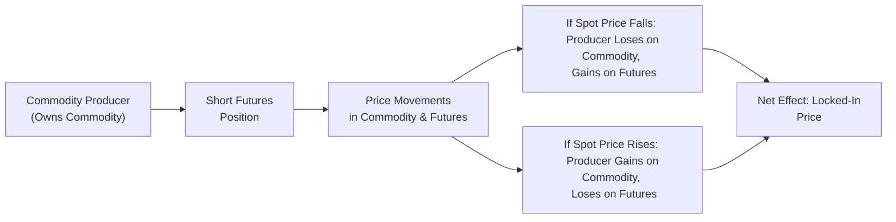

## Overview
Hedging with forwards and futures is one of those topics that everyone in the CFA Program eventually grows to appreciate—especially if you’ve ever found yourself wide awake at night, worried about the next day’s unexpected price volatility. In short, a hedge aligns a real (cash, or “physical”) market exposure with an offsetting position in the futures or forward market, with the aim of reducing or eliminating price risk. 

At its core, we hedge to stabilize outcomes. Whether it’s a farmer who wants to lock in a selling price for her harvest or a metals manufacturer who’d really prefer not to lose sleep over uncertain input costs, hedging strategies help ensure that operations can continue without being derailed by abrupt price swings. Here, we’ll explore the building blocks of hedging with forwards and futures, show how basis risk might sneak up on you, and share practical tips (and some personal experiences) on how to manage these exposures effectively.

## Why Hedge?
Before diving into the mechanics, let’s take a moment to reflect on the rationale. You might be asking, “If I hedge, I lock in a price—so what if the market later moves in my favor?” The short answer is: that’s the nature of insurance. Sometimes we pay for coverage we don’t need, but at other times we’re deeply grateful we had that coverage. Hedging works the same way. It’s about stable outcomes—removing unwanted variability so you can focus on what your business or portfolio is truly designed to do.

## Key Hedging Concepts

### Short Hedge
A short hedge is taken by a commodity producer or holder who wants to sell in the future at a set price. They “short” futures or forwards (i.e., they sell contracts) to offset potential losses from falling prices in the cash market. 

• Common scenario: A wheat farmer expects a harvest in three months. Wheat prices right now are favorable. The farmer sells wheat futures contracts maturing around the expected harvest date.  
• Desired outcome: If the spot price of wheat declines, any loss in the cash market is offset by gains in the short futures position.  
• Potential pitfall: If the spot market price rises, the farmer gains on the physical wheat but loses on the short futures position. Net result? Prices are locked in around the futures contract level.

### Long Hedge
A long hedge is the opposite side of the trade. A firm planning to purchase a commodity later can hedge against rising prices by buying futures or forwards.

• Common scenario: An airline expects to buy jet fuel over the next six months. Prices look like they might spike. So the airline goes long futures (buys them).  
• Desired outcome: If jet fuel prices rise, the airline’s increased cost in the cash market is offset by gains on the long futures position.  
• Potential pitfall: If the spot prices drop, the airline pays less in the cash market but loses on the futures hedge. Again, net effect is a locked-in cost near the futures price used when the hedge was initiated.

## Hedging Beyond Commodities
While long and short hedges are often taught in the context of commodities, hedging with futures or forwards is just as important in equity, currency, and fixed-income markets:

• Equity Portfolio Hedge: A portfolio manager who suspects a near-term market downturn could sell stock index futures to hedge systematic risk, effectively protecting the portfolio from broad market declines.  
• Fixed-Income Hedge: When worried about rising rates that would harm bond valuations, a manager might short Treasury futures to hedge the interest rate risk of the underlying bond portfolio.  
• Currency Hedge: An exporter expecting payment in a foreign currency might sell currency forwards to lock in a favorable exchange rate, thereby reducing foreign-exchange risk.

## Mechanics of a Typical Hedge

### Initial Hedge Setup
To set up a hedge, you (1) identify your underlying exposure—whether it’s a planned sale or purchase or a portfolio that’s vulnerable to price shifts—then (2) determine an appropriate amount of the derivative to buy or sell. This might sound straightforward, but the correct hedge ratio can be tricky. You have to consider contract specifications (size per contract, expiration date, etc.), not to mention the expected correlation between the futures price and the actual underlying asset in your exposure. One of my earliest hedging attempts in a real job involved messing up the hedge ratio because I forgot to convert from bushels to metric tonnes. Seriously. This taught me the joys of double-checking all units.

### Monitoring and Adjusting the Hedge
Prices move daily, so you shouldn’t just “set it and forget it” with your hedge. Markets rarely behave exactly as predicted. With futures, margin calls may arise if the market moves sharply against your position. Meanwhile, your exposure in the underlying might be changing, too—maybe you decide to extend production or shift your investment strategy.

### Closing or Rolling the Hedge
When you no longer need the hedge, or when you’re ready to deliver or take delivery, you can close out your futures position by taking an offsetting position (buy back the contracts if you were short, or sell them if you were long). If your hedge horizon goes beyond the current contract expiry, you may need to “roll” your hedge: you close out the expiring contract and reopen the same position in a longer-dated contract. Rolling has its own transactional costs, and shifts in the term structure of futures might also affect your overall hedging outcome.

## Basis and Basis Risk
To appreciate hedging fully, you need to be aware of basis and basis risk. The basis is simply the difference between the spot price of the underlying and the futures price. Over time, the basis can change in unpredictable ways, introducing basis risk—potential mismatches between changes in the spot and futures prices.

Example of Basis Risk:
• Suppose the spread between spot crude oil and the nearest futures contract is $2/barrel (futures trading higher). If at the time you close or roll your hedge, that spread has widened to $3/barrel, your net hedge outcome might differ from what you initially projected.  

In practice, many participants choose the contract that is most closely correlated with the underlying exposure, hoping to minimize basis risk. Paying close attention to both the historical performance and any potential seasonal distortions in the basis can significantly improve hedging outcomes.

## Margin Requirements for Futures
When hedging with futures (rather than forwards), margin requirements come into play. Even though the net economic exposure is hedged, you must be prepared to post initial and variation margins as the futures contract’s value fluctuates. This can be inconvenient from a cash-flow perspective if you have a large hedged position and prices move sharply, generating margin calls.

• Tip for Portfolio Managers: If you’re short equity index futures to hedge a portfolio downturn, the futures might lose money if the market rallies, leading to margin calls. Meanwhile, your portfolio is actually gaining in value, but that gain might not be quickly realized as cash unless you sell some holdings.

## Practical Examples and Case Studies

### Commodity Producer Hedging with Forwards
Imagine you run a small coffee farm—and you, quite literally, run it out of your family’s backyard. You’re worried that coffee prices will decline by the time your next crop is ready. You can enter into forward contracts with a local roaster to sell your entire harvest at a set price. This forward sale locks in your revenue, letting you sleep more peacefully (although the roaster might not as they face the converse side of the transaction).

### Equity Portfolio Hedge
Consider a large institutional investor who is overweight equities but wants to protect themselves during market uncertainty. The investor sells S&P 500 futures in an amount roughly equal to the equity allocation’s notional exposure. If the market declines, the lost value in the equity portfolio is offset by gains on the short futures. On the other hand, if the market rallies, the futures will generate losses. Overall, the portfolio is partially or fully protected from broad market swings.

### Rolling a Hedge in Practice
Let’s say you’re a corporate treasurer who has a seasonal hedging need for natural gas each quarter. You buy near-month natural gas futures contracts, but your consumption horizon is well beyond the next two or three months. As each contract nears expiry, you close it out and open a new futures contract for the subsequent month. This rollover process can lead to a “roll yield,” which might be positive if the market is in backwardation (spot > futures) or negative if the market is in contango (spot < futures). Over time, this can accumulate and impact your overall hedging performance.

## Mermaid Diagram: Flow of a Short Hedge
Below is a simple diagram that shows the flow of a short hedge scenario. The commodity producer owns the commodity, but is worried about a falling price, so they short futures.

## Challenges, Best Practices, and Tips
• Know Your Underlying: Make sure the contract you select truly matches your underlying exposure. Even small differences in grade, location, or contract size can cause real headaches.  
• Track the Basis: Watch how the difference between spot and futures prices evolves over time. Basis risk can erode hedge effectiveness if it moves in unfavorable ways.  
• Manage Cash Flows: Be mindful of collateral or margin calls. Ensure you have enough liquidity to weather short-term price moves against you.  
• Roll with Caution: Rolling a hedge may lead to repeated transaction costs and either positive or negative roll yields. Model your scenario carefully.  
• Recalibrate as Needed: If your underlying exposure changes (e.g., you produce more or less than expected), adjust your hedge accordingly.

## Selected Formulas and Illustrations

While hedging typically relies on the notional matching of exposures rather than purely formulaic approaches, a few expressions are worth memorizing:

(1) Basis  
B_t = S_t – F_t  
Where S_t is the spot price at time t, and F_t is the futures price at time t. A change in basis over the life of the hedge creates basis risk.

(2) Hedge Ratio  
A stylized version of the hedge ratio (HR) might look like:  
HR = (β × Value of Portfolio) / (Futures Price × Contract Multiplier)  
Where β is the sensitivity (e.g., equity beta, or some measure of bond duration). For a commodity, you might use an estimate of how many units of the physical good correspond to a single contract.

## Regulatory and Standards Considerations
Hedging is often subject to accounting rules such as IFRS 9 or U.S. GAAP’s hedge accounting standards (ASC 815). Firms must carefully document hedges if they want to apply hedge accounting treatment, which can smooth out earnings volatility by matching gains and losses on the hedge with losses and gains on the underlying. In addition, the CFA Institute Code of Ethics and Standards of Professional Conduct emphasizes the importance of clear client communication regarding derivatives strategies and their associated risks.

## Exam Tips and Time Management
• Candidates often see scenario-based questions where you must recommend a long or short futures hedge to manage exposure. Practice identifying the underlying risk (i.e., potential price decline or increase) and then selecting the appropriate hedge action.  
• Don’t forget about basis risk in your analysis. The exam might present you with a mismatch between the underlying asset and the futures contract.  
• Watch out for “point value” or “tick size” risk. Calculation mistakes in the hedge ratio or contract size can be a common pitfall.  
• In essay (constructed response) questions, communicate your logic clearly. Show the step-by-step approach: identify exposure, choose contract, determine number of contracts, interpret final outcome.  
• In item set questions, watch for distractor details—don’t let extraneous info about shipping times or small differences in contract specification lead you astray.

## References and Further Reading
- CFA Institute Program Curriculum: Derivatives, “Hedging with Futures and Forwards.”  
- Black, Fischer. “The Pricing of Commodity Contracts.” Journal of Financial Economics, 1976.  
- Hull, John. Options, Futures, and Other Derivatives.  
- IFRS 9, Financial Instruments – Hedge Accounting Requirements.  
- US GAAP ASC 815 – Derivatives and Hedging.

--------------------------------------------------------------------------------

## Test Your Knowledge: Hedging Strategies with Forwards and Futures



### A commodities producer worried about falling prices would typically implement which position to hedge?

- [ ] A long hedge in futures
- [x] A short hedge in futures
- [ ] A combination spread
- [ ] No hedge is required

> **Explanation:** A producer concerned about falling prices would short futures (a short hedge) to offset potential losses in the cash market if prices indeed decline.

### Which concept refers to the difference between the spot price of an asset and the futures price?

- [ ] Hedge ratio
- [x] Basis
- [ ] Margin excess
- [ ] Roll yield

> **Explanation:** The basis is the difference between the spot and futures prices. Changes in the basis during a hedge can introduce basis risk.

### A short hedge is likely to be most beneficial to which of the following market participants?

- [ ] An airline worried about rising fuel costs
- [ ] A bond investor fearful of falling interest rates
- [x] A wheat farmer expecting to sell produce in three months
- [ ] A portfolio manager who is bullish on the market

> **Explanation:** A short hedge is used by those who hold (or will hold) an asset and wish to protect themselves against declining prices. A wheat farmer with an upcoming harvest is a classic example.

### If an airline wants to lock in the cost of jet fuel for the next six months, which hedge would be most suitable?

- [ ] Short hedge on crude oil
- [ ] Covered call on jet fuel
- [x] Long hedge on jet fuel futures
- [ ] Put option on currency futures

> **Explanation:** An airline subject to rising fuel costs would typically buy (long) jet fuel futures—this is a long hedge.

### When rolling a hedge forward, a common challenge or cost arises from which phenomenon?

- [ ] A perpetual maturity
- [x] Roll yield due to contango or backwardation
- [ ] Currency mismatch in the hedge contract
- [ ] Constant margin calls after each trade

> **Explanation:** Rolling a hedge can introduce positive or negative roll yields, depending on whether the market is in contango (futures priced higher than spot) or backwardation (futures priced lower than spot).

### A portfolio manager with a large, diversified equity portfolio expects a short-term decline in equity markets. What is a typical hedging strategy?

- [x] Short index futures
- [ ] Long index futures
- [ ] Long put options on risk-free bonds
- [ ] Long call options on equity stocks

> **Explanation:** To hedge a decline in equity markets, the manager would short equity index futures, effectively offsetting potential losses in the cash portfolio.

### Which of the following is an example of basis risk?

- [x] The futures price and spot price do not converge as expected
- [ ] The underlying commodity spoils during shipment
- [ ] The broker charges a high commission for each transaction
- [ ] The underlying asset experiences no price volatility

> **Explanation:** Basis risk arises when changes in the spot and futures prices do not match perfectly, impacting hedge effectiveness.

### In a hedging context, a corporate treasurer who is short futures but finds that production increased unexpectedly might have to:

- [x] Increase the short position to cover the larger production
- [ ] Decrease the short position and go long options
- [ ] Exit the hedge entirely and take on the price risk
- [ ] Switch to an interest rate hedge

> **Explanation:** If production (or exposure) changes, the treasurer may need to adjust the size of the futures position to maintain the desired hedge ratio.

### A margin call arises when:

- [x] The available equity in a futures account falls below the maintenance margin
- [ ] The basis equals zero
- [ ] Forward contracts expire
- [ ] The underlying price and futures price move in the same direction

> **Explanation:** With futures, if losses in the account bring the balance below the maintenance margin level, a margin call is issued so the trader can restore the equity to the initial margin level.

### Hedging typically transforms a price-risk exposure into what kind of risk?

- [x] Basis risk
- [ ] Counterparty risk
- [ ] Operational risk
- [ ] Zero risk

> **Explanation:** Hedging usually reduces or eliminates the directional price risk but introduces or leaves some level of basis risk (the difference between the spot and futures prices). It does not eliminate risk entirely.


