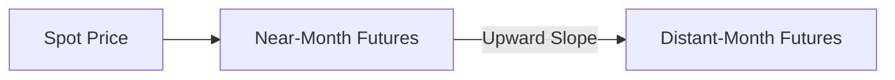
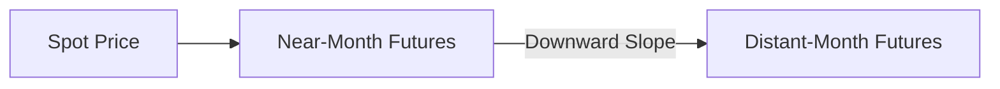

## Overview

Contango and backwardation are two intriguing conditions that describe how futures prices stack up across different maturities—often called the term structure of futures. Some folks think of contango and backwardation as fancy words for “the futures curve is going up” or “the futures curve is going down.” But, as you’ll see, there’s so much more behind these concepts. 

If you’ve ever followed commodity markets like crude oil, grains, or metals, you’ve probably heard chatter like, “The market is in contango!” or “We’re slipping into backwardation!” At their core, these terms help us figure out what the market might be saying about supply, demand, storage costs, and the convenience of having immediate access to the underlying asset. 

In this section, we’ll break down these concepts, lay out theoretical underpinnings, share practical examples, and give you some robust insights that can help you if you’re preparing for the CFA exam—or if you’re just curious about how futures pricing works in the real world. We’ll also talk about potential trading strategies like calendar spreads and highlight the key pitfalls that can catch new traders off guard. 

## The Term Structure of Futures Prices

When we talk about the term structure of futures prices, we’re basically describing how the price of a futures contract changes as the time-to-maturity increases. Think of it like this: If you line up a futures contract expiring next month, the one expiring in three months, and the one expiring in six months, there’s going to be a pattern in the prices. That pattern—upward sloping, downward sloping, flat, humped, or any other shape—is called the term structure.

Why does this structure matter? Because it reflects all sorts of market forces: interest rates, storage costs, convenience yields, expectations about future spot prices, and even short-term supply squeezes. Some investors (like hedgers) watch the term structure to reduce risk; others (like speculators) hope to profit if their view on the future is correct.

## Understanding Contango

Contango is the condition where distant futures contracts are priced higher than near-term futures (or the current spot price). If you look at the term structure, it slopes upward as maturity extends. If you’re picturing a line chart in your mind, it’s basically going “uphill” from left to right.

### Why Contango Happens

• Storage Costs Exceed Convenience Yield: If the commodity is expensive to store (and if it doesn’t offer any real convenience of holding it physically), then the cost of carry tends to push futures prices higher for later delivery.  
• Market Expectations: If the market collectively believes that prices will be higher in the future (for example, if commodity demand is expected to outpace supply), the futures price curve might also slope upward.

### Real-World Example

Let’s say your friend invests in crude oil futures. He notices that the one-month future is trading at $80 per barrel, while the six-month future is trading at $85 per barrel. This upward slope likely indicates a contango structure. If your friend wants to roll his expiring contract each month, he may have to routinely pay a higher price for the next month’s contract. This difference (buying at a higher price each time) can reduce his overall returns, especially if the spot market isn’t actually rising at the same pace.

A quick personal note: I once watched an energy trader lose sleep because he kept rolling over natural gas futures in a steep contango market. He’d buy near-month futures, and each time he tried to extend his position to the next month, that next contract was more expensive. It felt like sand slipping through his fingers—he might have been spot on about the long-term direction of natural gas prices, but the contango ate into his returns.

### Contango in a Diagram

Below is a simple Mermaid diagram showing a stylized upward-sloping term structure:

The arrow from the near-month futures price to the distant-month futures price rises, reflecting the higher pricing for later deliveries.

## Understanding Backwardation

Backwardation is the opposite scenario. Here, distant futures contracts trade at prices that are lower than near-term contracts or the spot price. That means the futures curve slopes downward from left to right.

### Why Backwardation Happens

• Significant Convenience Yield: Some assets—particularly ones in short supply—offer a large benefit to holding them immediately (e.g., you need the physical commodity for processing or to meet demand quickly). This convenience can drive up the near-month futures so much that they exceed longer-dated futures.  
• Scarcity or Supply Constraints in the Spot Market: If participants need the commodity now, and there’s a shortage, near-term contracts might be bid up to a premium. The further-out contracts might remain cheaper because the market expects supply constraints to ease over time.

### Real-World Example

You’ll see backwardation in certain agricultural markets when a significant production shortfall meets a present surge in demand. Let’s say a drought severely hits wheat production, so millers are scrambling for whatever supply they can get their hands on now. The spot price and near-month futures may skyrocket on immediate scarcity, while the six-month or nine-month futures reflect normal harvest expectations and trade at lower levels.

I remember meeting a grain trader who joked that, in a backwardation scenario, it feels like a “discount sale” is happening for future deliveries. If you’re holding the physical commodity, you benefit from the strong immediate demand. But as time passes and new crops get harvested, the price for wheat might stabilize or even drop—hence, a downward-sloping futures curve.

### Backwardation in a Diagram

Here’s another Mermaid diagram illustrating a downward-sloping term structure:

Notice how the distant-month futures are priced below the near-month futures.

## Calendar Spreads and Strategies

A calendar spread (sometimes called a time spread) happens when an investor simultaneously buys one futures contract and sells another futures contract on the same underlying asset but with different expiration months. It’s a direct bet on changes in the shape or slope of the futures term structure.

• **Bull Calendar Spread (when you expect a narrowing contango or deepening backwardation)**: Buy the near-month contract and sell the distant-month contract. If the near-month contract’s price rises relative to the distant-month contract, you can profit.  
• **Bear Calendar Spread (when you expect a widening contango)**: Sell the near-month contract and buy the distant-month contract. If the near-month contract’s price falls relative to the distant-month contract, the spread widens, and you might profit.

### Example of a Calendar Spread

Imagine Company X, a small prop trading firm, thinks that the crude oil market is going to shift from a moderate contango to a deeper contango over the next quarter. They sell the near-month contract at $80 and buy a contract three months out at $83. If the spreads widen—meaning the near month drops to, say, $78, and the further out only drops to $82—they’ll have effectively benefited from that difference.

## The Role of Roll Yield

Roll yield is a concept that acknowledges gains or losses when rolling a futures contract that’s about to expire into a new contract with a longer maturity. If the market is in backwardation, rolling can generate “positive roll yield” because you’re effectively selling a near-month contract at a higher price and buying a distant-month contract at a lower price. Cool, right? This can boost your returns over time if the spot price remains stable or rises.

But if the market is in contango, you might be stuck with a “negative roll yield.” Each time you roll over, you’re selling the expiring contract at a lower price and then buying the new contract at a higher price. Over time, all those small hits can chip away at your returns.

## Practical Insights from Term Structure

Why do we even care about contango, backwardation, and the shape of the futures curve? Here are a few reasons:

• **Hedging Purposes**: If you have a future cash outlay or inflow related to a commodity, the term structure helps you pick the right contract month for hedging.  
• **Investment Returns**: Commodity index investments often involve rolling from the expiring futures contract to a later contract. The net effect on returns can be substantial, depending on whether the market is in contango or backwardation.  
• **Market Sentiment**: Sometimes the curve hints at future supply-demand conditions. An acute backwardation might signal near-term shortages. A steep contango might suggest an oversupplied present, or high storage costs relative to convenience yield.  
• **Interpreting Basis Risks**: The difference between the local spot price and the futures price is called the basis. By watching the broader term structure, you can get a sense for how that basis might evolve over time.

## Extended Example: Metals Market

Suppose a metals dealer, Alice, deals in copper. She notices that the copper futures market is in contango, with spot at $4.00 per pound, the three-month contract at $4.05, and the six-month contract at $4.10. She wants to hedge her inventory, which she expects to sell in three months. She could short the three-month contract to lock in that $4.05 sale price. If the spot price drops, her physical copper fetches a lower price, but the short futures position gains value. 

On the other hand, if the market was in backwardation—say the three-month contract is at $3.95 while spot is at $4.00—she might consider the implications of a positive roll yield if she plans to keep rolling short positions. Or maybe she sees a bigger opportunity by going outright short the physical commodity if she’s anticipating further price declines, because backwardation might reveal tightness in the near term that could dissipate in the future.

## Storage Costs, Convenience Yield, and Cost of Carry

One crucial underlying concept is the “cost of carry.” In general, the Fair Value of a futures contract can be represented (in a simplified sense) by:

$$
F_0 = S_0 \times e^{(r + s - c)T}
$$

• \\( F_0 \\) = futures price at initiation  
• \\( S_0 \\) = current spot price  
• \\( r \\) = risk-free interest rate  
• \\( s \\) = storage cost  
• \\( c \\) = convenience yield  
• \\( T \\) = time to maturity in years  

In contango, the term \\((r + s - c)\\) often nets out to a positive number, pushing futures prices higher as \\(T\\) grows. In backwardation, \\(c\\) might be large enough that \\((r + s - c)\\) is negative, driving futures prices lower than the spot price.

## Additional Factors Influencing the Curve

• **Seasonality**: Some commodities (like natural gas, wheat, or gasoline) exhibit strong seasonal demand or supply trends. A commodity used primarily for heating might spike in winter near months, leading to backwardation during that season, but revert to contango in times of abundant supply off-season.  
• **Regulatory Environment**: If regulations change for storing or transporting commodities—like new environmental policies for crude oil storage—it might alter storage costs or convenience yields, thus shifting the term structure.  
• **Global Events**: Wars, geopolitical tensions, or unexpected OPEC decisions (in the case of oil) can drastically reshape the curve in a short period.  

## Potential Pitfalls

1. **Ignoring the Roll Yield**: Many new investors in commodity ETFs or index products are baffled by losses even when the spot price moves in their favor, simply because they overlook the negative roll when the market is in contango.  
2. **Misreading Market Signals**: Sometimes, an upward-sloping curve might be more about storage constraints than about truly bullish market expectations.  
3. **Over-Leveraging**: A heavily leveraged position can quickly be undone if the term structure shifts unexpectedly, especially around contract settlement.  
4. **Timing the Spread**: Calendar spreads can be extremely profitable—or painfully costly—if your forecast about how the near and distant futures will converge (or diverge) doesn’t materialize.  

## Best Practices for Managing Term Structure Risk

• **Use Calendar Spreads Judiciously**: If you understand the market’s carry dynamics, this can be a more controlled way to express a view than outright buying or selling.  
• **Stay on Top of News**: Supply disruptions, new government regulations, or changes in interest rates can tilt the curve in a heartbeat.  
• **Diversify Contracts**: Instead of just buying near-month or far-month futures outright, consider spreading across multiple maturities to balance potential roll losses with potential roll gains.  
• **Model Scenarios**: If you can, test your strategy under various contango or backwardation scenarios to see how big a roll yield hit or gain you might face.

## Regulatory and Accounting Perspectives

From an accounting standpoint, IFRS and US GAAP require that derivatives be marked to market, with changes in value recognized depending on whether the derivative is used for hedging or speculation. Firms need to comply with hedge accounting rules if they want to reduce income statement volatility. If you’re using futures to hedge a known commodity purchase, you’d better have well-documented hedge relationships, or you’ll have to mark your positions to market without offsetting the underlying cost swings.

On the regulatory front, agencies across major markets often require detailed disclosures of large futures positions to detect potential manipulation or cornering of the market. Commodity regulators closely watch swings in contango and backwardation for anomalies that might signal stress, speculation, or market manipulation.

## Exam Relevance and Practical Tips

• **Quantitative**: Expect to be tested on calculating forward/futures prices using cost of carry, as well as analyzing outcomes under contango vs. backwardation.  
• **Conceptual**: You might see questions on how convenience yield and storage costs interact, or how to identify a market in contango vs. backwardation from a given table of prices.  
• **Application**: Be ready to interpret the shape of the curve in the context of real-world events, such as an oil supply shock.  
• **Essay or Constructed Response**: In many exam contexts, you could be given a scenario with partial information about the futures curve and asked to discuss how you’d manage a position, hedge a commodity purchase, or speculate on changing supply-demand conditions.

A wise approach for your exam: always keep the big picture in mind. Don’t focus solely on the formula; remember the underlying logic. The moment you see a difference in near-month versus far-month prices, ask yourself: “Where do storage costs, interest rates, and convenience yields fit into this scenario?” That approach often clarifies how to handle even the trickiest question.

## References & Further Reading

• Gorton, Gary, and K. Geert Rouwenhorst. “Facts and Fantasies about Commodity Futures.”  
• Sanders, Dwight, et al. “Understanding the Term Structure of Commodity Futures.”  
• CFA Institute. “Derivatives and Alternative Investments.” CFA Program Curriculum.  
• Hull, John. “Options, Futures, and Other Derivatives.”  

## Test Your Knowledge: Contango, Backwardation, and Term Structure Quiz



### Which of the following most accurately defines contango?

- [ ] A situation in which the spot price exceeds the futures price.  
- [ ] A scenario in which the near-term futures price is lower than the distant-futures price, leading to a negative carry.  
- [x] A situation where the futures prices for more distant maturities are higher than near maturities or the spot price.  
- [ ] A market condition that only arises when there is zero storage cost.  

> **Explanation:** Contango is when distant-month futures exceed near-month futures or the spot price, often because the total cost of carry exceeds the convenience yield.

### Which cost component is most likely to push futures prices upward when storage costs exceed convenience yield?

- [ ] Tax cost.  
- [x] The cost of carry.  
- [ ] The margin requirement.  
- [ ] Settlement cost.  

> **Explanation:** The cost of carry includes storage costs (and interest costs), which, if not offset by a sufficient convenience yield, results in higher futures prices for more distant maturities.

### In a backwardation scenario, which of the following best describes the shape of the futures curve?

- [ ] Perfectly flat.  
- [x] Downward-sloping from near-term to long-term.  
- [ ] Upward-sloping from near-term to long-term.  
- [ ] Humped in the middle.  

> **Explanation:** In backwardation, near maturities are more expensive than farther maturities, creating a downward-sloping curve.

### What is the primary reason a market might experience backwardation?

- [ ] Excess storage capacity and low interest rates.  
- [ ] Extremely high levels of open interest in futures markets.  
- [x] A strong convenience yield or scarcity in the spot market.  
- [ ] Extremely high transaction fees.  

> **Explanation:** Backwardation often arises when there is a strong benefit to holding the underlying asset now (convenience yield) or a short supply in the spot market.

### If you expect a widening contango in crude oil, which calendar spread might be advantageous?

- [x] Selling the near-month contract and buying the further-out contract.  
- [ ] Buying both the near-month and distant contract.  
- [ ] Shorting short-dated puts while going long distant calls.  
- [ ] Buying the near-month contract and selling the distant-month contract.  

> **Explanation:** A widening contango scenario suggests distant prices will rise relative to near prices, so shorting the near-month and going long a distant-month futures could benefit from that anticipated spread widening.

### Roll yield refers to:

- [ ] The return generated by interest-accruing margin deposits.  
- [ ] The difference between the spot price and the strike price on an option.  
- [x] The gain or loss realized when a futures contract is rolled over to a new maturity.  
- [ ] The discount received for storing commodities in a warehouse.  

> **Explanation:** Roll yield arises from closing an expiring futures contract and opening a new one, which can be a gain in backwardation or a cost in contango.

### You notice a market is in steep contango. Which outcome is most likely when you hold a long position and continuously roll it forward?

- [ ] Constantly receiving a roll credit.  
- [ ] Free margin interest from the clearinghouse.  
- [x] Negative roll yield.  
- [ ] Perfectly matching the spot return.  

> **Explanation:** In contango, the future you’re rolling into will generally be more expensive than the future you’re exiting, leading to negative roll yield over time.

### A downward-sloping term structure in soybean futures typically signals:

- [ ] Inadequate risk management policies by regulators.  
- [x] Higher near-month prices due to tight current supply or high short-term demand.  
- [ ] That storage costs have become negative.  
- [ ] A state of zero basis risk for hedgers.  

> **Explanation:** A downward slope (backwardation) is frequently tied to near-term scarcity or strong demand pushing up the spot and near-month prices relative to longer maturities.

### Which of the following is the best hedging strategy if you expect to sell your physical gold inventory in the near future and the market is currently in backwardation?

- [x] Short the near-month futures contract matching your projected sale date.  
- [ ] Buy the near-month futures contract.  
- [ ] Buy a further-out futures contract.  
- [ ] Engage in a bull calendar spread.  

> **Explanation:** To hedge a future sale, you typically short a contract that expires around your expected sale date. This locks in today’s higher price, common in backwardation markets.

### True or False: The existence of contango always implies that the market expects spot prices to rise in the future.

- [x] True  
- [ ] False  

> **Explanation:** This can be tricky. Contango often reflects storage costs and the cost of carry, not necessarily a pure expectation of higher future spot prices. However, from a straightforward theoretical perspective, an upward curve often includes the market’s anticipation of higher future fundamentals, alongside cost-of-carry components.




