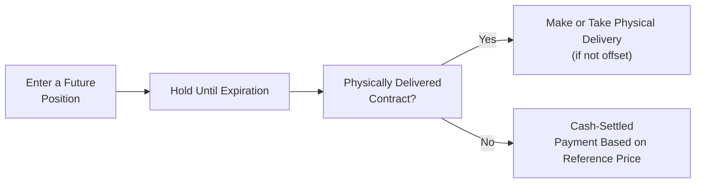

## Overview

Have you ever heard traders say, “I’d rather not store 1,000 barrels of crude oil in my backyard”? Yeah—neither would I. But that’s exactly the type of scenario that might arise for a futures contract requiring physical delivery. Deliverable and cash-settled contracts are two types of futures (and sometimes forward) arrangements, each providing unique benefits, trade-offs, and risk considerations. From a CFA Level III perspective, understanding these nuances goes a long way in optimizing hedge strategies and managing portfolio-level positions. In this section, we’ll explore both types of contracts in depth.

## Fundamental Concepts

### Deliverable Contracts
A deliverable contract specifies that at expiration, the holder of a short position must deliver the physical commodity (or underlying asset) to the holder of a long position. For instance, if you short one gold futures contract (representing 100 troy ounces of gold) on the COMEX, you are obligated to physically deliver 100 ounces of gold to the buyer if you hold the position until expiration.

• Typical Underlying Assets: Commodities such as crude oil, precious metals (e.g., gold, silver), agricultural products (e.g., wheat, corn), and some financial instruments (e.g., government bonds) can be deliverable.  
• Hedgers: This structure is often used by producers (e.g., farmers, oil producers) who want to lock in prices for their output, thereby ensuring predictable revenue irrespective of market price fluctuations. Equally, manufacturers or commercial consumers may want to lock in inputs.  
• Logistics: Physical storage, inspection, and quality control are essential considerations. Traders sometimes close or roll over positions before expiry to avoid the hassle—this is especially common among speculators with no desire to take or make physical delivery.  
• Open Interest Dynamics: For physically delivered contracts, open interest typically declines sharply as expiration nears because market participants who have no need for physical settlement often exit or roll positions to a later contract month.  

### Cash-Settled Contracts
Cash-settled futures, on the other hand, do not require the physical exchange of an asset. Instead, the long and short positions are settled by a cash payment based on a predetermined reference rate or index price at expiration. One popular example is the CME’s Eurodollar futures or stock index futures (e.g., S&P 500 E-mini futures).

• Reference Rate/Index: A final settlement price is determined using a transparent benchmark, such as the official index close for an equity index future or a fixing rate for an interest rate future.  
• No Physical Delivery: Because there is no underlying to deliver, there’s no need to scout for warehouses or shipping lines. This property appeals to financial traders, hedge funds, or institutions with purely speculative or portfolio-based hedging objectives.  
• Potential Settlement Price Disputes: If the reference index or settlement price process is not transparent, there could be disputes or perceived manipulation around the fixing. Exchanges typically have rigorous procedures to mitigate manipulation risks.  
• Reduced Logistical Burden: The biggest advantage? You don’t need to figure out how many soybean silos or gold vaults you can rent at short notice.  

## Key Distinctions and Practical Implications

### When to Choose Deliverable Contracts
Deliverable contracts make sense when:

• You actually want or need the underlying. For example, an airline purchasing heating oil futures to secure a stable fuel price might stand for delivery if the logistics make sense.  
• You are a producer hedging your production output and prefer to deliver physically. This offers a natural hedge when timing harvest or commodity extraction with the futures contract’s expiration date.  

In these cases, the contract’s design is more about locking in supply or guaranteeing a buyer at a certain price rather than focusing purely on settlement arbitrage. Deliverable contracts help align the futures market with real economic activity in the physical market.

### When to Choose Cash-Settled Contracts
Cash-settled contracts are typically chosen by:

• Financial institutions hedging broad market exposures, such as index-based hedges.  
• Speculators or investors who neither need the physical commodity nor want to worry about handling and transportation.  
• Traders valuing administrative simplicity. Rolling over a cash-settled contract often involves fewer operational issues than a physically delivered contract.  

### Example: Crude Oil
Many of the world’s largest oil futures (like WTI Crude Oil Futures on the NYMEX) are physically delivered. But alternatives, like some Brent contracts on the Intercontinental Exchange (ICE), have historically involved both deliverable and cash-settled variants. A refiner might use a deliverable WTI contract if they plan to take physical barrels for operational usage at a refining facility. Meanwhile, a hedge fund might prefer a cash-settled approach to avoid storing 1,000 barrels of oil in a field.

## Market Microstructure and Price Discovery

One key observation in futures markets is the interplay of supply, demand, and open interest:

• Delivery Mechanisms Affect Behavior: If a contract is physically delivered, participants must either offset their trades before expiry or stand ready to deliver the underlying. This dynamic can cause sharper price movements or “rolling” patterns near the close of a contract as large positions exit or shift to future months.  
• Convergence of Futures and Spot: With physically deliverable contracts, the futures and spot prices converge as the contract heads to expiration—since any discrepancy would invite arbitrage. Cash-settled contracts, on the other hand, converge to a published reference price, so that final settlement is fair to both longs and shorts.  
• Open Interest Patterns: Deliverable contracts often show a large drop in open interest as expiration nears. By contrast, cash-settled instruments might maintain higher open interest closer to contract maturity, especially if large institutions engage in last-minute hedging or positioning tied to well-known index fixings.

Below is a Mermaid diagram illustrating how holders of futures are faced with two paths at expiration: deliver (in a physically delivered contract) or settle in cash.

## Pricing Implications

### Carry Costs and Convenience Yields
In physically delivered contracts, costs of carry (storage, insurance, financing) and convenience yields often impact pricing. A commodity that is difficult to store (e.g., livestock, fresh produce) will typically exhibit different forward pricing behavior from a storable commodity (e.g., gold, silver) due to these logistical costs. Traders must also consider:

• Inventory Levels: Low inventory and high demand might increase the convenience yield, compressing futures prices relative to spot.  
• Transportation Bottlenecks: In physically delivered crude oil, pipeline constraints can spark regional price anomalies.  

In cash-settled contracts, carry costs and convenience yields matter less if the underlying is a broad index or a rate. For interest rate futures, for example, the theoretical fair price depends more directly on implied interest rates and discount factors.

### Potential for Settlement Price Volatility
Cash-settled contracts rely on a reference rate (e.g., last trading day’s settlement price) that might be influenced by short-lived market volatility. This can lead to large marking-to-market fluctuations near the final day if the index experiences unusual volatility. Deliverable contracts can experience a “delivery squeeze,” where tight supply or strategic positioning by some traders might move prices. Although both forms have unique volatility triggers, active exchanges and regulators watch settlement processes closely to deter manipulation.

## Risks and Considerations for Portfolio Management

### Basis Risk
Both deliverable and cash-settled contracts can exhibit basis risk, where the futures price deviates from the spot price you’re trying to hedge. However, the nature of basis risk differs slightly:

• Deliverable: The spot price at the delivery location and quality grade might not perfectly match your local spot if you’re procuring or producing at a different location or grade.  
• Cash-Settled: If the reference index used for settlement is not highly correlated with the physical or intangible exposure you’re attempting to hedge, basis risk emerges.

### Liquidity Risk
Liquidity typically depends on how well-used or standardized a contract is. Large commodity contracts (e.g., WTI Crude, ICE Brent Crude, CME Gold) often have substantial liquidity whether deliverable or cash-settled. However, niche commodities with limited volume can see wide bid-ask spreads and lower open interest.

### Operational and Legal Risks
Deliverable contracts pose operational complexities involving warehousing, shipping, and insurance. There can also be legal or regulatory complexities around commodity grades or accepted storage facilities. While institutions can mitigate these through well-structured logistics, oversights may lead to expensive mistakes.

### Settlement Risk
• Deliverable: Settlement risk can arise if there is any uncertainty about the quantity or quality of the delivered asset, particularly if guidelines are not strictly followed.  
• Cash-Settled: There is a risk that the exchange-traded or third-party reference price could be manipulated near the fixing window, though major exchanges carefully monitor trading activity to detect anomalies.

## Real-World Case Study: Gold Futures

Let’s say you are a jewelry manufacturer expecting large orders for the upcoming holiday season. You anticipate needing 1,000 troy ounces of gold within six months. You decide to hedge by buying gold futures on COMEX, which are deliverable. If gold prices spike in six months, your gain on the futures offsets the higher spot price you’ll be forced to pay for bullion. Alternatively, you can choose to stand for delivery and use that gold directly in your manufacturing. But if you were purely a financial trader with no gold vault, you’d likely close your futures positions before expiry or roll them forward to the next contract month to avoid taking actual delivery of 100 troy ounces per contract.

## Slightly Personal Anecdote

I once worked with a grains trader who loved the smell of freshly harvested wheat—until he realized he had accidentally held onto a short wheat future near expiration. He had to scramble to offset his position so he wouldn’t be required to deliver wheat he didn’t have. While he always said, “I’d love to store a truckload of wheat in my garage,” the reality of handling physical grains, ensuring correct moisture content, and meeting the exchange’s grade requirements was far more complicated than he let on in conversation. That’s when he truly appreciated the relief of a cash-settled contract.

## Common Pitfalls and Best Practices

• Not Understanding Grade/Location Differences. With physically delivered contracts, the exact delivery location and commodity grade matter. Make sure the contract’s specifications align with the underlying exposure.  
• Overlooking Delivery Logistics. If you plan to stand for delivery, confirm your ability to store and transport the commodity.  
• Reference Rate Differences. In a cash-settled contract, always confirm the reliability and transparency of the designated reference rate or index.  
• Neglecting Roll Strategy. Most institutions wishing to avoid delivery will “roll” their futures, closing near-expiring contracts and opening new ones. Rolling costs or roll yield can affect profitability.  
• Settlement Day Liquidity. Both deliverable and cash-settled instruments can see heightened volatility approaching expiry. Understand how your contract’s settlement day is determined and watch for volume shifts.

## Ethical and Regulatory Considerations

From the standpoint of the CFA Institute Code of Ethics and Standards of Professional Conduct, practitioners using deliverable or cash-settled futures must ensure:

• Fair Dealing and Market Integrity. Attempting to manipulate settlement prices—no matter how tempting—violates both the law and professional standards.  
• Transparency and Disclosure. If placing client trades near the settlement window, ensure that all potential conflicts of interest or market impact concerns are disclosed appropriately.  
• Regulatory Compliance. In the U.S., the Commodity Futures Trading Commission (CFTC) oversees futures activity, including any suspicious trading patterns near settlement. Globally, other market regulators perform analogous tasks.

## Quantitative Example: Settlement Amount in a Cash-Settled Index Future

Imagine you enter a long position in a single cash-settled S&P 500 E-mini futures contract. The notional value is determined as (S&P 500 Index Level) × $50. Suppose:

• The index trades at 4,000 when you open the position.  
• At expiration, the reference price is 4,100.  

Your profit (ignoring mark-to-market flows along the way) is:

Profit = Futures Multiplier × (Settlement Index Level – Initial Index Level)  
Profit = 50 × (4,100 – 4,000)  
Profit = 50 × 100 = $5,000  

You receive $5,000 in cash settlement, and you do not need to interact with any physical asset.

In contrast, a physically delivered contract on a basket of stocks might require moving all constituents (or requiring an exchange of the actual underlying shares if it’s a physically delivered equity index future—though such equity index futures are rare in practice). You can imagine the administrative headache that might entail, which is precisely why many equity index futures are cash-settled.

## Integration with Portfolio Management

At the CFA Level III, portfolio managers must often decide whether a physically delivered or cash-settled derivative best suits a particular hedging or alpha-generating strategy:

• Multi-Asset Class Portfolios: Managers running global macro strategies may prefer cash-settled index futures or interest rate futures to quickly adjust exposures.  
• Commodities in an SAA/TAA Framework: When employing a strategic asset allocation (SAA) or tactical asset allocation (TAA) approach, deliverable contracts might be too cumbersome if the portfolio is only seeking synthetic beta exposure to a commodity.  
• Risk Budgeting and Tail Hedging: For tail-risk hedges (e.g., equity market drawdowns), cash-settled index futures are typically simpler. Meanwhile, commodity hedgers with real exposure to physical goods benefit from deliverable futures that align with operational needs.

## Conclusion

Deliverable and cash-settled contracts each offer distinct benefits and potential drawbacks. Deliverable futures mirror the underlying commodity markets more directly, making them favorites for producers, consumers, and anyone requiring a physical hedge. Cash-settled futures, on the other hand, excel in convenience and administrative simplicity, suiting many financial traders and cross-asset portfolio managers seeking efficient instruments for hedging and speculation.

From an exam-preparedness point of view, grasping the fundamental differences—which revolve around the necessity (or lack thereof) to handle the underlying—will help you tackle scenario-based questions with confidence. Whether it’s farmland, crude oil, or equity indexes, being aware of how the contract settles is crucial to managing risk, understanding basis dynamics, and ensuring alignment of the derivative strategy with your investment objectives.

## Final Exam Tips

• Know the Specification. The exam will test your knowledge of contract terms. Precisely identify whether the underlying contract is physically delivered or cash-settled.  
• Watch for Basis Risk Nuances. Remember that location, grade mismatch, and reference-rate mismatch can create basis risk.  
• Rolling Over Contracts. Be prepared to answer how and why market participants roll over futures—particularly relevant for deliverable contracts near expiry.  
• Summaries in Essay Prompts. CFA Level III constructed-response questions might provide a scenario describing a client’s commodity or equity exposures. Pay attention to the logistical or cost implications of each contract type.  
• Ethical Aspects. If you see a scenario where a trader or portfolio manager might have an incentive to influence a settlement price, link it to the professional ethics dimension.

## References

• CME Group. (n.d.). Contract Specifications & Cash Settlement Procedures. Retrieved from https://www.cmegroup.com/  
• Various Commodity Exchange Rulebooks. (n.d.). Available from respective exchange websites.  
• CFA Institute. (2023). Code of Ethics and Standards of Professional Conduct.  
• Hull, J. (2022). Options, Futures, and Other Derivatives. 10th Edition. Pearson.  

--------------------------------------------------------------------------------

## Test Your Knowledge: Hedging and Settlement in Futures



### Which of the following statements is most accurate regarding deliverable futures contracts?

- [ ] They always settle based on a reference rate at expiry.
- [x] They require either physical receipt or delivery of the underlying commodity if held to expiration.
- [ ] They generally have no basis risk.
- [ ] They are used only for agricultural products.

> **Explanation:** Deliverable contracts require physical delivery of the underlying at expiration if not closed out. This approach can impose storage, transportation, and quality considerations.  

### A portfolio manager wants to hedge equity exposure without dealing in actual shares. She would most likely prefer:

- [ ] Deliverable equity futures.
- [x] Cash-settled index futures.
- [ ] OTC forward contracts that specify physical delivery of the index constituents.
- [ ] Any physically deliverable commodity contract.

> **Explanation:** Cash-settled index futures allow managers to settle gains or losses in cash, eliminating the logistical challenges of acquiring or delivering the underlying stocks.  

### In the context of open interest dynamics, physically delivered contracts often:

- [x] Witness a sharp drop in open interest as expiration approaches.
- [ ] Retain high open interest since delivery is easy to arrange.
- [ ] Cause large short positions to remain open until well after settlement.
- [ ] Have zero open interest until expiry.

> **Explanation:** Many participants who do not wish to make or take delivery will close or roll their positions before the delivery date, causing a drop in open interest.  

### One key advantage of cash-settled contracts is:

- [x] They reduce the logistical burdens of handling the underlying.
- [ ] They completely eliminate the possibility of basis risk.
- [ ] They are more liquid than deliverable contracts in all markets.
- [ ] They do not require a clearinghouse.

> **Explanation:** Cash-settled contracts do not involve the physical exchange of the underlying, making them simpler from a logistical standpoint.  

### A commodities trader worried about physically delivering 5,000 bushels of wheat could avoid this obligation by:

- [x] Closing out the futures position prior to expiration.
- [ ] Allowing the position to expire in the money.
- [ ] Going long on another futures contract simultaneously.
- [ ] Filing an exception with the exchange after the contract’s last trading day.

> **Explanation:** Traders wishing to avoid physical delivery usually close out (offset) their futures position prior to the delivery period.  

### Which statement about basis risk is correct?

- [ ] Basis risk arises only in cash-settled contracts.
- [x] Basis risk can occur if the underlying asset differs from the hedger’s actual exposure in quality, location, or reference index.
- [ ] Basis risk only affects agricultural goods.
- [ ] Basis risk is eliminated by making the contract physically deliverable.

> **Explanation:** Basis risk results when the futures price doesn’t move in tandem with the hedger’s spot market exposure, often due to mismatched specifications.  

### For a manager using futures at the portfolio level, which approach is typically simpler?

- [x] Rolling cash-settled index futures to maintain a target exposure.
- [ ] Arranging daily shipments of physically delivered commodities for rebalancing.
- [x] Standing for delivery of every commodity contract in the portfolio.
- [ ] Buying physically delivered bond futures to replicate an equity index.

> **Explanation:** Rolling cash-settled index futures can be simpler administratively than taking delivery.  

### Which factor does NOT commonly affect the price convergence of a physically delivered contract and the spot market at expiration?

- [ ] Arbitrage opportunities lock futures prices close to spot.
- [ ] Delivery mechanisms force physical markets and futures markets together.
- [x] A centralized reference rate fixes prices regardless of supply and demand.
- [ ] Storage and carry costs are factored into the futures price.

> **Explanation:** Physically delivered contracts converge with spot primarily because of arbitrage and delivery forces, not because a single reference rate is forced on the market.  

### Choose the correct statement regarding cash settlement:

- [x] It simplifies settlement by using a reference price, eliminating the need for physical exchange.
- [ ] It always provides lower transaction costs than deliverable contracts.
- [ ] It prevents any disputes regarding the final settlement amount.
- [ ] It effectively removes the interest rate component from futures pricing.

> **Explanation:** Cash settlement involves computing gains and losses based on a reference price, reducing logistical burdens. However, disputes may still arise if the reference price is perceived as manipulated or inaccurate.  

### True or False: Combining physically delivered futures with real holdings of the underlying asset often yields a perfect hedge.

- [x] True
- [ ] False

> **Explanation:** While perfect hedges are rare, physically delivered futures can more closely align with real exposure to the commodity (e.g., a gold miner hedging gold output) compared to purely financial derivatives that reference a different grade, time, or location.


