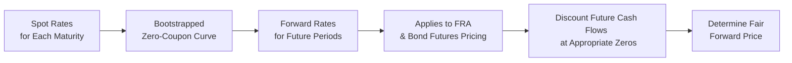

## Overview

So, let’s say you’re sitting at your desk—maybe you’re a newly minted bond trader or a corporate treasurer—wrapping your head around the idea that different maturities have different interest rates. It can feel a bit overwhelming at first because interest rates can shift in ways that sometimes make you want to throw your hands up and say, “Enough!” But understanding the term structure of interest rates is actually one of the most important building blocks when you’re pricing forward and futures contracts. If the yield curve (the graphical representation of the term structure) changes, the value of these contracts can move dramatically.

Anyway, in this section we explore how the term structure of interest rates affects calculating (and recalculating) the fair value of forwards, especially interest rate forwards (like Forward Rate Agreements) and bond futures. We’ll discuss single-period versus multi-period frameworks, how to use zero-coupon yields in discounting cash flows, and the real-world significance of yield curve shifts on positions you may have in your portfolio. 

There’s a lot to unpack here—so buckle in and let’s get started.

## Key Concepts and Definitions

Before diving into how interest rates impact forward pricing, we should clarify basic definitions. These terms will crop up again and again:

• Term Structure: This is simply the relationship between interest rates (or yields) and time to maturity. We often depict it visually as the yield curve.  
• Zero-Coupon Rate: The yield on a zero-coupon bond maturing at a specific date. Because this bond provides no coupon payments, its yield is used to discount a single lump-sum payment at maturity.  
• Forward Rate: An implied interest rate for a specific future period, derived from the current yield curve. It’s like an interest rate for a loan that begins in the future, calculated by comparing two spot rates (or multiple zero-coupon rates).

Understanding these definitions is crucial for analyzing (and hopefully mastering) the role of the term structure in forward pricing.

## Relevance of the Yield Curve in Forward Pricing

When traders or hedgers talk about the “cost of carry” or the “discount rate,” they’re essentially talking about how one interest rate or another influences the forward price. But in the real world, interest rates vary by maturity. You don’t have just one interest rate that extends to five years or ten years. Instead, you have a curve that tells you the yield for varying maturities (3 months, 6 months, 1 year, 5 years, 30 years, and so on).

In forward pricing:

• If you’re dealing with a single cash flow at a future date, you only need the zero-coupon rate for that horizon.  
• If you’re dealing with multiple cash flows at different points in time (like coupon payments or multiple settlement periods), you generally have to use a separate discount rate for each payment.  

That’s why the yield curve is so important. The entire curve drives how you discount future cash flows, which in turn affects the fair value of your forward or futures contract.

## Single-Period Forward Pricing

Let’s start simple. Imagine a forward contract that ends in 6 months. You want to find the fair forward price to lock in today for settlement in 6 months. If you’re dealing with an underlying that pays no income, and you assume we have a zero-coupon rate (also referred to as the spot rate) of r for 6 months, then the forward price F₀ for an asset with today’s spot price S₀ (e.g., a zero-coupon bond or a short-term money market security) can be modeled (in continuous compounding form) as:


F_0 = S_0 \times e^{r \times T}


where T is the fraction of the year (in this case, T = 0.5 for 6 months). That’s the single-period approach: you assume one interest rate that spans the entire forward period.

Of course, not everyone uses continuous compounding in practice. Alternatively, we might use a simple or discrete compounding approach:


F_0 = S_0 \times (1 + r \times T)


the exact formula depends on your convention: is it bond-equivalent yield? Is it money market yield? In real life, you pick the convention that fits the underlying market or instrument. The key takeaway: we use the zero-coupon yield for the single maturity that matches how long the contract lasts.

### Single-Period Forward Rate Agreements (FRAs)

If you’ve ever heard about FRAs—Forward Rate Agreements—they’re basically off-balance-sheet solutions to set an interest rate today for a single future period, like locking in a 3-month interest rate that starts 6 months from now. The forward rate you lock in is implied from the yield curve. If the yield curve changes, that implied rate changes too, which moves the FRA’s value.

## Multi-Period Forward Pricing and the Full Yield Curve

Now imagine you’re dealing with a multi-coupon bond or an instrument with multiple cash flows. In that scenario, the old single-period approach is not precise enough; you need to discount each future cash flow at its own zero-coupon rate for that specific maturity. In effect, you break the underlying security’s upcoming payments into a series of cash flows, discount each at the relevant point on the yield curve, and then determine what the forward price should be so that no arbitrage is possible.

You might do something like:


\text{Value of the underlying} = \sum_{i=1}^{n} \frac{\text{CF}_i}{\left(1 + z_i\right)^{t_i}}


Here, \\(\text{CF}_i\\) is the i-th cash flow, \\(z_i\\) is the zero-coupon rate for the i-th cash flow’s maturity, and \\(t_i\\) is the exact time in years. In the forward market, you’d set the initial forward price so that when you discount the expected payoff, the net present value is zero at inception.

## Valuing Bond Futures Using Term Structure

Take bond futures, for instance. If the underlying bond pays semiannual coupons over several years, each coupon must be discounted at the zero rate associated with the coupon’s date. Then the final principal redemption also gets discounted at the zero rate for that date. The forward or futures price is basically:


F_0 = \frac{\text{Bond Value, discounted at each zero rate} - \text{Present Value of all coupons during the futures period}}{\text{Any relevant scaling or conversion factor}}


Yes, that’s a simplified version, but the heart of the calculation is that we use the entire term structure to get the bond’s theoretical value forward in time. In practice, short-term bond futures often incorporate the “cheapest-to-deliver” option (in Treasury futures), so the pricing can be a bit more intricate. But it always comes back to discounting all future cash flows at appropriate zero rates.

## Modeling the Yield Curve

I remember, years ago, when I first heard about different yield curve models, I thought, “Wait, can’t we just use one single rate and call it a day?” But the market does not revolve around a single rate. Traders might build “bootstrapped” yield curves from on-the-run government bond prices combined with swap rates for longer maturities, or use forward-forward deposit rates to fill certain gaps. The result is that you get a curve with a specific rate for each maturity—like a big puzzle with many pieces.

### Bootstrapping Zero Rates

A typical approach is:

1. Start with short-term instruments (e.g., T-bills, repo rates, deposit rates) to derive the near-term zero rates.  
2. Move out on the maturity spectrum using coupon-bearing bonds or interest rate swaps.  
3. Iteratively solve for each zero-coupon rate so that the theoretical price of each instrument matches its market price.

Once you have that yield curve, it’s your best approximation for discounting future cash flows.

## Impact of Yield Curve Shifts

Now for the fun part: what happens if interest rates shift? Maybe tomorrow the Federal Reserve or the European Central Bank surprises the market with an unexpected policy move. If yields spike across all maturities, the discount rates you’re applying to your forward or futures contract’s underlying value go up. That usually reduces the present value of future cash flows, which changes the forward/futures price. 

In an FRA context, an upward shift in the yield curve means the implied forward rate also changes. If you’ve locked in an FRA to pay a certain interest rate, you might see that FRA gain or lose value relative to the new market forward rate. 

In bond futures, if the yield curve flattens or steepens, your valuation of the underlying bond (and hence the futures contract) may swing in unexpected ways. A steepener typically benefits longer-dated instruments relative to shorter ones, while a flattener does the opposite—so there could be meaningful shifts in the relative pricing of futures on 2-year vs. 10-year vs. 30-year bonds.

## Real-World Case Study: Corporate Treasurer’s Hedge

Let’s walk through a quick scenario. A corporate treasurer knows they’ll issue a floating-rate note in six months, and they’re worried interest rates will rise by then. They decide to lock in the interest rate for the note’s first three-month payment using a 3×6 FRA (meaning a 3-month interest rate starting 3 months in the future). The FRA’s reference rate might be the 3-month LIBOR, or these days, a risk-free rate like SOFR.

• The forward rate for the 3-month period starting in 3 months is derived from the yield curve.  
• If the yield curve shifts upward tomorrow, the new FRA price would change accordingly. The treasurer, having locked in the rate earlier, would see a mark-to-market gain or loss on the FRA, offset (ideally) by changes in the cost of issuing the floating-rate note.

This scenario underlines how the yield curve is the core input for deriving that “forward rate” in an FRA and determining how the value changes as rates move around.

## Diagram: Term Structure in Forward Pricing

Below is a basic Mermaid diagram showing the link between spot rates, forward rates, and how they flow into forward valuations. This is obviously a simplified representation, but it might help visualize the big picture:

As you can see, the entire chain starts with obtaining or building the zero-coupon yield curve. From there, we derive forward rates for specific future intervals, discount relevant cash flows at the appropriate yields, and arrive at the forward price.

## Practical Tips and Common Pitfalls

• Failing to Use the Right Rates: People sometimes apply a single yield for discounting all cash flows, even when there’s a big maturity mismatch. That can lead to mispricing and potential arbitrage.  
• Ignore Day Count and Market Conventions at Your Peril: Market quotes often use specific compounding or day count conventions (e.g., Actual/365, 30/360). If you mismatch these conventions, your forward valuations will be off.  
• Watch the Auction Cycles in Government Bond Markets: When you price bond futures, the liquidity in certain maturities or on-the-run issues can shift the shape of the yield curve.  
• Check for Negative Rates (Yes, It Happens): In some markets, negative yields are a reality. This can complicate discounting (though the math mostly stays the same—just be mindful of your sign and compounding formulas).  
• Overlooking the Cost of Funding vs. Investment Rate: For cash-and-carry arbitrage, the interest rate you pay on borrowed funds might differ from the rate you earn on your underlying asset. In advanced practice, you consider these nuances carefully.

## Regulatory and Accounting Notes

From an accounting perspective under IFRS 9 or US GAAP, derivatives such as FRAs and futures must be recognized on the balance sheet at fair value, which depends on this yield curve analysis. If you’re applying hedge accounting, you’ll also have to demonstrate the relationship between how changes in fair value of the hedge offset the exposure. So your back-office team will likely run these calculations (or rely on external software) daily—particularly if you’re dealing with large volumes.

## Example Calculation for a Two-Period Bond Forward

Let’s do a simplified numeric example, though keep in mind real-life yield curves rarely fit these tidy numbers:

Assume a 1-year zero rate z₁ = 3% (annualized) and a 2-year zero rate z₂ = 4%. We have a 2-year bond with an annual coupon of 5% of face value (assume face = 100).

1) Calculate the present value of next year’s coupon:  
   – The coupon is 5% × 100 = 5.  
   – Discount at 3% for 1 year: PV₁ = 5 / (1 + 0.03) = 4.854.  
2) Calculate the present value of the year 2 cash flow (coupon + redemption):  
   – Payment is 5 + 100 = 105 at maturity.  
   – Discount at 4% for 2 years: PV₂ = 105 / (1 + 0.04)² = 105 / 1.0816 ≈ 97.07.  
3) Total present value of the bond = 4.854 + 97.07 = 101.924.  

If you wanted a forward contract to buy this bond in 1 year, you’d discount the second year’s coupon plus redemption differently from the first coupon, and you’d factor in that after 1 year you will be capturing the second coupon. The year-2 payment is now effectively 1 year away at that point, so you might use the 1-year forward rate implied in the 1-year and 2-year zero rates. The forward price at inception is found so the net present value is zero. 

We can do an additional step with forward rates, but the main idea is that each cash flow gets discounted at the correct spot or forward rate. The entire shape of the yield curve is at play.

## Best Practices for Exam Preparation

1) Memorize Key Formulas: Make sure you can recall standard forward pricing formulas for single and multi-period cases.  
2) Practice Discounting Multiple Cash Flows: On the exam, you might have to discount each coupon at a different rate. If it’s an item-set or essay question, watch out for partial credit.  
3) Understand the “Why”: The exam often goes beyond “here’s the formula.” They might ask for conceptual reasoning—like how an upward parallel shift in the curve affects forward prices.  
4) Double-Check Conventions: The CFA Institute might specify a day count basis or compounding method. Read the question stem carefully!  

## Final Thoughts

Perhaps the biggest mental leap is realizing that an interest rate for a single maturity—like a 6-month T-bill yield—doesn’t necessarily hold for all maturities. The yield curve is dynamic; it can flatten, steepen, develop a hump, or invert entirely. Each shape has implications for how you discount future cash flows. Once you see how a forward or futures contract’s fair value links to all these discount rates, you’ll appreciate the importance of the term structure in derivative pricing.

As you continue studying derivatives, keep coming back to the yield curve concept, because it underpins so much of fixed income, forward, and futures valuation. Perhaps you’ll look back someday (like I do) and chuckle at how complicated it seemed at first. Yet, it’s an essential pillar of professional finance.

## References

- Fabozzi, F. “Bond Markets, Analysis, and Strategies.”  
- Tuckman, B. “Fixed Income Securities.”  
- CFA Institute Level I & II Curriculum, Fixed Income and Derivatives Topics.  
- IFRS 9 / US GAAP Guidance on Derivatives and Hedge Accounting.

--------------------------------------------------------------------------------

## Term Structure of Interest Rates in Forward Pricing: Practice Questions



### Which concept best describes the relationship between yields and time to maturity in the bond market?

- [ ] The volatility term structure
- [x] The yield curve (term structure of interest rates)
- [ ] The credit curve
- [ ] The swap curve only

> **Explanation:** The term structure of interest rates, often referred to as the yield curve, shows how bond yields vary across different maturities.

### In discounting a single cash flow 6 months from now for forward pricing purposes, which interest rate should be used?

- [ ] The 1-year zero-coupon rate
- [ x ] The 6-month zero-coupon (spot) rate
- [ ] The average of the 3-month and 9-month rates
- [ ] The prime lending rate

> **Explanation:** For a single future cash flow in 6 months, the corresponding 6-month zero-coupon rate (or equivalently 6-month spot rate) is appropriate for discounting.

### Suppose you have a Forward Rate Agreement (FRA) on a 3-month interest rate starting in 6 months. What drives the FRA’s fair forward rate at initiation?

- [x] The implied forward rate derived from the current yield curve
- [ ] The historical average short-term rate
- [ ] The prime rate plus a spread
- [ ] A regulator-set threshold rate

> **Explanation:** FRAs are priced off the implied forward rate for the specific period, which is inferred from the existing term structure (yield curve).

### When pricing a bond futures contract, how are multiple future coupon payments typically handled?

- [ ] They are all discounted at the same short-term rate
- [ ] They are ignored because coupons are not relevant in futures pricing
- [x] Each coupon is discounted at its respective zero-coupon rate
- [ ] They are assumed to have the same yield as the on-the-run treasury

> **Explanation:** Each coupon payment (and final redemption amount) is discounted at a distinct zero-coupon rate matching that cash flow’s maturity.

### A yield curve undergoes a parallel upward shift. Which of the following statements best describes the likely effect on the value of a long position in a bond forward?

- [x] It decreases in value because future cash flows are discounted at higher rates
- [ ] It increases in value because yields invert
- [ ] It remains unchanged; forward prices are unaffected by yield curve shifts
- [ ] It may increase or decrease, but not enough information is given

> **Explanation:** An upward shift in the curve increases discount rates, thus lowering the present value of the bond’s future cash flows and typically reducing the bond forward’s value.

### When constructing a yield curve for forward pricing, which best summarizes bootstrapping?

- [ ] Estimating a line of best fit for the entire term structure
- [x] Iteratively solving zero-coupon rates so that each bond’s theoretical price equals its market price
- [ ] Using historical data only to project future shapes of the yield curve
- [ ] Picking arbitrary rates for maturities beyond one year

> **Explanation:** Bootstrapping is a precise technique of backing out each zero-coupon rate from market prices (or yields) of sequential maturities.

### What is the relationship between the forward rate and spot rates in a simple no-arbitrage framework?

- [x] The forward rate is derived from the ratio of spot rates for consecutive maturities
- [ ] The forward rate is always less than the shortest spot rate
- [x] The forward rate is arbitrary and set by the largest market participant
- [ ] The forward rate is unrelated to spot rates

> **Explanation:** Under a no-arbitrage assumption, forward rates can be inferred from the ratio of the relevant spot rates. Specifically, the forward rate for a future period t₁ to t₂ can be computed from zero-coupon bonds maturing at t₁ and t₂, ensuring no arbitrage.

### Which best explains why single-period discounting can be insufficient for multi-coupon bonds?

- [ ] Single-period discounting always overestimates value
- [ ] Single-period discounting doesn’t incorporate negative yields
- [ ] Single-period discounting only applies to equities
- [x] Multi-coupon bonds have multiple cash flows, each needing its own discount rate

> **Explanation:** Coupon payments at different times should be discounted using the appropriate zero-coupon rates for each maturity to accurately capture the term structure.

### Under IFRS 9 (or US GAAP), derivatives such as FRAs must be recorded:

- [x] At fair value on the balance sheet
- [ ] As an off-balance-sheet note
- [ ] Only if they are winning positions
- [ ] On the balance sheet but at historical cost

> **Explanation:** Accounting standards require that all derivatives, including FRAs, be recognized on the balance sheet at their fair value.

### True or False: A flat yield curve implies the same discount rate for all maturities.

- [x] True
- [ ] False

> **Explanation:** If the yield curve is flat, short-term, medium-term, and long-term bonds all have the same (or very similar) yield, meaning the discount rate does not vary significantly by maturity.


