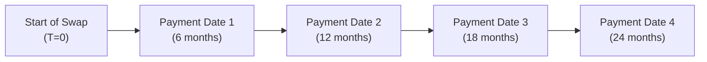

## Introduction and Conceptual Foundations

I remember the first time a colleague of mine casually said, “A plain vanilla interest rate swap is really just a bunch of forward rate agreements (FRAs).” It was one of those moments—my coffee nearly went cold as I realized all the flows in a typical swap do indeed mimic a series of forward-type commitments. The swap’s floating-rate side changes periodically to reflect market interest rates, and each payment effectively references a “locked-in” forward rate for that period. That’s exactly how a forward rate agreement works, except a swap happens to wrap multiple forward periods into a single contract.

This perspective—seeing a swap as a portfolio of forward contracts—is not just a trivial reframing. It can significantly simplify how we think about pricing, risk management, and hedging strategies. It’s an insight that helps us systematically break down complicated swap structures, turning them into smaller forward “chunks” for analysis. In this section, we’ll delve into how and why swaps are viewed in this way, and how that viewpoint helps with valuation and day-to-day risk management.

## Swap Cash Flows as Forward Commitments

Swaps, in simple terms, involve exchanging (or “swapping”) a series of cash flows over time. In an interest rate swap, one side pays a fixed rate while the other side pays a floating rate. Each of those payment exchanges occurs on specified future dates. This means we could treat each individual payment exchange as equivalent to a tiny forward contract—a forward rate agreement that locks in a rate for that upcoming period.

The key is that for each payment date:

• The floating-rate side is tied to the prevailing reference rate (like LIBOR in older contracts or SOFR after the LIBOR transition).  
• The fixed-rate side is known from swap initiation.  

Now, each “leg” of a swap has multiple settlement dates. By summing up the present values of all those future settlements, you get the net present value (NPV) of the swap. And if you look closely, each settlement is conceptually identical to a standalone forward: you’re locking in a fixed rate in exchange for a floating rate that will be determined later (or known from the “reset” period). That’s precisely the structure of an FRA.

## FRA Building Blocks

A Forward Rate Agreement (FRA) is an over-the-counter contract that lets you lock in an interest rate on a notional principal for a future loan or deposit. Let’s say you have a 6-month FRA that starts in 3 months. You’re effectively entering a commitment that says: “I will pay or receive the difference between the FRA rate and the actual market interest rate at the future date, applied to the notional for the 6-month period.”

For a typical swap’s floating leg, each reset is essentially a new “forward,” because the floating rate is determined at the beginning of each period and paid at the end. If we track these resets carefully, we see each forward period lines up with an FRA payoff schedule. Summing those hypothetical mini-FRAs over the entire life of the swap yields the floating leg’s expected cash flows.

On the fixed side, we have a known rate for each payment period. That, too, can be decomposed into a series of forward agreements to pay (or receive) a certain fixed rate for each time interval. When combined, the difference between the sum of forward fixed payments and the sum of forward floating payments yields the total swap payoff. So, yes, it’s basically a “bundle” of forward deals.

## Decomposing an Interest Rate Swap Diagrammatically

Here’s a simple Mermaid.js diagram that shows how each swap payment can be seen as a set of forward periods. Imagine a two-year currency or interest rate swap with payment dates every six months. Each future date is a mini-FRA settlement.



In each of those intervals, the floating payments can be seen as forward-based exposures—like a chain of FRAs lined up back to back.

## Calculating Present Value from Forward Legs

A major advantage of swapping the viewpoint from “just a swap” to “multiple FRAs” is it clarifies the discounting process:

1. Identify each potential payment (from the fixed leg and from the floating leg).  
2. Estimate the expected payment amount by using forward rates for that period.  
3. Convert that future payment to its present value using discount factors from the zero-coupon yield curve.  
4. Sum all those discounted values to get the net present value of the swap.

Mathematically, you might see something like:


\text{NPV}_{\text{swap}} = \sum_{i=1}^{n} \left( \frac{\text{Floating Payment}_i}{(1 + r_{\text{discount},i})^{t_i}} \right) - \sum_{i=1}^{n} \left( \frac{\text{Fixed Payment}_i}{(1 + r_{\text{discount},i})^{t_i}} \right)


Because the floating rate payment qualifies as the set of “forward-based” flows, we often note:


\text{Floating Payment}_i \approx \text{Notional} \times (F_{i})(\Delta t)


where \\( F_i \\) is the forward rate for the appropriate term, and \\(\Delta t\\) is the length of the accrual period in years.

In practice, the discount rates \\( r_{\text{discount},i} \\) come from a bootstrapped zero-coupon curve or from the relevant swap curve. Traders might use separate discount curves for collateralized versus uncollateralized swaps. Over time, as discounting methods have evolved (from LIBOR to overnight indexed swap (OIS) discounting), the principle remains: each future flow is individually discounted as though it’s part of a forward transaction.

## Practical Example: Breaking Down a 1-Year Swap

Picture a plain vanilla interest rate swap with a 1-year maturity. Suppose it’s set up with quarterly payments. The notional is \\( \$1{,}000{,}000 \\). The fixed rate is 4% per annum, while everybody expects the floating rate to follow an index that currently reflects a 3.95% forward curve. Just for simplicity, let’s say the discount factor for each quarter is 0.99 (this is not entirely accurate, but it makes the math easy for illustration).

• The swap’s floating leg can be treated as four consecutive 3-month FRAs, each with a notional of \$1,000,000 and an implied forward rate around 3.95%.  
• The fixed leg can be treated as four consecutive forward agreements to pay 4% on the same notional.  

If you discount each payment flow back to the present at 0.99 per quarter, you can sum up all the present values on each side. Notice how each piece is conceptually identical to an FRA. The initial swap value, ignoring minor day count details, is basically zero if the forward rates match the fixed rate. Tiny differences might appear because the floating forward rates are 3.95% while the fixed is 4%, or if discount factors stray from 0.99. In practice, you run real calculations with precise day counts, compounding conventions, and a fully bootstrapped curve.

## Why the Initial Swap Value Is Typically Zero

Swaps usually launch at “par,” meaning neither party is supposed to pay anything at inception (aside from potential collateral to mitigate credit risk). But how can that happen? Because we set the fixed rate at exactly the level that makes the present value of the fixed payments equal to the present value of the floating payments. In a sense, you’re balancing out the sum of forward obligations so that the net present value is zero.

If it weren’t zero, one side would have a built-in advantage. Let’s say the fixed rate was too high compared to market forwards. Immediately, the fixed-rate receiver would have a net positive NPV. Markets don’t let free arbitrage exist for long, so that discrepancy gets arbitraged away, pushing the swap’s fixed rate to the fair level. It’s like the ultimate no-arbitrage logic: the sum of the forward-based obligations on the fixed side and the floating side has to net out.

## Hedging and Replication

Viewing a swap as a portfolio of forward contracts is super helpful for hedging. If you only want to hedge or replicate part of a swap’s exposure—for instance, the next two payment dates but not the entire life of the swap—you can just enter offsetting FRAs for those periods. Alternatively, if your portfolio only has interest rate risk for certain upcoming quarters, you might replicate or offset that portion by layering on FRAs or short-term futures.

Traders often do this in practice: they “lock in” or “unwind” future payments by transacting forward contracts that effectively neutralize one or more legs of the swap. The entire swap can be sliced and diced into forward increments that you can hedge individually. Admittedly, there might be slight differences in day count conventions, credit risk, or administrative details, but conceptually it’s close.

## Collateral, Credit Risk, and Real-World Deviations

In the real world—well, things get messy, right? The theoretical view still holds, but market microstructure introduces complexities:

• Credit and Liquidity Premiums: The swap’s floating rate might exhibit a small premium or discount if the market perceives credit risk or liquidity constraints.  
• Collateralization: Many swaps require collateral, typically in the form of cash or high-quality securities. This can alter the effective discounting rate since posted collateral might earn an overnight rate.  
• Bid-Ask Spreads: Market participants factor in transaction costs. A small “spread” might appear at swap initiation, so the theoretical zero-NPV might shift a bit.

Nevertheless, at a fundamental level, each leg is still a stream of forward-based payments, discounting is done with risk-free or collateral-based curves, and the initial net value hovers around zero unless there’s an intended off-market arrangement.

## Code Example: Valuing a Swap in Python

Here’s a quick snippet (just for illustration) of how you might piecewise discount a swap’s forward-based cash flows in Python. This is not comprehensive, but it outlines the logic:

```python
import math

notional = 1_000_000
fixed_rate = 0.04
payment_times = [0.25, 0.50, 0.75, 1.00]  # in years
discount_factors = [0.98, 0.96, 0.94, 0.92]  # example discount factors
forward_rates = [0.039, 0.041, 0.042, 0.043]  # example forward rates

pv_fixed_leg = 0.0
pv_floating_leg = 0.0

for i, t in enumerate(payment_times):
    # Fixed payment
    fixed_payment = notional * fixed_rate * (t - (payment_times[i-1] if i>0 else 0))
    pv_fixed_leg += fixed_payment * discount_factors[i]
    
    # Floating payment
    float_payment = notional * forward_rates[i] * (t - (payment_times[i-1] if i>0 else 0))
    pv_floating_leg += float_payment * discount_factors[i]

swap_value = pv_floating_leg - pv_fixed_leg
print("Swap Value (Floating - Fixed): ", swap_value)
```

In a real professional environment, you’d refine each step with actual day counts, compounding conventions, and you might perform a more sophisticated forward curve bootstrap. But the gist is: each piece is a forward-based payment with its own discount factor.

## Relevance for the CFA Exam and Practice

From a CFA exam standpoint, understanding how to break swaps into their forward components clarifies:

• Why no money changes hands at initiation for standard swaps.  
• How to interpret each swap payment period as an FRA.  
• How to compute a swap’s fair fixed rate by equating the present value of the fixed leg and the floating leg.  
• Best practices in hedging interest rate risk using forward-based products.  

In exam questions—particularly item sets that revolve around interest rate derivatives—candidates often must show the ability to discount each future cash flow individually. Some might ask for the “swap rate,” which is just another name for the fixed rate that sets the swap’s initial value to zero. Others test your knowledge of forward rates to confirm you can do piecewise discounting or that you understand the subtle relationship between forward curves and swap pricing.

It’s also common in advanced questions to see scenarios involving an off-market swap, in which the fixed rate is set at a level different from the par swap rate, thus creating an immediate upfront value for one counterparty.

## Common Pitfalls and Exam Tips

• Missing the Link to FRAs: One of the biggest conceptual errors is thinking of a swap as a single monolithic trade. On the exam, you’ll likely gain huge clarity if you break it into segments and treat each as a forward.  
• Ignoring Day Count or Compounding: Minor differences in day count conventions can tilt the math. The exam might highlight 30/360 vs. Actual/360, so watch for the instructions provided in the question.  
• Overlooking the Discount Curve: Especially post-2008, the discounting approach can switch from LIBOR to OIS. When the question references OIS discounting, ensure you use that correct discount curve.  
• Time Management: In multi-part item sets, you might get a question that wants a detailed decomposition of a swap into forward instruments. Keep your eyes on the clock—develop a time-efficient approach for the calculations.

## Conclusion and Further Reading

Swaps are at the heart of modern finance, and viewing them as portfolios of forward contracts is not just a neat theoretical statement—it unlocks some very practical ways to hedge, replicate, and value them. Anytime you see a multi-payment structure, ask yourself: can I slice it into smaller forward components? Often, the answer is yes.

If you’d like to dive deeper:

• Hull, John C. “Options, Futures, and Other Derivatives,” 10th ed. (Pearson). The go-to reference for an in-depth exploration.  
• Das, Satyajit. “Swap & Derivative Financing.” Rich with real-world insights on how swaps are structured and used.  
• International Swaps and Derivatives Association (ISDA): https://www.isda.org/  
• BIS Papers on OTC Derivatives Markets: https://www.bis.org/publ/  

Understanding swaps as a series of FRAs will serve you well in both exam contexts and real-world portfolio management. It demystifies an otherwise complex derivative structure, letting you break it down into fundamental—and simpler—atoms of forward commitments.

## Test Your Knowledge: Swaps as Portfolios of Forward Contracts



### Which statement best describes why an interest rate swap can be seen as a portfolio of FRAs?

- [ ] Each swap payment frequency closely matches that of derivatives exchanges.
- [x] Every future swap payment resembles a forward contract on an interest rate.
- [ ] The floating rate in a swap is always higher than the fixed rate.
- [ ] Swaps always require initial collateral that equals the sum of forward contracts’ premiums.

> **Explanation:** Each settlement in an interest rate swap references a rate at a future date, akin to an FRA payoff. By viewing each payment exchange as its own forward contract, the entire swap can be seen as many FRAs strung together.

### In a standard plain vanilla interest rate swap, what usually explains why the initial value of the swap is zero?

- [x] The fixed rate is set so that the present values of both legs are equal.
- [ ] The central bank guarantees no initial premium.
- [ ] Both parties negotiate an upfront fee to offset any imbalance.
- [ ] The floating rate is inherently higher to compensate for risk.

> **Explanation:** Swaps typically start at par by design: the fixed rate is chosen to make the sum of discounted expected cash flows from the fixed and floating sides equal, resulting in no initial cost to either party.

### When discounting future payments for a swap’s valuation, which curve is generally the most relevant post-financial-crisis?

- [x] OIS-based discount curve.
- [ ] LIBOR-based discount curve.
- [ ] Corporate bond yield curve.
- [ ] Local bank prime rate curve.

> **Explanation:** After the 2008 crisis, market conventions shifted to OIS discounting to more accurately reflect the risk-free or collateralized rate, rather than using LIBOR.

### In decomposing a swap into forward contracts, which of the following is a principal advantage?

- [ ] It reduces credit risk for both parties.
- [ ] It bypasses the need for discounting future cash flows.
- [x] It helps with hedging each payment separately using FRAs or short-term futures.
- [ ] It guarantees a fixed profit each time a leg is settled.

> **Explanation:** Viewing a swap as multiple FRAs makes it straightforward to hedge individual segments of the swap, as each segment can be offset with well-matched forward contracts.

### Which of these factors could cause a slight initial premium or discount on a swap, deviating from zero at inception?

- [x] Credit risk or liquidity constraints.
- [ ] The notional amount is too large.
- [x] Bid-ask spreads in the market.
- [ ] Overcollateralization is prohibited by the contract.

> **Explanation:** Real-world conditions (credit risk, bid-ask spreads, liquidity considerations) can shift the fair rate slightly above or below the ideal par swap rate, resulting in minor upfront value to one side.

### What is the usual role of collateral when two counterparties enter into a swap?

- [x] To mitigate credit risk by periodically securing potential mark-to-market exposures.
- [ ] To be used immediately if one counterparty defaults on a separate contract.
- [ ] To fund future margin calls in regulated futures trading only.
- [ ] To replace the discount factor with a fixed rate.

> **Explanation:** Collateral is posted to protect each party from the other’s possible default. As the swap’s mark-to-market value changes, collateral might transfer hands to ensure coverage of potential credit exposure.

### How might small day count convention differences impact a swap valuation?

- [x] They can create modest discrepancies in the total interest accrued per period.
- [ ] They have no effect if the swap is fully collateralized.
- [x] They allow for interest rate arbitrage.
- [ ] They’re offset by the central bank’s policy rate.

> **Explanation:** Over multiple payment periods, small differences in day count assumptions can aggregate into notable deviations in valuations, because each period’s cash flow is accrued differently.

### Which of the following best describes the relationship between the floating rate in a swap and forward rates?

- [x] The floating rate resets in alignment with forward rates for each period.
- [ ] The floating rate never changes once the swap is initiated.
- [ ] The floating rate is always determined at the end of the accrual period based on historical data.
- [ ] The floating rate is the same as the fixed rate at every reset date.

> **Explanation:** The floating rate in each interval resets based on market expectations of that future rate, which coincides with forward rates for that specific period.

### Why is it often said that the floating leg of a brand-new interest rate swap has a value close to par?

- [x] Because at inception, the floating rate is typically set to match the current market reference rate.
- [ ] Because the floating leg is never discounted.
- [ ] Because the notional for the floating leg is different from the fixed leg.
- [ ] Because swaps are always collateralized.

> **Explanation:** At the start of the swap, the floating rate used (e.g., LIBOR or SOFR) is typically set at the prevailing reference rate, giving the floating leg a present value approximately equal to notional.

### True or False: The act of summing all forward contracts within a swap is necessary primarily for determining who owns the underlying asset.

- [x] True
- [ ] False

> **Explanation:** This is a bit of a trick question. Technically, in many interest rate swaps, there is no ownership transfer of an underlying asset. We sum all the forward contracts to accurately value each future payment, not to track asset ownership. However, from a broader perspective, the “ownership” of interest rate exposure can be viewed as the sum of forward rate exposures. In a strict sense, there is no commodity or bond ownership changing hands, so the statement’s wording can be misleading.  


