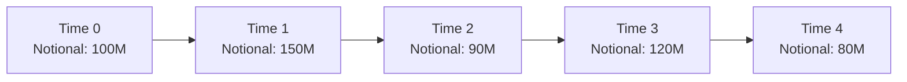

## Overview

It’s funny how, when I was first introduced to swaps—specifically those standard plain vanilla interest rate swaps—I thought, “Well, I get it… pay fixed, receive floating (or vice versa), done deal.” But as I spent more time in a bank treasury rotation, I discovered a world of more complex swap structures that can literally shape-shift over time. Swaps can do some pretty extraordinary things, especially if you layer in changes to notional amounts, coupon rates, or the underlying yield curve exposures. 

In this section, we’re going to look at a few of these advanced swap configurations. We’ll discuss butterfly swaps (structuring the swap notional in a way that references different points along the yield curve), roller-coaster swaps (where the notional steps up and down in a non-linear way, possibly multiple times), and other similarly complex instruments. We’ll also examine how these instruments are typically priced, used, and properly risk-managed. You’ll find references to earlier sections—like “9.1 Swaps as Portfolios of Forward Contracts” or “9.2 Valuing Interest Rate Swaps and Swap Rates”—but the core focus here is how the notional schedules, yield curve exposures, and forward curves align to create dynamic hedging possibilities for often tough-to-hedge liabilities.

## Butterfly Swaps

### Concept and Motivation
A butterfly swap is generally a structure designed to exploit or hedge yield curve shape changes across short, medium, and long maturities. Think of it like a mini-wings arrangement: short-term and long-term rates are the “wings,” and the mid-range is the “body,” forming a three-pronged position. In practice, the notional (or sometimes the number of contracts) might be higher in the short and long maturities, with a smaller notional in the middle—or vice versa. 

The biggest reason market participants might use a butterfly structure is to get exposure to the curvature of the yield curve. This technique is all about yield curve shaping risk, which is the risk that short and long ends might behave differently than the mid-range. In a parallel shift environment, a butterfly might not have huge payoffs, but if the curve flattens (the wings distorting relative to the belly) or if it steepens (the wings diverge from the belly), the butterfly can produce gains—or hedges—consistent with the investor’s (or issuer’s) outlook.

### How It Works
Imagine you have a swap referencing a 2-year, 5-year, and 10-year hypothetical curve. You might:

• Receive fixed on a 2-year notional.  
• Pay fixed on a 5-year notional.  
• Receive fixed on a 10-year notional.  

The ratio of notionals at each maturity is structured so that the net duration at inception is near zero or at some desired profile. This combination is basically a “butterfly” because it’s symmetrical around the middle maturity. When the 5-year (middle) rate moves differently than the 2-year and 10-year (outer wings), the net position’s value changes accordingly.

### Pricing Mechanics
Pricing a butterfly swap often starts by decomposing it into a sum of smaller forward contracts—something you might recall from Section “9.1 Swaps as Portfolios of Forward Contracts.” Each “leg” or segment of the swap is discounted at the relevant forward rates. If you’re receiving fixed on the outer legs (2-year and 10-year) and paying fixed on the belly (5-year), you’d discount the expected net cash flows from each segment independently. 

One small heads-up: butterfly swaps can be illiquid. Pricing transparency may require specialized yield curve data and dealer quotes, because you’re effectively betting on relative movements among multiple points on the curve. 

## Roller-Coaster Swaps

### Why the Name?
Roller-coaster swaps get their name from the notional (or, in some cases, the coupon) pattern that meanders upward and downward over the life of the swap. It’s like the track of a roller coaster, cresting at certain intervals, then swooping downward at others. You might have a business reason for this: say your project financing ramps up for a few years, then you draw back on borrowed capital, then scale it up again, etc. A static notional swap wouldn’t match that risk exposure well, so you look for a swap that can “roller-coaster” right along with your evolving liabilities or asset base.

### The Structure
Typically, the notional might accrete for a specified period—let’s say you start at $100 million notional, then it steps to $150 million in year two. Then maybe it steps back to $80 million in year three, and jumps again in year four, and so on. Each time, the notional changes are contractually set in the initial swap documentation so there’s no need to re-negotiate mid-swap.

Here’s a rough mermaid diagram illustration of a hypothetical roller-coaster notional:



The credit exposures, margin calls, or collateral requirements often come into play if the notional is large. So you plan carefully for the times when the swap’s notional is at its peak. By the way, I once helped a friend on the corporate treasury side manage a roller-coaster swap tied to a long construction schedule. They found it super helpful in precisely matching interest cost with the actual debt usage at each construction phase.

### Pricing Roller-Coaster Swaps
For a roller-coaster swap, you typically break the contract into time segments—like separate “mini-swaps”—each reflecting the notional for that segment. Then you discount each mini-swap’s net cash flows using the relevant forward curve. Summing all these discounted cash flows gives you the swap’s fair value at inception. If you want to see how it’s done programmatically, here’s a small Python snippet showing a highly simplified approach:

```python
import math

discount_factors = [1.0, 0.95, 0.90, 0.86, 0.83]  # example only

notional_schedule = [100, 150, 90, 120, 80]  # in millions

fixed_rate = 0.04  # 4% annually

net_present_value = 0.0

for t in range(1, len(notional_schedule)):
    # Year t's notional
    notional_t = notional_schedule[t]
    
    # Hypothetical net CF for the year = notional * (fixed_rate - floating_estimate)
    # We'll assume floating_estimate is 3% for demonstration
    floating_estimate = 0.03
    
    net_cf = notional_t * (fixed_rate - floating_estimate)
    
    # present value
    pv_cf = net_cf * discount_factors[t]
    
    net_present_value += pv_cf

print("Estimated NPVs of roller-coaster swap (millions):", round(net_present_value,2))
```

In a real environment, you’d get forward LIBOR or risk-free reference rates (such as SOFR if we are post-LIBOR era) to estimate the floating side’s payments. Each segment’s net payment or receipt is discounted by the forward-based zero-coupon rates for that period.

## Other Complex Structures

Once you understand butterfly and roller-coaster swaps, it’s simpler to see how you could combine these ideas or add optionality. For example:

• Accreting-Amortizing Hybrids: The notional may step up and then gradually amortize, perfect for loans that experience partial paydowns over time.  
• Multi-Currency Roller-Coaster Swaps: Notional not only changes in volume but might switch from one currency to another. Though it’s not too common, it can be an elegant solution for multinational finance.  
• Swaps with Embedded Calls (Cancellable Swaps): If interest rates drop below some threshold, the fixed-rate payer might have the option to cancel and reissue at a lower rate.  

These variations can be huge lifesavers if you have unique exposures in your liabilities or assets, but they do come with potential complexity and higher transaction costs.

## Key Pricing Considerations

1. Segmenting Cash Flows  
   Nearly all complex swap structures can be decomposed into segments or “mini-swaps.” Each segment captures the notionals and rates relevant for a specific time band or maturity bucket.

2. Forward Curve and Yield Curve Shaping  
   Complex swaps thrive on shaping the yield curve exposure, so you need robust forward curves for each relevant tenor. If your swap references three different points along the curve (like in a butterfly) or notional changes in a roller-coaster pattern, you’ll require carefully calibrated discount factors.

3. Embedded Optionality  
   Features like calls, cancelation rights, or knockout levels (on certain exotics) add more layers to the valuation. Typically, you’d factor in the value of that optionality using an option pricing model (e.g., a short-rate model or a lattice approach).

4. Liquidity and Pricing Transparency  
   If you’re dealing with standard tenors (e.g., 2-year, 5-year, 10-year), you might find quotes fairly easily. But for custom schedules, you’ll rely on your derivatives dealer or an inter-dealer broker to build a specialized quote. Validate your assumptions with multiple counterparties if possible. 

## Case Studies and Practical Examples

• Hedging a Construction Project with a Roller-Coaster Swap:  
  Suppose a real estate developer expects their loan drawdown to climb from $50 million in year 1 to $120 million by year 3, then drop to $80 million by year 4. A roller-coaster swap is perfect to match the exact interest cost with actual outstanding debt. Their main “aha!” moment is noticing they only want to pay fixed on the portion of debt they truly plan to use.

• Asset-Liability Management in a Bank with a Butterfly Swap:  
  A bank might want to hedge the shape of the yield curve on certain mortgage assets that are especially sensitive to intermediate-maturity rate movements. They create a butterfly swap that receives fixed on short and long maturities, while paying fixed on the intermediate leg. If the mid-section of the curve changes significantly relative to the short and long ends, the swap payoff offsets that imbalance in their mortgage portfolio yields.

In each scenario, the impetus is to handle non-linear hedging: the exposures evolve over time or vary by maturity in ways that a simple plain vanilla swap can’t address.

## Exam Tips and Common Pitfalls

• Always Break Down by Segments: Complex swaps are still, at the end of the day, a series of forward contracts. For exam questions, show how you’d discount each payment stream or each segment’s net cash flow.  

• Watch the Notional Changes Carefully: A big slip-up is misaligning the notional schedule. In a roller-coaster swap, if you forget a ramp-up or ramp-down, you’ll get the wrong valuation.  

• Yield Curve Shifting vs. Parallel Shifting: Understand the difference. A butterfly swap might do little if rates shift in parallel, but it becomes crucial if the curve flattens or steepens.  

• Checking Liquidity and Price Quotes: Real swaps may not match textbook examples. Evaluate the strength of your data sources and see if you can handle a wide bid-ask spread.  

• IFRS 9 or US GAAP Hedge Accounting: If you plan to qualify for hedge accounting, ensure you properly document your hedge relationships. Complex swaps might require advanced documentation to pass the “hedge effectiveness” test.  

• Manage Counterparty Risk: Complex notional structures can increase credit exposure in the middle of the swap. Keep track of collateral requirements and netting agreements, especially if not centrally cleared.  

In exam scenarios, you’re often asked to compute present values of each segment or to discuss how a change in the yield curve affects a butterfly structure. You might also see a question about a client with a forecast of debt usage that’s non-linear over time. Stay calm and methodical: break it into smaller pieces, apply forward discount rates for each relevant period, and background-check your assumptions.

## Glossary

• Yield Curve Shaping Risk: The risk of non-parallel shifts (steepening, flattening, butterfly movements) in the term structure of interest rates.  
• Non-Linear Hedging: Managing exposures that do not move in lockstep with time or interest rate changes; requires dynamic or custom-structured derivatives.  
• Forward Curve: The market’s implied expectation of future interest rates for specific maturities; used as the basis for discounting and projecting floating payments.  
• Embedded Optionality: Contractual clauses that allow changes (like calls, knockouts, or step-ups) within the swap if specific conditions are met.

## References

• Grinblatt, M. and Titman, S. “Financial Markets and Corporate Strategy.”  
• Various broker/dealer whitepapers on advanced swap structuring.  
• International Financial Reporting Standards (IFRS 9) and US GAAP guidelines on hedge accounting for derivatives.  

--------------------------------------------------------------------------------

## Test Your Mastery of Complex Swap Structures



### 1. Which of the following best describes a butterfly swap?

- [ ] A standard plain vanilla swap with a fixed notional.  
- [ ] A swap that only references short-term and long-term rates.  
- [x] A swap structure involving three or more points on the yield curve, often focusing on the curvature.  
- [ ] A swap with multiple embedded call options.  

> **Explanation:** A butterfly swap typically involves a position in short-term, mid-term, and long-term maturities to capture or hedge yield curve shape changes.

### 2. In a roller-coaster swap, which factor most distinguishes it from a simple amortizing swap?

- [ ] It is valued using the Black–Scholes–Merton model rather than forward rates.  
- [ ] The notional amount remains constant throughout the swap.  
- [x] The notional amount oscillates up and down over the swap’s life, instead of strictly amortizing.  
- [ ] The coupon rates are floating at all times.  

> **Explanation:** A roller-coaster swap’s notional is designed to move up and down in steps, often to match fluctuations in the underlying exposure.

### 3. Which of the following is a typical reason to enter into a butterfly swap?

- [x] To profit from or hedge against changes in the curvature of the yield curve.  
- [ ] To lock in a parallel shift in interest rates.  
- [ ] To convert floating rate debt into equity.  
- [ ] To reduce collateral requirements on a short-term loan.  

> **Explanation:** Butterfly swaps are commonly used to manage perspective changes in yield curve shape, not just parallel shifts.

### 4. Which of these statements is most accurate about pricing complex swaps like butterfly or roller-coaster swaps?

- [ ] They cannot be decomposed into simpler forward contracts.  
- [ ] They are priced using only option-based models.  
- [ ] They must be valued at par because the notional is variable.  
- [x] They can be decomposed into multiple swap “legs,” each discounted separately at the appropriate forward rate.  

> **Explanation:** The standard approach for pricing complex swaps continues to rely on viewing each distinct cash flow or leg as its own forward contract, then summing the present values.

### 5. Which scenario best illustrates a real use-case of a roller-coaster swap?

- [x] A construction firm whose outstanding loan balance ramps up and then down according to the building schedule.  
- [ ] A day trader wanting to speculate on daily LIBOR movements.  
- [x] A company that expects to expand, then temporarily contract, then expand again.  
- [ ] A firm with a single bullet maturity bond issuance.  

> **Explanation:** Roller-coaster swaps are helpful for non-linear liability profiles, such as those in phased projects, expansions, or cyclical usage patterns.

### 6. True or False: Butterfly swaps become particularly relevant if the yield curve undergoes a strictly parallel shift.

- [ ] True  
- [x] False  

> **Explanation:** Butterfly swaps primarily benefit or hedge against changes in the shape (e.g., flattening, steepening) rather than a uniform parallel shift.

### 7. What is the key challenge with respect to liquidity when trading a butterfly swap?

- [ ] They are typically exchange-traded, so there is no challenge.  
- [ ] They can only be legally traded with central clearing.  
- [x] The customized nature of multiple legs or maturities can limit the availability of transparent price quotes.  
- [ ] They have mandated daily mark-to-market requirements by regulators.  

> **Explanation:** Because of their specialized structure, butterfly swaps often rely on dealer-driven OTC markets for quotes, reducing liquidity and transparency.

### 8. Which of the following is not an example of embedded optionality in a swap?

- [x] A guaranteed parallel shift in the yield curve.  
- [ ] A call (cancellation) right granted to the fixed-rate payer.  
- [ ] A step-up swap rate triggered by a market condition.  
- [ ] A knockout feature that terminates the swap when rates reach a certain threshold.  

> **Explanation:** Embedding optionality deals with contract terms that allow changes or terminations under certain triggers. A parallel shift in the curve is not an option, it’s just a market move.

### 9. If you plan to qualify a complex swap for hedge accounting under IFRS 9 or US GAAP, which step is considered critical?

- [ ] Not reporting the hedge to regulators.  
- [ ] Including the swap in the company’s capital structure calculations only.  
- [x] Thoroughly documenting the hedge relationship and demonstrating hedge effectiveness.  
- [ ] Immediately terminating the hedge after the first reporting date.  

> **Explanation:** Standard hedge accounting rules require extensive documentation that the derivative reduces risk in a highly effective manner, plus ongoing effectiveness testing.

### 10. True or False: A roller-coaster swap’s notional schedule must remain strictly symmetrical around its midpoint.

- [ ] True  
- [x] False  

> **Explanation:** There is no requirement for symmetry in roller-coaster swaps. The notional pattern can vary in any pre-agreed manner throughout the swap’s term.


