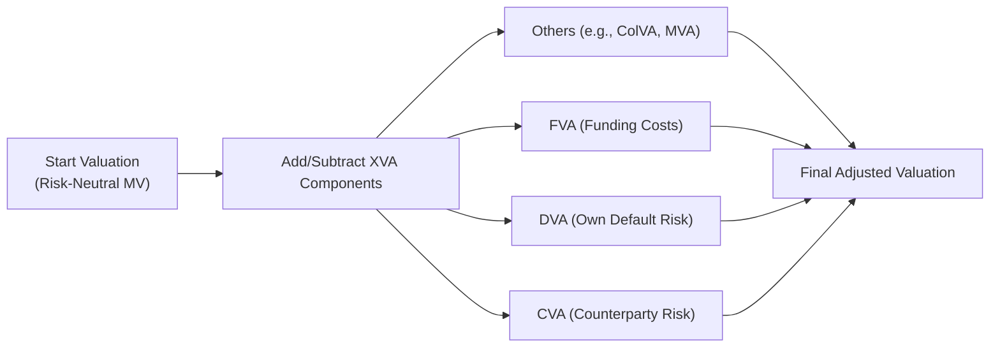

## An Informal Introduction

Have you ever heard someone say, “Ah, a swap’s value is just the net present value of the expected cash flows”? Well, that’s mostly true—except real-world market players worry about what happens if one party defaults. I vividly recall this “oh snap” moment when, as a junior analyst, I realized all those fancy swaps we had on our books were worthless if the counterparty vanished. The credit risk dimension—i.e., the risk that the other side fails to honor the contract—means we need to incorporate a special factor called the Credit Value Adjustment (CVA). In fact, we often talk about a more complete picture: Market Value plus CVA, DVA (Debit Value Adjustment), and maybe even FVA (Funding Valuation Adjustment). Let’s just say real life is rarely so simple.

Below, we’ll walk through how to value a swap contract in “normal” conditions (i.e., ignoring credit risk) and then deal with the sticky reality that each side could default. This conversation is definitely relevant to your exam, but it’s also useful if you’re ever in a role where you’re structuring, pricing, or risk-managing derivatives.

## Understanding Market Value in Swaps

In the most basic sense, a swap is a series of future cash flows exchanged between two parties. For instance, in a plain-vanilla interest rate swap, one party pays a fixed rate while receiving a floating rate, and the other does the opposite. The market value of the swap at inception is usually zero because both parties structure the fixed rate so that the contract is “fair” under prevailing market conditions.

But as time passes, interest rates shift, credit spreads move, and the underlying risk factors change. Consequently, if you want to figure out what your swap is worth at any point in time, you’d typically measure:

• The present value of all future expected inflows.  
• Minus the present value of all future expected outflows.

If you’re receiving fixed and paying floating, you’ll discount your expected fixed-rate receipts and compare them with your floating-rate payments. The discount factors come from the risk-free (or near-risk-free) curve, which can be something like SOFR-based discounting (since LIBOR has been phased out in many jurisdictions). This standard discounting approach using risk-free rates is often referred to as “risk-neutral valuation.” 

Just remember: so far, we’re ignoring counterparty credit risk.

## Risk-Neutral Valuation in Brief

Risk-neutral valuation might sound like finance jargon, but it’s a fairly straightforward concept. Under risk-neutral valuation, all assets and liabilities grow on average at the risk-free rate in expectation. So, if we know what a future cash flow might look like, we discount it back to the present using the risk-free rate. That sets the “market value,” ignoring default risk. 

On the exam, you might see a simple formula for a forward-starting swap or a standard interest rate swap. The risk-neutral approach to the value (V) of a swap’s leg typically looks like this:


V = \sum_{t=1}^{T} \mathbb{E}^{\mathbb{Q}}[\,\text{Cash Flow}_t\,] \times D(t)


where:  
• \\(\mathbb{E}^{\mathbb{Q}}[\cdot]\\) is the expectation under the risk-neutral measure (Q).  
• \\(D(t)\\) is the discount factor to time \\(t\\), often derived from the risk-free curve.

This is the standard setup for a market-based valuation. But in real life, there’s that question in the back of your mind: “What if the other side can’t pay?” That’s when we move to adjustments like CVA.

## Credit Value Adjustment (CVA)

CVA recognizes that your counterparty might default on its obligations—especially if your swap is positively valued to you (i.e., the contract is in your favor). If the amount owed to you at some future date ends up being uncollectible, your gains vanish into thin air.

### When CVA Matters Most

CVA plays a larger role when:

• Contracts are long-dated (interest rate swaps with maturities of 10 or 20 years).  
• The counterparty has a lower credit quality.  
• The trade is significantly in-the-money to you.  

In these scenarios, you really want to price in the possibility that your expected “windfall” might not materialize. Almost inevitably, at some point, you’ll see market participants incorporate CVA in quotes—especially for large or complex over-the-counter (OTC) deals.

### Conceptual Formula

The basic conceptual formula for CVA is:


\text{CVA} = \sum_{t=1}^{T} \left( \mathrm{PD}(t) \times \mathrm{EE}(t) \times (1 - \mathrm{Recovery\ Rate}) \times \mathrm{DF}(t) \right)


In words:
• \\(\mathrm{PD}(t)\\) is the probability that your counterparty defaults at time \\(t\\).  
• \\(\mathrm{EE}(t)\\) is the expected exposure of the swap at time \\(t\\) (how much you stand to lose if default occurs then).  
• \\(\mathrm{Recovery\ Rate}\\) is the fraction of exposure you might recover if your counterparty defaults.  
• \\(\mathrm{DF}(t)\\) is the discount factor to bring that expected loss to present value.

It can be helpful to think of CVA as the “insurance premium” you would conceptually pay to protect yourself from the counterparty’s default risk. The bigger the default risk, the bigger the CVA.

## DVA, FVA, and Beyond

When your counterparty is valuing the same swap from their perspective, they’re factoring in your default risk as well. This is known as Debit Value Adjustment (DVA). Essentially, if you are more likely to default, then the counterparty sees a reduced potential liability, which ironically increases your side’s “benefit” from the default perspective. It sounds counterintuitive, but that’s how bilateral negotiations go: each side sees the other’s credit risk, and each side acknowledges its own risk from the other’s vantage point.

Then we get into Funding Valuation Adjustment (FVA). If your trading desk needs to fund collateral or uncollateralized positions, there’s a cost to that funding. If you can’t post collateral cheaply, your FVA might be higher. This is the real world, where expansions of the “XVA” alphabet soup can also include:

• ColVA (Collateral Valuation Adjustment)  
• KVA (Capital Valuation Adjustment)  
• MVA (Margin Valuation Adjustment)  

But at the CMA® or CFA® (or any advanced finance exam) Level I (or III) context, you’ll typically focus on CVA, DVA, and maybe FVA for deeper discussions.

## Calculating the CVA

Nowadays, many institutions use sophisticated Monte Carlo simulations to determine the path of future exposures in a stochastic environment. They embed credit curves (or hazard rates) for the probability of default at each step. This gets technically involved, but the principle is straightforward: you anticipate different possible states of the world, weigh them by their probabilities under a risk-neutral measure, measure your exposure in each scenario, and factor in the chance your counterparty won't pay.

If your exam necessitates a simpler approach, you might see a single probability of default spread evenly over the contract’s duration—or an assumption that the exposure is constant or moves linearly. 

Let’s do a quick hypothetical example to illustrate CVA. Apologies if it feels a bit simplistic, but it’s a good starting point.

## An Illustrative Example

Imagine you have a 3-year interest rate swap where you receive fixed and pay floating. You did your usual valuation ignoring credit risk and concluded the swap is worth $200,000 to you today (present value). Great. Now, suppose your counterparty’s credit curve suggests:

• Probability of default (PD) each year is around 2.5%, independent each year for simplicity (in reality, these probabilities would be cumulative).  
• If the counterparty defaults, you expect to recover 40% of the claim (meaning 60% is lost).  
• The expected exposure remains roughly $200,000 for the entire 3-year period—this is admittedly artificial, but let’s keep it simple.  
• The risk-free discount factor each year is, say, 0.95 for Year 1, 0.90 for Year 2, and 0.85 for Year 3.

Here’s a simplistic CVA calculation:

Year 1  
• PD(1) = 0.025  
• EE(1) = $200,000  
• LGD = (1 – Recovery) = 60%  
• DF(1) = 0.95  

So the expected cost from default in Year 1 is:  
(0.025) × (200,000) × (0.60) × (0.95) = $2,850

Year 2  
• PD(2) = 0.025 (not cumulative, just annual)  
• EE(2) = $200,000  
• LGD = 60%  
• DF(2) = 0.90  

CVA for Year 2:  
(0.025) × (200,000) × (0.60) × (0.90) = $2,700

Year 3  
• PD(3) = 0.025  
• EE(3) = $200,000  
• LGD = 60%  
• DF(3) = 0.85  

CVA for Year 3:  
(0.025) × (200,000) × (0.60) × (0.85) = $2,550

Total CVA = $2,850 + $2,700 + $2,550 = $8,100  

That $8,100 is the approximate expected credit loss from the possibility your counterparty could default. In more realistic scenarios, we’d adjust for the changing exposure over time (especially relevant for swaps with netting or changing notional). We might do a more advanced analysis of correlated default risk, forward interest rates, potential negative exposures, and so forth. But this example demonstrates the central idea: your swap isn’t really worth $200,000 risk-free if the other side might not fully pay.

## XVA in a Nutshell

Putting it all together, we talk about the full “fair” value of the swap as:


\text{Adjusted Value} = \text{Market Value} - \text{CVA} + \text{DVA} - \text{FVA} + \dots


However, each additional “VA” slice can become more complicated. Some banks or big institutional investors use intricate internal models for each type of risk, and the sums can significantly change the net valuation of a derivative. More sophisticated or well-capitalized parties might net out certain exposures across multiple trades, sign ISDA (International Swaps and Derivatives Association) netting agreements, or post daily collateral so that the CVA is drastically reduced. 

## Visualizing the Adjustment Flow

Below is a simple Mermaid diagram to illustrate how you start with a base swap valuation (ignoring credit risk) and then apply adjustments step by step:

## Best Practices and Pitfalls

• Discount Curves Matter: Especially post-LIBOR, the discount rates might come from specific overnight benchmark curves (like SOFR in the U.S.). Using the wrong curve for discounting can lead to big mispricings.  
• Correlation Between Exposure and Default: Sometimes, the risk of default rises exactly when exposure is largest (e.g., in stressed markets), amplifying potential losses. This phenomenon is called wrong-way risk and can drastically inflate CVA.  
• Overlooking Netting: If you have multiple derivatives with the same counterparty under a netting agreement, your overall CVA might be lower because negative exposures can offset positive ones across trades.  
• Complexities for Practitioners: Many institutions manage a “CVA desk” that focuses on hedging counterparty risk with credit derivatives, thereby offsetting some of the expected losses from a default event.  
• Real-World Documentation: Standardized agreements, like those from ISDA, define netting, collateral thresholds, and early termination clauses. These create real-world constraints on how you measure credit exposure.

## Exam Tips

• Don’t Over-Apply Formulas: You may be given a simplified probability of default and a simplified discount rate. Use them carefully in a step-by-step manner, showing any partial computations if it’s a constructed response question.  
• Understand the Conceptual Difference: The “market value” is what you get if everything goes smoothly. CVA and DVA reflect the chances it might not.  
• Time Management: On multi-part derivative questions, you might have to incorporate multiple steps: (1) find the swap’s base value, (2) incorporate credit risk, (3) interpret the net effect. Keep track of each step methodically.  
• Potential Ethical and Regulatory Ramifications: Regulators often require banks to hold capital against potential CVA losses. Also, the IFRS or GAAP might have specific requirements for how you account for CVA/DVA.  
• Typical Pitfall: Confusing CVA with “CFA.” That’s mostly a joke, but watch your acronyms. More seriously, a common test trap is to forget to discount exposures or to forget the concept of potential future exposure.  

## References

• Gregory, Jon. “Counterparty Credit Risk and Credit Value Adjustment.”  
• Brigo, Damiano, et al. “Counterparty Credit Risk, Collateral and Funding.”  
• ISDA Documentation on Collateral and Netting.  
• CFA Institute 2025 Level I Curriculum, Volume 7: Derivatives (Chapters 9.1–9.12)

## Test Your Knowledge: Swap Valuation and XVA Concepts



### 1. Which statement best describes the market value of a swap?

- [ ] It includes counterparty credit risk at the outset.
- [ ] It is calculated only using the counterparty’s credit spread.
- [x] It is the net present value of expected future cash flows under risk-neutral valuation, ignoring credit risk.
- [ ] It always starts at a positive value.

> **Explanation:** The market value of a standard swap at inception is typically the net present value of its expected cash flows under a risk-neutral measure, not factoring in default risk.  

### 2. Considering CVA in swap valuation:

- [ ] Increases the swap’s value from your perspective.
- [x] Decreases the swap’s value from your perspective.
- [ ] Has no effect if the swap is out-of-the-money.
- [ ] Only applies to collateralized swaps.

> **Explanation:** CVA represents the expected loss due to counterparty default, so it reduces the swap’s value to you if you’re expecting to receive money.  

### 3. Debit Value Adjustment (DVA) accounts for:

- [x] Your own default risk from the counterparty’s viewpoint.
- [ ] The effect of netting i.e., offsetting exposures.
- [ ] Funding cost for uncollateralized positions.
- [ ] Reduction in the probability of default due to stable credit ratings.

> **Explanation:** DVA factors in how your potential default might reduce the counterparty’s exposure, effectively lowering your liabilities.  

### 4. Which of the following is true of an uncollateralized long-dated swap?

- [ ] CVA is likely negligible because exposures are small.
- [ ] DVA is irrelevant if the swap is not in your favor.
- [ ] CVA and DVA are always zero when netting agreements exist.
- [x] CVA can be significant if the counterparty’s credit quality is poor.

> **Explanation:** In an uncollateralized long-dated contract, large credit exposure can build up over time, making CVA significant if the counterparty is risky.  

### 5. If the expected recovery rate is 30%, what is the Loss Given Default (LGD)?

- [ ] 30%
- [x] 70%
- [ ] 40%
- [ ] 100%

> **Explanation:** Loss Given Default (LGD) is 1 minus the recovery rate. Here, 1 – 0.30 = 0.70 (or 70%).  

### 6. FVA (Funding Valuation Adjustment) typically reflects:

- [x] The cost of funding uncollateralized derivative positions.
- [ ] The potential benefit from your default risk.
- [ ] The incremental effect of netting across multiple swaps.
- [ ] The spread between the fixed and floating legs.

> **Explanation:** FVA is about the cost of funding (or financing) positions, particularly when collateral is not posted or is posted at a different rate than the risk-free rate.  

### 7. In a CVA calculation, the probability of default is multiplied by which of the following?

- [ ] Market Value of the entire derivative portfolio plus the notional.
- [x] Expected Exposure, Loss Given Default, and a discount factor.
- [ ] Floating-rate payments discounted at credit spreads.
- [ ] Notional principal less the collateral posted.

> **Explanation:** CVA is built from Probability of Default × Exposure at Default × Loss Given Default × Discount Factor.  

### 8. “Risk-neutral valuation” in swap pricing means:

- [x] Future cash flows are discounted at a risk-free rate, and probabilities are adjusted so that the expected return on all assets is the risk-free rate.
- [ ] The discount rate depends solely on the counterparty’s yield curve.
- [ ] The swap is collateralized by default.
- [ ] The real-world probabilities of events are used directly without adjustment.

> **Explanation:** Under a risk-neutral measure, expected returns are typically set to the risk-free rate, and all cash flows are discounted accordingly.  

### 9. For a swap with positive replacement value to you, which of the following is true?

- [ ] CVA is zero if you do not post margin.
- [ ] The probability of default is irrelevant.
- [ ] The swap’s value is unaffected by credit spreads.
- [x] CVA reduces the overall market value, reflecting the risk your counterparty might not pay.

> **Explanation:** If your swap is in the money, the possibility of your counterparty failing to pay reduces your actual expectation of receiving the full amount.  

### 10. Is it theoretically possible for DVA to increase your reported profitability?

- [x] True
- [ ] False

> **Explanation:** If your own default risk rises, your liabilities can be viewed as decreasing from the market’s perspective, which paradoxically may boost your short-term reported earnings under certain accounting standards.


