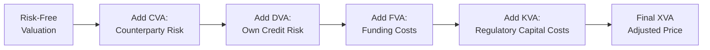

## Understanding the XVA Framework

When we talk about valuing derivatives, most folks picture the classic approach: discount all expected cash flows at a “risk-free” rate. Then—bam!—out pops a “fair value.” But in the real world, there are funding frictions, counterparty credit risk, and even the possibility that you yourself (as the derivative dealer or investor) might default. So the risk-free discount approach just doesn’t cut it anymore. This is where XVA enters the picture, capturing all those real costs and complexities in a single suite of adjustments. 

XVA stands for a family of “Valuation Adjustments” that refine the original fair value of a derivative. It includes Credit Value Adjustment (CVA), Debit Value Adjustment (DVA), Funding Valuation Adjustment (FVA), and Capital Valuation Adjustment (KVA). You might bump into even more alphabetical expansions in practice, but these four are the big ones. 

It can feel overwhelming at first. I remember the first time I saw a massive spreadsheet with all these XVA items—CVA, DVA, FVA, KVA—it felt like some secret code. But once you realize the logic behind each, it actually makes sense why the derivative’s final price should reflect all these nearly invisible costs.

## Core Components of XVA

### CVA: Credit Value Adjustment
CVA is about the counterparty’s credit risk. When you enter into an over-the-counter (OTC) derivative, there’s a chance the other party won’t honor its obligations. If your counterparty defaults, you stand to lose some or all of the derivative’s positive value. CVA is basically the expected loss resulting from that default risk.

To compute CVA, analysts often model the possible exposures over time (like a Monte Carlo simulation of the derivative’s path), then they overlay the probability of counterparty default and the recovery rate if said default happens. The result is an expected cost that you subtract from the idealized, risk-free derivative value. 

In practical terms, CVA can be material for institutions with large derivative portfolios, particularly during volatile markets when credit spreads suddenly widen. Regulators also emphasize CVA because it represents real credit risk that banks need to measure, manage, and capitalize.

### DVA: Debit Value Adjustment
DVA flips the perspective onto your own default risk. It’s essentially the mirror image of CVA. If you’re the one with a concerning credit profile, your counterparty is the one that might lose out if you default. 

Here’s the tricky part: from your perspective, if you think you might default, weirdly enough, that can reduce your derivative liability because you might, in effect, “save money” by not paying off the entire contract if you go bust. This is why many practitioners remain cautious with DVA. Recognizing DVA as an immediate gain can lead to somewhat strange accounting and risk management conclusions: you generally don’t want to celebrate the fact that your own credit risk is rising. 

In practice, DVA is accounted for in the same manner as CVA, but it gets added rather than subtracted from the risk-free valuation (though it can be negative if your credit improves). The net effect of CVA and DVA is often aggregated into something called “bilateral CVA,” although many advanced shops keep them separate for clarity.

### FVA: Funding Valuation Adjustment
Funding Valuation Adjustment captures the cost (or benefit) of funding derivative positions. Instead of borrowing at a theoretical risk-free rate, financial institutions typically fund at a higher spread, especially when markets are stressed. If you have to post collateral in a derivative transaction, you’re effectively tying up expensive capital. 

FVA extends the idea that not all money is “free,” and your discount rate for derivatives might be quite a bit higher than the risk-free rate. Some banks have been through tense times where the funding rate soared, and that cost needed to be accounted for in derivative pricing. 

Implementation of FVA can become a major modeling challenge:
• You have to track the usage of collateral.  
• You have to project future funding costs based on evolving interest rates and credit spreads.  
• You must factor in margin calls triggered by changes in a derivative’s mark-to-market.

For large dealer banks, ignoring FVA can be quite costly, especially for trades with long maturities or high notional amounts.

### KVA: Capital Valuation Adjustment
Think about an institution’s total risk-weighted assets (RWAs): the higher your RWAs, the more regulatory capital you’re required to hold. KVA reflects the capital costs associated with backing a derivative. In short, if your derivative exposure is going to require you to set aside more capital (and capital is expensive), then you need to pass that cost along in the derivative’s price.

Under Basel III (and potentially subsequent Basel Accords updates), capital regulations have become more stringent. By factoring KVA into pricing decisions, large financial institutions ensure that the incremental capital drag from a new trade is priced into the final deal. This can be especially relevant for trades that carry high counterparty risk or for banks operating near their regulatory capital limits.

### Summarizing the XVA Flow

Below is a simple diagram of how each adjustment builds upon the previous “risk-free” valuation. This is highly simplified, but it helps visualize the sequential effect of XVA:

The ordering can differ, and in practice, these are often assessed jointly. It’s also essential to avoid double counting or contradictory assumptions across these separate adjustments.

## Modeling and Implementation Considerations

### Simulation of Exposure
Modeling XVA usually starts with simulating potential future exposures (PFE) for each derivative under a risk-neutral measure. For CVA, you multiply that exposure by the probability your counterparty defaults at each future time segment. For FVA, you multiply that same PFE by your funding spread. For KVA, you measure how each incremental derivative changes your capital usage over time.

• Monte Carlo simulation is often used to capture complex derivatives (e.g., interest rate swaps with embedded optionality, cross-currency swaps, or exotic derivatives).  
• Dynamic margining might reduce exposure but introduces new complexities, including possible margin calls.  
• The margin period of risk (MPR) is critical because it’s how long it takes to close out and replace a defaulted trade.

### Data Challenges
Accurate data on credit spreads (for counterparties and for one’s own firm), thoroughly validated internal funding curves, and robust capital usage metrics are all essential to produce a sound XVA number. Missing or stale data can lead to big miscalculations, especially in volatile markets. 

### Internal Coordination: The XVA Desk
Large investment banks often have specialized “XVA Desks” that centralize these calculations. The theory is that you want a single desk to manage or hedge the firm’s overall XVA exposure, instead of each trading desk doing it in a silo. This helps avoid duplication or contradictory hedging strategies. That said, disputes can arise internally about the “right” approach, especially since each business line might have different incentives.

## Avoiding Double Counting

One well-known pitfall is summing up CVA, DVA, and FVA incorrectly. There can be overlap, especially in the discount rates used and the risk parameters. If you treat each adjustment in isolation, you might inadvertently double count. 

For instance, CVA may already incorporate some of the funding spread in the discounting assumption. Or adding DVA on top is especially tricky if you’ve partially recognized it in the capital weighting. The key is a holistic approach that ensures each piece is measuring a distinct source of risk or cost:

• CVA: Systematic expected loss from the counterparty.  
• DVA: Systematic expected gain (or offset) from your own default possibility.  
• FVA: External cost of financing the position over its life.  
• KVA: Regulatory capital cost, which is separate from interest or credit spreads.

## Practical Examples and Real-World Insights

It might help to anchor these abstract concepts to a real scenario:

• Suppose you’re a mid-tier bank entering into a 10-year interest rate swap with a large corporate. The corporate’s credit rating is BBB, and your bank is rated A.  
• Under risk-free valuation, the swap premium might be priced at par.  
• But after factoring in CVA (the corporate’s risk of default is not trivial over 10 years), you add 15 basis points to the swap’s fixed rate.  
• Then you consider your own bank’s credit risk. From the corporate’s point of view, you might default, but your A-rating is relatively strong, so the net DVA might reduce the 15-basis-point add-on by 3 basis points.  
• Now, if your bank’s internal funding rate is 20 basis points over the risk-free rate, you incorporate an FVA of, say, 5 basis points.  
• Finally, your capital desk tells you that taking on this swap is going to require an additional capital buffer. Factoring this in might add another 2 basis points.  
• The final price is the sum of all those adjustments—up or down from the “risk-free” level. 

Of course, these numbers are purely illustrative. But you can see how each separate piece modifies your final swap rate.

## Regulatory and Risk-Management Context

### Basel Accords and Capital Requirements
Under Basel III (and subsequent Basel amendments), banks must hold capital proportional to their risk-weighted assets. Derivatives exposure contributes to RWA calculations, and CVA risk capital charges can be large if you have big uncollateralized swap portfolios. That’s one reason XVA has become so prominent: the regulatory environment essentially forces banks to measure and manage these adjustments.

### Accounting and Reporting
On the accounting side, many institutions reflect CVA and DVA in their profit-and-loss (P&L) statements. This can create short-term P&L swings when market perceptions of credit quality shift. Meanwhile, some argue that changes in your own creditworthiness (DVA) shouldn’t run through earnings. The debate on these topics can get philosophical, but the IFRS and US GAAP guidance generally require recognition of credit risk adjustments.

### Risk-Neutral vs. Real-World Probability
Another puzzle is the concept of using risk-neutral probabilities in pricing while real-world probabilities might be more relevant for default events. Typically, the valuation folds in risk-neutral measure for consistent arbitrage-free pricing, but the default hazard rates or spread data reflect real-world markets. There’s ongoing debate in academic and practitioner circles about bridging these probability measures consistently.

## Common Pitfalls

• Underestimating correlation between market factors and counterparty default. In stressed environments, credit risk and market movements often go hand in hand.  
• Over-simplified approaches to netting sets and collateral postings. Real contracts can have complicated nettable exposures that reduce credit risk.  
• Treating capital costs as constant. KVA can shift dramatically if, for example, regulators or rating agencies change capital requirements, or if a bank’s internal capital cushion changes.

## A Quick Personal Anecdote

I once worked with a trader who was thrilled about snagging a new client for a large interest rate swap seat. At first glance, the trade seemed profitable—until we loaded it into our internal XVA engine. The CVA was huge because the counterparty was on shaky footing, plus our own funding curve had widened that month. All of a sudden, the “great trade” turned out to be borderline unprofitable when priced with the full set of adjustments. The moral of the story: if you want to reflect reality, you can’t ignore XVA.

## Practical Exam Tips for CFA Candidates

• Familiarize yourself with each step in the “valuation chain.” You might see item sets that ask you to incrementally adjust from a risk-free derivative price to a final “fair” price with XVA.  
• Understand the conceptual difference between CVA, DVA, FVA, and KVA. The exam might require you to interpret how a shift in credit spreads or capital requirements changes each component.  
• Be comfortable with the idea of netting—on both sides. The presence of a legally enforceable netting agreement can reduce CVA materially.  
• Practice doing small numerical examples. The exam might present you with simplified numbers for default probabilities, discount factors, or capital charges.  
• Don’t overlook the possibility of negative adjustments (for instance, if your own credit improves, you might have a negative DVA).  

## References and Further Reading

• Gregory, Jon. “The xVA Challenge: Counterparty Credit Risk, Funding, Collateral, and Capital.”  
• Green, Andrew. “XVA: Credit, Funding and Capital Valuation Adjustments.”  
• Basel Committee on Banking Supervision. “Basel III: A global regulatory framework for more resilient banks and banking systems.”  
• IFRS 13. “Fair Value Measurement.”  
• Hull, John. “Options, Futures, and Other Derivatives.”  

## Test Your Knowledge: XVA (CVA, DVA, FVA, KVA) Valuation Adjustments



### Which of the following best describes CVA (Credit Value Adjustment)?
- [x] An adjustment reflecting the counterparty’s likelihood of default
- [ ] An adjustment reflecting your own institution’s credit risk
- [ ] A discount rate adjustment to match margin funding costs
- [ ] A reserve allocated to cover potential future capital requirements

> **Explanation:** CVA explicitly measures the expected loss due to the counterparty’s credit risk, factoring in default probability and recovery rates.

### Which statement is true about DVA (Debit Value Adjustment)?
- [ ] DVA is always negative and reduces the derivative’s fair value
- [x] DVA can be viewed as a gain from your own potential default
- [ ] DVA only applies to collateralized derivative transactions
- [ ] DVA is independent of the market’s view of your firm’s creditworthiness

> **Explanation:** DVA can be interpreted as an immediate gain that arises if there’s a chance you might default on your payments. It depends heavily on your own credit spreads.

### Funding Valuation Adjustment (FVA) captures which of the following costs?
- [ ] Increased costs due to large notional amounts but no margin posting
- [x] The cost of financing or funding a derivative position above the risk-free rate
- [ ] The cost of capital under Basel regulations
- [ ] The default risk premium attached to a new counterparty

> **Explanation:** FVA considers the difference between the risk-free funding rate used in theoretical valuations and the actual funding rate a firm faces to support the derivative over its life.

### KVA (Capital Valuation Adjustment) is most closely linked to:
- [ ] Liquidity considerations and margin haircuts
- [x] Regulatory capital requirements that banks must hold
- [ ] Potential enhancements in technology to streamline derivative trading
- [ ] The cost of intraday collateral calls and margin management

> **Explanation:** KVA accounts for the regulatory capital costs (e.g., under Basel) that the bank must hold against derivative exposures, reflecting an additional charge.

### When summing up CVA, DVA, FVA, and KVA in practice, analysts must be cautious about:
- [ ] Including them only if the counterparty is uncollateralized
- [ ] Stacking them in alphabetical order to get the correct final price
- [x] Overlapping assumptions that lead to double counting certain credit or funding elements
- [ ] Excluding netting benefits to remain conservative

> **Explanation:** The biggest risk is double counting or inconsistently modeling correlations across the different adjustments. Netting can reduce CVA, for instance, and must be considered carefully.

### A typical approach to modeling CVA exposure is:
- [x] Running a Monte Carlo simulation of exposures over time and overlaying default probabilities
- [ ] Using a single future time point with a flat discount rate
- [ ] Estimating DVA first and applying the result to CVA
- [ ] Ignoring any real-world probability of default unless a rating agency has downgraded the counterparty

> **Explanation:** CVA calculations often use Monte Carlo simulations to capture the changing exposure profile over time and the likelihood of counterparty default.

### In a bilateral CVA framework, which adjustments are considered together?
- [ ] CVA and FVA
- [ ] DVA and FVA
- [x] CVA and DVA
- [ ] KVA and DVA

> **Explanation:** Bilateral CVA means you account for both your counterparty’s credit risk (CVA) and your own default risk (DVA) in the same model.

### In practice, a specialized "XVA Desk" within a financial institution:
- [x] Centralizes the management and hedging of the firm’s valuation adjustments
- [ ] Is responsible for creating new derivatives entirely without credit risk
- [ ] Operates purely as an external consulting service
- [ ] Has minimal interaction with traders or risk managers

> **Explanation:** An XVA Desk tries to unify and optimize how the bank handles the full spectrum of valuation adjustments across product lines.

### A margin period of risk (MPR) typically refers to:
- [x] The time required to close out and replace a derivative position after a default
- [ ] The initial margin posted for futures contracts
- [ ] The maximum credit exposure in uncollateralized trading
- [ ] The grace period a bank has before paying capital charges on derivatives

> **Explanation:** MPR is a key concept in derivatives risk management, representing how long it might take to re-hedge or terminate positions if one party defaults.

### True or False: KVA looks at the incremental capital that must be set aside for a new derivative trade under regulatory guidelines.
- [x] True
- [ ] False

> **Explanation:** KVA explicitly measures the cost of holding additional capital for derivatives exposures, as mandated by regulatory frameworks like Basel.


