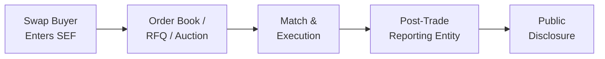

## Introduction and Context

When I was just starting out in the financial world, I remember hearing about swaps and thinking, “Wait, so two parties just pick up the phone and say, ‘Hey, let’s exchange these cash flows?’ How do they even figure out the right price?” For a long time, many swaps were negotiated privately—traders used phone lines or chat messages, negotiated terms bilaterally, and dealt with fairly opaque market quotes. This wasn’t exactly the best environment for ensuring broad market transparency or robust price discovery.

Enter Swap Execution Facilities (SEFs). These regulated platforms emerged primarily in the United States after the Dodd-Frank Act (particularly Title VII) to address the complexities and, let’s be frank, the potential hidden risks of over-the-counter (OTC) derivatives trading. SEFs brought a whole new level of visibility and standardization, and many found it a game-changer—if also a bit of a regulatory headache at first. In this section, we’ll explore SEFs, their features, and how post-trade transparency requirements can affect the overall function and valuation of swaps.

## The Rise of Swap Execution Facilities

SEFs are typically electronic trading platforms that match buyers and sellers of certain types of swaps. Their creation was driven by legislation (Dodd-Frank in the US) and global regulatory efforts aimed at mitigating systemic risk. In essence, regulators wanted to ensure that at least the more standardized portion of the swap market functioned in a manner similar to traditional exchanges—particularly in terms of transparency and fairness. 

So, how do SEFs actually operate? Broadly, you’ll see a few types of trading mechanisms:

• Order Book: This is straightforward—traders submit bids and offers, often anonymously, and the system tries to match them automatically.  
• Request-for-Quote (RFQ): This allows a participant to solicit prices from multiple dealers simultaneously, requiring them to quote competitively.  
• Periodic Auctions: Think of these as scheduled or timed auctions, where participants submit their orders over a set period, and the best matching prices get filled.

Use of an SEF can bolster price discovery because multiple market participants (often dealers or liquidity providers) see and compete on the same platform. In a purely bilateral setup, you might contact just a couple of dealers and pick the best quote from the bunch. With SEFs, you get a broader look at pricing from potentially many more participants, lowering the informational barriers and narrowing bid-ask spreads.

## Why Not All Swaps Trade on SEFs

Not every swap can be executed through an SEF. Some requirements must be met before a derivative is mandated to trade on these platforms—for example, the product has to be sufficiently standardized or “made available to trade” under certain regulatory definitions. Highly customized, bespoke swaps might still stay in the bilateral realm because:

• They do not meet the regulatory criteria for SEF trading.  
• They are too tailored to a particular investor’s needs and not easily standardized.  
• Parties may prefer direct negotiation with specialized terms.

In other words, if you’re hedging a very particular risk, an “off-the-shelf” swap might not cut it—and so you’ll remain outside the SEF environment. This layered approach suggests that SEFs primarily thrive in more liquid, standardized swap markets, particularly interest rate swaps and credit default swaps (CDSs) that have broad trading interest among many participants.

## Impact on Market Pricing and Liquidity

Historically, one could argue that the OTC market functioned well enough, but the global financial crisis that erupted in 2008 shed a bright light on the systemic risks lurking in unregulated or opaque markets. By shifting much of the swap execution to a more transparent platform, the regulators hope to reduce these risks and improve overall price discovery.

• Tighter Bid–Ask Spreads: With more participants viewing the same quotes, competition often increases, leading to narrower spreads.  
• Centralized Liquidity: A regulated platform can serve as a liquidity hub, helping large institutional players, hedge funds, and corporate clients find counterparties more efficiently.  
• Diversification of Dealers: Instead of depending on a single bank or a handful of banks to make a market, participants can see prices from multiple dealers on a single screen.

However, some participants (particularly smaller dealers or specialized broker-dealers) worry that the new structure levels the playing field in ways that might hurt their proprietary edge or relationships. In practice, the magnitude of these effects depends on how widely a market migrates to SEFs and how strictly the rules for mandatory trading are enforced.

## Post-Trade Transparency

Post-trade transparency is another critical piece of the puzzle. Many regulators now require that trade details—such as price, volume, and timestamps—be reported publicly in near real time. In the U.S., for instance, the Dodd-Frank Act mandated that swap trades be reported to Swap Data Repositories (SDRs). Meanwhile, European regulation, such as MiFID II, focuses on real-time publication of trade details for standardized derivatives.

### Key Benefits

• Informed Price Discovery: When the broader market sees at what price and size recent trades went through, it can gauge fair market levels more easily.  
• Risk Mitigation: Transparent reporting helps regulators and market participants track exposures and potential systemic risks.  
• Market Confidence: Public availability of trade data can reinforce trust in the stability of the market.

### Potential Downsides or Concerns

• Front-Running Risk: Releasing large trade sizes could hurt a firm’s ability to execute the remainder of a large order, as others might position themselves in anticipation of price moves.  
• Operational Complexity: Filing accurate, timely trade reports adds compliance overhead.  
• Variation in Reporting Deadlines: Some large trades may get delayed reporting windows, to shield sensitive transaction data from immediate public release.

## A Visual Overview

Below is a simplified flow of how a typical swap might be executed on an SEF, along with the post-trade reporting mechanism:

The buyer interacts with the SEF platform, either through an order book or an RFQ. Once the order is matched, the trade details are sent to the relevant post-trade reporting entity (often a Swap Data Repository in the U.S.). Finally, certain details—such as price and transaction time—are disclosed to the public according to regulatory guidelines.

## Practical Example: Request-for-Quote in Action

Imagine a corporate treasurer for a large multinational who wants to enter a plain vanilla interest rate swap to hedge floating-rate exposures. Using a request-for-quote facility on an SEF:

• The treasurer chooses to request quotes from five different dealers.  
• Each dealer sees the size, maturity, and other contract parameters the treasury wants.  
• Dealers respond with their best fixed rate for the swap.  
• The treasurer can compare quotes from all five in real time and choose the best deal.  

From this example, you can see how an RFQ system fosters robust competition, with all quotes visible in a consolidated interface, rather than scattered across phone calls or emails.

## Compliance and Regulatory Perspectives

A crucial part of operating on SEFs involves meeting certain compliance standards. SEFs must register with the appropriate regulatory body—primarily the Commodity Futures Trading Commission (CFTC) in the U.S. or become a Multilateral Trading Facility (MTF) or Organized Trading Facility (OTF) in Europe under MiFID II/MiFIR. These platforms must maintain transparent rulebooks, monitor trading activity, and facilitate trade reporting.

### Implementation Challenges

• System Infrastructure: SEFs must ensure robust technological infrastructure capable of handling peak trading volumes.  
• Operational Costs: The cost of compliance—surveillance, transaction reporting, technology—can be substantial for smaller platforms or dealers.  
• Data Quality and Consistency: A major regulatory goal is to standardize how data is reported, but global differences in formats or definitions can create complexities.

## Glossary

• Dodd-Frank Title VII: The section of U.S. legislation shaping rules for OTC derivatives, including the requirement for certain swaps to trade on SEFs.  
• RFQ (Request for Quote): A process where a market participant requests price quotes from multiple liquidity providers.  
• Post-Trade Reporting: The public release of details (price, volume) of executed trades, typically to ensure transparency.  
• Electronic Trading: Execution of trades on an automated or semi-automated platform.  
• Price Discovery: The process by which market prices are determined based on bids, offers, and transactions.

## Advantages and Disadvantages of SEFs vs. Bilateral Trades

Below is a quick comparison table that highlights the differences between executing swaps via a regulated SEF versus negotiating them bilaterally:

| Aspect                 | SEF Execution                        | Bilateral Swaps (OTC)               |
|------------------------|--------------------------------------|-------------------------------------|
| Price Transparency     | High (multiple quotes displayed)     | Low or opaque for outside parties   |
| Execution Method       | Electronic order book/RFQ/auctions   | Private negotiation                 |
| Standardization        | Mandated for certain swap types      | Typically more flexible             |
| Reporting Requirements | Strict, near real-time               | Limited or private                  |
| Transaction Costs      | Potentially lower due to competition | Possibly higher; depends on relationships |
| Regulatory Oversight   | High (CFTC, ESMA, etc.)              | Still regulated, but less standardized |

## Valuation Ramifications

Because SEFs add transparency and more consistent pricing, the “fair value” for many standardized swaps has become easier to observe. That said, derivatives on these platforms can still experience:

• Liquidity Premiums: Especially if a swap type has relatively fewer participants or unique structural features, we might still see liquidity-driven deviations from a “theoretical” price.  
• Reduced Pricing Dispersion: The difference in quotes from various dealers tends to shrink in a transparent environment, allowing participants to better converge on a single correct price.  

In practice, the data gleaned from post-trade transparency reports also improves mark-to-market accuracy for firms that hold swap positions, which is a key part of risk management and financial disclosure.

## Potential Pitfalls and Challenges

• Over-Reliance on Visible Prices: Just because something is posted on an SEF doesn’t mean the market is always trading at that exact level, especially if liquidity is thin.  
• Partial Transparency: Certain large block trades may have delayed or masked reporting to protect participants from market impact.  
• Operational Missteps: Failure to comply with ever-evolving reporting requirements can lead to significant fines or reputational damage.  

## Final Thoughts for the Exam

If you’re studying for the CFA exam, you might see scenario-based questions requiring you to determine the effect of SEF execution on swap spreads, or to describe how post-trade transparency influences cost of capital for market participants. You could see questions on the mechanics of an RFQ system or an “auction-based matching” process—and how each approach might affect the final executed price. 

Keep in mind that “standardized swaps” are more likely to become subject to mandatory SEF execution, and exam questions might test your understanding of why certain custom swaps remain outside that domain. For compliance-related prompts, be prepared to contrast the regulatory environment in the U.S. with that in the EU under MiFID II/MiFIR, focusing on the shared objective of better risk management and transparency.

Below, you’ll find a set of questions to test your mastery of these concepts. I’d suggest you try them out—maybe even time yourself the way you would for short, exam-style set items. Practice is everything!

## References and Further Reading

• CFTC Regulations on SEFs:  
  https://www.cftc.gov  

• ESMA MiFID II/MiFIR Rules on Transparency in EU Markets:  
  https://www.esma.europa.eu  

• Duffie, D., et al. (various works on OTC market structure and transparency).  

• CFA Institute, Curriculum—Level I & II Derivatives Readings (Foundational knowledge of derivatives and structured products).  

---

## Test Your Knowledge: Swap Execution Facilities and Post-Trade Transparency



### Which statement best describes a Swap Execution Facility (SEF)?

- [x] A regulated platform that standardizes and facilitates the trading of OTC derivatives, primarily swaps.  
- [ ] A specialized department in commercial banks for physical commodity trades.  
- [ ] An unregulated chat service used by dealers to negotiate swap terms.  
- [ ] An exclusive forum only for large hedge funds to trade credit default swaps.  

> **Explanation:** SEFs are regulated trading platforms established under mandates like Dodd-Frank in the U.S. They aim to bring transparency and standardization to OTC swap trading.

### What is the main advantage of using the RFQ (Request-for-Quote) mechanism on an SEF?

- [x] It offers quotes from multiple dealers, improving price competition.  
- [ ] It provides fixed prices that cannot change intraday.  
- [ ] It excludes smaller market participants to reduce volatility.  
- [ ] It automates all trades without human intervention.  

> **Explanation:** RFQs allow a participant to request prices from several dealers simultaneously. This fosters more competitive bids, leading to potentially better execution prices.

### A corporate treasury enters a swap via an SEF. Shortly after execution, certain trade details are publicly reported. This reporting process is known as:

- [ ] Pre-trade transparency.  
- [ ] Bilateral negotiation.  
- [x] Post-trade transparency.  
- [ ] Exchange clearing.  

> **Explanation:** Many regulators require that salient details (price, volume) of executed swaps be published as post-trade transparency, helping market participants gauge fair market levels.

### Which of the following is a key driver behind establishing Swap Execution Facilities?

- [ ] Reducing the length of swap maturities.  
- [x] Increasing transparency and reducing systemic risk in OTC derivatives markets.  
- [ ] Eliminating all custom swap features.  
- [ ] Allowing only government agencies to trade swaps.  

> **Explanation:** SEFs were introduced to improve transparency and reduce systemic risk, especially after lessons learned from the global financial crisis.

### Under what circumstance might a swap remain bilateral rather than trade on an SEF?

- [x] When the swap is highly customized and does not meet the “made available to trade” requirements.  
- [ ] When the notional is under $1 million.  
- [ ] When two parties prefer public price disclosure.  
- [ ] When the swap references any interest rate index.  

> **Explanation:** Customized or bespoke swaps generally do not meet the standardization requirements for mandatory SEF execution, thus they often remain bilateral.

### Which of the following represents the biggest potential benefit of post-trade transparency?

- [x] Improved market confidence and better-informed price discovery.  
- [ ] Complete elimination of all bid–ask spreads.  
- [ ] Complete anonymity of trading parties.  
- [ ] Removal of regulatory compliance costs.  

> **Explanation:** Post-trade transparency enhances the integrity and efficiency of markets by providing critical information about recent trades, which fosters more accurate pricing.

### Which of these is a concern some participants have about increased post-trade transparency?

- [x] Large block trades may face front-running if detailed trade sizes are revealed.  
- [ ] All trades instantly become zero cost.  
- [ ] There will be no price improvement for standardized swaps.  
- [ ] Bid–ask spreads always widen significantly.  

> **Explanation:** Large trades reported in near-real time could be vulnerable to predatory trading tactics. Regulators sometimes allow short reporting delays for block trades to address this.

### In which key way do SEFs differ from traditional exchange-traded futures?

- [x] SEFs may offer multiple trading protocols such as RFQ, while futures exchanges typically rely on a central limit order book.  
- [ ] SEFs only allow trading of physical commodities.  
- [ ] Futures exchanges have no clearinghouse for trades.  
- [ ] SEFs only exist in Europe, while futures are only in the U.S.  

> **Explanation:** SEFs can incorporate different trading methods (like RFQ or auctions), whereas futures exchanges tend to use a central order book for price discovery and matching.

### Which platform is primarily responsible for collecting and maintaining swap trade data in the U.S.?

- [x] Swap Data Repository (SDR).  
- [ ] Securities and Exchange Commission (SEC).  
- [ ] Federal Deposit Insurance Corporation (FDIC).  
- [ ] Basel Committee on Banking Supervision (BCBS).  

> **Explanation:** In the U.S., the Dodd-Frank Act introduced the concept of SDRs (Swap Data Repositories), which collect data on executed swaps for regulatory oversight and transparency.

### True or False: Swap Execution Facilities were introduced exclusively to remove all bilateral trading relationships in the derivatives market.

- [x] False  
- [ ] True  

> **Explanation:** SEFs were never intended to fully eliminate bilateral relationships. Instead, they were designed to bring greater transparency and structure to certain standardized swaps while recognizing that customized swaps may still be negotiated bilaterally.


