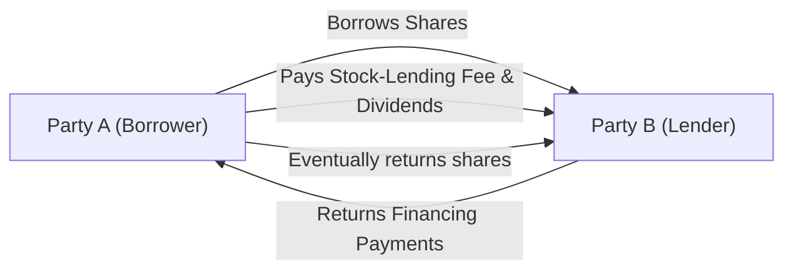

## Introduction and Context

Picture this: You’re chatting with a friend who’s deeply into short-selling strategies. They casually mention they used an “equity repo swap” last week, then started talking about “stock lending fees.” You might have nodded politely, but inside you were wondering: “Hang on. Is this just an equity swap with extra bells and whistles?” Well, it turns out these instruments—equity repo swaps and stock-lending swaps—are indeed specialized variations of standard swaps but with very particular financing and collateral mechanics. 

They allow investors to optimize their financing costs and potentially enhance returns, especially when short sales or specific collateral transformations are required. And they come with a web of corporate action considerations (like dividends or splits) that can change the economic outcome. 

In this article, we’ll break down the essential attributes of these strategies, explore how they’re structured and priced, and highlight their uses in a real-world, multi-asset portfolio context. We’ll also reveal some best practices and common pitfalls—and, because no conversation about swaps would be complete without it, we’ll include details on risk management and exam tips if you see these topics in advanced portfolio and derivative exams.

## Understanding the Framework of Equity Financing

Before diving into the inner workings of equity repo swaps and stock-lending swaps, let’s revisit the basics of “financing.” In the world of finance, especially for institutional investors, equity financing trades can be just as important as the underlying exposures themselves. Market participants often need to borrow shares to go short, or they might need a way to transform collateral from one form into another (e.g., turning equities into cash or vice versa). Traditional methods include margin lending or repurchase agreements (repos) in the fixed-income domain. But these same concepts can be adapted to equities.

• A repurchase agreement (repo) in fixed income is effectively a sale and subsequent repurchase of a security at a predetermined price.  
• In the equity space, a similar structure can be used, typically involving selling equities and repurchasing them later.  
• When you structure an equity repo as a swap, you effectively replicate the economics of that buy-sell-back arrangement, but within a derivative contract.  

Those who engage in shorting strategies or want to optimize their capital usage will often look to these specialized swaps as a cost-effective and flexible approach.

## Equity Repo Swaps: The Basics

An equity repo swap is modeled on the logic of a classic fixed-income repo transaction, but it uses equities instead of bonds. Here’s the simplified idea:

• Party A “sells” an equity security to Party B and agrees to “repurchase” it on a future date at a higher price.  
• For the duration of the agreement, Party B holds title to the shares, although the economic exposures can be modified via swap-like payment streams so that Party A retains or transfers the economic risk.  
• The price difference between the initial “sale” and the eventual “repurchase” reflects the implicit financing cost for Party A.  

When done as a “swap” rather than a direct repo, you effectively transform that sale-repurchase arrangement into a stream of payments. One leg is typically the financing rate (plus a spread), and the other leg is the equity return (price appreciation or depreciation and dividends). By design, the equity repo swap addresses a few specific objectives:

• Short-Selling Facilitation: Just as with a borrowed security, you get an arrangement that helps you execute short positions more smoothly if needed.  
• Collateral or Cash Flow Enhancement: Equity securities can be used as collateral, allowing the original holder to raise cash.  
• Leverage or Enhanced Return Potential: The difference between the cost of financing and the return on the equity can be locked in for certain trades.

### Key Mechanics

Let’s illustrate with a minimal example:  
• Suppose Party A holds shares of XYZ Corp. stock worth $1 million. They enter an equity repo swap with Party B.  
• In a standard repo, Party A would sell those shares to Party B at $1 million, with a contractual promise to buy them back for $1.01 million (or more) at a later date—representing some interest cost.  
• In a swap structure, instead of physically delivering shares and then repurchasing, the parties exchange the economics. Party A might pay a financing rate (for example, LIBOR or the new risk-free rate plus a spread) in exchange for receiving the total return on the XYZ shares (any change in price plus dividends).  

This effectively replicates a “financing trade” using equities, with the advantage that Party A does not necessarily have to handle the complexities of physically transferring shares—although, in some cases, partial transfers of beneficial ownership might occur, depending on the contract specifics.

### Handling Corporate Actions

Corporate actions such as dividends, splits, or even special shareholder votes complicate equity financing transactions. Generally, the swap contract specifies if dividends paid during the swap’s life are credited to the equity receiver or netted out. The same holds for events like stock splits (affecting notional shares), spin-offs (affecting the underlying company structure), or mergers (potentially changing the deliverable). 

In equity repo swaps, the party that effectively has the economic exposure to the underlying share price typically “owns” the corporate actions. But in legal terms, the ownership may temporarily rest with the other party. This means you need robust contract language to clarify how to handle the proceeds or changes from these corporate events.

## Stock-Lending Swaps: The Essentials

A stock-lending swap is closely related to the concept of a “securities lending” transaction. In a straightforward securities lending deal, one party lends a security (often to a short seller) for a fee and eventually gets the same security back at a later date. The borrower pays a stock-lending fee and also typically compensates the lender for any distributed dividends or other entitlements that occur during the lending period.

When you elevate this to a “swap,” you’re essentially locking in the economic exposures and payment streams that replicate the stock loan arrangement. Here’s a conceptual breakdown:

• Party A borrows stock from Party B.  
• Through a swap contract, Party A might commit to paying B any dividends (or “manufactured dividends”) that arise, plus a stock lending fee.  
• In return, Party A might receive an optimized financing rate or some other form of payment stream.  

This structure can be used by short sellers who want predictable financing costs, or by sophisticated investors who want to optimize income from lending out their securities. 

### Distinction from a Standard Equity Swap

Standard equity swaps typically involve exchanging the total return on an equity index or single stock for a floating interest payment (or vice versa). Stock-lending swaps more directly incorporate the explicit securities lending fee dimension and place greater emphasis on the legal or beneficial ownership transfer of the actual shares. The focus is on bridging the stock borrowing mechanism (with associated fees, collateral requirements, and dividend compensation) into a swap-based pay-and-receive schedule. 

### Interface with Short Sales

Short sellers love stock-lending or equity repo structures because:

• They get immediate access to the stock they need to short in the market.  
• The cost of borrowing the stock (the stock lending fee) is locked into the swap contract.  
• Dividends or other corporate actions that would normally complicate short sale calculations are spelled out in the swap.  

On the flip side, the beneficial owner of the shares can earn additional income from lending them out while retaining some synthetic exposure if the swap structure so provides.

## Real-World Example and Flow Diagram

Let’s illustrate a combined scenario:

• Party A is a hedge fund that wants to short 100,000 shares of ABC Inc.  
• Party B is a large pension fund that holds these shares and is willing to lend them for a certain fee.  

In a typical securities lending arrangement, Party A would borrow the shares, pay a lending fee to Party B, and would have to return the shares after the shorting strategy finishes. Dividends are effectively “manufactured” back to Party B if they’re paid while Party A holds the shares short.  

Now, if they set this up as a swap, you’d have something like:

• Party A pays Party B:  
  – A stock-lending fee (fixed or floating rate).  
  – Any dividends (manufactured dividends).  
• Party B pays Party A:  
  – A reference interest rate or financing arrangement.  
  – Possibly some portion of the appreciation or depreciation on the shares, depending on how the contract is designed.  

Below is a simplified Mermaid diagram showing the direction of economics in a stock-lending swap.

Though the diagram is simplistic, in practice the agreement can vary in complexity depending on whether Party A is receiving or paying the equity returns, and how the financing flows are structured.

## Collateral, Margin, and Contract Nuances

Both equity repo swaps and stock-lending swaps hinge on robust collateral management. Because these instruments typically create counterparty risk, most contracts require the posting of margin or collateral to ensure performance, especially in OTC (over-the-counter) deals. Central clearing solutions, or tri-party repo and other specialized clearing services, may come into play for large institutional trades.

Also, be mindful of re-hypothecation—where the party holding collateral can reuse it. This can create additional layers of complexity but also potential for more efficient capital usage.

### Corporate Actions: Again, the Devil’s in the Details

In equity financing transactions, corporate actions make life interesting. If you are a short seller or a borrower, you must return any dividends or corporate benefits that would have gone to the beneficial owner. Conversely, if certain corporate actions reduce share count or result in special distributions (like spinoffs), the contract must specify how these are handled in the swap. Failure to precisely define these details can lead to disputes or value leakage.

## Pricing and Valuation Considerations

### Interest Rate and Financing Charge

At the core, these structures revolve around an interest or financing charge. With equity repo swaps, that charge is the difference between the sale price and repurchase price in a notional sense. For stock-lending swaps, it is the lending fee. Both of these are influenced by:

• Market rates for short-term financing (e.g., risk-free rates, overnight rates).  
• The availability or scarcity of the underlying equity in the lending market (a heavily shorted stock might command a high borrow fee).  
• Regulatory constraints that might limit or incentivize certain transactions (for instance, restrictions on short selling or capital requirements for holding certain assets).  

### Mark-to-Market Adjustments

Because equity prices can be quite volatile, the mark-to-market process can cause repeated margin calls or collateral adjustments. Similar to an interest rate swap, you might revalue the contract daily (or periodically) based on changes in the underlying. If the contract allows the transfer of actual shares, the mechanics could be more straightforward—once the shares are delivered, analyzing mark-to-market is simply a matter of adjusting the financing leg. But in synthetic forms, you typically do it via net present value (NPV) calculations of future equity legs and the financing leg.

### Practical Example

Let’s do a quick numeric illustration:  

• Party A enters a 3-month equity repo swap on 10,000 shares of “TechCorp,” priced at $50 per share. Notional = $500,000.  
• The repo rate (annualized) is 3%. For 3 months, that’s 3% × (3/12) = 0.75%.  
• Over 3 months, the cost is 0.75% of $500,000 = $3,750.  

If TechCorp’s share price rises to $55 by the end of the 3-month term, the total return on those 10,000 shares is $50,000 (ignoring dividends). Party A, if receiving the equity leg, would get that $50,000. In exchange, Party A pays the financing cost of $3,750. The net payoff to Party A is $46,250. On top of that, if there is a $0.50 dividend per share inside that period, that’s an additional $5,000 that might go to whichever side “owns” the share’s economic rights.

## Common Pitfalls and Risk Management

1. Lack of Clarity on Corporate Actions  
   Perhaps the biggest pitfall is failing to define how dividends, merges, or spin-offs are handled. This can cause unexpected cash flows or disputes, especially if the stock undergoes significant events.

2. Collateral and Margin Gaps  
   Because equity prices can move rapidly, an inadequate margining schedule can expose a party to credit risk if the counterparty defaults. This is especially critical in high-volatility markets.

3. Regulatory Hurdles  
   Certain jurisdictions have rules that limit or require special disclosures for short selling or securities lending. In some markets, beneficial ownership rules might also hamper the ability to structure these swaps seamlessly.

4. Operational Complexity  
   Tracking all the mechanics—like manufactured dividends, stock-lending fees, or multi-day settlement windows—can be complicated. A robust back-office and legal setup is crucial.

5. Counterparty Concentration  
   If you rely too heavily on one or two counterparties, you risk a first- or second-order default scenario that can create severe liquidity crunches.

## Putting It into a Portfolio Context

For portfolio managers, equity repo swaps and stock-lending swaps can offer:

• Enhanced Yield: You can generate incremental income by lending out your portfolio’s equities if you don’t mind forgoing short-term beneficial ownership.  
• Short Exposure: You can replicate a short sale more flexibly, potentially at lower overall cost.  
• Hedging: If you need to hedge an index or single-stock position, the equity repo swap might provide a more capital-efficient tool than physically buying or selling a position.  
• Collateral Transformation: You can transform an equity position into something akin to a cash position (or vice versa), which might be beneficial for meeting margin requirements on other trades.

## Exam Tips and Best Practices

• Clearly define equity repo swaps versus standard equity swaps. Expect exam questions that probe the differences in how corporate actions, dividends, and financing fees are handled.  
• Watch out for details on stock lending fees. They might ask you to compute total returns if the lending fee changes or if the underlying is “special” (scarce in the market).  
• Practice reading term sheets that define corporate action provisions. These are likely to appear in scenario-based, constructed-response questions, where you must identify how a dividend or stock split will affect the payoff.  
• Brush up on your mark-to-market calculations. You can see item sets that require you to value the position after a certain time, or compute the net payoff to each counterparty.  
• Time management: In multi-part exam questions, address the straightforward calculations first, then move to explaining deeper conceptual points about risk or strategy.  

## Further References

• Chaplin, G., “Equity and Index Swaps,” in Professional Investor and Trader Resources.  
• Securities Lending and Repo Committee, Bank of England:  
  https://www.bankofengland.co.uk/markets/securities-lending-and-repo  

You’ll find these references provide deeper dives into the legal and operational intricacies as well as the broader market context. If you’re working in an environment heavily focused on securities finance, these readings are an essential complement to your standard derivatives textbooks.

## Sample Exam Questions: Equity Repo and Stock-Lending Swaps



### Which of the following best describes the key difference between an equity repo swap and a standard equity swap?

- [ ] In an equity repo swap, no collateral is required, whereas a standard equity swap always requires collateral.
- [x] An equity repo swap explicitly incorporates the sale and repurchase financing mechanics of equities, whereas a standard equity swap typically exchanges total return for a floating rate.
- [ ] An equity repo swap does not involve any form of interest payment.
- [ ] A standard equity swap is exclusively used to facilitate short sales while an equity repo swap is not.

> **Explanation:** The critical distinction is that an equity repo swap replicates the economics of a repurchase agreement (sale and later repurchase at a higher price), including explicit financing costs, whereas a basic equity swap focuses on exchanging total return for some floating or fixed rate.  

### In a stock-lending swap, which party is generally responsible for making dividend payments to the ultimate owner of the shares?

- [ ] The clearinghouse.
- [x] The borrower or the party receiving the shares pays “manufactured” dividends to the lender.
- [ ] The dealer bank, acting as counterparty.
- [ ] No one, because dividends do not get paid in stock-lending agreements.

> **Explanation:** Typically, the party borrowing the shares (or receiving them on swap) compensates the lender for any dividends that the lender would have received if it had retained physical ownership.  

### If a stock-lending swap contract specifies that Party A borrows 5,000 shares of XYZ Inc. at a stock-lending fee of 2% annually, and the notional value of those shares is $400,000, approximately how much does Party A pay in annual stock-lending fees?

- [ ] $2,000  
- [ ] $4,000  
- [x] $8,000  
- [ ] $80,000  

> **Explanation:** 2% of $400,000 = $8,000 annual fee.  

### Which of the following best characterizes the main economic benefit for the lender in a stock-lending swap?

- [x] Earning fees while retaining synthetic or beneficial ownership of the stock.
- [ ] Eliminating all market exposure without costs.
- [ ] Avoiding all regulatory reporting obligations.
- [ ] Converting fixed-income holdings into equity exposure.

> **Explanation:** Lenders earn extra income (lending fee) while still having a claim on the stock's economic benefits or an offsetting position, depending on how the swap contract is structured.  

### During an equity repo swap, the repo rate is typically:

- [x] Agreed upon at the initiation of the trade, reflecting short-term financing rates plus a spread.
- [ ] Equal to the dividend yield of the equity in question.
- [ ] Subject to daily reset without any reference to market interest rates.
- [ ] Always higher than high-yield bond yields.

> **Explanation:** The repo rate is negotiated at trade initiation, and it is influenced by market financing conditions (e.g., overnight or short-term interest rates), plus a spread reflecting the risk and collateral value of the equities.  

### Consider a stock-lending swap involving a scarce, heavily shorted stock. Which effect is most likely on the stock-lending fee?

- [ ] The fee will be zero.
- [ ] The fee will be unaffected by scarcity.
- [x] The fee tends to be higher owing to the stock’s “special” status.
- [ ] The fee is replaced by a direct equity return payment.

> **Explanation:** When a stock is hard to borrow (scarce in the lending market), its lending fee generally increases.  

### If a large corporate action (e.g., a merger) occurs during the life of a stock-lending swap, how is it typically handled?

- [ ] The lender has no right to any proceeds from the corporate action.
- [ ] The swap terminates immediately with no further obligations.
- [ ] Only the borrower benefits from the corporate action.
- [x] The contract stipulates the treatment of the merger proceeds, often requiring compensation or adjustments.

> **Explanation:** Well-drafted contracts outline how corporate actions should be split or compensated, ensuring the correct party receives the intended economic benefit.  

### Why might a hedge fund prefer an equity repo swap over a traditional margin loan?

- [ ] Margin loans are illegal in many jurisdictions.
- [x] The repo swap can offer more flexible terms and integrate corporate governance considerations, potentially with more favorable financing costs.
- [ ] Repo swaps allow the fund to bypass all regulatory requirements.
- [ ] An equity repo swap never requires collateral.

> **Explanation:** An equity repo swap can be more flexible and may come with more competitive financing rates. It can also incorporate corporate action details and might offer anonymity or other advantages over standard margin lending.  

### Which of the following is a key risk management activity when engaging in equity repo swaps?

- [x] Frequent margin calls or collateral adjustments based on price volatility.
- [ ] Eliminating all corporate action adjustments from the contract.
- [ ] Transferring all shares without a written agreement.
- [ ] Relying on the counterparty’s credit rating instead of requiring collateral.

> **Explanation:** Because equity markets can be quite volatile, both parties will want regular margin checks to ensure the contract remains adequately collateralized.  

### True or False: In a stock-lending swap, the borrower always retains the right to vote in corporate elections related to the stock.

- [ ] True
- [x] False

> **Explanation:** In most stock-lending or swap arrangements, the voting rights typically reside with legal ownership, which is often transferred to the party that temporarily holds the shares. The ultimate distribution of voting rights depends on the specific contract language, but generally the borrower does not automatically retain them.  


