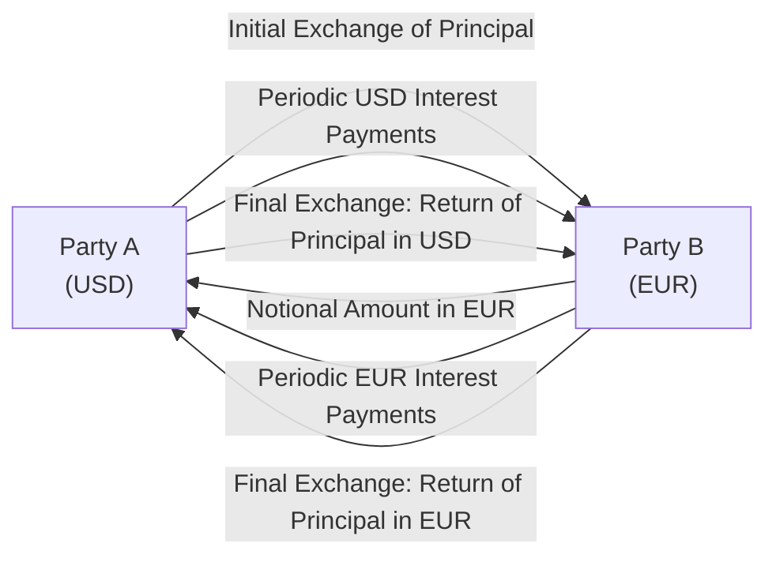
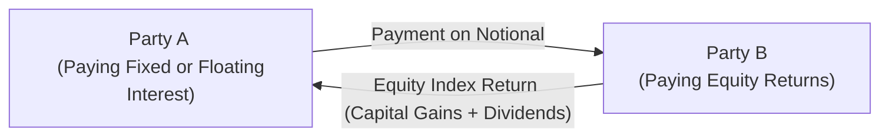

## Overview

Let’s talk about currency and equity swaps. If you’ve ever found yourself yawning over the complexities of interest rate swaps and thought, “This is fine, but can we add foreign exchange risk or equity market returns to the mix?”—then currency and equity swaps are exactly what you’re after. They might sound intimidating, but trust me, once you get the hang of their structure, these swaps can be incredibly versatile for hedging or gaining exposure to multiple asset classes.

Currency swaps and equity swaps both build on the principle that a swap is essentially an exchange of cash flows over time. However, unlike a plain vanilla interest rate swap, these involve more than just a fixed or floating interest rate. Currency swaps feature principal and interest in different currencies, while equity swaps substitute one leg’s payments (often an interest rate) with the returns of a stock, a basket of stocks, or an equity index. By the end of this section, you’ll understand how these instruments are structured, how they’re priced, and why they can be a powerful addition to a risk management toolbox—especially for global or multi-asset portfolios.

## Key Conceptual Foundations

Before diving into the specifics of currency and equity swaps, it’s helpful to recall a few general rules about swap valuation:

• A swap can be viewed as a portfolio of forward contracts or, equivalently, a difference between the present values (PVs) of two series of cash flows.  
• At initiation, many swaps have a theoretical value close to zero (absent transaction costs and credit risk premiums).  
• Over time, deviations in rates, exchange rates, or underlying asset performance cause the swap’s market (or fair) value to fluctuate.  
• Under IFRS or US GAAP, swaps are recognized on the balance sheet at fair value, with changes in that value running through profit-and-loss (P&L) or Other Comprehensive Income (OCI), depending on whether hedge accounting criteria are met.

These concepts underpin the mathematics of currency and equity swaps, even if each product’s unique features add additional layers (like foreign exchange risk, equity volatility, or dividend yields).

## The Anatomy of a Currency Swap

### Mechanics of Currency Swaps

A currency swap involves exchanging principal and interest denominated in one currency (say, USD) for principal and interest denominated in another currency (say, EUR). One easy (if slightly clumsy) way to think about it is: imagine you and a friend both need loans—you need USD, your friend needs EUR. Instead of each going to your respective banks and dealing with foreign exchange, you decide to “swap” your principal amounts. You give them USD at the start; they give you EUR at the start. Then you each pay interest in your home currency on that notional. At maturity, you exchange the principal again, returning the currency each started with.

Below is a simplified flowchart showing the principal and interest exchange structure between two counterparties, often named Party A and Party B:

In practice, there are many variations. Some currency swaps might not exchange principal at the start or might not exchange final principal at maturity. However, the “classic” structure generally entails an actual exchange of principal in different currencies at both the start and finish.

### Benefits and Applications

• **Funding optimization**: A corporation that can borrow more cheaply in one currency can do so and then swap into the currency they actually need.  
• **Hedging**: A company with revenue streams in multiple currencies might use a currency swap to fix or limit its FX exposure.  
• **Asset liability management**: If a company has liabilities in EUR but generates cash flows in USD, a currency swap can realign the currency mismatch.

### Valuation of a Currency Swap

When we speak of currency swap valuation, we’re really valuing two legs: one leg in currency A, the other leg in currency B. Each leg’s cash flows are projected based on the relevant yield curve or interest rate forecast in its home currency. Then, each leg is discounted in that same currency at an appropriate discount rate. Finally, we convert one or both legs into a common currency to figure out the net present value (NPV) of the entire swap.

In more formal terms, suppose you have:

- Leg 1: Cash flows CFₐ,t in currency A, discounted by rate rₐ,t in currency A  
- Leg 2: Cash flows CF_b,t in currency B, discounted by rate r_b,t in currency B  
- Eₜ = expected exchange rate at future time t (if you want to convert everything to, say, currency A)

The value of the swap to the party receiving currency A and paying currency B can be written in KaTeX form as:


V_\text{swap} = \sum_{t=1}^{T} \frac{CF_{A,t}}{(1 + r_{A,t})^t} \;-\; \sum_{t=1}^{T} \frac{\bigl(CF_{B,t} \times E_{t \rightarrow A}\bigr)}{(1 + r_{A,t})^t}.


In practice, we often discount each leg in its own currency and then convert the net difference to whichever currency we want to measure the swap’s value in. So if you’re quoting everything in USD, you would:

1. Project and discount all future EUR cash flows using EUR discount rates.  
2. Convert that discounted amount into USD at the spot rate (or forward exchange rates, depending on convention).  
3. Subtract from the discounted USD leg’s value to get the net.  

As with any derivative, if the net present value is positive, the swap is an asset to you; if negative, it’s a liability.

#### Example of a Simplified Currency Swap Valuation

Let’s pretend you enter a 3-year currency swap, receiving fixed USD interest at 5% on a notional USD 1 million, and paying fixed EUR interest at 3% on a notional EUR 800,000. Principal amounts are exchanged at initiation (USD 1 million for EUR 800,000) and re-exchanged at maturity.

1. **Forecast or observe market discount rates**: Suppose the yield curve for USD discounting is roughly 5% for all relevant maturities (for simplicity) and for EUR it’s about 3%.  
2. **Discount each stream**:  
   - USD leg: 3 annual interest payments of 50,000 USD, plus the redemption of 1,000,000 USD at maturity.  
   - EUR leg: 3 annual interest payments of 24,000 EUR (3% of 800,000), plus 800,000 EUR redemption at maturity.  
3. **Convert**: Determine the present value of the EUR stream in EUR, then convert to USD. If the spot is 1.25 USD/EUR (just an example), you’d turn your EUR PV into USD.  
4. **Compare**: The difference is the net value of the swap from your perspective.

Certainly, you would likely refine your approach with multiple discount factors if the yield curve isn’t flat, or consider forward exchange rates if the swap extends over multiple periods. But the principle stays the same: each side is valued in its home currency and then brought to a single currency measure for a net figure.

### Credit Risk, Collateral, and Mark-to-Market

Because a currency swap involves principal exchange, the credit (or counterparty) risk can be more complex than a plain vanilla interest rate swap. Collateral posting is becoming the norm, especially when dealing in Over-the-Counter (OTC) markets, to mitigate the risk that one counterparty might default. Periodic mark-to-market adjustments ensure that if the swap’s value changes significantly, margin or collateral is posted to keep credit exposure within acceptable ranges.

## The Anatomy of an Equity Swap

### Mechanics of Equity Swaps

An equity swap is where one leg is tied to the performance of either a single stock, a basket of stocks, or an equity index, and the other leg is typically a fixed or floating rate payment. For instance, consider a swap where you pay LIBOR + 2% on a notional of USD 1 million and, in return, you receive the total return on an equity index (including dividends).

No principal is usually exchanged in an equity swap (unlike most currency swaps), but the notional value is used simply for calculating the amounts paid or received. The payments can be settled periodically (quarterly, annually, or any custom schedule). If you’re receiving the equity index return, you’ll typically get the capital gains (or losses) plus any accrued dividends. Meanwhile, you’ll pay a predetermined interest rate on the notional.

Imagine a simple flow diagram for an equity swap:

Sometimes the second leg could be the return on another equity index. For example, you might want to swap the S&P 500 returns for the MSCI Europe returns. That’s basically an equity swap with two equity legs.

### Valuation Approach for Equity Swaps

At initiation, an equity swap is usually structured to have zero initial value. Over time, the value changes based on how the underlying equity or index actually performs relative to the expected performance. Here’s the typical approach to valuation:

1. **Project the equity leg**: This is tricky because it involves forecasting uncertain returns. In practice, dealers mark this leg to market using actual spot or index levels. The theoretical approach is to discount the expected future equity payoff or use a risk-neutral valuation.  
2. **Project the interest leg**: This is straightforward—discount future interest payments at the appropriate discount rate.  
3. **Net present value**: The difference between the present values of these two legs is the swap’s fair value.

Sometimes a shorter reset frequency is employed (i.e., monthly or quarterly). In these cases, each settlement effectively “resets” the notional or the underlying price, making the next period’s equity performance more or less of a fresh start.

#### Example of a Simplified Equity Swap

Suppose you enter into a 1-year equity swap on a notional of USD 1 million, receiving the total return on the S&P 500 index quarterly, and paying 3-month LIBOR + 1%. If, at the first quarterly reset date, the index has risen by 2% (including dividends), you receive 2% of the notional = USD 20,000. At the same time, 3-month LIBOR might be 4%; so you pay 5% annualized (LIBOR + 1%) but only for that quarter fraction. Over the course of a year, four such resets occur, each time netting gains/losses from the equity leg against your floating payment.

At any point in between settlement dates, you can revalue the swap by computing the present value of expected future equity returns minus the present value of your outstanding floating payments.

### When Are Equity Swaps Used?

• **Gaining equity exposure without direct investment**: An asset manager might want exposure to an overseas index but for regulatory or tax reasons would prefer a swap structure rather than physically buying foreign stocks.  
• **Hedging**: An institution holding a large stake in a particular equity might enter an equity swap to offset potential downside.  
• **Changing portfolio beta**: By swapping the returns of one equity index for another, a fund can efficiently reallocate its equity exposure without immediate portfolio liquidation.

## Practical Considerations and Risk Management

### Credit Risk and Basis Risk

Currency and equity swaps introduce more complex risks than plain vanilla interest rate swaps:

• **Exchange Rate (FX) Risk**: For a currency swap, the entire transaction’s value can swing significantly if exchange rates move. You might be receiving interest at a favorable rate, but if the currency you receive depreciates, your net position could become unfavorable.  
• **Equity Market Risk**: The side that receives equity returns faces the volatility of that underlying market. In other words, if you thought you were doing a safe hedge and the equity index drops 20%, your position might suffer significantly (depending on the swap’s structure).  
• **Collateral Posting**: Most major financial institutions require collateral posting under standardized credit support annexes (CSAs). You might be asked to post cash or liquid securities if the mark-to-market of your swap moves against you.  
• **Basis Risk**: If you’re using an equity swap to hedge a portfolio that isn’t perfectly aligned with the index in the swap, differences in performance can cause residual risk—this is the dreaded basis risk. Similarly, for currency swaps, if your underlying exposure isn’t to the exact same tenor or currency pairing, you can face mismatches in hedging.

### Regulatory and Accounting Aspects

Under IFRS or US GAAP, these swaps are recognized at fair value. If designated as a hedge (for instance, a currency swap hedging foreign currency–denominated debt), changes in the swap’s fair value might be offset in OCI rather than in P&L. However, hedge accounting rules can be strict and sometimes complicated—any small mismatch between the underlying hedged item and the hedge instrument can degrade the effectiveness.

Banks and large institutions typically trade these swaps in the OTC market, meaning they’re subject to bilateral credit risk rules, margin requirements (for uncleared swaps), and central clearing mandates in some jurisdictions. For currency and equity swaps that fall under clearinghouse guidelines, daily margining might be required, similar to futures.

### Operational and Settlement Details

• **Settlement Frequency**: Currency swaps often pay interest annually or semiannually; equity swaps can settle monthly or quarterly. The more frequent the settlements, the smaller the accumulated exposure at any point, but the greater the administrative overhead.  
• **Principal or Notional Exchanges**: Standard currency swaps often exchange principal amounts at both the start and end. Equity swaps typically do not, focusing mainly on the performance-based leg and the interest leg.  
• **Documentation**: The International Swaps and Derivatives Association (ISDA) Master Agreement typically governs the legal and credit aspects. Parties negotiate collateral terms in the ISDA Credit Support Annex (CSA).

### Best Practices, Common Pitfalls, and Strategies

From personal experience, I’ve seen currency swaps used extensively by multinational corporations looking to lock down both interest rate exposure and currency exposure in a single product. It’s superbly convenient, but the devil is in the details—especially if you have a mismatch in the timing or denominations of your real underlying cash flows. 

Similarly, equity swaps offer a neat trick: synthetic exposure to equity markets without having to physically own the shares. But folks often underestimate the cost of the floating rate payments or the complexity of dividend forecasting. Dividends, tax treatments, and cross-border withholding taxes can substantially affect the net returns. 

On the exam (or in the real world), keep the following in mind:  
• Always confirm that your notional amounts match the economic exposure you want to hedge or gain.  
• Monitor the exchange rate or equity price volatility. If the underlying moves drastically, your swap value can shift significantly.  
• Check credit exposures daily. If your counterparty defaults, you might lose a lot more than you bargained for, especially if the principal is exchanged in a currency swap.  
• Evaluate margin or collateral requirements. If you’re not prepared for margin calls, you can face liquidity squeezes.

## Conclusion and Exam Tips

Currency swaps and equity swaps offer powerful tools for managing cross-border financing costs, currency risk, and equity exposures. At their core, both instruments hinge on exchanging future streams of payments, but the complexities of principal exchanges (in the case of currency swaps) and equity index performance (in the case of equity swaps) require careful modeling and risk management. 

For exam success, remember these critical points:

• In currency swaps, discount each currency leg by its own interest rate, then convert to a single currency to find the net present value.  
• In equity swaps, project the total return leg (capital gains plus dividends) and the interest leg separately, and discount each at an appropriate rate.  
• Understand the role of collateral and mark-to-market in limiting credit risk.  
• Be prepared to explain how these swaps can function as hedging tools (especially under IFRS or US GAAP hedge accounting rules).  
• Keep an eye on “basis risk” if the underlying exposure isn’t a perfect match.  

Stay engaged with the big idea: a swap is only as good as your ability to measure and manage the underlying risk. With currency and equity swaps, you gain efficiency at the cost of more complicated risk exposures. Use them wisely, and you’ve got a robust addition to your derivatives toolkit.

## References

• Hull, John C. “Options, Futures, and Other Derivatives.” Chapters covering currency and equity swaps.  
• Levy, Haim. “Principles of Financial Engineering.”  
• Ehlers, Torsten (2017). BIS Working Paper on Cross-Currency Swaps.  
• International Accounting Standards Board (IASB). IFRS 9 Financial Instruments.  
• Financial Accounting Standards Board (FASB). ASC 815 Derivatives and Hedging.  

## Test Your Knowledge: Valuing Currency and Equity Swaps



### In valuing the legs of a currency swap, which of the following is true?

- [ ] Each leg is discounted at the same interest rate.
- [ ] Each leg is discounted using the foreign currency’s interest rates only.
- [x] Each leg is discounted using the respective currency’s interest rate, then converted to a single currency.
- [ ] Only the net leg requires discounting.

> **Explanation:** Each currency leg is discounted by its appropriate set of discount rates, reflecting the time value of money in its home currency. Then you convert these present values into a single currency to get the net swap value.

### Which aspect best distinguishes a currency swap from a standard interest rate swap?

- [x] The exchange of principal in different currencies at inception and/or maturity.
- [ ] The existence of a fixed leg and a floating leg.
- [ ] The use of collateral arrangements.
- [ ] The usage of notional amounts for calculating payments.

> **Explanation:** While interest rate swaps typically do not exchange notional principal, currency swaps often involve an actual exchange of principal amounts in two different currencies, at least at maturity and sometimes at inception as well.

### In an equity swap, the party receiving the equity leg typically receives:

- [x] Capital gains (or losses) plus dividend yield of the underlying equity (or index).
- [ ] Only the capital gain (excluding dividends).
- [ ] A fixed interest rate plus a dividend yield.
- [ ] Only a floating interest payment.

> **Explanation:** By receiving the equity leg, you get the total return (capital gains/losses and any dividends) of the underlying index or stock.

### A reasonable approach to valuing a currency swap involves:

- [x] Valuing each leg separately in its native currency and summing their present values in a common currency.
- [ ] Adding forward exchange rates as a single discount rate for all legs.
- [ ] Neglecting interest payments in the valuation as they net out.
- [ ] Using only spot rates.

> **Explanation:** The standard and recommended approach is to model each currency leg in its own discount framework, convert to a single currency, and net the results.

### Which of the following is a potential reason for entering an equity swap?

- [x] Gaining synthetic exposure to an equity index without physically purchasing the underlying shares.
- [ ] Avoiding all monthly settlement requirements in derivatives.
- [x] Hedging an existing equity position without liquidating it.
- [ ] Permanently locking in an unknown future return.

> **Explanation:** Equity swaps can provide synthetic exposure to equities (such a reason might be beneficial for international investors or those wishing to avoid certain transaction costs), as well as allow you to hedge an existing equity position. They do not guarantee a return, so they can’t lock in an “unknown future return” forever.

### The main difference in referencing discount rates for the two legs of a currency swap is:

- [x] Each leg uses the discount curve relevant to its own currency.
- [ ] Both legs use only the discount curve of the base currency.
- [ ] Both legs use the discount curve of the foreign currency.
- [ ] A single uniform discount rate is applied to all future cash flows.

> **Explanation:** Each leg in a currency swap is analyzed using the respective currency’s interest rate. After calculating PVs, you convert them to one currency to get the net value.

### For an equity swap with quarterly settlements, how frequently is the notional principal exchanged?

- [x] Typically, no notional principal is exchanged for equity swaps.
- [ ] Notional is exchanged every quarter.
- [x] Notional is exchanged only once at initiation.
- [ ] Notional is exchanged only at maturity.

> **Explanation:** Equity swaps generally do not require exchanging principal at initiation or maturity; they are based on notional amounts just for payment calculation.

### If you are receiving floating USD LIBOR payments and paying equity returns, if the equity market rises significantly:

- [x] The value of the swap will become negative from your perspective.
- [ ] The value of the swap will become more positive for you.
- [ ] The swap value remains at zero because it resets quarterly.
- [ ] It depends on the discount rate shifting.

> **Explanation:** If you’re paying out equity returns and the index jumps, you owe more. Thus, the swap’s value decreases from your side because your payment obligation increases compared to your floating interest income.

### How does basis risk arise in an equity swap?

- [x] The underlying portfolio is not perfectly correlated with the index referenced in the swap.
- [ ] Interest rates shift in a parallel fashion across the curve.
- [ ] The notional amount is too large for the swap.
- [ ] Dividends remain constant.

> **Explanation:** Basis risk exists when the asset you are trying to hedge has different performance characteristics than the underlying index or equity used in the swap. If the correlation is less than perfect, the hedge won’t track movements precisely.

### Mark-to-market of a currency swap is crucial because:

- [x] It determines collateral requirements and credit exposure.
- [ ] Currency swaps are always centrally cleared without margin calls.
- [ ] It eliminates all credit risk.
- [ ] Regulatory bodies do not require periodic valuation.

> **Explanation:** Periodic mark-to-market assessments are performed to manage credit exposure and determine if additional collateral is needed. Contrary to the statement, currency swaps are not always centrally cleared and do carry credit risk.


