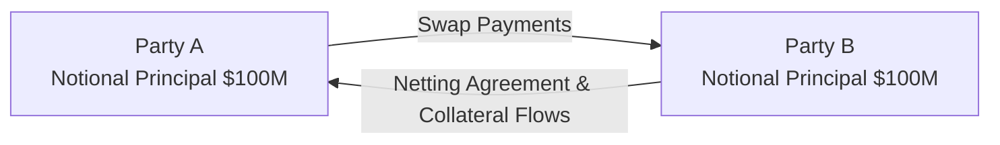

## Introduction

Swaps often seem like magical contracts that corporate treasurers and investment managers conjure up to manage interest or currency risk. But behind these contracts lurk three critical concepts—Notional Principal, Netting, and Collateral. In my personal experience, understanding how these three factors interact can really make the difference between a well-structured risk management strategy and a fiasco. In this section, we’ll venture a bit deeper into how each element shapes the way swaps are priced, valued, and managed from a risk perspective.

## The Role of Notional Principal

Notional principal is the reference amount on which swap payments are calculated. Although it’s called “principal,” it’s typically hypothetical—rarely does this entire amount ever change hands unless you’re dealing with a currency swap. In other words, a large notional principal can magnify the size of the interest or exchange-rate-driven cash flows, but it doesn’t necessarily increase the amount of money that physically passes from one party to another.

### Why It Matters

• Magnitude of Cash Flows: The bigger the notional, the larger the interest-based payments. So if your business is hedging a sizeable floating-rate loan with a swap, you need the notional to match that loan.  
• Credit Exposure: A large notional principal implies a larger potential exposure, because if the swap moves significantly in one party’s favor, the counterparty essentially “owes” more.  
• Capital Requirements: Regulatory frameworks such as Basel III sometimes use notional amounts (with certain conversion factors) in calculating capital charges.

### Example: Interest Rate Swap Notional

Imagine a plain vanilla interest rate swap where Party A pays fixed at 5%, and Party B pays floating at LIBOR + 0.50%. If the notional principal is $50 million, then Party A’s payment each period is 5% × $50 million = $2.5 million (annualized, but typically paid semi-annually). If LIBOR is 4.5% during a reset period, Party B pays (4.5% + 0.50%) × $50 million = 5.0% × $50 million = $2.5 million. The notional principal never changes hands (except possibly at initiation or maturity in certain swap structures), but all payments hinge on that $50 million figure.

## Netting in Swaps

Netting is a contractual and accounting mechanism that allows parties to offset reciprocal payment obligations, thereby reducing the total amounts exchanged—and crucially, mitigating credit risk. In a world without netting, each party would pay its obligations in full. With netting, they only pay the difference. It’s a bit like settling up with a friend after a group vacation: if you owe them for plane tickets and they owe you for hotel costs, you can just pay the net difference instead of swapping multiple envelopes of cash.

### How Netting Reduces Exposure

With netting, only the net payment is transmitted. If Party A owes Party B $2 million in a given period, and Party B owes Party A $1.6 million, the net payment is $400,000. That’s it. This means the gross flows of $3.6 million are reduced to a single $400,000 transaction. Credit exposure is substantially minimized because each party only faces the net amount at risk.

### Types of Netting

• Payment Netting: Offsetting payments due the same day for the same contract or the same currency.  
• Close-Out Netting: In an event of default, all obligations in all outstanding contracts are accelerated, valued, and then netted.  
• Cross-Product Netting: Netting across different derivative products (swaps, forwards, options) under a master netting agreement.

## Collateral in Swaps

Collateral might sound like a fancy term for “please give me some money in advance to show you’re good for it,” but in the derivatives world, it’s a formalized process governed by the Credit Support Annex (CSA) in an ISDA (International Swaps and Derivatives Association) Master Agreement. When you post collateral, you’re effectively saying, “I might be out-of-the-money by $X, so here’s some margin to protect you in case I can’t pay.”

### Collateral Posting and Mark-to-Market

Most collateral arrangements require daily or weekly “mark-to-market” (MTM) of the swap. That means each party looks at how much the swap is worth, using the typical present-value methods. If your position is negative, you must post collateral equal to or exceeding that negative value—often with a “haircut,” such as 98% or 95% of the nominal value, to account for market volatility and liquidity risk.

### Variation Margin vs. Initial Margin

Although the exact terminology can differ, “variation margin” usually refers to funds exchanged daily (or weekly) to reflect gains or losses that have already accrued on open positions. “Initial margin” is an additional buffer that’s required at the inception of the trade or as a cushion in volatile times. Together, they reduce counterparty credit risk because each party is less likely to default if they have posted collateral that covers their potential losses.

### Operational and Liquidity Implications of Collateral

Collateral is fantastic for reducing credit exposure, but it isn’t free. If you’re required to post cash or high-grade securities, that means you need to have that liquidity handy. If you’re running a corporate treasury, you might need to keep short-term investments readily available to meet margin calls. This operational arrangement can get pretty complex, especially if you’re dealing with multiple swaps across different currencies and positions. People sometimes forget how quickly markets can move—suddenly you might owe a large chunk of collateral because rates changed overnight!

## Putting It All Together

A swap with a large notional principal but robust netting across multiple trades—and supplemented by regular collateral posting—can have a surprisingly low net credit exposure. Conversely, a seemingly “small” swap (in notional terms) without netting or collateral might expose you to a larger credit risk than you’d guess.

### Illustrated Overview

Below, we have a simplified diagram of how these elements interconnect:

• Both parties define the notional ($100 million).  
• Periodic swap payments get netted.  
• Collateral flows back and forth depending on who is out-of-the-money.

## Impact on Swap Valuation

You might think the swap’s valuation is only about discounting future cash flows. While that’s roughly true in a frictionless environment, in reality, the presence (or absence) of netting and collateral can significantly shift the discount rates, the risk metrics, and the credit valuation adjustments (CVAs). Whenever there’s a possibility that your counterparty might fail, you need to factor that credit risk in. Collateral and netting help lower that risk, which typically leads to a more favorable (i.e., lower) cost to the side that might otherwise pay a premium for credit risk coverage.

### The Square of CVA, DVA, and FVA

• CVA (Credit Valuation Adjustment): The cost you charge to your counterparty for the possibility that they might default on you.  
• DVA (Debt Valuation Adjustment): The adjustment reflecting that you might default on your obligations—though for investment managers, that’s more of an accounting nuance.  
• FVA (Funding Valuation Adjustment): The additional cost of funding your position, especially if you’re posting collateral.  
Once you bring netting into the picture, the entire portfolio’s exposure is aggregated, sometimes resulting in a net positive or net negative position. Add collateral, and the net exposure might be even smaller. So your CVA, DVA, and FVA might drop significantly when you have robust netting and collateralization in place.

## Regulatory Perspective

Regulatory bodies worldwide love netting and collateralization because both reduce systemic counterparty risk. Under Basel III (for banks) and various global regulatory frameworks, netting agreements can reduce the reported exposure measure, thereby lowering risk-weighted assets. Collateral posting requirements—called “margin rules”—are also mandated for many swap transactions, especially those deemed standard enough to be centrally cleared.

## Common Pitfalls and Best Practices

• Documentation Gaps: Sometimes, parties assume netting applies across all trades, but the actual Master Agreement might contain exceptions. Review your netting clauses carefully.  
• Collateral Discrepancies: Due to currency mismatches or haircuts, you might need more collateral than anticipated. Keep an eye on operational details.  
• Over-The-Counter (OTC) Complexity: OTC trades can be customized but watch out for non-standard netting or partial collateral requirements.  
• Liquidity Strain: Sudden calls for collateral while you’re short on cash or high-quality securities can cause major disruptions. Maintain a contingency plan.  
• Cross-Border Legal Enforcement: In some jurisdictions, netting or collateral agreements might not be fully enforceable. Work with local counsel to ensure these protections are recognized legally.

## Real-World (Hypothetical) Example

Let’s say Company ABC enters into three interest rate swaps with Bank XYZ:

1) Swap 1: $50 million notional. ABC pays fixed 4.0%, receives LIBOR.  
2) Swap 2: $20 million notional. ABC receives fixed 3.5%, pays LIBOR.  
3) Swap 3: $30 million notional. ABC pays fixed 5.0%, receives LIBOR + 0.25%.

If the Master Agreement includes netting, the total net interest owed each payment date can be calculated across all three swaps. The net exposure to Bank XYZ is also offset by any net in-the-money positions ABC holds. Add in a daily collateral mechanism triggered when the net MTM moves beyond $1 million. With netting plus collateral in place, ABC’s credit exposure at any point might be less than $1 million—even though $100 million in notional principal is floating around across three swaps.

## Exam Tips

1) Expect that a question might provide multiple swaps or derivative transactions. You need to calculate the net exposure with netting.  
2) Watch for currency differences. In a cross-currency swap, notional principal may actually be exchanged.  
3) Know the difference between variation margin and initial margin. The exam loves asking about who pays what and when.  
4) If you see a question with a default scenario, keep your eyes open for whether close-out netting is triggered.  
5) Don’t overlook the operational complexities of collateral management, such as haircuts, threshold amounts, and frequency of margin calls.

## References and Further Reading

- International Swaps and Derivatives Association (ISDA):  
  (https://www.isda.org/)  
  Essential for understanding documentation standards, including Master Agreements and Credit Support Annexes.  

- Gregory, Jon. “Counterparty Credit Risk and Credit Value Adjustment.”  
  Classic text for deeper dives into CVA and other valuation adjustments.  

- Bank for International Settlements (BIS), “Collateral Markets and their Role in Monetary Policy Execution.”  
  Focuses on how collateral underpins financial stability.

- CFA Institute Code of Ethics and Standards of Professional Conduct.  
  Guidance that emphasizes accurate representation of derivative exposures in client accounts.

## Test Your Understanding: Notional Principal, Netting, and Collateral Quiz



### Which statement best describes the purpose of notional principal in a swap?

- [x] It is the reference amount on which interest payments are calculated.
- [ ] It is the amount of collateral posted by both parties.
- [ ] It is the actual loan principal that changes hands on each payment date.
- [ ] It is the required initial margin posted at the inception of the swap.

> **Explanation:** The notional principal is a reference figure used to calculate interest payments but is usually not exchanged (except in certain currency swaps).

### In a plain vanilla interest rate swap, which party is most likely to post collateral?

- [ ] Only the fixed-rate payer.
- [x] The party with a negative mark-to-market value.
- [ ] Both parties must post the same amount of collateral at inception.
- [ ] Neither party posts collateral when the swap is netted.

> **Explanation:** Typically, the party whose position is out-of-the-money must post collateral according to the Credit Support Annex.

### How does netting reduce credit exposure in a swap network?

- [ ] It eliminates all future payments unless a default occurs.
- [x] It offsets reciprocal payment obligations so only the net amount is exchanged.
- [ ] It converts all floating payments into fixed-rate payments.
- [ ] It causes the notional principal to be partially exchanged at the start.

> **Explanation:** Netting ensures that if both parties owe money to each other, only the difference is paid, reducing the gross exposure.

### What is a common pitfall related to collateral management?

- [ ] Using higher-quality collateral than required.
- [ ] Posting collateral on time.
- [x] Failing to hold enough liquid assets to meet margin calls.
- [ ] Renegotiating the notional principal under ISDA guidelines.

> **Explanation:** One major issue is that sudden margin calls can create liquidity strains if the firm does not have enough liquid assets.

### Which of the following best characterizes cross-product netting?

- [ ] Netting applied only to currency swaps.
- [ ] Netting of payments across two or more affiliates of the same counterparty.
- [x] Netting obligations across different types of derivatives under a single master agreement.
- [ ] Netting only after a default event has been declared by a regulator.

> **Explanation:** Cross-product netting aggregates exposures from multiple derivative products under a consolidated netting framework.

### When a swap is fully collateralized on a daily basis:

- [ ] There is zero operational risk because everything is posted daily.
- [x] Credit exposure is significantly reduced, but liquidity requirements increase.
- [ ] The swap is no longer subject to regulatory reporting.
- [ ] The parties no longer need a Master Agreement or CSA.

> **Explanation:** Daily collateral posting lowers credit risk but increases liquidity demands since you might need to post significant assets every day.

### Which of the following statements is correct about currency swaps?

- [x] The notional principal amounts are often exchanged at inception and maturity.
- [ ] They are identical to interest rate swaps except for the collateral arrangement.
- [ ] Currency swaps never involve mark-to-market valuation.
- [ ] They have no credit risk because netting applies across all payments.

> **Explanation:** In a standard currency swap, principals in two different currencies are exchanged at the start and re-exchanged at contract maturity.

### In an over-the-counter (OTC) swap with netting and collateral agreements, if a counterparty defaults:

- [ ] The other party can only recover up to the original notional amount.
- [ ] Netting and collateral do not apply in a default scenario.
- [x] Close-out netting applies and any posted collateral can be used to offset losses.
- [ ] Both parties exchange future interest payments until maturity is reached.

> **Explanation:** Close-out netting aggregates the value of all open transactions, nets them, and then applies posted collateral to cover the net loss.

### What is the primary regulatory benefit of having strong netting agreements?

- [ ] Derivatives do not require a CSA if netting is in place.
- [x] The parties can reduce their risk-weighted assets, lowering capital requirements.
- [ ] Collateral is no longer needed if netting is approved by the regulator.
- [ ] The notional principal is split between both counterparts.

> **Explanation:** Under many regulatory frameworks (e.g., Basel III), netting can reduce the measure of credit exposure and thus reduce the calculated capital requirement.

### True or False: In a swap without netting, each party still posts collateral on the net mark-to-market value.

- [x] True
- [ ] False

> **Explanation:** Even in the absence of netting, collateral can be posted based on the net (rather than gross) negative mark-to-market amount owed by each party under the collateral agreement.


