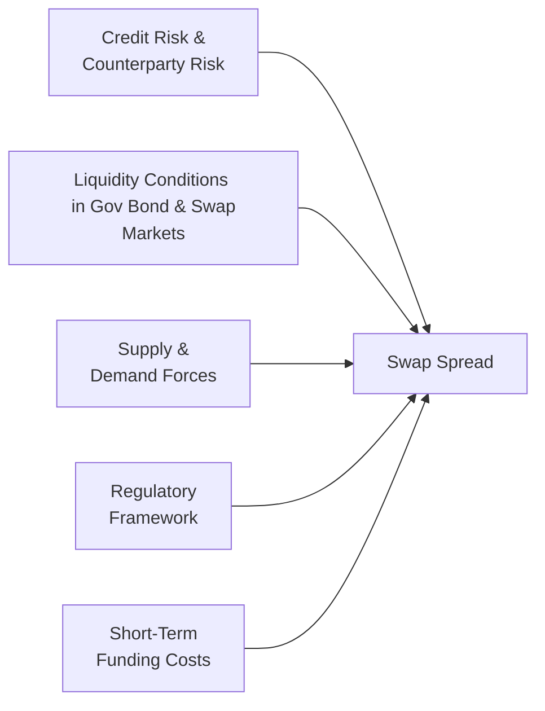

## Understanding the Significance of Swap Spreads
Swap spreads often pop up in market commentaries whenever there’s a change in the perceived risk of financial markets—like a canary in the coal mine, letting us know whether credit conditions are tightening or loosening. Essentially, these spreads measure the gap between the fixed rate of an interest rate swap and the yield on a government bond of the same maturity. If you’ve ever wondered why that gap can grow or shrink, you’re in luck—this section takes a close look at the drivers behind swap spreads and explains why they matter so much to both market participants and risk managers.

## The Basics of Swap Spreads
At its core, the swap spread is:

$$
\text{Swap Spread} = R_{\text{swap}} - r_{\text{gov}}
$$

Where:  
• \\( R_{\text{swap}} \\) is the fixed rate on a plain vanilla interest rate swap.  
• \\( r_{\text{gov}} \\) is the yield on a government security (often considered to be risk-free or close to risk-free) for the same maturity.

If, for instance, the yield on a 5-year government bond is 2.00% and the 5-year swap’s fixed rate stands at 2.50%, the swap spread is 0.50% (or 50 basis points). These 50 basis points can shift based on several factors, and these shifts can carry pretty important signals about the market’s health and risk tolerance.

## Key Drivers of Swap Spreads

### Credit Risk
A big chunk of the reason swap spreads exist at all is counterparty credit risk. While government bonds (like U.S. Treasuries) are often considered relatively free of default risk, swaps involve exposure to a private counterparty. If there’s even the slightest whiff of an increased risk of default, the fixed swap rate will escalate because investors need to be compensated for the potential that the counterparty might not fulfill its obligations.

• Counterparty Risk Premium: The extra yield demanded to compensate for the possibility of default.  
• Systemic vs. Idiosyncratic Risk: During systemic financial distress (think 2008 crisis), swap spreads can blow out as credit risk ramps up across the board. In calmer times, the spread might tighten, reflecting lower perceived risk.

### Liquidity Conditions
Sometimes, especially in times of heightened market uncertainty, investors stampede into government bonds. This “flight-to-quality” lowers government bond yields (pushing their prices up), while the swap market might not see a similar surge. Result? The gap (swap minus government yield) widens.

• Flight-to-Quality: Grabs headlines during crises when Treasuries and other government bonds get snapped up as safe havens.  
• Market Depth: If the government bond market is significantly more liquid than the swap market, that liquidity difference can itself elevate the swap spread, because investors prefer assets that can be easily traded and priced.

### Supply and Demand
Swaps aren’t just about speculation; they’re widely used for hedging. A pension fund might want to lock in a fixed payment to match outflows, while a corporation might be trying to hedge its floating-rate debt. If hedging needs are high, fixed swap rates can move independently of government bond yields.

• Hedging Demand: Institutional investors, corporate treasurers, or insurance companies can drive up the demand for swaps, pushing the fixed rate either higher or lower, depending on net demand.
• Speculative Activity: Traders who anticipate interest rate changes may enter or unwind swaps, influencing swap spreads outside of purely hedging-based transactions.

### Regulatory Framework
Regulations never sleep. They keep evolving, and every new rule about risk-weighted assets, collateral requirements, or capital charges can alter the cost of trading swaps. For instance, if a central bank or regulatory body tightens the rules on derivative exposures, it can become more expensive for banks to hold swap positions and that can nudge spreads wider as those costs get passed on.

• Collateral Requirements: Higher collateral requirements mean counterparties have to put up more cash or securities, raising the overall cost.  
• Bank Capital Rules (e.g., Basel Accords): Stricter risk-weighting for derivatives can affect how easily banks can make a market in swaps.  
• Central Clearing: Mandatory clearing might reduce counterparty risk but also introduce additional fees and margin calls—these can end up influencing the swap spread.

### Short-Term Funding Costs
In a plain vanilla interest rate swap, the floating leg is often pegged to short-term rates like LIBOR (historically), or more recently SOFR or other risk-free reference rates. Variations in short-term interest rates, liquidity in money markets, and even central bank policy can indirectly drive the fixed swap rate.

• Repo Markets and Overnight Rates: If repurchase agreement (repo) rates spike, that can kick off a chain reaction, raising overall short-term funding costs and pushing swaps’ floating leg higher or lower, influencing the equilibrium fixed swap rate.  
• Central Bank Policy: Monetary tightening or easing can reduce or enlarge the money supply, affecting short-term rates and, downstream, the swap rate.

## Diagram: Overview of Key Swap Spread Drivers
Below is a simplified mermaid diagram illustrating factors that influence swap spreads. The arrows represent the flow of influence rather than a strict causal sequence:

Each factor connects to the overall swap spread, indicating how changes in any of these drivers can make the spread widen or tighten.

## Simple Numerical Illustration
Let’s walk through a stylized scenario—something that helped me remember how these spreads could jump. A few years back, I was analyzing a 5-year swap when markets got jittery about some regional bank’s liquidity. Suddenly, the swap’s fixed rate shot from 2.50% to 2.60% while the 5-year Treasury only moved from 2.00% to 1.95%. The swap spread had been 0.50% and climbed to 0.65%. So, what happened?

• Rising Credit Risk: Investors got nervous about the potential for bank defaults, so they demanded a higher swap rate to be compensated for that risk.  
• Flight-to-Quality: Meanwhile, the 5-year Treasury yield dipped from 2.00% to 1.95% as people scooped up government bonds.  
• Wider Swap Spread: Voila—an extra 15 basis points on top of the original 50.

This scenario (though hypothetical in the details) reflects how multiple forces—namely credit risk perceptions, flight-to-quality, and the interplay of supply and demand—collaborate to shift swap spreads in real time.

## Market Stress and Flight-to-Quality
During tumultuous markets, fear can surge. Investors tend to speed into government bonds, which pushes their yields down. Meanwhile, the swap market might not share the same safe-haven glow. The result can be a spike in swap spreads:

• Example: The Global Financial Crisis of 2008. Swap spreads soared as counterparty risk soared and Treasuries rallied with flight-to-quality demand.  
• Monitoring Tool: Analysts keep a close eye on swap spreads to help gauge the overall stress in credit and money markets.

## Best Practices for Managing Swap Spread Exposure
Market participants with exposure to interest rate swaps—like banks, insurance companies, or large corporates—often keep a close eye on swap spreads to manage their portfolio risk:

• Continuous Monitoring: Track the short-term funding environment (e.g., overnight rates) and credit spreads to anticipate possible shifts in swap spreads.  
• Diversification: Combine different tenors and various forms of hedges (like interest rate options) to mitigate the risk of sudden spread movements.  
• Collateral Optimization: If you’re trading swaps that require collateral, ensure you have a robust liquidity plan so that you don’t face a crunch during market stress.  
• Scenario Analysis: Run “what-if” scenarios for widespread market shocks or changes in regulations that might dramatically widen or tighten swap spreads.

## Common Pitfalls
• Ignoring Regulatory Shifts: Underestimating how new capital regulations can alter market-making capacity or the cost of carrying swaps.  
• Overlooking Hedging Flows: Large pension funds, insurance companies, or other big players often need to hedge large blocks of interest rate risk. Failing to track or anticipate their flows is a common mistake.  
• Blind Spot to Liquidity: Even if you’re correct about the direction of interest rates, trouble finding a liquid exit for your swap positions can eat into returns.  
• Mistaking Risk-Free vs. Near Risk-Free: Government bonds are usually taken as “risk-free,” but the moment you shift to a swap, you pick up some additional risk. Underestimating that gap can lead to big miscalculations of fair value.

## Final Thoughts
Swap spreads provide a window into the market’s view of credit risk, liquidity conditions, and the broader health of financial markets. When you see spreads widening, remember to ask yourself if it’s credit risk, flight-to-quality, regulatory changes, or perhaps a sudden surge in demand for swaps. Conversely, a tightening spread might signal stabilizing credit conditions, falling hedging demand, or an improved short-term funding landscape. Being mindful of these dynamics can help you stay ahead of potential pitfalls in your trading strategies or risk management framework.

## References and Further Reading
- Sundaresan, S. (2009). Fixed Income Markets and Their Derivatives.  
- Collin-Dufresne, P., Goldstein, R., & Martin, J. (2001). “The Determinants of Credit Spread Changes.” Journal of Finance.  
- Bank for International Settlements (BIS). Various research papers on swap market liquidity.  
- CFA Institute. (Most Recent Edition). CFA Institute Code of Ethics and Standards of Professional Conduct.

## Mastering Swap Spreads: 10 Key Questions



### Which factor best explains why a swap spread is typically above zero?
- [ ] A lower yield on government bonds due to default risk
- [ ] A preference for higher-yielding government securities
- [x] Counterparty risk premium embedded in the swap rate
- [ ] Lack of credit risk in swaps

> **Explanation:** Swaps inherently have counterparty credit risk, which leads investors to demand a higher fixed rate on swaps than the yield on similar-maturity government securities.

### How does a flight-to-quality dynamic during a crisis usually affect swap spreads?
- [ ] It narrows swap spreads since everyone also runs to swaps
- [ ] It does not affect swap spreads since swaps are risk-free
- [x] It widens swap spreads as investors drive down government bond yields
- [ ] It narrows swap spreads playing off increased liquidity in both assets

> **Explanation:** In risk-off scenarios, government bond yields typically fall due to a surge in demand for “safe” assets, while the swap rate might remain elevated or even rise due to heightened credit risk, thus widening the spread.

### Which regulatory change could tighten swap spreads?
- [x] Reduction in risk weighting for swaps that lowers the cost of swap positions
- [ ] Increased collateral requirements for swaps
- [ ] Introduction of heavier capital charges on derivative positions
- [ ] Mandatory clearing that increases margin calls

> **Explanation:** A reduction in the regulatory risk weighting for swaps makes it cheaper for banks to hold swap positions, which can eventually lower the swap rate relative to government yields, narrowing the spread.

### If short-term funding costs rise sharply, how might it impact the swap’s floating leg and, indirectly, the fixed swap rate?
- [x] The floating leg becomes more expensive, potentially driving up the fixed swap rate
- [ ] The floating leg cost goes down, pushing up the fixed leg payment
- [ ] Short-term funding has no effect on market interest rates
- [ ] The fixed swap rate seldom moves with short-term rates

> **Explanation:** When short-term rates climb, the floating leg of a swap (often tied to a reference like SOFR or repo rates) can increase, prompting an upward shift in the fixed swap rate to keep the contract fair.

### Which of the following best illustrates the supply-demand dynamic in swap markets?
- [ ] Investors abandon swaps for corporate bonds
- [x] Institutional hedging pressure lifts the fixed rate on swaps above the risk-free rate
- [ ] Government bond issuance outstrips the demand for interest rate swaps
- [ ] Central banks withdraw from the market entirely

> **Explanation:** When institutional hedgers and speculators create heavy demand for swaps, the fixed rate on swaps can exceed the risk-free bond yield even more, pushing the spread higher.

### From a counterparty’s standpoint, which risk is most relevant when entering a new swap during volatile markets?
- [x] Credit risk from the other side of the swap
- [ ] Reinvestment risk in government bonds
- [ ] Intraday margin call from stock trades
- [ ] Commodities supply chain disruptions

> **Explanation:** During volatile markets, the creditworthiness of the swap counterparty comes under scrutiny, making counterparty risk particularly significant.

### How might government bond liquidity compare with swap market liquidity?
- [ ] Government bonds are typically less liquid than swaps
- [x] Government bonds are typically more liquid, contributing to flight-to-quality
- [ ] Liquidity is usually the same for both markets
- [ ] Swaps have guaranteed liquidity from central banks

> **Explanation:** Government bonds, especially those from developed markets, tend to enjoy deeper liquidity. This feature intensifies flight-to-quality flows when risk aversion spikes, pushing bond yields downward.

### Why might regulatory changes leading to higher margin requirements widen swap spreads?
- [x] The extra costs of holding swaps are passed on through higher fixed swap rates
- [ ] Collateralization typically reduces credit risk and spreads
- [ ] Margin calls do not affect the cost of carrying a swap
- [ ] Higher margins shift investor demand from swaps to riskier bonds

> **Explanation:** If traders or banks must keep more cash or securities on hand to back their swap positions, their cost of doing business rises, likely raising the swap’s fixed rate relative to the risk-free bond yield.

### What might a continuous narrowing of swap spreads signal about the credit environment?
- [ ] Greater fear of default among swap counterparts
- [x] Reduced perceived credit risk and improved market liquidity
- [ ] A flight-to-quality environment
- [ ] A regulatory crackdown on derivatives

> **Explanation:** Narrowing spreads can reflect declining credit concerns and robust liquidity in markets, reducing the additional premium demanded over government bonds.

### Swap spreads are often viewed as a measure of market “health” because:
- [x] They reflect both credit risk perceptions and liquidity conditions
- [ ] They are strictly determined by central bank policy rates
- [ ] They only represent hedging demand from corporations
- [ ] They isolate inflation expectations better than TIPS spreads

> **Explanation:** Swap spreads incorporate credit risk, liquidity premiums, and supply-demand factors. Observers track them to gauge how stable or stressed credit and funding markets are at any point.




