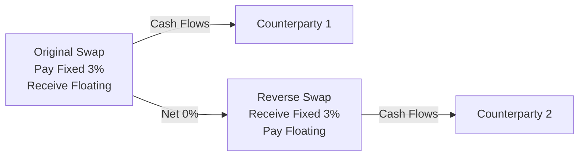

## Overview

Swaps, as detailed in earlier sections of this volume, are typically long-term over-the-counter (OTC) instruments. Parties enter these contracts with the intention of exchanging cash flows—often fixed for floating—throughout the life of the swap. But, as you know, the financial markets are dynamic: interest rate environments can shift, credit spreads widen or narrow, and corporate strategies evolve. So it’s no wonder that sometimes a party just wants to walk away from a swap before it reaches maturity. The big question is: how do you do that?

This section explores the main ways market participants can terminate or unwind a swap position. We’ll consider the key motivations for exit, the mechanics of termination, the valuation aspects, and a few practical anecdotes. We’ll also look at potential pitfalls and how to avoid them.

## Reasons for Exiting a Swap Early

Before zooming in on the mechanics, let’s reflect on the “why.” Sometimes it’s straightforward: maybe a borrower locked in a fixed rate at 5% only to discover interest rates dropped to 2%, and continuing that swap is now an expensive mismatch of cash flows. Other times, strategic decisions precipitate the exit, such as a corporate merger or changes in exposure to underlying rates. For example—as I once saw—an industrial firm decided to shut down a major project that had originally required hedging with an interest rate swap, so they wanted the hedge canceled. It felt a bit like giving back the extra insurance coverage once you no longer own the car.

Common reasons include:
• Changes in underlying interest rates or credit spreads.  
• Shifts in corporate strategy, such as project cancellations.  
• Regulatory changes or new capital requirements.  
• A desire to lock in gains (if the swap is in-the-money).  
• Credit concerns with the counterparty.

Regardless of the reason, the next step is to figure out the best exit method.

## Key Methods of Swap Termination

### Reverse Swap (Close-Out)

A reverse swap allows you to offset your economic exposure by entering a new swap with the same notional amount, maturity date, payment frequency, and reference rates, but with the opposite pay/receive direction. This method is typically called a “close-out” swap. Conceptually, it’s a neat trick: the new swap’s cash inflows neutralize the outflows of the original.

• Example:  
  Suppose you have a fixed-for-floating interest rate swap where you’re paying 3% fixed and receiving a floating rate (like LIBOR + 50 bps). If you decide to end your net payments, you can enter a second swap where you receive a fixed 3% and pay floating (LIBOR + margin). Assuming all terms match, net cash flows effectively zero out.

• Pros:  
  – You don’t have to negotiate a termination fee with the original counterparty.  
  – Potentially simpler if your original swap is large and you need a quick solution.  

• Cons:  
  – You still carry credit exposure to two separate counterparties now.  
  – Administrative complexity in having two active swaps.  
  – You haven’t truly “torn up” the original contract; you’ve just offset the net cash flows.

A small informal note: I once joked that a “close-out” swap is like wearing noise-canceling headphones. You still have the noisy environment (the original swap), but you’re effectively blocking it with another wave (the new swap). The environment remains, but your perceived exposure is neutralized.

Below is a simple Mermaid diagram illustrating the offsetting cash flows of a reverse swap:

### Assignment or Novation

Sometimes parties prefer to be truly done with the transaction rather than layering additional swaps. Enter novation: a legal process in which your obligations are transferred to a new party with the consent of the original counterparty. Novation means your name is replaced with the new party’s name on the legal contract.

• Mechanics:  
  – Negotiate with a third party willing to “take over” your portion of the swap.  
  – Obtain approval from the original counterparty (which will assess credit risk on the new party).  
  – Execute the novation agreement, typically governed by International Swaps and Derivatives Association (ISDA) guidelines.  

• Valuation:  
  – The original swap is marked to market, and the party stepping out either pays or receives the swap’s present value.  

• Pros:  
  – You’re 100% free of the contractual obligations and future credit exposures.  
  – Only one swap remains in existence, preserving clarity.  

• Cons:  
  – The process can be time-consuming if the new party’s credit quality is in question or if it’s challenging to find that new party.  
  – Legal and administrative fees often arise.

### Cash Settlement

Cash settlement might be the most straightforward approach—if you or your counterparty has the resources to settle up. In this method, one party simply pays (or receives) the present value of the swap to the other party. With that, the swap is effectively torn up, and no further obligations exist.

• Mechanics:  
  – Calculate the termination value (the net present value of remaining cash flows).  
  – If you’re “in the money,” the counterparty pays you. If you’re “out of the money,” you pay them.  
  – The swap is canceled upon payment.  

• Pros:  
  – Cleans the slate: no new swaps, no new counterparties.  
  – Fast execution when parties agree on the fair market value.  

• Cons:  
  – Requires a lump sum of cash.  
  – Negotiation might be tricky if parties disagree on the valuation approach or discount rate.

## Valuation for Early Termination

When terminating a swap (whether via novation, reverse swap, or outright settlement), the crucial step is determining the contract’s present value (PV). Conceptually, you’re discounting all expected future net cash flows to the current date using appropriate discount factors. If it’s an interest rate swap, you’d typically:

1. Project the timetable of fixed flows and expected floating rates.  
2. Discount each leg back to present.  
3. Subtract one leg’s PV from the other’s to get the net value.  

If that net value is positive to you, you’ll expect a receipt to walk away. If negative, you’ll have to pay. The formula for the termination value of a “plain vanilla” interest rate swap, from your perspective, is often:


\text{Swap Value to Fixed-Rate Payer} = \text{PV of Receiving (Floating Leg)} - \text{PV of Paying (Fixed Leg)}.


In a real transaction, there might be small complexities like day count conventions, credit spreads, or collateral terms. Also, as time passes, the notional schedule might be amortizing, or you may have additional terms like embedded options or caps/floors referenced in prior sections. Remember: the entire process of marking to market is meant to reflect the fair price that the seller or buyer of the swap position would require to assume the remaining exposures.

## Economic and Market Drivers

Two main factors generally dominate early termination value:

• Interest Rate Movements: Even half a percentage point shift can significantly alter the net present value of future cash flows on a multi-year swap.  
• Credit Spreads: If the swap references corporate rates or includes credit-based triggers, spread changes can generate formidable windfalls or costs.

Minor factors—like time decay, changes in floating reference rates, and forward curve oscillations—also matter. Legal and operational fees may tack on additional costs.

## Operational and Legal Considerations

I remember thinking, “Isn’t unwinding a swap just about the money?” But operational logistics matter. For instance:

• Documentation: You’ll typically rely on your ISDA Master Agreement to specify how termination or novation is handled.  
• Regulatory Requirements: Certain jurisdictions require clearing for standard swaps. Termination might trigger additional reporting, collateral release, or variation margin settlement.  
• Credit Approval: If you go for novation, the original counterparty must sign off on the new party.  

These considerations can slow down the process. It’s wise to build in lead time and factor in potential fees.

## Practical Example: Company ABC

Let’s illustrate with a simplified scenario:

• Company ABC is paying fixed at 4% and receiving floating at LIBOR on a $10 million notional, 3-year interest rate swap.  
• Two years remain, but ABC no longer needs the hedge because they repaid the underlying variable-rate debt. The swap is now a speculative position from ABC’s perspective.  
• Current swap rates for 2-year maturities have fallen to 2.5% fixed. This means ABC’s fixed 4% payment is “expensive.” So the swap likely has a negative value to ABC.  

ABC can:  
1. Enter a reverse swap: receiving 4% fixed, paying LIBOR, effectively neutralizing net payments. This leaves two offsetting swaps outstanding.  
2. Assign the swap to a new party that actually wants to pay fixed at 4% (perhaps they believe that’s cheap given their circumstances). ABC would pay that party the negative termination value.  
3. Pay the counterparty the present value of the net future losses to walk away.  

From ABC’s viewpoint, it might come down to whether the CFO prefers a clean break (cash settlement) or layering a second swap (reverse swap), or if there’s a willing counterparty for assignment. Each approach might yield a different cost structure, but the underlying economics—based on present value—remain similar.

## Best Practices and Common Pitfalls

• Understand the Mark-to-Market Correctly: One pitfall is misunderstanding how discount rates, forward curves, or day counts factor into the present value calculation, leading to disputes on settlement amounts.  
• Consider Credit Exposure: A reverse swap might look like a neat fix, but now you’re storing credit risk with two separate deals. If either counterparty defaults, you still have exposures.  
• Watch Out for Legal, Operational, and Tax Implications: Unwinding can trigger accelerated income or gain recognition, especially under certain accounting frameworks.  
• Don’t Overlook “Hidden” Costs: Sometimes the original documentation includes an early termination clause with a penalty. Or the new counterparty’s legal counsel might charge for novation contract reviews.  
• Timing Your Exit: If you believe interest rates are about to move even further in your favor, consider the risk of waiting. Conversely, if you’re out-of-the-money but expect rates to revert, you might hold off on termination.

## Conclusion

Terminating or unwinding a swap isn’t always a trivial decision. The method you pick—reverse swap, novation, or straight-up cash settlement—has unique trade-offs in terms of credit exposure, legal complexity, and cost. Examining the current mark-to-market value is crucial to determining the final payment. And it’s important to weigh the operational and regulatory angles, so you’re not surprised by a wave of paperwork or other fees.

That said, if done thoughtfully, unwind strategies can free up your balance sheet, remove unwanted exposure, and ensure that your derivatives portfolio evolves with your business or investment objectives. After all, flexibility can be just as critical in derivatives as it is in life.

## References

• ISDA, “User’s Guide to the 2006 ISDA Definitions.”  
• Gregory, Jon. “Central Counterparties: Mandatory Clearing and Bilateral Margin Requirements for OTC Derivatives.”  
• CFA Institute. “2025 CFA® Program Curriculum: Derivatives.”  
• Hull, John. “Options, Futures, and Other Derivatives,” 10th ed.  

## Test Your Knowledge: Terminating or Unwinding a Swap



### A swap participant might wish to terminate early mainly due to:
- [ ] A desire to lengthen the existing swap’s maturity.
- [ ] Having no way to pay future floating payments.
- [ ] Protocols in the ISDA Master Agreement requiring automatic termination.
- [x] Changes in economic conditions or updated corporate strategies.

> **Explanation:** While inability to pay or mandatory early termination can be factors, the typical motivation is that market or corporate changes have made the swap undesirable.

### Which termination method involves creating a second, offsetting swap?
- [ ] Novation.
- [ ] Cash settlement.
- [x] Reverse swap (close-out).
- [ ] Recouponing.

> **Explanation:** Reverse swaps (or close-out swaps) establish a new, opposite position to offset the original swap’s cash flows.

### In a novation:
- [ ] You enter a swap with the same counterparty but oppose your original position.
- [x] All parties must agree to transfer the swap obligation to a new counterparty.
- [ ] You settle with cash and remove the original counterparty entirely.
- [ ] No legal changes are required beyond the existing contract.

> **Explanation:** Novation requires the original counterparty and the new counterparty to both agree, effectively replacing one party in the contract.

### One advantage of cash settlement for early termination is:
- [ ] It allows indefinite deferral of legal obligations.
- [ ] It creates new offsetting swaps and reduces net exposure.
- [x] It provides a clean break with no additional swaps outstanding.
- [ ] It is generally free of any lumpsum payment.

> **Explanation:** Cash settlement, by definition, ends the swap outright through a single payment; no further obligations remain.

### If a party is “out of the money” on a swap:
- [ ] It will receive the present value of the swap upon termination.
- [x] It may need to pay to unwind or terminate the position.
- [ ] It is not allowed to terminate the swap prior to maturity.
- [x] It might consider deferring termination if it anticipates a favorable rate shift.

> **Explanation:** Being out-of-the-money typically means the swap has negative value, so a payment is often required to exit.

### Which factor most significantly influences the mark-to-market value of an interest rate swap?
- [x] Current and expected future interest rates.
- [ ] Stock market volatility.
- [ ] Commodity price swings.
- [ ] Foreign exchange rates exclusively.

> **Explanation:** The primary drivers for an interest rate swap’s value are the level and movements of interest rates.

### An operational concern when novating a swap is:
- [x] The original counterparty must approve the new counterparty.
- [ ] The notional principal is automatically reset to zero.
- [ ] Only the net cash flows are reassigned, but not the legal obligations.
- [ ] ISDA Master Agreements disallow novations.

> **Explanation:** In a novation, the original counterparty has to agree, often performing a credit review of the incoming party.

### A reverse swap can expose the original swap holder to:
- [x] Potential credit risk from two counterparties.
- [ ] Zero chance of default because net exposures offset.
- [ ] Illegality under standard ISDA protocols.
- [ ] Zero net present value under all circumstances.

> **Explanation:** Even though the cash flows offset, each contract has distinct credit risk. If either counterparty defaults, netting fails.

### A termination valuation might include:
- [x] Discounting projected cash flows on both swap legs.
- [ ] Accrued stock dividends to offset the cost of carry.
- [ ] Only forward currency contracts, not interest rates.
- [ ] A single future cash flow with no discounting.

> **Explanation:** Accurately valuing a swap at termination requires discounting all future cash flows of the fixed and floating legs, summing them, and finding the net present value.

### True or False: In a cash settlement, no lump sum changes hands since the swaps net out automatically.
- [ ] True
- [x] False

> **Explanation:** Cash settlement involves an immediate lump sum payment, reflecting the market value of the swap to be canceled.


