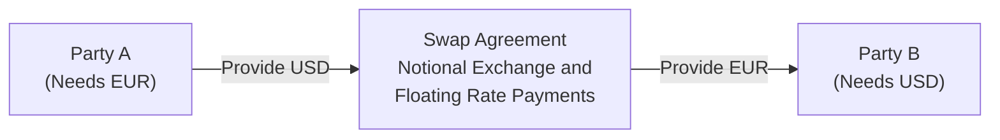

## Introduction 
Cross-currency basis swaps are a versatile tool for exchanging payments denominated in one currency for payments in another currency, often used by global financial institutions and multinational corporations seeking to manage currency exposures and fund cross-border operations more efficiently. If you’ve ever worked with a branch office overseas, you probably know the pain of fluctuating currency rates—those changes can wreak havoc on your financial statements. I remember one instance early in my career when a sudden shift in the dollar-to-euro exchange rate sparked a frantic search for hedging solutions. Cross-currency basis swaps were part of the answer.

This swap structure typically involves two counterparties who agree to exchange not only floating interest payments but also principal in different currencies at the start and conclusion of the swap’s life. Unlike standard interest rate swaps (which only address interest payments in the same currency), cross-currency basis swaps add another layer: principal exchanges based on a predetermined exchange rate. Investors, corporations, and financial institutions use these swaps for funding, hedging currency risks, or even spotting arbitrage opportunities when short-term rates deviate across regions.

## How Cross-Currency Basis Swaps Work
At a high level, a cross-currency basis swap has two legs:

• One leg references a floating rate in Currency A.  
• The other leg references a floating rate in Currency B, often adjusted by a “basis spread” to account for supply-demand imbalances or credit risk differentials.

The principal is exchanged at inception and re-exchanged at maturity. The final re-exchange is done at the same predetermined rate used at the start, which aims to neutralize direct foreign exchange risk on the notional principal. However, the swap’s fair value can still fluctuate if interest rates in the two currencies move differently or if the cross-currency basis changes over time.

In practice, you might see something like “EURIBOR vs. USD LIBOR + 25 basis points,” indicating that the USD leg pays LIBOR plus a 25 bps spread. This 25 bps spread is the “cross-currency basis,” reflecting the market’s willingness to pay or receive additional yield for taking on USD exposures relative to EUR exposures. The size of the spread can swing widely in times of financial stress—if liquidity in one currency evaporates, the basis can spike, making it more expensive to swap into that currency.

## Principal Exchanges and Notional Amounts
One major difference between cross-currency basis swaps and standard single-currency interest rate swaps is the exchange of principal:

• At inception: Party A delivers the notional amount in Currency A, while Party B delivers an equivalent notional amount in Currency B according to an agreed-upon exchange rate.  
• At maturity: The same notional amounts are returned to their original owners at that same rate.

Consider a EUR/USD cross-currency swap, where an EU-based firm wants USD funding to expand operations in the United States. The firm might borrow in euros (because it’s cheaper or because it has natural euro funding sources) and swap into USD to fund its U.S. projects. Meanwhile, a U.S.-based lender might be happy to lend euros (and receive euros at maturity) if it has euro liabilities or sees an arbitrage opportunity.

## Common Uses
Balance Sheet Management  
Corporations with debt denominated in multiple currencies often use cross-currency basis swaps to reduce foreign exchange mismatches. For instance, let’s say a Japanese multinational with big operations in Europe wants to keep some of its liabilities in Europe but is more comfortable borrowing in yen (due to better funding conditions at home). They can manage these exposures by entering a JPY/EUR cross-currency basis swap, converting an otherwise yen borrowing into a synthetic euro obligation.

Arbitrage Opportunities  
Short-term interest rate differentials create opportunities for what’s sometimes called “funding arbitrage.” In markets where U.S. dollars are in high demand, the cross-currency basis spread might go significantly negative, making it cheaper for some parties to raise USD in an indirect manner. Banks constantly look for these small distortions—maybe the direct route to get USD is more expensive, so they borrow in EUR (which is cheaper), enter a cross-currency basis swap to get USD, and pocket the difference in rates.

Driven by events such as central bank interventions, capital controls, or short-term liquidity squeezes, cross-currency basis spreads can reflect risk sentiment and funding availability across the globe. During times of crisis, these swaps may see a massive surge in volume as institutions scramble to lock in funding at reasonable rates (or at least as reasonable as they can get).

## Mechanics in a Diagram
Let’s illustrate with a simplified diagram. Suppose we have two parties: “Party A” in the US that needs euros and “Party B” in Europe that needs dollars. Each wants the other’s currency.



• Party A provides USD to Party B at the start.  
• Party B provides EUR to Party A at the start.  
• During the life of the swap, A pays a floating rate (e.g., USD LIBOR + spread) on the USD notional, and B pays EURIBOR on the EUR notional.  
• At maturity, they reverse the principal exchange at the same rate used initially.

## Valuation Considerations
From a valuation standpoint, each currency’s floating rate leg is discounted using the appropriate discount curve for that currency. Remember that for cross-currency swaps, you have to consider two separate yield curves (e.g., the EUR discount curve and the USD discount curve). The cross-currency basis spread is also factored in as part of the cash flows on the relevant floating leg.

In a simplified approach, one might see the net present value (NPV) of a cross-currency basis swap as the difference between:

• The present value of all projected cash flows in Currency A (including principal exchange at the end), converted into some base currency at forward FX rates.  
• The present value of all projected cash flows in Currency B, also converted consistently at the forward FX rates.

The underlying principle is that the swap legs can be viewed as portfolios of forward rate agreements (FRAs) in different currencies with an FX forward overlay. The key difference from a plain-vanilla interest rate swap is the principal exchange in multiple currencies.

Mathematically, you might represent the fair value of the swap (from the perspective of receiving the Currency A leg and paying the Currency B leg) as:


\text{FV} = \sum_{t=1}^{T} 
\Big[ 
\frac{\big(\text{Floating Rate A}_t + \text{Spread A}_t \big) \cdot \text{Notional}_A \cdot \delta_t}{(1 + r_{A,t})^{t}} \times \text{FX Forward Rate}(A \to B) 
- \frac{\big(\text{Floating Rate B}_t + \text{Spread B}_t \big) \cdot \text{Notional}_B \cdot \delta_t}{(1 + r_{B,t})^{t}} 
\Big]


where δt is the day-count fraction for the period, rA,t and rB,t are the discount rates (possibly from their respective OIS curves), and “FX Forward Rate(A → B)” is the forward exchange rate for converting A’s currency flows into B’s currency. This can get pretty intricate in real-life scenarios, particularly when discount curves differ (e.g., OIS vs. LIBOR-based curves), but the conceptual framework remains a set of discounted cash flows.

## Brief Python Example
Below is a simplified Python snippet aimed at conceptualizing how one might discount cash flows for a cross-currency basis swap. It’s by no means comprehensive—just a quick illustration:

```python
import math

def present_value_cash_flows(cashflows, discount_factors):
    """
    Calculate the present value of projected cash flows.
    cashflows: list of (time, amount)
    discount_factors: dict with time -> discount factor
    """
    pv = 0.0
    for t, amount in cashflows:
        pv += amount * discount_factors.get(t, 0)
    return pv

usd_leg = [(0.5, 50000), (1.0, 50000), (1.5, 1050000)]  # includes final notional at T=1.5
eur_leg = [(0.5, 45000), (1.0, 45000), (1.5, 900000)]   # includes final notional

usd_discount_factors = {0.5: 0.99, 1.0: 0.97, 1.5: 0.94}
eur_discount_factors = {0.5: 0.995, 1.0: 0.975, 1.5: 0.93}

pv_usd_leg = present_value_cash_flows(usd_leg, usd_discount_factors)
pv_eur_leg = present_value_cash_flows(eur_leg, eur_discount_factors)

print("Present Value of USD Leg: ", pv_usd_leg)
print("Present Value of EUR Leg: ", pv_eur_leg)

# to compute net value to the party receiving USD leg and paying EUR leg.
```

While real valuation models are much more involved (especially with multi-curve construction and more precise day-count conversions), the underlying principle is straightforward: discount each cash flow at its appropriate curve, then convert to a common currency.

## Risk Management 
The principal exchange at both the start and end of the swap means you’re effectively locking in an exchange rate for that principal. This can be fantastic if your expectations about future exchange rates are correct—but it can hurt if they aren’t. Meanwhile, you’re still exposed to interest rate movements in both currencies and to changes in the cross-currency basis. In times of market stress, that basis can swing wildly, impacting large floating-rate payments.

Best practices in risk management for cross-currency basis swaps often include:
• Regular mark-to-market of each leg using current yield curves and FX forward rates.  
• Monitoring cross-currency basis volatility and its correlation with other risk factors (e.g., credit spreads, equity volatility).  
• Maintaining enough liquidity or collateral to meet margin calls if the swap is centrally cleared (or if the counterparty agreement requires collateral posts).

From a standard setter’s perspective (such as IFRS or local GAAP), the hedge accounting guidelines can get intricate. If you’re using cross-currency basis swaps for hedging a foreign currency debt, you’ll need to document and assess hedge effectiveness under IFRS 9, for instance. Keep in mind that any mismatch in the hedge could lead to volatility in the profit and loss statement.

## Real-World Example
A fairly classic real-world scenario is when large global banks (particularly during a crisis period) found themselves short on USD funding. To secure dollars, they borrowed in other currencies (say, yen) at low rates and then entered into a cross-currency basis swap to exchange those yen payments for USD. This funding route often ended up cheaper—though not always—than directly tapping the USD market. The cross-currency basis swap effectively became a barometer for global demand for U.S. dollars.

In 2008 and during later market stresses, cross-currency basis spreads for some currency pairs (like USD/JPY or USD/EUR) went deeply negative. This negative basis signaled that non-U.S. entities were paying a premium to get their hands on dollars. Central banks later implemented swap lines to ease these pressures, further reflecting the critical role currency swaps play in international liquidity.

## Challenges and Pitfalls
• **Exchange Rate Risk**: While principal amounts are re-exchanged at a predetermined rate, any mismatch in operational cash flows or intermediate conversions can still create unpredictable FX exposures.  
• **Basis Volatility**: If you enter a swap to lock in a certain basis spread, and that spread widens or narrows significantly, the mark-to-market value of your position can swing in ways you might not have initially anticipated.  
• **Liquidity Risk**: In times of financial stress, liquidity for certain currencies can dry up, causing abnormal basis movements.  
• **Accounting Complexity**: Hedge accounting under IFRS 9 or US GAAP’s ASC 815 can be complex, especially when you have to prove ongoing effectiveness in offsetting currency risk.

## Regulatory and Accounting Considerations
Globally, cross-currency swaps often fall under central clearing mandates (though not to the same extent as standardized interest rate swaps). Under Basel III, a bank’s capital requirements apply to the counterparty credit risk these trades create. Moreover, the Dodd-Frank Act in the U.S. and EMIR in Europe impose reporting and, in many cases, clearing obligations for over-the-counter derivatives, including cross-currency swaps.

From an accounting perspective, some institutions elect hedge accounting if the swap is used to hedge a firm commitment or forecasted transaction in another currency. Documentation must clearly outline the risk management objective, strategy, and methods for measuring hedge effectiveness. If all the criteria are met, the hedge’s gains and losses can be deferred in other comprehensive income and recognized in earnings in tandem with the hedged item.

## Exam Relevance
For CFA Level III candidates (and advanced Level I/II readers looking ahead), understanding cross-currency basis swaps is crucial for multi-asset, multi-currency portfolio management. The exam often incorporates scenario-based questions where you must evaluate the cost-effectiveness of different hedging strategies, or measure how basis spreads could impact the hypothetical firm’s interest expenses.

You might be asked to:
• Propose a hedge structure to convert debt obligations from one currency to another while minimizing basis risk.  
• Evaluate the mark-to-market for a swap position when either interest rates or cross-currency basis spreads shift.  
• Calculate the net savings or cost from employing cross-currency basis swaps during certain liquidity conditions.

## Final Exam Tips
• Always keep track of which currency’s discount curve you’re using for each leg. Illogical discounting leads to incorrect valuations.  
• Understand that principal exchanges at inception and maturity can dramatically influence the swap’s initial and final cash flows—this is distinct from a plain-vanilla interest rate swap.  
• Pay careful attention to the cross-currency basis. If the exam question provides a basis spread (e.g., +20 bps in EUR), integrate that spread properly into the floating leg.  
• Watch out for notional amounts that differ slightly if the problem states an off-market exchange rate.  
• In scenario questions, be prepared for a trick: a shift in the cross-currency basis can produce a larger impact than a shift in the underlying floating rates.  
• Practice multi-currency discounting. Sometimes, the exam will throw curveballs related to the forward FX rates not matching simple interest rate differentials.  
• If asked about hedge accounting or GIPS compliance, remember to mention the documentation required and how the variation in the swap’s value might be reflected on financial statements.

## References
• Baba, N., and Packer, F. “Interpreting Deviations from Covered Interest Parity,” BIS Quarterly Review.  
• Bank for International Settlements (BIS). “Cross-Currency Liquidity and Basis Swaps” – various official reports and working papers.  
• IFRS 9 Financial Instruments – Hedge Accounting standards.

## Cross-Currency Basis Swaps Practice Questions



### A cross-currency basis swap differs from a standard interest rate swap in that:
- [ ] It eliminates all foreign exchange risk for both parties.  
- [x] It requires an exchange of principal amounts in different currencies at the start and end of the swap.  
- [ ] It does not involve any floating rates.  
- [ ] It has no collateral requirements.  

> **Explanation:** The hallmark of a cross-currency basis swap is the net exchange of principal at both inception and maturity, whereas a standard interest rate swap involves no exchange of notional principal.

### The “basis” in a cross-currency basis swap generally refers to:
- [x] The spread over a floating rate benchmark in one currency that compensates for supply-demand imbalances of that currency.  
- [ ] The fixed coupon rate paid on a long-term bond.  
- [ ] The predicted future spot exchange rate.  
- [ ] The difference between the two notional principal amounts.  

> **Explanation:** The cross-currency basis is the spread added to the floating rate (e.g., USD LIBOR), reflecting market conditions and imbalances in demand for certain currencies.

### A key reason a multinational corporation might utilize a cross-currency basis swap is:
- [ ] To speculate on interest rate movements in a single currency.  
- [x] To convert debt obligations from one currency to another and reduce foreign exchange mismatches.  
- [ ] To eliminate interest rate risk entirely.  
- [ ] To diversify its credit portfolio within a single currency zone.  

> **Explanation:** One main purpose is to change the effective currency of debt obligations, which helps the firm align its liabilities with revenues and manage FX risk.

### When valuing a cross-currency basis swap, an analyst should:
- [ ] Ignore discounting since floating rates net out.  
- [ ] Use a single discount curve for all cash flows.  
- [x] Discount each leg using the respective currency’s discount curve and convert to a common currency at forward rates.  
- [ ] Only value it on a notional-to-notional exchange basis.  

> **Explanation:** Because the swap involves two distinct currencies, each leg must be valued using the relevant discount rates, then converted, if needed, to a single base currency.

### Which statement best describes the principal exchanges in a cross-currency basis swap?
- [ ] The principal is never exchanged; only interest is exchanged.  
- [x] Notional principal is exchanged at inception and re-exchanged at maturity at a predetermined rate.  
- [ ] Principal is exchanged only if the exchange rate moves beyond a certain threshold.  
- [ ] Principal amounts are solely dependent on final spot rates.  

> **Explanation:** Actual notional principal is exchanged at the beginning and the end based on a fixed exchange rate agreed upon at the start.

### The cross-currency basis spread is most likely to widen (become more negative or positive) when:
- [x] There is heightened demand for a specific currency, particularly during liquidity shortages.  
- [ ] All yield curves flatten simultaneously.  
- [ ] Market volatility decreases.  
- [ ] Central banks are in a prolonged easing cycle with stable markets.  

> **Explanation:** The basis reflects supply and demand for each currency. During times of stress (or heightened demand for one currency), the basis can widen significantly.

### One benefit of conducting a cross-currency basis swap can be:
- [ ] Elimination of counterparty risk.  
- [x] Locking in favorable funding rates by accessing cheaper capital in an alternate currency.  
- [ ] Avoiding any exchange rate exposure indefinitely.  
- [ ] Guaranteeing a profit if the future spot rates change.  

> **Explanation:** The swap helps a counterparty access funds in a different currency at potentially cheaper rates, though it does not eliminate all FX risks if operational exposure remains.

### Which risk is most pronounced in a cross-currency basis swap compared to a standard single-currency interest rate swap?
- [ ] Interest rate risk.  
- [ ] Credit default risk.  
- [x] Exchange rate risk on the principal re-exchange.  
- [ ] None; they generate identical risks.  

> **Explanation:** Although the re-exchange occurs at the agreed rate, the mark-to-market can fluctuate based on future expected exchange rates and interest rates in two currencies.

### In times of market turbulence, cross-currency basis swaps:
- [ ] Become irrelevant because nobody trades them.  
- [ ] Narrow in spread due to stable currency conditions.  
- [x] Can exhibit larger fluctuations in the basis spread, reflecting strong currency-specific liquidity demand.  
- [ ] Never change pricing unless interest rates move.  

> **Explanation:** Market stress often amplifies liquidity concerns, leading to substantial shifts in the cross-currency basis as certain currencies become scarcer or more costly.

### True or False: Central banks have historically used currency swap lines to help regulate cross-currency basis spreads and ensure dollar liquidity in foreign markets.
- [x] True  
- [ ] False  

> **Explanation:** Especially during financial crises, central banks often establish swap lines to stabilize dollar funding markets abroad, mitigating extreme moves in cross-currency basis spreads.


