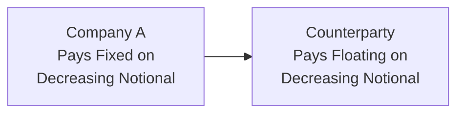
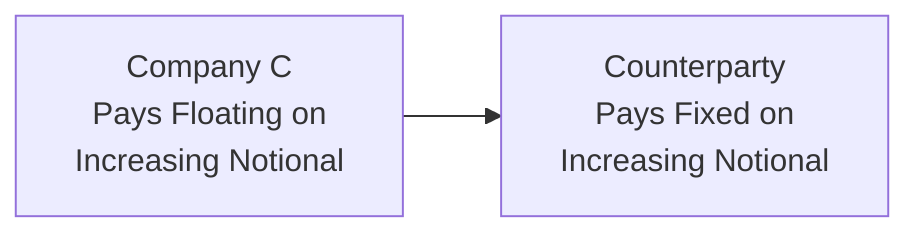

## Overview and Motivation

Let’s say you’re a corporate treasurer—your company just issued a series of loans for a manufacturing facility, and each of those loans amortizes (i.e., principal steadily declines) as you make periodic payments. You want to eliminate exposure to floating interest rates, but you only need to hedge the portion of principal still outstanding. A standard or “bullet” interest rate swap, which assumes a constant notional, doesn’t quite mirror that steadily shrinking loan principal. Enter the amortizing swap—a structured swap designed to match the notional schedule with your exact debt profile.

Likewise, imagine a project with expanding capital expenditures—maybe a wind farm under construction or a new R&D initiative. You need more capital as time goes on, so you'd prefer a hedge that grows along with your funding needs. That’s precisely why accreting swaps exist: the notional starts smaller and gradually increases, matching your rising exposures.

These so-called “structured swaps” are powerful tools for customizing interest rate risk management to evolving cash flow or principal profiles. But their flexible design brings along its own set of complexities, from unique valuation approaches to potentially thinner liquidity in the market. By the end of this reading, you should have a solid grasp on what these swaps are, how they function, and how you can apply them (especially if the exam tries to trip you up with a scenario-based question).

## Understanding Amortizing Swaps

An amortizing swap is an interest rate swap where the notional principal is not fixed. Instead, it decreases according to a predetermined schedule. This schedule often aligns with the underlying amortization of a loan, mortgage, or bond. The structure is intuitive: each payment date, the outstanding notional shrinks—similar to how paying off part of a mortgage each month lowers your balance.

• Matching Cash Flows:  
  Corporations often choose an amortizing swap to match exactly the declining principal of a loan portfolio or a structured note they issued. The floating or fixed interest rate payments on the corresponding swap leg shrink in lockstep with the actual principal, helping keep hedging efficient.

• Replicating the Declining Principal:  
  From a mechanical standpoint, each swap payment is calculated on the current notional. If you’re on the fixed-pay side, you’ll pay a fixed rate times the outstanding notional at that point in time, while receiving a floating rate (or vice versa).

• Use Cases:  
  – Mortgage Servicers: Mortgage servicers often manage large pools of amortizing mortgages. They might use amortizing swaps to hedge the interest rate risk that matches the actual paydown schedule of the mortgages.  
  – Project Finance: Infrastructure or energy projects financed with bonds that feature scheduled redemptions use amortizing swaps to manage the interest rate on the outstanding bonds.

Below is a simplified flow diagram showing how payments on an amortizing swap might look. Think of it like a handshake between two parties exchanging flows on a notional that shrinks over time.



## Understanding Accreting Swaps

Accreting swaps do the exact opposite. Instead of the principal going down, it goes up. That might sound a bit unusual, but consider if you’re building out a new facility in stages. Each new stage might come with additional capital expenditures (and additional floating debt). You’d like to hedge that incremental rate exposure in a single instrument rather than layering on multiple smaller swaps as time goes on.

• Increasing Notional:  
  In an accreting swap, the notional might start at $0 (or a specified lower amount) and then increase at specific intervals or according to certain project milestones. Each time the notional steps up, future interest payments are computed on the higher notional.

• Use Cases:  
  – Construction Projects: Large infrastructure or real estate developments where the capital drawdowns occur over time. Banks often structure interest rate swaps to match capital inflows.  
  – Expanding Portfolios: A manager might anticipate ramping up a portfolio of floating-rate assets, so an accreting swap can hedge the expected incremental interest rate exposure.

Visually, you can imagine flows that expand over time:



## Comparing to Bullet Swaps

A traditional (bullet) swap keeps the same notional principal throughout its life. This is the standard approach for many interest rate swaps: a single notional is agreed upon at initiation, and all fixed/floating exchanges are calculated based on that notional until maturity.  

• Bullet Swap Simplicity:  
  – Easier to price because the notional remains the same.  
  – Typically more liquid, with tighter bid-offer spreads.  

• Structured Swap Complexity:  
  – You have to track the notional schedule, which can be more computationally intensive.  
  – Less standardized, which sometimes reduces liquidity.

## Hedging Applications

Hedgers are drawn to amortizing and accreting swaps because of the pinpoint accuracy they offer when matching changing exposures. For instance:

– Debt Management: A company with a $100 million amortizing note could swap from floating to fixed, ensuring the notional—and therefore the hedge—tracks the loan’s payoff schedule.  
– Project Finance: For a construction project financed in stages, an accreting swap may help manage the risk from the incremental floating-rate borrowings used to fund each project milestone.

There’s a personal story I love to share: I once consulted on an airport expansion project where monthly funding was drawn from different bond issues. We structured an accreting swap so that the time we took down each new bond issue, the notional on the swap stepped up. That meant the airport authority only paid fixed interest on the exact portion of capital that was already deployed—rather than unutilized capital. The result was a pretty big interest savings, not to mention far simpler hedge accounting.

## Valuation Dynamics

Valuing these swaps isn’t vastly different in principle from valuing a bullet swap, but the variable notional schedule adds moving parts. Generally, swap valuation is the net present value (NPV) of the difference between two legs (fixed vs. floating). Let’s break down a prototypical approach:

• Split the Swap into Time Segments  
  The key is to recognize that each period has its own notional. You might conceptualize an amortizing swap as a series of mini-swaps, each with a different notional.  

• Calculate Discount Factors  
  For each payment date t, compute the discount factor DF(t) using the relevant yield curve. In practice, discount factors can be derived from OIS-based curves (Overnight Indexed Swap) or other appropriate risk-free curves (depending on your local environment, e.g., SOFR or ESTR).

• Compute Fixed Leg Value  
  The fixed leg’s cash flows are interest amounts based on the notional at each reset period plus any final principal exchange if that’s part of the deal. Typically, principal isn’t exchanged at the end for interest rate swaps, but the notional profile affects the interest portion significantly. Each interest payment is:

  (Fixed Rate) × (Current Notional) × (Day Count Fraction).

  That cash flow is then discounted back to present.

• Compute Floating Leg Value  
  The floating leg is trickier. Each time the floating rate resets, the notional might have changed. The present value of the floating leg is typically par at a reset date, but with an amortizing or accreting structure, you need to project each upcoming notional and the corresponding floating rate.  

• Combine and Net Out  
  The value of the swap to the fixed-rate payer is:

  Value(swap) = PV(Floating Leg) – PV(Fixed Leg).

  Conversely, if you’re the floating-rate payer, the sign flips.  

In formulaic terms, for an amortizing or accreting swap with T total payment periods, let Notional_i be the notional at each period i. If i-1 to i is a settlement interval, then:

• Fixed Leg Payment at time i:  
  CFᵢ(fixed) = (FixedRate × Notionalᵢ × τᵢ) × DFᵢ  

  where τᵢ is the day-count fraction for that period, and DFᵢ is the discount factor to time i.

• Floating Leg Payment at time i (assuming standard floating reset mechanics):  
  CFᵢ(float) = (RefRateᵢ × Notionalᵢ × τᵢ) × DFᵢ  

The swap’s net present value is the sum over i = 1 to T of [CFᵢ(float) – CFᵢ(fixed)] for whichever side you’re evaluating. The concept is straightforward, but the scheduling of Notionalᵢ complicates the arithmetic—especially if your amortization or accretion formula is irregular or depends on external triggers (e.g., project checkpoints, inflation-based adjustments, etc.).

Below is a very high-level pseudo-code snippet that might appear in a Python-based valuation engine:

```python
import math

def discount_factor(yield_curve, t):
    # yield_curve can be a list or function that gives you zero rates 
    # or discount factors for each tenor.
    # Typically you'd do something like:
    # zero_rate = yield_curve.get_rate(t)
    # return math.exp(-zero_rate * t)
    pass

def pv_structured_swap(fixed_rate, payment_schedule, yield_curve):
    # payment_schedule could contain tuples of (time_i, day_count_fraction, notional_i, forward_float_rate_i)
    pv_fixed_leg = 0.0
    pv_float_leg = 0.0
    for (t_i, dcf_i, notion_i, ff_rate_i) in payment_schedule:
        df_i = discount_factor(yield_curve, t_i)
        # Fixed leg cash flow
        cf_fixed = fixed_rate * notion_i * dcf_i
        # Floating leg cash flow
        cf_float = ff_rate_i * notion_i * dcf_i
        
        pv_fixed_leg += cf_fixed * df_i
        pv_float_leg += cf_float * df_i
    
    return pv_float_leg - pv_fixed_leg
```

Though simplistic, this snippet captures the notion that each time you compute the cash flow, you’re using the relevant notional, day-count fraction, and discount factor for that interval. In the real world, you’ll factor in accrual periods, compounding, possible changes in reference rates, convexity adjustments, etc.

## Liquidity Considerations

Because amortizing and accreting swaps are custom instruments, they lack the uniform standardization found in plain vanilla bullet swaps. The result is:

• Wider Bid-Offer Spreads: Dealers factor in the operational and market risk of warehousing such a position, especially if it’s not easy to hedge the varying notional in the standard swap market.  
• Fewer Participants: Many buy-side firms might not have the appetite or portfolio structure that requires these instruments. So fewer natural counterparties exist.

In practice, large corporate treasuries, banks specializing in project finance, or institutions with structured debt issuance are the biggest users. Outside these circles, heightening complexities and narrower liquidity hamper everyday usage.

## Risks and Challenges

• Mismatch Risk: If the actual principal repayment (or drawdown) schedule changes, you may end up with a mismatch to your swap schedule. That can lead to under- or over-hedging.  
• Credit and Counterparty Risk: Since notional changes over time, your credit exposures shift. The peak credit exposure to your counterparty may be at a period of highest notional or near the front end, depending on the shape of notional changes.  
• Valuation Model Risk: Because the swap introduces a more complicated cash flow schedule, modeling errors can creep in more easily, especially if payments or notional changes are subject to dynamic or uncertain triggers.

## Practical Tips for the Exam

• Understand the Conceptual Difference: The test might present a scenario with a loan that amortizes monthly, then ask which swap structure best hedges the interest rate risk. That’s a classic prompt.  
• Watch Out for Trick Notional Schedules: A question could test your ability to separate a swap into multiple time segments or mini-swaps.  
• Preliminary Calculations: A typical exam question might ask you to compute the net periodic payment in the second or third period once the notional has decreased (amortizing) or increased (accreting). Double-check your day-count fractions and discount factors carefully.  
• Awareness of Real-World Constraints: Sometimes exam items highlight that the structured swap has a slightly higher cost or a “wider spread” due to lower liquidity. If you see that, it’s probably a hint that the question wants you to incorporate real-life market friction in your final recommendation.

## Final Thoughts

Structured swaps—amortizing and accreting—are a prime showcase of derivatives’ flexibility. They bridge the gap between real-world financing patterns and the sometimes unwieldy, one-size-fits-all nature of plain vanilla swaps. If you find yourself in project finance, mortgage servicing, or a corporate treasury seat, it’s only a matter of time before you encounter (and appreciate!) these specialized instruments.

From an exam standpoint, remember the big gist: (1) you’re matching the time profile of notional exposure to the debt or asset you’re hedging, (2) the valuation steps are the same as standard swaps—except you must incorporate a changing notional schedule, and (3) structured swaps generally carry lower liquidity.

Keep practicing with real-world examples—even if just hypothetical—so you can do these calculations in your sleep. Because come exam day, you don’t want to blank on the difference between an amortizing and an accreting swap!

## References and Further Reading

• Tuckman, Bruce, and Angel Serrat. “Fixed Income Securities: Tools for Today’s Markets.”  
• CFA Institute “Fixed Income” Readings on Structured Products.  
• Jarrow, Robert, and Li, Haitao. “Interest Rate Modeling and the Risk Premiums in the Fixed Income Market.”  
• Official CFA Program Curriculum, particularly the segments on swaps, project finance, and advanced hedging techniques.  

## Evaluate Your Understanding: Structured Swaps Quiz



### A company has an $80 million term loan that amortizes by $10 million each year for 8 years. They want to convert their floating rate to a fixed rate. Which swap structure best fits their needs?

- [ ] Bullet swap
- [ ] Accreting swap
- [x] Amortizing swap
- [ ] Basis swap

> **Explanation:** Because the principal of the loan declines over time, an amortizing swap that mirrors this schedule is ideal.  

### Which of the following is most accurate regarding accreting swaps?

- [ ] The notional remains constant throughout the life of the swap.
- [x] The notional increases periodically based on a predetermined schedule.
- [ ] The notional declines periodically based on a predetermined schedule.
- [ ] The notional is reset to zero at each payment date.

> **Explanation:** Accreting swaps incrementally increase the notional at specific intervals or milestones, usually to match expanding funding needs.  

### A mortgage servicer is most likely to use which structured swap to hedge a large pool of amortizing mortgages?

- [x] Amortizing swap
- [ ] Accreting swap
- [ ] Constant maturity swap
- [ ] Basis swap

> **Explanation:** Amortizing swaps align with declining outstanding principal, just like an amortizing mortgage portfolio.  

### Why is it generally more complex to value an amortizing swap than a bullet swap?

- [x] The notional changes over time, requiring piecewise valuation of each period.
- [ ] The floating rate is based on an obscure reference.
- [ ] There is no fixed rate in an amortizing swap.
- [ ] Amortizing swaps generally don’t require discount factors.

> **Explanation:** Changing notional amounts introduce additional layers of complexity, as each payment period has a different underlying principal.  

### Which of the following is a key benefit of an accreting swap for project finance?

- [x] It aligns hedge coverage with incremental borrowings.
- [ ] It keeps the total notional constant over the life of the loan.
- [x] It can be structured to match capital expenditures increasing over time.
- [ ] It suppresses interest rate volatility to zero.

> **Explanation:** Accreting swaps grow the notional to match project milestones, so the hedge remains proportional to the actual financing needs.  

### One potential downside of both amortizing and accreting swaps is:

- [x] Lower liquidity and wider bid-offer spreads.
- [ ] No possibility of early termination.
- [ ] Immediate margin calls under all circumstances.
- [ ] Regulatory disapproval in most jurisdictions.

> **Explanation:** Structured products often trade less frequently, leading to thinner liquidity and unfavorable pricing spreads compared to standard swaps.  

### In practice, an amortizing swap could be viewed as:

- [x] A sum of forward rate agreements with progressively shrinking notionals.
- [ ] A single forward rate agreement.
- [x] A set of mini-swaps, each with a different notional schedule.
- [ ] A put option on interest rates.

> **Explanation:** You can conceptualize the swap as a series of smaller contracts, each with its own (reduced) notional.  

### When discounting future cash flows for a structured swap:

- [x] You must use appropriate discount factors for each payment date.
- [ ] You only need one universal discount factor for all payments.
- [ ] Discounting is optional if the swap is fully collateralized.
- [ ] Discounting is irrelevant if the swap has a floating leg.

> **Explanation:** Each payment date may have a different tenor, so you use distinct discount factors or zero rates for each.  

### Which statement about counterparty risk in structured swaps is correct?

- [x] Counterparty exposure can vary substantially as the notional changes.
- [ ] Counterparty risk is immediately eliminated because notional is changing.
- [ ] Counterparty risk only arises if the fixed leg is large.
- [ ] Structured swaps are free of counterparty credit risk.

> **Explanation:** Adjusting notionals means credit exposure can peak at the largest notional point or in periods where interest rate volatility is highest.  

### An accreting swap can be perfectly appropriate under which of the following conditions?

- [x] True
- [ ] False

> **Explanation:** If you expect your need for interest rate hedging to grow over time, a notional that accretes can be a natural fit to match your liabilities or assets as they expand.  


