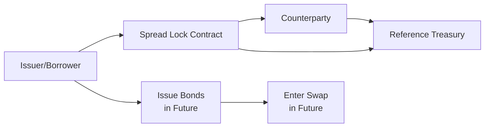

## Introduction

I remember a slightly awkward conversation I once had with a colleague who was panicking over the possibility of swap spreads widening just before her company planned to issue debt. She was worried about that last-minute volatility in spreads, which could totally ruin the economics of the deal—like being locked out of a party you’ve already bought a fancy suit for. Eventually, we found something called a spread lock, which helped her organization rest a little easier. In this section, we’ll talk about spread lock agreements: what they are, how they work, why they’re crucial for anyone engaging in future interest rate swaps, and how you might see them on the CFA® Level I curriculum or in real-world transactions.

## Key Concepts

A spread lock is a customized forward contract that protects an investor or issuer from changes in the swap spread before entering an actual interest rate swap. The “swap spread” is typically the difference between the fixed rate on an interest rate swap and the yield of a corresponding government bond of a similar maturity (often a U.S. Treasury bond if you’re in the U.S. market).

• By “locking in” that spread, you effectively eliminate the risk that the spread portion of your deal will move against you in the future.  
• If you’re going to issue new bonds or refinance at a specific date and plan to convert them through a swap (e.g., from fixed to floating), a spread lock helps ensure that your ultimate interest expense or income (depending on your swap position) doesn’t blow up due to a sudden shift in the swap market’s risk premium over the benchmark Treasury curve.

Before we explore the mechanics and valuation, let’s clarify some foundational terms:

• Spread Lock: A forward agreement aimed solely at locking in the swap spread.  
• Interest Rate Lock: A broader forward arrangement to lock in an interest rate—not merely the spread.  
• Reference Treasury: The government yield curve (e.g., the Treasury yield curve in the U.S.) that represents the “risk-free” portion of interest rates.  
• Hedging Spread Risk: The practice of mitigating exposure to changes in swap spreads relative to a government bond.  
• Synthetic Conversion: Using derivatives to transform a bond’s coupon from fixed to floating or vice versa.

## Mechanics of Spread Locks

The objective of a spread lock is to isolate and lock in the difference between the swap fixed rate and the reference Treasury yield. Let’s imagine you are an issuer planning to come to market in, say, three months with a new bond sale. You also anticipate entering a pay-fixed swap to convert your future fixed-rate bond into a synthetic floating-rate liability. You worry that solely focusing on the yield environment might distort the real cost of the swap if swap spreads widen or narrow independently of government rates.

A spread lock contract usually follows this sequence:

1. You and a counterparty agree on a notional amount for the future swap and the maturity of that future swap (or the synthetic structure you envision).  
2. You negotiate a “locked spread” over the reference Treasury yield. For example, you might lock in a swap spread of 50 basis points over the 5-year Treasury yield.  
3. When the agreed-upon date arrives (e.g., three months later), you compare the actual swap spread in the market with your locked spread.  
4. Depending on whether the actual swap spread is above or below your locked spread, one party will make a payment to the other party.  
5. You then enter (or choose not to enter) your final swap. Regardless, you’ve effectively hedged the risk of that swap spread drifting.

It’s all about taking out uncertainty related to the difference between the swap and the government yield curve, as opposed to the underlying risk-free rate itself.  

### Diagram: Basic Structure of a Spread Lock

Below is a simplified mermaid diagram to visualize how a spread lock revolves around a reference Treasury and the swap spread:

• The Issuer/Borrower wants to protect against changes in the swap spread.  
• The Counterparty takes the opposite side of the trade.  
• Both parties reference Treasury yields to isolate the spread portion.

## Valuation

Valuing a spread lock, at its core, means determining the present value of the expected difference between the actual future swap spread and the locked spread. The “spread lock payoff” can be visualized much like a forward contract payoff:

Payoff at settlement date ≈ (Notional) × (Difference between actual swap spread and locked spread) × (Discounting factor based on time to maturity).

• If the actual spread is higher than your locked spread, you (as the spread lock buyer) gain because you’d theoretically be paying a fixed rate that’s lower than what the market otherwise demands.  
• If the actual spread is lower, you lose on the spread lock because your locked spread is above the market’s new, narrower spread.

One subtlety is that the notional in a spread lock can be tailored to reflect only the impact of the spread difference on the final swap payments. Often, an approximate formula for the final settlement looks like:

(Spread observed – Spread locked) × Notional × Duration Factor

Where “Duration Factor” indicates the sensitivity of the swap’s value to a 1% change in the swap spread. In a more precise approach, we’d discount each potential outcome (i.e., each possible future spread) using appropriate discount factors and apply a risk-neutral valuation approach, similar to how you’d value forward claims on other interest rate instruments.

## Practical Examples and Strategies

Let’s say you’re the treasurer for a large corporation, and you plan to issue $100 million in 5-year notes next quarter. You’d like to lock in a floating rate afterward. That means you’ll pay fixed on the swap side and receive floating. But, you suspect that swap spreads might widen because of potential market volatility. If the swap spread jumps from 45 basis points to 60 basis points, that extra 15 basis points could cost you a lot over the life of the swap.

Hence, you enter a spread lock with a notional near $100 million and fix your spread at 45 basis points. When you finally go to the market:

• If the actual 5-year swap spread is at 60 basis points, your spread lock produces a gain. That gain offsets the higher cost of paying fixed at 60 basis points over Treasury in your subsequent swap.  
• If the swap spread remains at 45 basis points or even declines, your final swap might be cheaper than you feared, but the spread lock position might incur a mark-to-market loss that compensates for that favorable outcome.

Regardless, you have peace of mind knowing your cost is effectively known up front, minus the natural up-and-down noise in the underlying interest rates themselves.

### Synthetic Conversions with Spread Locks

A big use case for spread locks is in “synthetic conversions.” You might say, “Wait, I want to issue fixed. Why bother?” The trick is that sometimes you can get better pricing as a fixed-rate issuer at the time of issuance but prefer a floating-rate liability for economic reasons. Or maybe you want a particular hedge ratio in your portfolio. Using interest rate swaps to convert your debt is straightforward, but the swap spread is part of the cost. By locking that part, you can plan around your final real cost more precisely.

## Risk Management Considerations

### Separating Spread Risk from Rate Risk

A neat aspect of spread locks is that they allow you to hedge the spread risk, while you can handle the outright interest rate exposure separately. Typically, you might do this if you already have a partial hedge on the interest rate via a Treasury lock (thus hedging the underlying government bond yield), so all that remains to hedge is the spread portion. If you’re comfortable with interest rate movement but not comfortable with how swap spreads might fluctuate, a spread lock is your targeted solution.

### Default or Counterparty Risk

Because spread locks are often arranged over-the-counter (OTC), you have to consider the usual suspects: credit risk and counterparty risk. Clearing or collateral agreements (if your transaction is bilateral) can mitigate this exposure, but these might add extra administrative or cost burdens.

### Market Liquidity

Spread locks aren’t always as liquid as standard interest rate futures or more common interest rate swaps. That’s not to say you can’t do them—rather, you usually set them up with dealers who are quite active in the market. But in times of stress, bid-ask spreads can widen, which might reduce the cost-effectiveness of the hedge.

## Best Practices and Pitfalls

• Accurately Forecasting Notional Amounts: If you lock in a spread for a notional that doesn’t match what you eventually finance, you’ll have a mismatch, or you’ll need to offset or terminate part of your hedge.  
• Overlooking Transaction Costs: The bid-ask spread, plus any premiums or fees, can eat into the benefits.  
• Coordinating with Treasury Locks or Other Hedges: Make sure your “legwork” is consistent. If you also have a forward Treasury lock in place to hedge overall interest rate risk, you need to coordinate that with your spread lock to avoid double-layers or missing coverage.  
• Monitoring Market Movements: Spread locks typically settle in cash. If your locked spread is significantly off from the realized spread, the impact is magnified by your notional amount. Good internal controls can help you manage or offset any unexpected settlements.

## Additional Insights

### Complex Pricing Models

In advanced applications, banks or large corporates might use sophisticated models that incorporate the correlation between the swap spread and Treasury rates. Spread lock valuation can become quite technical when you consider that swap spreads can be influenced by liquidity conditions, credit premiums in the interbank lending market, and the supply-demand dynamics of government bond markets.

### Real-World Anecdote

Think about my friend from earlier: Her main fear was that she’d finalize the swap at a time when the markets were suddenly demanding an arm and a leg for that swap spread—completely out of proportion to any changes in headline interest rates. Using a spread lock meant she could separate that risk from general rate movements. So, if yields soared or sank, that was less of a worry because a different hedge might manage that portion. The spread portion was the piece causing her sleepless nights, and the spread lock was like a warm blanket.

## Conclusion

Spread lock agreements are a powerful tool for market participants who regularly tap the swap market. By allowing you to “lock in” the spread to a reference Treasury, they effectively reduce a potent slice of uncertainty. Just be mindful of how they fit into your broader interest rate risk management strategy, and pay attention to liquidity and counterparty risks. In a sense, spread locks let you “put a pin” in one part of the yield curve equation, giving you more confidence in your future borrowing or investment decisions.

From a CFA® exam standpoint, it’s essential to recognize spread locks as forward-type instruments for the swap spread alone, to see precisely how the valuation logic parallels that of forward rate agreements, and to grasp how they integrate into corporate liability management or investment hedging.

## Exam Relevance and Final Tips

• Understand how spread risks differ from outright curve risks.  
• Know that a spread lock pays out based on the difference of the actual swap spread versus the locked spread.  
• In exam item sets or constructed-response questions, be prepared to highlight how an issuer or an investor might use a spread lock to hedge or speculate on changes in the swap spread (less likely speculation for typical exam scenarios, but still feasible).  
• Be ready for potential synergy with forward Treasury locks or interest rate futures/tradable swaps.

## References

• Choudhry, Moorad. “The Bond & Money Markets: Strategy, Trading, Analysis.”  
• Fabozzi, Frank J. “Bond Markets, Analysis, and Strategies.”  

• CFA Institute. Level I Curriculum, 2025 Edition.

--------------------------------------------------------------------------------

## Practice Questions on Spread Lock Agreements



### In a spread lock, which risk is specifically targeted for hedging?

- [ ] The full interest rate risk, including changes in government bond yields.
- [x] The risk of changes in the differential between the swap fixed rate and a government benchmark yield.
- [ ] A counterparty’s default risk on the swap itself.
- [ ] The risk of changes in the floating reference rate (e.g., LIBOR).

> **Explanation:** A spread lock isolates the “spread risk” over a reference Treasury benchmark, rather than the entire interest rate movement.

### Which best summarizes how a spread lock is settled at maturity?

- [x] The difference between the actual swap spread and the locked spread is settled in cash.
- [ ] The parties exchange notional amounts based on the locked spread.
- [ ] The fixed rate of the swap is reset to the locked spread amount.
- [ ] The entire future swap is canceled and replaced by a new contract.

> **Explanation:** A spread lock typically settles in cash, where the difference between the observed swap spread and the locked spread applies to the notional.

### A corporation that wants to issue fixed-rate debt in three months but convert it to floating rate is most likely to use a spread lock to hedge:

- [ ] Risk that the reference Treasury yield will drop significantly.
- [x] Risk that the swap spread used in the future swap will widen.
- [ ] Credit risk of government securities.
- [ ] The liquidity risk of the corporate bond primary market.

> **Explanation:** The main purpose of a spread lock in this scenario is to manage the future swap spread, not the absolute level of interest rates.

### If the actual swap spread is lower than the locked spread at settlement:

- [x] The spread lock buyer effectively loses on the contract.
- [ ] The spread lock buyer gains because the cost of the future swap is lower.
- [ ] No monetary exchange occurs.
- [ ] The spread lock automatically extends for an additional term.

> **Explanation:** A buyer of the spread lock benefits if actual spreads go above the locked level, so if the actual spread is lower, the buyer loses.

### Which is a key difference between a spread lock and a forward rate agreement (FRA)?

- [x] A spread lock is focused on the spread to a reference Treasury, whereas an FRA focuses on an absolute interest rate.
- [ ] FRAs are only used by speculators, whereas spread locks are only used by hedgers.
- [ ] Spread locks have physical settlement in almost every case, unlike FRAs.
- [ ] FRAs are typically used to lock in equity index levels.

> **Explanation:** A spread lock concentrates on the difference (swap spread) rather than the full interest rate. An FRA usually locks in the full short-term interest rate.

### In terms of credit and counterparty risk, spread locks:

- [ ] Do not have any counterparty risk because they are exchange-traded.
- [ ] Always require an upfront premium to the seller.
- [x] Expose both parties to bilateral credit risk, similar to other OTC derivative contracts.
- [ ] Are automatically guaranteed by central clearing requirements for all maturities.

> **Explanation:** Spread locks are usually OTC derivatives, so bilateral credit risk and potential for collateral posting are key considerations.

### What is a typical use of a spread lock by an issuer who plans to tap the debt market soon?

- [x] They lock the swap spread to hedge potential volatility before converting the issued bond’s rate structure.
- [ ] They lock the entire bond yield, including credit spreads, so that there is no yield fluctuation at all.
- [ ] They remove all variations in the coupon payments by switching to an equity-based derivative.
- [ ] They secure the entire notional in a collar strategy for yield enhancement.

> **Explanation:** Issuers commonly use spread locks when they plan to issue bonds in the near future and convert them synthetically to floating or fixed rates.

### Assume an issuer locks a spread of 30 bps over Treasuries, but at settlement the actual spread is 40 bps. Who receives a payment?

- [x] The spread lock buyer receives a payment because the actual spread is higher.
- [ ] The spread lock buyer makes a payment to the seller.
- [ ] No payment is exchanged; only the swap rate changes.
- [ ] Both the buyer and seller receive an equal settlement.

> **Explanation:** The buyer benefits when the actual spread exceeds the locked spread.

### If the issuer’s main fear is that overall interest rates will skyrocket, but they think the spread remains stable, they might find:

- [ ] Only the spread lock is needed.
- [ ] A spread lock is necessary to mitigate overall interest rate moves.
- [x] A spread lock insufficient, because it doesn’t hedge absolute interest rate hikes.
- [ ] No derivatives necessary, because spreads are more important than the underlying rates.

> **Explanation:** A spread lock solely targets spread risk. If a big jump in the overall interest rate is a concern, another instrument (like a Treasury lock) would be needed.

### Spread locks primarily target:

- [x] True
- [ ] False

> **Explanation:** Yes, they specifically target the difference between the swap rate and a Treasury benchmark, rather than the entire interest rate environment.


