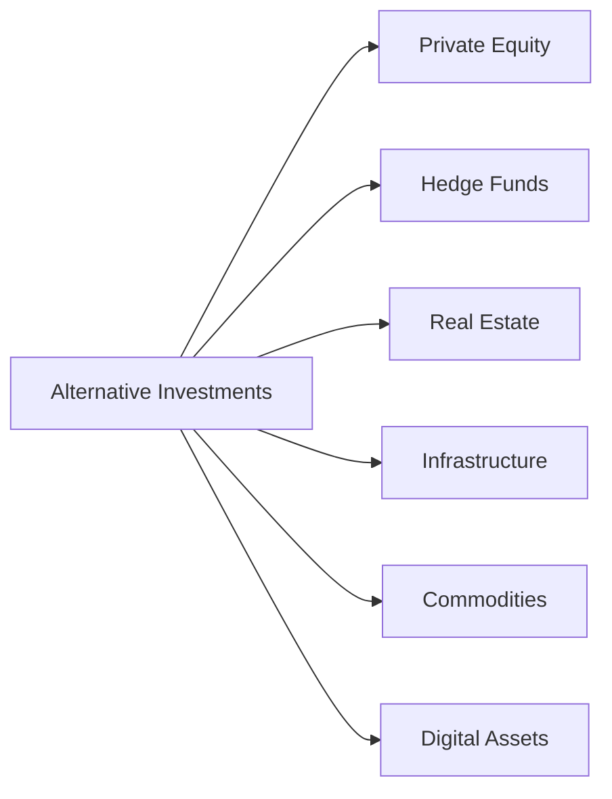
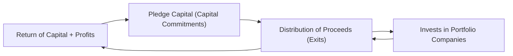

## Introduction

If you’ve ever heard someone casually mention that they have money in “hedge funds” or “venture capital” and found yourself nodding but silently wondering, “What does that really mean?”—you’re not alone. Many folks, even those well-versed in stocks and bonds, step into the world of alternative investments (or “alts,” as people like to say) and discover, well, another universe. These are investments that sit outside traditional publicly traded equities and fixed income. 

And trust me, it can feel like stepping through a hidden door, complete with its own language—“alpha,” “beta,” “illiquidity premium”—plus structural oddities that differ quite a bit from, say, your everyday stock portfolio. In this section, we’ll unravel the definition of alternative investments, poke around their key attributes, and get a handle on the overall market size and trends. 

## Broad Definition of Alternative Investments

Before we define them, here’s a short anecdote: I remember the first time I encountered a hedge fund manager. I pictured this big shot in a fancy suit, trading 24/7. But hedge funds can be more subtle—some strategies revolve around taking slow, methodical “long-short” positions that can actually dampen volatility. Or so they say. The point is: alternative investments are anything that’s not your usual go-to (like publicly listed equities or government bonds). 

Technically, “alternative investments” includes a wide range of asset classes:  
• Private equity (including venture capital and buyouts)  
• Hedge funds (multi-strategy, long-short, market neutral, etc.)  
• Real estate (both private market holdings and some publicly listed vehicles like REITs)  
• Infrastructure (think toll roads, airports, utilities)  
• Commodities (physical, futures, farmland, timberland)  
• Digital assets (cryptocurrencies, tokenized securities)  

In a nutshell, whenever you step off the beaten path of heavily regulated, exchange-traded instruments, you’re probably dealing with an alternative investment. Some folks also lump in “alternative strategies” on top of existing structures, such as an ETF that replicates hedge fund index returns—yes, alt strategies come in all shapes and sizes.

## Key Differentiators

So, what sets alternative investments apart from traditional ones? A few crucial things:

• Liquidity (or lack thereof): Alts are often illiquid, meaning you can’t convert them to cash right away (without potential losses or fees).  
• Unique risk-return profile: They may behave quite differently from the stock market, presenting the possibility of lower correlation with typical asset classes.  
• Specialized structures: General partners, limited partnerships, lock-up periods, capital calls—these are standard in many alts.  
• Higher fees and complexity: It’s not uncommon to see a “2 and 20” fee structure in hedge funds or private equity, meaning 2% annual management fees plus 20% of profits (carried interest).  

One of the neat aspects of alternative investments is diversification—by adding an investment that zigged while your equities zagged, you might reduce overall portfolio volatility. But on the flip side, complexity, higher fees, and regulatory constraints can make them trickier to evaluate. 

## The Global Market: Size and Scope

The alternative investment industry has exploded in size over the past two decades. Major factors include the global search for yield in a low-interest-rate environment, institutional appetites for private markets, and the rise of new structures like interval funds that cater to retail investors. Today, the total “alternatives AUM” (assets under management) is measured in the tens of trillions of US dollars. Yes, that’s with a “T.”  

Let’s visualize a basic classification of alt segments:

In this simple diagram, each major branch represents a broad category—within each one, there could be dozens of sub-strategies. For instance, “Private Equity” could have venture capital, growth equity, buyouts, and distressed debt. “Hedge Funds” might include macro, long-short equity, event-driven, and more.

## Major Players in the Market

• Institutional Investors: Pensions, endowments, sovereign wealth funds, and insurance companies. They often include alternatives in their portfolio mix to achieve higher returns or to offset liabilities.  
• HNWIs (High-Net-Worth Individuals): People who want to diversify into private markets; often they invest through specialized funds.  
• Family Offices: Typically manage wealth for one or multiple families, and many have turned to sophisticated alt strategies to preserve and grow capital across generations.  
• Retail Investors: Historically less exposed due to accreditation requirements or liquidity constraints, but there’s a shift (the so-called “democratization” of alternatives) as new platforms and structures open the door more widely.  

## Macroeconomic Backdrop: Why Alts Now?

A key driver behind the surge in alts is the global macroeconomic environment. Lower interest rates in many developed markets have sent traditional fixed-income yields to rock-bottom levels in recent years. Institutional investors, desperate for yields that can cover obligations, have turned to real estate, infrastructure, and private credit to get a bit more bang for their buck. Plus, growth equity and venture capital can offer that juicy potential for higher returns, albeit with higher risk.

Monetary policy can also shape the risk appetite in alternatives—when rates are low and liquidity is ample, private equity firms borrow at cheap levels, fueling buyouts. Hedge funds might also thrive in volatile markets, using advanced derivatives or arbitrage trades. Or they might suffer if markets become sideways and correlation goes up. 

## Regulatory Evolution and Technological Impacts

It’s not just about interest rates—regulatory changes open up new possibilities. Over the last decade or so, we’ve seen some easing of restrictions around who can invest in certain private placements, though there are still accreditation requirements in many jurisdictions. Securities regulators have been busy balancing investor protection with the desire to cultivate robust capital markets.  

Alongside this, “Regtech” (regulatory technology) has emerged as a big deal. It aims to help managers comply with complex global rules. From automated compliance reports to AI-powered risk monitoring platforms, technology is lowering the barriers to entry and offering more transparency.

Technological developments aren’t just about compliance. Digital asset platforms, tokenization of real estate, and advanced analytics are reshaping the entire structure of what can be considered “alternative.” It’s not science fiction anymore—some real estate property titles are now maintained on distributed ledgers, allowing fractional ownership.  

## Common Terminology and Concepts

A quick rundown of a few essential alt-investment terms:

• “Alpha”: That elusive extra return above market benchmarks. In alternatives, managers often pitch alpha generation as the main draw.  
• “Beta”: The part of returns driven by general market movements. Good to keep track of it in both traditional and alternative contexts.  
• “Illiquidity Premium”: The extra potential return that investors demand for locking up their money in investments with limited liquidity, such as private equity or real estate.  
• “Institutional Investors”: Entities with large amounts of capital (like pension funds) that often have dedicated teams to explore alternative assets.  
• “Sovereign Wealth Fund (SWF)”: State-owned funds with a long horizon, frequently investing in infrastructure, private equity, or real estate.  
• “Diversification”: One reason alts are appealing is the potential for uncorrelated returns.  
• “Regtech”: Tools to help manage compliance and regulatory obligations.  

## Potential Benefits of Alternatives

1. Diversification. A big reason alts are popular is that their performance might not move in lockstep with public markets. For example, farmland might hold its value even when equities slump because people still need to eat, right?  
2. Enhanced Return Potential (Alpha). Private equity or hedge fund managers often claim they can beat the market through active strategies and unique access.  
3. Inflation Hedge. Some alts, such as real estate or commodities, have historically increased in value or returned higher yields in inflationary environments.  
4. Access to Private Growth Opportunities. Venture capital invests in early-stage companies that might become the next big tech giant.  

## Challenges and Risks

1. Illiquidity. Try selling a 30% stake in a private biotech start-up overnight—spoiler alert, you probably can’t.  
2. Complexity and Fees. The structures can be dizzying, and the “2 and 20” model embedded in many hedge funds or PE firms can significantly erode net returns unless performance is truly exceptional.  
3. Regulatory Constraints. Different jurisdictions have different rules, especially for cross-border investments.  
4. Operational Risk. Alternative strategies might rely on sophisticated (or even opaque) processes that, if not well-run, can collapse quickly.  
5. Lack of Transparency. Many alt vehicles do not publish their full holdings daily the way mutual funds do.  

## Real-World Example

Let me share a short story: A friend of mine who runs a small software business decided to raise capital through a private equity fund. The negotiation involved complicated term sheets, carried interest clauses, and future exit strategies. Because the private equity fund locked in its capital for 8–10 years, it had the flexibility to support the company’s expansion. Meanwhile, if the friend had tried raising funds through public bonds, it would have been complicated, not to mention the higher interest expense. This scenario highlights how alternatives can fit unique business needs and provide distinct avenues for investor returns.

## Exam Tip: Putting It All in a Portfolio

For an exam question, you may be asked to demonstrate how adding a 10% allocation to private equity might shift a portfolio’s expected returns and standard deviation, or how macroeconomic shifts (like rising rates) could affect real estate valuations. Prepare to show the mechanics of risk calculations and how correlation affects portfolio variance. Also, be ready to discuss the intangible aspects, like the illiquidity premium and evaluating manager skill (alpha vs. luck).

## Practical Diagram of Capital Flows in Alternatives

Imagine a simplified version of how money flows in a private equity commitment:

1. The Limited Partner promises capital to the Private Equity Fund (General Partner, or GP).  
2. The GP draws down (calls) that capital when making investments.  
3. Over time, the GP sells or exits those investments, distributing the capital gains to the LP.  

## Final Exam Tips

• Understand Terminology. Be absolutely clear on terms like alpha, beta, illiquidity premium, and diversification. The exam often tests conceptual clarity.  
• Quantify the Impact. Practice short calculations of how a small alt allocation changes risk-return profiles.  
• Keep an Eye on Macroeconomics. Whether it’s interest rate policy or an economic downturn, these shifts can have a huge effect on alts.  
• Regulatory and Compliance Angles. The CFA exam may include scenario-based questions about how new regulations could affect investor allocations.  
• Evaluate Manager Skill. Distinguish between skill-based manager returns (pure alpha) and returns that can be attributed to market beta or style factors.  

## References

• Alternative Investments: A Primer for Investment Professionals, CFA Institute Research Foundation.  
• Donald R. Chambers et al., CAIA Level I: An Introduction to Core Topics in Alternative Investments, Wiley.  
• CFA Institute Official Curriculum (various volumes).  

## Test Your Knowledge: Defining Alternative Investments and Market Overview



### Which of the following assets is generally considered part of alternative investments?
- [ ] Investment-grade corporate bonds
- [x] Hedge funds
- [ ] Exchange-traded index funds
- [ ] Short-term money market instruments

> **Explanation:** Hedge funds are typically categorized as alternative investments due to their unique fee structures, investment strategies, and regulatory environment.

### Which term describes the added compensation investors demand for holding assets that cannot be easily sold?
- [ ] Diversification benefit
- [ ] Beta premium
- [x] Illiquidity premium
- [ ] Idiosyncratic premium

> **Explanation:** The illiquidity premium is the extra return investors expect for locking away their capital in less liquid assets.

### What is one of the main reasons institutional investors allocate funds to alternatives?
- [ ] To reduce manager complexity
- [ ] Because they are required by law
- [x] In search of enhanced returns or diversification
- [ ] To follow retail investor trends

> **Explanation:** Institutional investors often seek the higher return potential and diversification benefits that alternatives can provide.

### Which of the following statements best describes alpha in investment terms?
- [x] The excess return an investment generates over a designated benchmark
- [ ] The risk-free rate of return
- [ ] The average return on government bonds
- [ ] The portion of returns explained by overall market movements

> **Explanation:** Alpha measures performance beyond what a passive benchmark would provide, reflecting the manager’s skill or unique strategy.

### When interest rates are very low, why do some investors turn to private debt or real estate?
- [ ] These assets do not require long holding periods
- [ ] They move perfectly in tandem with bonds
- [ ] They systematically lose value
- [x] They may offer higher yields to compensate for added risk

> **Explanation:** In a low-rate environment, investors often seek higher-yielding alternatives (like private loans, real estate) that may compensate for additional risks.

### Which term refers to a state-owned investment fund, often used to store and grow a nation's wealth?
- [x] Sovereign Wealth Fund
- [ ] High-Net-Worth Individual
- [ ] Special Purpose Vehicle
- [ ] Pension Endowment

> **Explanation:** Sovereign Wealth Funds are government-owned investment funds with potentially large pools of capital, investing in various asset types, including alternatives.

### One characteristic that often differentiates alternative investments from stocks and bonds is:
- [ ] They always produce guaranteed returns
- [x] They typically have unique structures and less frequent trading
- [ ] They are traded on public exchanges
- [ ] They are less risky than Treasury bonds

> **Explanation:** Alternatives frequently have specialized or less transparent structures, with lower liquidity and more complex trading terms than listed securities.

### How do regulatory changes typically impact alternative investments?
- [ ] They eliminate all manager fees
- [ ] They prevent new entrants into the market
- [x] They can influence fund structures and investor accessibility
- [ ] They have no effect at all on alternative investing

> **Explanation:** Regulatory developments can reshape how managers structure funds, who is allowed to invest, and what kind of disclosures are required.

### A major selling point for many alternative investments is:
- [x] Potential for diversification benefits
- [ ] Low fees and zero risk
- [ ] Immediate liquidity at all times
- [ ] Complete transparency on daily holdings

> **Explanation:** Many alternative assets exhibit lower correlation with traditional markets, potentially offering diversification benefits.

### True or False: Family offices are generally uninterested in alternative investments.
- [ ] True
- [x] False

> **Explanation:** Family offices frequently invest in alternatives such as private equity, hedge funds, and real estate to diversify and grow wealth over the long term.


