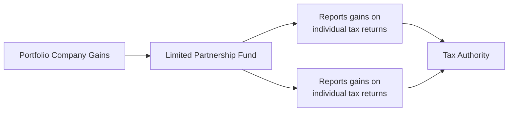

## Introduction
Taxation can feel overwhelming, especially when we start looking at how funds in alternative investments are set up. I remember the first time I heard someone say, “Oh, our private equity vehicle is domiciled in the Cayman Islands,” and I thought, “Uh, wait—why the Cayman Islands?” Right away, my mind pictured sunlit beaches, but, in reality, these choices are about tax neutrality, investor protection, and regulatory flexibility. Understanding how jurisdictions and legal structures affect taxes is a major piece of the puzzle when you’re analyzing alternative investments—be they private equity, hedge funds, or real estate investments.

This section takes a close look at the broad tax and jurisdictional issues you'll face in alternative investments. We’ll talk about domestic fund domiciles (like Delaware in the U.S.) and offshore jurisdictions (like the Cayman Islands, Luxembourg, and more). We’ll also review pass-through entities, highlight real estate-specific vehicles (e.g., REITs, REMICs), and look at how global regulations such as FATCA and CRS might influence your decisions. So let’s dive in.

## Core Domiciles and Why They Matter
Fund managers often debate which jurisdiction is “best” for domiciling a fund. Trust me: there’s no one-size-fits-all answer. Different locations offer different advantages, whether it’s flexible fund structures, favorable tax regimes, or minimal administrative burdens.

• Delaware (U.S.): In the United States, Delaware is famous for its well-developed business laws, investor-friendly courts, and robust legal precedents. Delaware LLCs and Limited Partnerships allow pass-through taxation, meaning the fund doesn’t pay taxes at the entity level. Instead, each investor is taxed based on personal tax circumstances. This pass-through treatment is often considered simpler and can avoid that dreaded double taxation.

• Cayman Islands: Cayman is a major global player for offshore funds. Many fund sponsors choose this domicile because the jurisdiction has no direct taxes (no corporate tax, no capital gains tax). That said, you might still pay taxes in your own home country once you distribute or realize the gains. From a compliance perspective, Cayman is known for flexible regulation suited to institutional-quality funds, though transparency requirements have grown stricter in recent years.

• Luxembourg: Within the European Union, Luxembourg stands out for its sophisticated legal frameworks supporting alternative investment vehicles (Specialized Investment Funds, Reserved Alternative Investment Funds, etc.). Luxembourg-based structures often benefit from EU directives and tax treaties, and they allow cross-border marketing—an enormous plus if you’re targeting European institutional investors.

In many cases, choosing the right domicile comes down to knowing your investor base. If the majority of investors are from the U.S., a Delaware LP might do the trick, whereas if you have global investors seeking a neutral tax-efficient jurisdiction, Cayman or Luxembourg may be more appropriate.

## Pass-Through Structures and Tax Efficiency
Now, let’s chat about pass-through entities—these are often limited partnerships (LPs) or limited liability companies (LLCs) that don’t pay corporate tax at the entity level. Instead, income “passes through” to investors:

• General Structure: Imagine a private equity fund structured as a Delaware LP. The partnership receives capital from Limited Partners (LPs) and is managed by a General Partner (GP). Whatever income or gains occur at the partnership level flow straight to the individual partners, who report it on their personal returns. 

• Why Pass-Through? The biggest appeal is avoiding double taxation—where income is taxed once at the corporate level and again when distributed to shareholders. If you’ve ever studied corporations paying dividends, that’s exactly the scenario pass-through funds aim to avoid. 

Below is a super-simple visual representation of how pass-through taxation might look:

In a pass-through structure, the fund collects gains but does not pay a corporate-level tax. Instead, GPs and LPs handle taxes in their own respective jurisdictions based on distributed income.

## Withholding Taxes, Deferral Strategies, and Treaty Benefits
Anytime you hear the words “cross-border investing,” think of withholding taxes. When a non-resident invests in a specific country’s securities, the local government may require the payer (for example, a dividend-issuing corporation) to withhold a set percentage of taxes before money even reaches the investor. 

• Withholding Rates: Rates can vary wildly, from 0% in some favorable treaty scenarios all the way to 30% or more in others. Sometimes, if there is a good Double Tax Treaty in place between the investor’s home country and the source country, the effective rate can be significantly reduced.

• Deferral Strategies: Some investors try to capitalize on strategies that allow reinvestment of gains before any taxation event is triggered, effectively deferring taxes. A classic approach is reinvesting distributions in vehicles that don’t force recognized gains until liquidation. However, keep an eye on compliance laws such as Passive Foreign Investment Company (PFIC) rules in the U.S., which can limit deferral for offshore mutual funds and other foreign investments.

• Treaty Benefits: Cross-border deals often rely heavily on bilateral or multilateral tax treaties. These treaties cultivate smoother financial flows by eliminating or reducing double taxation. For instance, a firm in Luxembourg may leverage the country’s extensive tax treaty network with other EU nations and beyond, making it simpler to mitigate withholding taxes on dividends, interest, or royalties paid across borders.

## Carried Interest: The Elephant in the Room
If there’s one topic that sets off lively debates, it’s carried interest—or “carry.” Carried interest is the share of profits a General Partner receives from the fund’s investments, typically around 20%. The controversy arises (at least in some jurisdictions like the U.S.) because carry is often taxed at capital gains rates, which can be substantially lower than ordinary income tax rates.

In many places, the argument is that the GP is performing a service (managing money) and should be taxed accordingly, rather than enjoying the low capital gains rates designed for long-term investors. But from a fund manager’s perspective, carried interest is shaped by sweat equity and entrepreneurial risk-taking. If you ever see “carried interest reforms” in legislative discussions, keep an eye on it—it can drastically change net returns for GPs and alter the entire economics of private equity and hedge fund compensation.

## Addressing Double Taxation and Unintended Consequences
Double taxation occurs when the same income is taxed by two (or more) jurisdictions. Without careful planning, an alternative investment structure might inadvertently attract more taxation than necessary. For instance, if you have a corporation in Country A investing in real estate in Country B and then distributing gains to investors in Country C, it’s possible to get taxed multiple times unless the structure is planned well.

So how do you avoid it?
• Pass-through structures: Partnerships, LLCs, or other vehicles that flow income directly to investors.  
• Offshore holding companies in treaty-friendly jurisdictions: Think about a stable, recognized location that has favorable double-tax treaties.  
• REITs and REMICs for real estate: These vehicles often come with special tax treatments that avoid corporate-level taxation if certain distribution and operational requirements are met.

## Real Estate Vehicles: REITs and REMICs
Real estate investment trusts (REITs) and real estate mortgage investment conduits (REMICs) have unique tax advantages that encourage real estate participation:

• REITs: A REIT that meets certain distribution thresholds (often around 90% of taxable income) can avoid federal corporate income tax in the U.S. By distributing most of its earnings, the REIT structure in effect passes income through to shareholders, who then pay taxes at their own rates. This arrangement can be pretty compelling if you want a stable yield from property assets without corporate-level taxation.

• REMICs: These hold pools of mortgages and issue mortgage-backed securities. A REMIC can transform mortgage cash flows into different tranches with unique risk/return profiles. They also get specific tax benefits, as the REMIC entity itself isn’t taxed on mortgage interest—taxation occurs at the investor level according to each tranche’s structure.

## Navigating Regulatory Reporting: FATCA and CRS
Let’s talk about compliance. Funds operating globally wrestle with obligations like the U.S. Foreign Account Tax Compliance Act (FATCA) and the Common Reporting Standard (CRS), an initiative led by the OECD. FATCA requires foreign financial entities to identify U.S. account holders and report them to the IRS, or face steep withholding taxes. CRS similarly requires reporting on financial accounts held by non-residents to their home-country tax authorities.

So, it’s not enough to say, “Well, I’ll just pop my fund in an offshore haven and forget about regulation.” Those days are long gone. If you hold U.S. assets or have U.S. investors, you’ll often be pulled into FATCA obligations. Meanwhile, CRS means that if you’re in just about any major financial center, you’ll be expected to report relevant data on your investors to ensure cross-border tax compliance.

## Practical Example: Modeling Net Returns After Withholding
Suppose you’re looking at a cross-border private debt investment. There’s a 15% withholding tax on interest payments from Country X. You expect a 10% gross return from the loan. Let’s do a quick simplified approach to see how that might look for an investor.

Assume $1,000,000 in principal:

• Gross interest = $1,000,000 × 10% = $100,000.  
• Withholding tax = 15% × $100,000 = $15,000.  
• Net interest (before local investor taxes) = $85,000.  
• Net return on principal = $85,000 / $1,000,000 = 8.5%.  

In short, that 15% withholding tax might reduce a 10% gross yield down to just 8.5%, even before any additional taxes in the investor’s own jurisdiction. If there’s a tax treaty that cuts the withholding down to 5%, the net return improves to 9.5%. These smaller differences can add up quickly in a portfolio, so good planning can deliver higher after-tax returns.

## Best Practices and Common Pitfalls
• Seek Expert Tax Counsel: Alternative investment vehicles can be complicated. Working with specialized counsel to structure your fund is worth every penny. They can help you figure out if and how you should use an SPV (Special Purpose Vehicle) or certain types of pass-through structures to reduce risk of double taxation.

• Stay Current with Laws and Treaties: International tax laws evolve constantly. It’s easy to get caught off guard by changes in tax treaties or new disclosure requirements. If you aren’t keeping up, you risk non-compliance or suboptimal structures.

• Watch for Anti-Deferral Rules: Certain jurisdictions (like the U.S. with PFICs and CFC rules) crack down on indefinite deferral of offshore income or complicated ownership structures. Make sure you’re well-versed in these or partner with experts who are.

• Understand Real Estate Nuances: REIT and REMIC structures can be extremely efficient if you comply with distribution requirements and other regulatory criteria. But failing to meet these thresholds can blow up the tax advantage. There have been too many cases where a fresh real estate sponsor didn’t realize they had to distribute enough of their earnings. Oops.

• Factor in Investor-Specific Situations: Not every investor is the same! A foundation, a tax-exempt pension fund, and a high-net-worth individual each can have drastically different outcomes in the same fund, especially if one is subject to unrelated business taxable income (UBTI) or if someone else benefits from tax treaties the others don’t.

## Exam Relevance and Real-World Application
For your CFA exam at Level III, these nuances matter a lot. You might see an item set question describing a cross-border private equity strategy and then find yourself with a pop quiz on withholding taxes, pass-through complexities, or the effect of carried interest on returns. Or you might see an essay question about choosing the best vehicle for a real estate project, referencing REIT structures and how distributions might be taxed in multiple countries. 

Exam tips:
• Identify the investor profile. Are they exempt from taxes (like a sovereign wealth fund) or fully taxable?  
• Check the presence of double-taxation treaties.  
• Evaluate the impact of pass-through vs. corporate structures on final returns.  
• Understand whether carried interest is taxed as capital gains or ordinary income.  

Focus on the final after-tax yield. Some exam questions will test your ability to incorporate taxes into performance calculations. Be systematic: Start with gross returns, apply relevant withholding or corporate taxes, then factor in investor-level personal taxes.

## Bringing It All Together
The interplay of fund domiciles, entity structure, withholding taxes, and special vehicles makes tax planning for alternative investments both fascinating and complex. Sometimes it’s enough to make your head spin. But if you handle these details well, you’ll maximize after-tax returns for your investors—or yourself—as well as stay on the right side of the law.

In my opinion, the key is to remember that no single structure or locale is inherently “best.” It’s all about tailoring a solution to the needs of your strategy and investor base. A well-designed partnership using a pass-through structure, a strategic offshore domicile, and an alignment with tax treaties can help you optimize returns without stepping into the messy realm of tax evasion or complicated compliance nightmares.

## References
• Global Tax Considerations for Alternative Funds, Deloitte Insights.  
• Guide to International Taxation in Alternative Investments, PwC.  
• CFA Institute Code of Ethics and Standards of Professional Conduct.  

## Final Exam Tips
• Always consider the net effect of taxes when analyzing future cash flows, IRRs, or enterprise values in any alternative investment.  
• Practice scenario-based questions that incorporate multiple jurisdictions. Time is ticking in the exam, so speed and clarity on how to handle taxes can be crucial.  
• Be comfortable with formulas that calculate both pre- and post-tax returns, especially when multiple layers of tax might apply.  
• Use logic to handle partial-year or short-term strategies—some withholding taxes might be pro-rated, and you might see a scenario requiring you to compute a partial tax year.  

## Test Your Mastery of Tax and Jurisdictional Structures



### Which of the following is a primary advantage for funds domiciling in the Cayman Islands?

- [ ] Low investor sophistication requirements
- [ ] Higher corporate tax deduction
- [x] No corporate or capital gains tax at the fund level
- [ ] Automatic U.S. market access for global investors

> **Explanation:** The Cayman Islands often levies no direct corporate or capital gains taxes on funds, which is a key reason many managers choose this jurisdiction. However, investors usually remain subject to tax in their own home countries.

### How do pass-through structures primarily help fund investors?

- [x] They avoid entity-level corporate taxes, so profits are taxed at the investor’s individual rate.
- [ ] They increase the amount of double taxation for foreign investors.
- [ ] They eliminate the need to file any tax forms for the fund.
- [ ] They guarantee a lower tax bracket for all investors.

> **Explanation:** Pass-through entities do not pay corporate tax at the fund level. Instead, income flows directly to investors, who pay taxes at their personal rates. This structure can help prevent double taxation typical of C-corporations.

### Which statement best describes the taxation treatment of carried interest (carry) in many jurisdictions?

- [x] It is often taxed as capital gains rather than ordinary income.
- [ ] It is always taxed at the highest applicable income tax rate.
- [ ] It is non-taxable as long as the fund is structured as a pass-through.
- [ ] It is subject to additional government surcharges globally.

> **Explanation:** Carried interest is frequently taxed at favorable capital gains rates, stemming from the view that GPs share in investment risk. This treatment can be controversial and subject to evolving legislation.

### A major factor influencing the selection of a fund domicile is:

- [ ] The retail banking interest rate in that jurisdiction.
- [x] The country’s tax treaties and regulatory framework.
- [ ] The weather and vacation benefits for fund employees.
- [ ] The number of local retail investors.

> **Explanation:** It’s all about favorable tax treaties and a supportive regulatory environment that accommodate global investors. Weather may be lovely, but it’s not a driving factor in fund domicile decision-making.

### What is the usual tax treatment for Real Estate Investment Trusts (REITs) in the United States if they meet certain distribution requirements?

- [ ] Corporate income tax is paid before distributions.
- [x] No corporate income tax, provided they distribute a specified percentage of earnings.
- [ ] Always taxed at a flat 30% rate.
- [ ] Exempt from tax only if they earn foreign-sourced real estate income.

> **Explanation:** REITs in the U.S. avoid federal corporate income tax if they distribute at least 90% of their taxable income to shareholders. Shareholders then pay taxes at their own rates.

### Which rule enforces foreign financial institutions to report certain account information for U.S. taxpayers?

- [x] FATCA
- [ ] CRS
- [ ] REMIC
- [ ] REIT

> **Explanation:** The Foreign Account Tax Compliance Act (FATCA) mandates that non-U.S. financial institutions disclose information about U.S. account holders.

### CRS (Common Reporting Standard) requires:

- [x] Automatic exchange of financial account information among participating countries.
- [ ] Publicly listing all beneficial owners of private funds on a government website.
- [x] Full annual audits for private equity funds in every jurisdiction.
- [ ] Automatic deduction of capital gains tax at source in all member countries.

> **Explanation:** CRS ensures financial institutions share non-resident account information with relevant home-country tax authorities to support cross-border tax compliance.

### One of the key reasons to use pass-through structures for alternative investments is:

- [x] To minimize double taxation by eliminating entity-level tax.
- [ ] To avoid disclosing beneficial owners under KYC rules.
- [ ] To guarantee capital gains rates for all fund income.
- [ ] To reduce volatility in the underlying portfolio returns.

> **Explanation:** Pass-through structures help ensure that only the individual investors are taxed, avoiding an additional corporate-level layer.

### In a simplified withholding tax scenario, if an investor faces a 20% withholding rate on interest income from a foreign bond, how is the net interest payment calculated?

- [x] Gross interest minus (20% of gross interest)
- [ ] Gross interest minus (20% of the total investment principal)
- [ ] Gross interest minus (20% of net returns)
- [ ] Gross interest minus (2% of total investment principal)

> **Explanation:** Withholding taxes on interest typically apply to the interest amount, not the principal. So if there’s a 20% withholding tax, you simply multiply gross interest by 20% and subtract from the gross interest amount to find the net interest paid.

### True or False: Carried interest is taxed the same in every country.

- [x] True
- [ ] False

> **Explanation:** This is a tricky one. It might be tempting to say “False,” because indeed the specific rates and definitions can vary among countries. However, many countries treat carried interest in a broadly similar manner—often aligning it with capital gains, though details can differ. The principle that it’s "carried interest" is largely recognized globally, though rates and classification specifics may vary. For exam-style contexts, we often emphasize that carried interest is taxed more favorably in many jurisdictions, even if specific laws differ.


