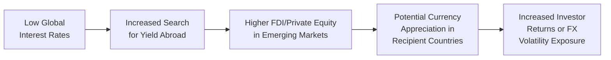
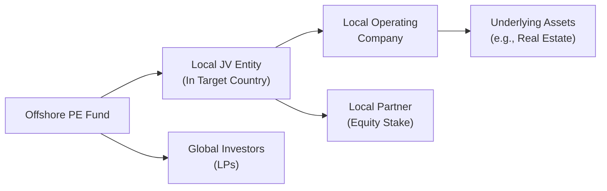

## The Global Landscape for Alternative Investments
It’s amazing how, over the past few decades, our investments have grown from local farmland ventures to cross-border private equity deals—sometimes overnight. I’ll never forget the first time I considered an emerging market real estate project: I was both excited and anxious, imagining all the potential returns but also mulling over the countless unknowns—regulatory hurdles, currency fluctuations, and local market norms. In this section, we’ll talk through the essential elements of cross-border alternative investments—why they’re so compelling, what challenges you’ll likely face, and some best practices for navigating them effectively.

## Drivers of Globalization and Cross-Border Investment
Cross-border opportunities in alternative investments exist partly because globalization has made it relatively seamless (well, more seamless than it used to be) to move capital across the world. The search for higher yields, diversification, and exposure to emerging markets often motivates investors to look beyond their domestic borders. Large institutional investors, such as pension funds and sovereign wealth funds, frequently seek international real estate projects, private equity buyouts in growing economies, or even farmland in distant geographies to broaden their portfolio’s risk-return profile.

At the same time, technology has played a key role in nurturing this speed and convenience. Communication tools let you instantly coordinate with foreign partners, and data analysis can quickly reveal growth markets. But technology alone can’t solve everything—we still deal with local market intricacies, political climates, and good old-fashioned cultural differences. 

## Foreign Ownership Restrictions and Regulatory Barriers
Every country has its own regulatory agenda, which can be as straightforward as requiring additional disclosures or as restrictive as limiting or outright prohibiting foreign ownership. For instance, some nations only allow minority stakes in certain industries—like technology or telecom—where they deem local control a matter of national security. Real estate can also be subject to foreign ownership barriers, particularly if it’s agricultural land or located near sensitive borders.

Because of this, you might need to partner with a local entity for operational or structural ownership compliance. Joint ventures, for example, are a common approach: a foreign investor teams up with a domestic firm to meet ownership regulations while maintaining some influence over managerial decisions. However, forming such partnerships brings its own complexities in terms of governance, distribution of returns, and mutual trust.

## Foreign Exchange (FX) Risk
With globalization comes currency exposures that can significantly swing investment returns, often overshadowing the underlying asset’s performance. If you’re an investor in, say, euro-denominated private equity deals but report your performance in U.S. dollars, exchange rate movements between the euro and the dollar can magnify or shrink your nominal gains. 

It’s helpful to keep an eye on the main variables driving FX markets—like interest rate differentials, trade balances, and geopolitical news. Technical factors such as capital flows or sentiment can also influence currency behavior. Hedging via derivatives (like currency forwards or options) is a common approach, but it comes at a cost and can introduce complexities of its own.

Here’s a tiny illustration of annualized return with currency impact:

Let rᵤ be the underlying asset return in local currency, and rₓ be the percentage change in exchange rate from the local currency to your home currency. Your total return in home currency, R, often approximates to:

R ≈ rᵤ + rₓ + (rᵤ × rₓ)

For small rᵤ and rₓ, the cross-term (rᵤ × rₓ) may be negligible, but in more volatile markets it’s definitely worth considering.

## Political Risk: Stability and Policy Environment
Political upheaval can derail even the most promising cross-border investments. If I had a dollar for every time an investor told me, “We didn’t see that policy reversal coming,” I might have a nice little side portfolio by now. Political risk can manifest in many ways:

• Expropriation or nationalization of foreign-owned assets.  
• Sudden changes in foreign investment laws.  
• Unstable government leadership or regulatory oversight.  
• Unexpected trade barriers or tariffs.

Take the time to examine a country’s track record with foreign investors. Look for bilateral investment treaties (BITs) that may provide some legal shield in the event of adverse government actions. Also, be sure to follow macroeconomic and geopolitical developments that could lead to shifting policy priorities.

## Cultural Differences and Business Practices
Navigating cultural nuances might, at first, seem intangible or even trivial. But from experience, ignoring local customs or business etiquette can create friction in negotiations, hamper trust building, or lead to misunderstandings in contract interpretation. Simple differences in negotiation style—like direct confrontation vs. indirect consensus-building—can dramatically influence how deals are structured.

Furthermore, language barriers can complicate everything from official documentation to day-to-day communications. To mitigate this risk, many investors rely on local consultants or regional offices employing staff who understand the local business climate, legal system, and cultural norms.

## IFRS vs. GAAP: Diverging Accounting Landscapes
When stepping into international deals—whether in private equity, real estate, or hedge-like strategies—be sure to note how the financials are reported. If you come from a U.S. background, you’re probably using Generally Accepted Accounting Principles (GAAP). Much of the rest of the world uses International Financial Reporting Standards (IFRS). And some jurisdictions even apply localized hybrids.

Key differences can include revenue recognition, valuation of intangible assets, treatment of leases, and how objectives like “fair value” are assessed when dealing with private holdings. Mismatched standards sometimes create confusion around enterprise value or net asset value, especially if you’re comparing multiples across markets. An accurate read of financial statements in cross-border transactions can require bridging differences between IFRS and GAAP before making final decisions.

## Global Capital Flows and Macroeconomic Trends
Capital rarely travels in a vacuum. Often, it follows signals like central bank policies, global interest rates, and liquidity conditions. A rising interest rate environment in major economies might reduce the attractiveness of foreign markets, especially if those markets are riskier or lack robust capital controls. Meanwhile, a supportive trade policy or a free trade agreement might spur foreign direct investment (FDI), accelerating cross-border deals in infrastructure or private real estate.

Let’s illustrate a simplified view of how cross-border capital flows respond to macro factors:

As you can see, everything is interconnected. A wave of capital into an emerging market can lead to currency appreciation, which can alter expected returns and raise new concerns about asset valuations becoming overheated.

## Bilateral Investment Treaties and Regional Trade Zones
Bilateral investment treaties (BITs) are crucial in protecting private property rights across international borders, providing frameworks for dispute resolution, compensation in the event of expropriation, and nondiscriminatory treatment for foreign investors. Similarly, regional trade zones—such as the European Union, ASEAN, or the newer African Continental Free Trade Area—simplify cross-border capital flows and reduce tariffs, making it more practical to distribute goods or operate a business on a multinational scale. 

If you’re investing in a region governed by a free-trade agreement, you may benefit from less red tape, greater regulatory harmonization, or streamlined logistical processes. But watch out: if countries decide to renegotiate specific terms or if membership in these regions becomes politically contentious, that can also increase risk.

## Operational Considerations: Local Partnerships and Expertise
Local expertise is worth its weight in gold—seriously. Whether it’s law firms well-versed in local regulations, or a general partner who has a strong track record in the target country, connecting with people on the ground can drastically reduce nasty surprises. In countries with challenging bureaucracies, a local partner might help expedite permitting or interpret labyrinthine tax codes. However, forging these partnerships demands vetting the partner’s background, ensuring alignment of interests, and clarifying each party’s governance and decision-making authority.

Often, investors set up local offices or rely on established joint ventures. Maintaining direct involvement—regular visits, management oversight, and transparent feedback—helps ensure that the local operation upholds both local best practices and your own firm’s standards.

## Heightened Due Diligence: Tax Regimes, Regulations, and Market Practices
Running due diligence on a domestic investment is tough enough. Cross-border, it’s a whole new level of rigorous investigation. You might think, “But I have a bunch of checklists already.” That’s helpful—just expect to double or triple the number of items to check:

• Tax implications: Withholding taxes, capital gains treatments, double-taxation treaties.  
• Regulatory approvals: Licenses, foreign ownership caps, environmental permits.  
• Compliance with local labor laws.  
• Transfer pricing rules.  
• Repatriation of funds: Some jurisdictions limit how quickly or how much you can bring your profits home.

Be prepared for the time and resource commitment. Local counsel, multi-lingual documentation, and third-party advisors can help keep you on track, but it’ll likely cost a bit more. Weigh these costs against the potential benefits of cross-border exposure.

## Case Study: Emerging Market Real Estate Fund
Let’s take a quick hypothetical scenario: An institutional investor from the U.S. invests in a real estate fund focused on Southeast Asian commercial properties. The local partnership structure requires a minority stake for the U.S. investor (due to foreign ownership regulations) and the majority partner is a local developer with strong government ties. 

After 12 months, the local currency has depreciated 5% against the U.S. dollar. Yet, the property values in local terms have risen around 10% based on booming office demand, netting a rough 5% gain (10% local property growth – 5% currency hit) in USD terms. During routine due diligence, the investor learns that new environmental regulations are pushing out project timelines, which could impact the forecasted net present value. To mitigate this, they re-run the financial models accounting for expanded construction costs and possible higher financing rates. While they remain optimistic overall, they decide to extend the project timeline by six months to accommodate the regulatory shift.

This example underscores how multiple overlapping factors—local currency movements, regulations, and local partnerships—can shape cross-border investment outcomes.

## Practical Diagram: Cross-Border Investment Structures
Below is a simplistic diagram illustrating how a cross-border private equity deal might be structured, showing the interplay between offshore funds, local operating companies, and potential joint ventures:

Notice how the Offshore PE Fund invests into a Local JV Entity, which in turn controls the Local Operating Company owning the real assets. Meanwhile, a Local Partner also holds an equity stake in the JV. This structure often helps address regulatory constraints, currency flow considerations, and local governance demands, yet it introduces complexity in terms of profit distribution, taxes, and control.

## Best Practices and Strategies
• Thoroughly Research Legal and Tax Environments: Use local experts but keep an independent verification layer.  
• Manage FX Exposure Proactively: Hedge only where it’s cost-effective.  
• Partner with Reputable Local Firms: Shared goals and complementary skill sets are essential.  
• Adapt to Cultural Norms: Hire bilingual staff or translators; schedule “get to know you” sessions with potential partners to build rapport.  
• Conduct Scenario Planning: Stress-test your investment under different currency, political, and macroeconomic outcomes.  
• Maintain Clear Communication: Ensure both local and foreign stakeholders understand the project timeline, responsibilities, and share progress updates regularly.

## Pitfalls and Common Mistakes
• Overlooking Regulatory Quirks: Sometimes, a country’s actual regulatory environment differs from what’s on paper.  
• Inadequate Governance: Trust is great, but strictly define roles, responsibilities, and reporting lines.  
• Underestimating Cultural Nuances: A minor misunderstanding can escalate if not properly managed.  
• Skimping on Due Diligence: Cross-border transactions have special layers of complexity requiring thorough vetting.  
• Neglecting Ongoing Monitoring: Market conditions and political climates can shift quickly.

## Exam Tips for CFA Candidates
1. Be Prepared for Scenario-Based Questions: You may be given a cross-border M&A scenario, asked to identify key risks (FX, political, cultural), and propose solutions.  
2. Brush Up on Accounting Standards Differences: IFRS vs. GAAP can factor into how you interpret financial statements in exam item sets or essays.  
3. Know Hedging Strategies: Understand how forwards, options, and swaps can mitigate currency risk.  
4. Remember the Role of Bilateral Treaties: They can appear as constraints or solutions in a lawsuit or expropriation scenario.  
5. Take a Multi-Faceted Approach: The exam might ask for a recommended capital structure or partnership structure. Show your understanding of local conditions.  

## References and Further Reading
• “Emerging Markets and Cross-Border Private Equity,” CFA Institute.  
• “International Investments,” Grinold and Kahn, Financial Analysts Journal.  
• World Bank’s Doing Business Reports (for regulatory insights).  
• OECD Statistics on FDI flows.  
• Local Chambers of Commerce or Investment Promotion Agencies (for specific country data and guidelines).

---

## Test Your Knowledge: Cross-Border Alternative Investments Quiz



### Which of the following is a primary reason investors seek cross-border alternatives?
- [ ] Reduced currency volatility
- [ ] Guaranteed political stability
- [x] Potential for higher returns and diversification
- [ ] Uniform global regulations

> **Explanation:** Investors often look to cross-border investments to capture returns in fast-growing economies and diversify beyond domestic markets. Currency volatility and political risk still exist, and regulations differ among jurisdictions.

### What is one typical purpose of a Joint Venture arrangement in cross-border investing?
- [ ] To avoid paying local taxes
- [x] To comply with foreign ownership restrictions
- [ ] To eliminate foreign exchange risk
- [ ] To circumvent bilateral investment treaties

> **Explanation:** A joint venture can help foreign investors navigate ownership regulations by partnering with a local firm, sharing risk and control according to local requirements.

### Which factor is often considered the most direct influence on exchange rate movements?
- [x] Interest rate differentials
- [ ] Cultural differences
- [ ] GAAP vs. IFRS reporting
- [ ] Availability of joint ventures

> **Explanation:** While multiple factors affect currency values, interest rate differentials between countries frequently drive capital flows and influence exchange rates.

### Under IFRS and GAAP, which area commonly differs and can impact valuation in cross-border deals?
- [x] Treatment of leases and intangible assets
- [ ] The existence of a standard worldwide foreign exchange hedging rule
- [ ] Rules for spin-offs in domestic markets only
- [ ] Concept that alternative investments cannot be held abroad

> **Explanation:** IFRS and GAAP diverge on issues such as lease recognition, intangible asset valuation, and revenue recognition, so cross-border deals often require reconciliation of these differences.

### In a rising global interest rate environment, cross-border capital flows into emerging markets tend to:
- [ ] Surge immediately without any constraints
- [ ] Remain unaffected
- [x] Potentially decrease as higher rates in developed markets attract capital
- [ ] Stay the same, because interest rates are irrelevant

> **Explanation:** When developed markets raise interest rates, investors may reallocate capital back home seeking safer yields, potentially reducing capital flows to emerging markets.

### Which of the following best describes political risk?
- [ ] Fluctuations in currency exchange rates
- [ ] Differences in business etiquette
- [x] Government or political actions that can adversely impact investments
- [ ] Laws requiring IFRS

> **Explanation:** Political risk focuses on how government decisions, policy changes, or instability can deter or damage foreign investments.

### One direct benefit of bilateral investment treaties (BITs) is:
- [x] Enhanced legal protection and clearer dispute resolution for foreign investors
- [ ] Automatic interest rate parity across countries
- [ ] Elimination of foreign exchange risk
- [ ] Superior local currency performance

> **Explanation:** BITs are designed to protect foreign investors by setting frameworks for property rights protection and dispute resolution, though they don’t address currency fluctuations or guarantee higher local returns.

### A key component of heightened due diligence in cross-border deals is:
- [x] Understanding local tax regimes and double-taxation treaties
- [ ] Assuming all IFRS rules directly match GAAP
- [ ] Bypassing local counsel to save costs
- [ ] Neglecting to verify environmental regulations

> **Explanation:** Cross-border due diligence is more expansive, requiring thorough analysis of local taxes, potential withholding rules, and the existence of double-taxation treaties to accurately forecast net returns.

### Forming local partnerships in cross-border investments mitigates which major challenge?
- [x] Foreigner’s lack of on-the-ground expertise and cultural understanding
- [ ] All currency fluctuation risks
- [ ] Volatile global capital flows
- [ ] Global adoption of IFRS

> **Explanation:** Collaborating with a reputable local partner can help navigate bureaucracy, cultural norms, and regulatory labyrinths—though it doesn’t fix every challenge, such as currency movements or global liquidity issues.

### Foreign ownership limitations in specific industries or property types are imposed primarily to:
- [x] Maintain strategic control within the host country
- [ ] Increase foreign exchange volatility
- [ ] Promote uniform global accounting standards
- [ ] Eliminate cultural differences

> **Explanation:** Many countries limit foreign stakes in areas deemed critical to national security or strategic interest, ensuring local control and oversight.


