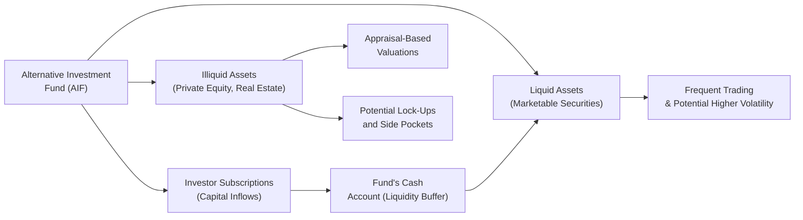

## Introduction

Volatility and liquidity—two concepts that, in my opinion, can simultaneously intrigue and intimidate folks in the investing world—are particularly vital when talking about alternative investments. If you recall from prior sections, alternatives range from private equity to real estate, hedge funds, infrastructure, natural resources, and, increasingly, digital assets. Each segment has its own nuanced behavior, especially under stressful market conditions.

In traditional equity or bond markets, data on prices and trading volumes is widely available, making it easier to evaluate both volatility (how much an asset’s price bounces around) and liquidity (how easily you can buy or sell without changing the market price). With many alternatives, however, we deal with so-called appraisal-based valuations, lock-up periods, limited secondary markets… the list goes on. So, how do we navigate all these complexities and keep our portfolios on solid ground? Let’s break down the key volatility and liquidity characteristics across various alternative segments.

## Understanding Volatility Across Alternative Investments

Volatility represents how strongly an asset’s returns can swing over a certain period. If you compare, say, a broad equity index to a private equity fund, you might see notable differences in day-to-day (or even month-to-month) price variability. Let’s look at a few broad points:

• Private Equity and Real Estate: These are typically “appraisal-based” markets. Because valuations often come from periodic property or company appraisals (instead of real-time market quotes), reported volatility might look deceptively low. In truth, the underlying economic values can fluctuate dramatically—think of real estate during a severe housing downturn—yet formal appraisals may only take place quarterly or less frequently. This smoothing effect can mask the real ups and downs.

• Hedge Funds: Volatility among hedge fund strategies can vary widely—global macro funds might show significant gyrations, while market-neutral or relative-value arbitrage funds could exhibit lower daily volatility. That said, hedge funds often employ leverage, short selling, or derivatives, which can amplify both gains and losses when market conditions shift abruptly.

• Commodities and Natural Resources: Commodity prices can experience large swings due to macroeconomic data releases, geopolitical events, or even weather patterns. If you’ve ever checked the price of crude oil after OPEC announcements, you’ll know it’s not exactly a stable ride.

• Infrastructure: Infrastructure projects (e.g., toll roads, utilities) can provide relatively steady returns in stable economic times. But these assets are not immune to volatility spikes if there’s a sudden shift in policy, regulatory frameworks, or user demand.

An important takeaway is that while appraisal-based or infrequently traded assets appear less turbulent, the actual economic value of these assets may have higher volatility than reported. It’s essential to remember that “volatility” can be understated when data points are sparse or smoothed.

## Market Liquidity vs. Funding Liquidity

Another core piece of the puzzle is understanding the difference between two types of liquidity:

• Market Liquidity: The ease with which an asset can be sold at or near its fair value. In highly liquid markets, you can typically enter or exit positions quickly. Profoundly illiquid markets—think specialized real estate, certain private debt deals—are quite the opposite.

• Funding Liquidity: The ability of an investor or a fund to raise cash when necessary. Even if an investor’s portfolio assets have some liquidity, if the investor is facing margin calls or other cash demands (like capital calls from private equity funds), they might need to access external funding lines or try to sell assets rapidly.

Sometimes you’ll see a situation where the general market is liquid, but a fund can’t raise cash quickly due to other constraints. It’s like driving a car in a wide-open parking lot but realizing you’re low on gas. The environment might be open (market liquidity), but you still need enough gasoline (funding liquidity) to make the journey.

## The Realities of Appraisal-Based Smoothing

Many alternative segments, especially private equity and real estate, rely on less frequent or periodic valuations. Private investments, whether in private equity funds or real estate portfolios, often undergo valuations every quarter or semi-annually. As a result, the reported standard deviation in returns can look surprisingly low compared to publicly traded equities. This phenomenon is sometimes called appraisal-based smoothing.

But let’s not kid ourselves: the true volatility of these underlying assets can be considerable. We just don’t see it displayed daily. A property might lose 10% of its value one month, regain 5% in another, but the official appraisal might only happen once a quarter. That’s akin to measuring the temperature once a day in a city known for huge day/night temperature swings. You detect some changes but miss the real intraday extremes.

One personal story comes to mind: I once saw a private equity real estate fund report stable appraised values for several quarters in a down-market environment. The fund manager told me privately, “Well, that’s just how the appraiser’s model is set up, but realistically, we already sense a sizable market discount if we had to sell right now.” This underscores that reported data might not reflect the reality of immediate “fire-sale” prices.

## Lock-Ups, Gating Mechanisms, and Side Pockets

Hedge funds and private investment vehicles often come with lock-up periods that dictate how long your capital must remain invested. These structures can mitigate the risk of a “run on the fund” where too many investors withdraw simultaneously—especially under stressed market conditions.

• Gating Mechanisms: Many hedge funds include “gates” in their contracts permitting the manager to limit redemptions if total withdrawal requests exceed a certain threshold. This helps avoid forced selling of illiquid positions at distressed prices, but it also means investors may not access capital when they want it most.

• Side Pockets: Hedge funds might segregate hard-to-value or very illiquid assets into side pockets. That portion of the portfolio is, effectively, locked away until the manager can realize or fairly value the underlying investment. This is beneficial from a fairness perspective (so new investors don’t inherit the illiquid portion’s risk), but it can also complicate your cash flow planning.

From an investor’s perspective, it’s crucial to know if your capital might be restricted at precisely the time you need liquidity. Funding liquidity needs can arise from redemptions, margin calls, or other capital requirements in stressful moments.

## Real Assets and Cyclical Liquidity Constraints

Real assets—such as commercial real estate, farmland, or infrastructure—are often coveted because of their perceived inflation-hedging properties and historically steady income streams (like rental payments or toll revenues). However, they can still be vulnerable to cyclical liquidity constraints. During an economic downturn or a credit crunch, fewer buyers may be active in these markets, creating a mismatch between desired selling prices and what the market will pay.

Large real estate holdings generally require significant due diligence, financing arrangements, and legal review before buyers commit. All these steps take time. An investor needing immediate cash might feel trapped holding a building that could take months (or longer) to sell at a fair price. This is why many commercial property transactions slow to a crawl during recessions.

With infrastructure, it might be the same story. Although we often see stable cash flows in normal times, abrupt changes in regulation or user behavior (like major declines in air travel for an airport concession) can disrupt the underlying cash flow. That reduced reliability might spill over into the market’s willingness to buy or finance new projects, sending liquidity into a standstill.

## The Liquidity Mismatch Problem

In some cases, funds that invest in illiquid assets promise their investors relatively frequent redemption terms. How do they do that? Sometimes, managers hold a portion of liquid assets (like cash or marketable securities) to satisfy redemptions. However, if a larger-than-expected share of investors requests their money at once, the fund could be forced to liquidate illiquid holdings at fire-sale prices.

This is the classic “liquidity mismatch:” an imbalance between the liquidity offered to end investors and the liquidity of the actual underlying assets. In extreme cases, the mismatch can drive a fund to freeze redemptions (via gating), effectively forcing a lock-up even if investors were initially assured of quicker access to their capital.

## Risk Management Techniques for Volatility and Liquidity

Because volatility and liquidity crises can strike unexpectedly, sophisticated funds utilize several risk management tools:

• Stress Tests: By simulating adverse scenarios—like a sudden drop in asset prices or a spike in redemption requests—portfolio managers can identify vulnerabilities. They might, for example, discover that under a severely adverse market scenario, they’d need to suspend investor redemptions if more than 10% of the fund is requested at once.

• Liquidity Buffers: A portion of the fund is held in cash or high-quality liquid assets that can be easily converted to cash. This buffer provides a cushion against unexpected outflows or margin calls.

• Leverage and Derivative Controls: If a fund is using leverage, controlling that leverage carefully can reduce the risk of forced asset sales at inopportune times. Similarly, derivatives exposure needs to be sized so that margin requirements remain manageable in volatile markets.

• Dynamic Asset Allocation: Some funds systematically shift allocations between more liquid and less liquid assets, especially when market signals (like credit spreads widening) hint that liquidity might tighten.

• Understanding Regulations: Certain jurisdictions regulate leverage or require liquidity stress testing. Managers operating under the Alternative Investment Fund Managers Directive (AIFMD) in Europe, for instance, have explicit liquidity monitoring requirements.

Anyway, robust risk management is key—particularly in alternative investments where transparency can be less than perfect.

## Illustrating Volatility and Liquidity Flows

Below is a simple Mermaid diagram representing typical flows in an alternative investment structure, highlighting some of the liquidity considerations:

From this diagram, you can see how different parts of the fund interrelate. Appraisal-based valuations in illiquid assets (C → F) can mask some of the day-to-day volatility. Meanwhile, liquid assets (D → H) trade more frequently, reflecting real-time market conditions.

## Exam Tips and Common Pitfalls

• Don’t Overlook Hidden Volatility: Appraisal-based smoothing does not mean an asset is inherently low-risk. On the exam (and in real life), remember to question the difference between reported and actual volatility.

• Be Clear on Liquidity Terminology: Market liquidity vs. funding liquidity are separate (but related) concepts. A question might test how you’d respond to a margin call if your assets are illiquid, highlighting funding challenges.

• Hedge Fund Lock-Ups: Be ready to discuss gating mechanisms, side pockets, and redemption structures. Clearly distinguishing these features will be crucial in constructed-response or item set questions.

• Watch Out for Liquidity Mismatch: This concept often appears on the exam as a scenario-based question—a fund promising monthly redemptions but investing in multi-year private infrastructure projects. Understand the red flags.

• Stress Test Scenarios: You might see questions about how to incorporate stress testing into liquidity planning. Focus on the logic behind scenario assumptions—e.g., how a credit crunch or market sell-off changes both volatility and redemption requests.

• Use Real-World Logic: The exam often frames questions in a real-world context, requiring you to apply the core concepts of liquidity and volatility. Always consider both the manager’s perspective (preventing a run on the fund) and the investor’s perspective (ensuring enough liquidity to meet commitments).

## References

• “Liquidity Risk Management in Alternative Funds,” CFA Institute.  
• “Measuring and Managing Liquidity Risk,” Basel Committee on Banking Supervision.  

## Test Your Knowledge: Volatility and Liquidity in Alternative Investments



### Which of the following best describes appraisal-based valuation?

- [ ] An automatic valuation method that updates fund prices daily
- [x] A process of periodically estimating an asset’s value, potentially creating a smoothed return profile
- [ ] A 24/7 order book system for all private holdings
- [ ] A mechanism for locking up investor capital during market panics

> **Explanation:** Appraisal-based valuation uses periodic estimates rather than continuous market data, often leading to artificially low reported volatility.

### A fund offering monthly redemptions while holding primarily multi-year private equity interests demonstrates which problem?

- [ ] Funding liquidity risk
- [ ] High volatility risk
- [ ] Event-driven risk
- [x] Liquidity mismatch

> **Explanation:** Promising liquid terms but investing in illiquid assets is a classic example of liquidity mismatch.

### In a hedge fund, a side pocket is primarily used for:

- [ ] Investing in extremely liquid assets
- [x] Segregating illiquid or hard-to-value investments
- [ ] Allowing investors daily redemption rights
- [ ] Actively hedging interest rate risk

> **Explanation:** A side pocket reserves illiquid or non-marketable assets so that existing investors bear the risk, preventing dilution for new investors.

### Gating mechanisms in hedge funds allow managers to:

- [x] Limit redemptions when withdrawal requests exceed certain thresholds
- [ ] Guarantee daily liquidity to all investors
- [ ] Eliminate all volatility in the fund’s returns
- [ ] Invest solely in high-yield bonds

> **Explanation:** Gates let managers protect the fund from forced sales by capping redemption amounts.

### Which scenario most accurately illustrates the concept of appraisal-based smoothing?

- [x] A real estate fund reports stable values each quarter, despite known market fluctuations
- [ ] A high-frequency trading fund posts daily price changes
- [ ] A commodity ETF that marks to market every minute
- [ ] A long-only equity fund that invests in government bonds

> **Explanation:** Appraisal-based smoothing refers to private or infrequently traded assets where valuations are updated only periodically, masking short-term fluctuations.

### Market liquidity is best defined as:

- [x] The ease of buying or selling an asset near its fair market value
- [ ] The ability to roll over short-term financing
- [ ] Fulfilling margin calls in times of stress
- [ ] A measure of an asset’s total return volatility

> **Explanation:** Market liquidity focuses on how quickly you can trade at or near fair value, distinct from funding liquidity or return volatility.

### To cope with unexpected redemption requests, funds commonly maintain:

- [ ] Only risky, high-return assets
- [x] A liquidity buffer of liquid holdings such as cash or T-bills
- [ ] Exclusively real estate holdings
- [ ] Zero cash reserves

> **Explanation:** A liquidity buffer provides easy access to cash for redemptions without having to liquidate illiquid assets.

### A stress test in the context of alternative investments is used to:

- [x] Simulate a portfolio’s performance in adverse market conditions
- [ ] Lock up funds when redemption requests are low
- [ ] Determine daily price increments
- [ ] Replace formal appraisals for illiquid holdings

> **Explanation:** Stress tests project how a portfolio may fare under tough scenarios, helping managers prepare liquidity and risk management plans.

### Which statement is accurate regarding appraisal-based volatility?

- [x] It may significantly understate the underlying true volatility of the asset
- [ ] It is always higher than market-based measures
- [ ] It is unaffected by market conditions
- [ ] It is never used for real estate funds

> **Explanation:** Appraisal-based methods often fail to capture all market fluctuations, leading to understated volatility in reported figures.

### True or False: Hedge fund gates prevent investors from requesting redemptions under any circumstances.

- [x] True
- [ ] False

> **Explanation:** Gates restrict or limit redemption requests beyond certain thresholds, thereby controlling outflows and preventing forced sales of illiquid assets.


