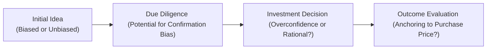

## Understanding Behavioral Biases in Alternative Investments

The world of alternative investments can be, well, pretty exhilarating—and sometimes a little nerve-racking. Many of us get swept up in the excitement of discovering a hot new private equity fund or the prestige of saying we’re part of a venture capital round. But the psychological pitfalls lurking in these investments are no joke. When you’re dealing with less-liquid assets, limited transparency, and complex structures, behavioral biases can hit you like a ton of bricks. And, trust me, I’ve had more than a few friends who learned this the hard way.

In traditional markets—where analysts publish standardized ratings and tons of price data—the truth is usually easier to see (though we don’t always heed it). In private or less-liquid markets, however, there can be a fog of partial information and the siren song of exclusivity. So let’s talk through the biggest biases that show up in alternative investments, including overconfidence, the good old familiarity bias, and that pesky herd mentality. We’ll also dig into anchoring, recency bias, and the dreaded “fund halo effect.” Throughout, we’ll highlight how real-world investors can (hopefully) sidestep these emotional traps.

## Overconfidence and Familiarity Bias

Imagine your close friend has launched a real estate fund that invests in boutique hotels. You know this friend, you trust them, and you’ve heard them talk about the local tourism boom. So you decide to invest more than half your net worth—because you’re just so sure this is a surefire bet. That’s a textbook case of overconfidence and familiarity bias, all rolled up into one big risk.

• Overconfidence Bias:  
  Overconfidence can manifest as overestimating your ability to select the best deals or believing you have accurate forecasts. It’s especially prevalent in alternative investments due to their complexity. People sometimes figure, “Hey, it’s not widely understood—so if I understand it, I must really know my stuff.” In reality, you might be confusing specialized knowledge with genuine skill.

• Familiarity Bias:  
  Familiarity bias leads investors to prefer what feels known—like a local business or a sector they’ve worked in. In private markets, this can be doubly dangerous because a sense of personal closeness might overshadow rational analysis of risks. If you’re too comfortable, you might skip crucial due diligence steps.

### Spotlight Example: Familiarity in Private Equity  
A case in point: one investor I knew put most of her capital into a friend’s private equity energy fund. She’d worked a decade in the oil industry, so she assumed she couldn’t lose. The fund’s geology-based exploration strategy, however, was different from her operational background. She ended up holding an illiquid stake in assets that were riskier than anything she’d imagined. Her “familiarity” was partially real, but it wasn’t enough to protect her from a massive shift in energy prices and a few overlooked operational hazards.

## Prospect Theory and Loss Aversion

Prospect theory, introduced by Daniel Kahneman and Amos Tversky, posits that we feel losses more intensely than gains. In other words, the sting of losing $100 feels more powerful than the joy of winning the same $100. This might sound like an academic point at first, but in alternative investments—where you can’t just exit at the click of a button—the fear of losses can loom even larger.

• Loss Aversion Dynamic:  
  Emotional attachment to an illiquid asset can paralyze rational thinking. You might hold on to a struggling real estate property or a faltering VC investment, hoping to avoid realizing a loss. Essentially, you’d rather wait (and wait, and…wait) than admit an unfavorable outcome.

• Prospect Theory in Action:  
  Let’s say you invested in a private credit vehicle that was supposed to yield 10% annually. Now, economic conditions shift, and the fund’s expected returns drop to 6%. Even though 6% might be a decent yield in the current environment, you may feel you’re losing that 4% difference. This can sour your perception of an otherwise reasonable return, prompting you to make abrupt or irrational decisions—like redeeming early (if allowed) at disadvantageous terms.

## Anchoring and Recency Bias

Sometimes, we latch onto numbers or initial bits of information—like the first valuation we hear or the price at which we bought in. That’s anchoring. Recency bias is closely related: it’s the tendency to overemphasize the most recent information or experiences. In alternative investments—where valuations can be spread out (quarterly updates, sporadic pay-to-play rounds)—these biases can sneak in easily.

• Anchoring:  
  Picture an LP (Limited Partner) investing in a private equity fund at $50 per share. The initial anchor remains in their mind: “This is a $50 share.” Even as the fund’s portfolio companies pivot or the economy changes drastically, the $50 purchase price can overshadow new valuation data. Investors might set unrealistic exit expectations simply because “that’s what I paid.”

• Recency Bias:  
  If a hedge fund manager just had a stellar year, we might extrapolate that success far into the future. Alternatively, a real estate syndicate suffering a bad quarter might see an exodus from investors who weigh that fresh pain more heavily than the property’s long-term fundamentals. In illiquid markets, data is limited and often irregular, so each new bit of information can trigger disproportionate responses.



In this simplified flowchart, we see how a seed of thought (A) might enter our due diligence process (B). Even “due diligence” can be colored by biases if we only search for affirming data. Then (C) is where we decide—fueled by either rational analysis or illusions of skill. Finally, (D) shows how we might continuously compare outcomes to an “anchor” (like our original purchase price), which can overshadow more pertinent signals about the investment’s true performance.

## Herd Mentality and the Fund Halo Effect

“Herd mentality” is basically groupthink on steroids. In alternative investments—where deal flow can be dominated by word-of-mouth or insider networks—following the crowd is painfully common. Meanwhile, the “fund halo effect” can make us ignore red flags just because the manager or sponsor once had a big win.

• Herd Mentality:  
  We see a top venture capital firm put money into a certain biotech startup—so we blindly follow, assuming they must have done rigorous research. Or, multiple family offices jump on a new hedge fund launch, and we assume it must be “the next best thing.” The problem is, sometimes the herd can be dead wrong. Without independent verification, you might land in a money-losing stampede.

• Fund Halo Effect:  
  Ever been star-struck by a manager’s track record? Maybe they were behind a unicorn IPO last year, so now you’re convinced every new idea they touch is gold. This phenomenon quickly subverts your questionnaires and risk analysis. You might skip critical steps just because you’re enamored with the manager’s reputation. Over time, the halo effect can overshadow new data suggesting that “this time might be different.”

### Quick Story:  
I once worked with an institution that poured capital into a “rockstar” real estate sponsor because “he just knows how to pick deals.” Past success overshadowed glaring issues in the sponsor’s new strategy—less stable markets, less net operating income. The brand carried the day, and the institution overlooked cautionary data. When occupancy rates fell short, the truth was harsh: a strong brand in one niche doesn’t automatically translate to success elsewhere.

## Confirmation Bias and Limited Transparency

Confirmation bias is the drive to notice or recall information that supports our existing beliefs, while conveniently ignoring evidence to the contrary. In alternative investments, limited data availability can feed right into this.

• Limited Transparency:  
  Many private funds provide only quarterly or semiannual reports, with limited detail. If you already “believe” the manager is great, you’ll interpret any ambiguous data as further confirmation of that belief. Then you might disregard subtle warnings—like times to liquidity or negative operational updates.

• Irregular Reporting:  
  Because performance updates can be irregular, you might fill the gaps in your mind. Often you’ll find yourself internalizing the idea that “no news is good news.” This is exactly how confirmation bias can intensify. If you expect success, you’ll interpret silence as success. If you expect trouble, you might misinterpret trivial updates as big red flags.

## Mitigating Investor Biases

The good news? Behavioral biases aren’t unstoppable. They’re part of human nature, but we can fight back with structured processes, external validation, and open communication.

• Investment Committees:  
  Form a group that isn’t afraid to challenge each other’s assumptions. A well-structured committee can be a brake on an overly enthusiastic champion. You might say, “Yes, this is a great idea—but here are five contrarian points we must address.”

• Third-Party Validation:  
  Invite an outside consultant or an independent valuation expert to test your assumptions. Even a small dose of external feedback can dampen biases. This could mean a second-opinion letter for big capital calls or major expansions.

• Structured Decision Processes:  
  Checklists or scoring systems sound boring, but they’re powerful. Set up criteria—like manager track record, fund terms, risk parameters—and rate them systematically before making a commitment. This helps you see the final decision in a less emotional, more transparent format.

• Investor Education and Communication:  
  Training your team (or yourself) about these biases can be a game-changer. Sometimes just recognizing them is enough to spark caution. On top of that, emphasize thorough, clear communication with your managers. Request updates regularly, ask direct questions, and push for more detail. The more visible the data, the less room for illusions to form.

Below is a tiny (and admittedly simplified) snippet in Python that shows how you might combine a few metrics from a structured scoring system to mitigate biased decisions in evaluating private equity funds:

```python
def evaluate_fund(track_record, strategy_clarity, governance_score, manager_reputation):
    """
    Returns a simple weighted score for a fund.
    Each parameter is rated on a scale of 1-10.
    Weighted logic to offset 'halo effect' of manager reputation.
    """
    # Weighted system: track record 30%, strategy clarity 30%, governance 30%, manager rep 10%
    score = (0.3 * track_record
             + 0.3 * strategy_clarity
             + 0.3 * governance_score
             + 0.1 * manager_reputation)
    return score

fund_score = evaluate_fund(track_record=8, strategy_clarity=6, governance_score=7, manager_reputation=9)
print("Fund Scoring Result:", fund_score)
```

Yes, it’s simplistic, but it forces you to quantify traits that might otherwise get overshadowed by subjective excitement about the manager’s name. Having a consistent approach can really help you identify a borderline or subpar fund despite your own enthusiasm.

## Balancing Emotions and Rational Analysis

It’s impossible to be purely rational. Most of us invest because we have goals, dreams, or even a passion for a sector. Tapping into that passion can be beneficial—it drives motivation to learn about, say, farmland investing or renewable infrastructure. But an unchecked emotional approach can leave you exposed.

• Embrace Emotion…Cautiously:  
  It’s okay to be excited about your portfolio, but channel that energy into deeper research rather than letting it cloud your judgment.

• Regular Portfolio Check-Ins:  
  In alternative investments, you might go 6–12 months without major developments. Regularly schedule portfolio reviews using the same set of objective metrics each time. This not only counters recency bias but also helps ensure you’re not forgetting older data.

Here’s a simple KaTeX formula that can help visualize how a rudimentary risk-return ratio might be employed when combining multiple investments, pushing you to systematically compare new deals against your existing portfolio:


\text{Portfolio Utility} = \sum_{i=1}^{n}\left[\mu_i - \frac{1}{2}\cdot \lambda\cdot \sigma_i^2\right]


Where:  
• \\(\mu_i\\) represents the expected return of investment \\(i\\).  
• \\(\sigma_i\\) is the standard deviation (risk) of investment \\(i\\).  
• \\(\lambda\\) is a risk-aversion coefficient.  

You can see that the parameter \\(\lambda\\) helps you weigh how much risk you’re willing to take for a given level of return. By comparing \\(\mu\\) (expected return) and \\(\sigma^2\\) (variance), you’re forcing a more balanced, quantitative evaluation—one less prone to random emotional swings.

## Exam Relevance and Final Thoughts

Behavioral biases can pop up in a variety of item-set questions and constructed responses at the CFA exams. You may be asked to identify how an investor’s personal stake in a venture capital fund fosters confirmation bias or how recency bias affects due diligence on a hedge fund manager. Understanding the interplay of these psychological forces—and having preemptive methods to tackle them—is critical in performing well.

For your studies:  
• Familiarize yourself with the definitions of each bias.  
• Be ready to illustrate how these biases might alter portfolio decisions in real-world scenarios.  
• Practice describing how you’d mitigate these biases through structured processes.  

Above all, remember that alternative investments often have intangible or difficult-to-measure attributes. Emotions can run higher in opaque or volatile segments, intensifying biases. By being aware and prepared, you’re already a step ahead.

---

## Test Your Knowledge: Investor Psyche and Behavioral Traps



### Which of the following best describes overconfidence bias in alternative investments?

- [ ] Underestimating your ability to outperform the market.  
- [x] Overestimating your skill or knowledge in selection or forecasting.  
- [ ] Assuming that market prices are always accurate and fair.  
- [ ] Allocating too little capital due to fear of volatility.  

> **Explanation:** Overconfidence bias is when investors believe they have superior knowledge or skill, which can lead them to take on excessive risk or insufficient due diligence.

### When a private equity investor clings to the fund’s initial purchase price as a reference point for future expectations, this is an example of:

- [ ] Familiarity bias.  
- [ ] Herd mentality.  
- [x] Anchoring.  
- [ ] Recency bias.  

> **Explanation:** Anchoring occurs when an investor over-relies on initial or specific pieces of information (like the original purchase price) and fails to adjust adequately when new data emerges.

### In Prospect Theory, which statement most accurately reflects loss aversion?

- [x] People feel the pain of losses more acutely than the pleasure of equal-sized gains.  
- [ ] People always weigh gains and losses equally.  
- [ ] People discount future gains more than immediate losses.  
- [ ] People tend to ignore losses if they are hidden in illiquid investments.  

> **Explanation:** Under Prospect Theory, the disutility of losing a certain amount is typically perceived as stronger than the utility of gaining that same amount.

### How can a strong manager reputation lead to suboptimal decisions in alternative investments?

- [ ] It encourages rigorous, independent due diligence.  
- [x] It can create a fund halo effect, causing investors to overlook red flags.  
- [ ] It always indicates proven skill with minimal risk.  
- [ ] It leads to more frequent manager turnover.  

> **Explanation:** The fund halo effect is a cognitive bias in which investors fail to identify potential weaknesses because they are enamored by the manager’s past successes or reputation.

### Which of the following actions would best mitigate herd mentality in a private placement?

- [x] Conducting a thorough independent due diligence prior to committing capital.  
- [ ] Asking all your peers which fund they chose and matching it exactly.  
- [ ] Quickly moving out if others start to exit.  
- [ ] Waiting until the manager publicly markets the fund.  

> **Explanation:** Conducting proper investigation independently and considering objective data protects investors from simply following the crowd.

### Which statement best illustrates recency bias?

- [x] An investor becomes overly optimistic after a short period of strong returns and projects them far into the future.  
- [ ] An investor invests in assets they’ve heard about for a long time.  
- [ ] An investor delegates decision-making to a third-party consultant.  
- [ ] An investor claims they remember all relevant performance data of an asset.  

> **Explanation:** Recency bias is the tendency to place greater emphasis on recent experiences or short-term performance when making judgments about future outcomes.

### Which of the following is an example of confirmation bias?

- [ ] Reducing exposure to a sector after reading multiple contradicting research reports.  
- [x] Only reading data that supports your belief that a hedge fund is top-tier while ignoring warning signs.  
- [ ] Diversifying your positions after a successful venture capital exit.  
- [ ] Changing your mind promptly when confronted with new, contradictory evidence.  

> **Explanation:** Confirmation bias involves seeking out or recalling information that aligns with a preexisting view and dismissing competing opinions.

### Which technique can help control biases when evaluating complex alternative investments?

- [x] Using a structured decision process with defined scoring criteria.  
- [ ] Relying solely on past network recommendations.  
- [ ] Avoiding external validators to save time.  
- [ ] Investing spontaneously in illiquid assets.  

> **Explanation:** A structured decision framework, such as a scoring system, can standardize evaluation and reduce emotional or subjective influences.

### An investor who continues to hold a troubled private equity stake to avoid “realizing” a loss is primarily demonstrating:

- [ ] Overconfidence bias.  
- [x] Loss aversion.  
- [ ] Recency bias.  
- [ ] Herd mentality.  

> **Explanation:** Loss aversion leads investors to hold onto losing positions longer to avoid the psychological pain of a realized loss.

### True or False: Limited transparency in alternative funds commonly magnifies confirmation bias.

- [x] True  
- [ ] False  

> **Explanation:** With fewer data points available, investors tend to fill gaps with information that confirms their preexisting beliefs, thus intensifying confirmation bias.



---

### References and Further Reading

- Daniel Kahneman, “Thinking, Fast and Slow,” Farrar, Straus and Giroux.  
- “Behavioral Finance and Investment Decision-Making,” CFA Institute Research Foundation.  

For deeper insights on how these behavioral pitfalls affect asset allocation and manager selection, see Chapters 2.3 (Fee Structures), 3.3 (Due Diligence and Selection Criteria), and 6.3 (Operational Due Diligence and Manager Selection). Although we can’t eliminate our human quirks entirely, recognizing them is the first step toward making better decisions—whether in a private real estate syndicate, a hedge fund, or the next cutting-edge crypto venture. Keep questioning your own assumptions, and you’ll be better equipped to navigate the fascinating world of alternative investments.
