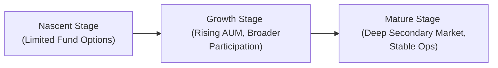

## Understanding the Evolution of Alternative Investment Markets

Measuring the maturity and depth of alternative investment markets isn’t just about scoring how developed they are; it’s also about recognizing the opportunities and risks that come at each stage. I remember evaluating a regional private equity fund in its early days—there were hardly any service providers, minimal data coverage, and limited investor participation. Fast-forward a few years, and that same region had specialized fund administrators, a more robust regulatory framework, and a thriving secondary market. This dramatic shift reflected the maturation of the entire ecosystem, illustrating the importance of tracking key factors such as the number of funds, growth in assets under management (AUM), secondary market development, and operational infrastructure.

Below, we explore the major themes that define industry maturity and market depth in the alternative investments space, including relevant measures, challenges, and best practices.

## Lifecycle Stages and Key Indicators

Every alternative investment segment—whether private equity, hedge funds, real estate, or digital assets—transitions through various stages:

- Nascent Stage: Very few participants, limited track record, and small AUM.  
- Growth Stage: Rapid inflows, broader investor base, and emerging operations infrastructure.  
- Mature Stage: Sophisticated secondary markets, stable fee structures, transparency standards, and institutional adoption.

The progression from one stage to the next often hinges on data availability, regulatory oversight, technology adoption, and the presence of credible service providers. In other words, we look for signals like standardized documentation, more robust investor protections, and internationally recognized certifications (e.g., CAIA or CFA) to gauge maturity.

### AUM Growth and Fund Count

At its simplest, a growing sum of money chasing alternative assets—also known as an increase in AUM—often signals investor confidence and an influx of new participants. But keep in mind, bigger AUM doesn’t necessarily mean a healthier market: it could also mean potential overcapitalization, where valuations get inflated and future returns get squeezed. Another angle to watch is fund count: a growing number of managers and products can enhance choice and competition but might lower average quality if new entrants lack expertise.

### Investor Diversity

A market with only a handful of large institutional investors is far more fragile than one with a broad, diverse investor base. Diversity can be measured by looking at the ratio of institutional to retail capital, the global versus regional investor split, and the proportion of strategic vs. opportunistic investors. Markets that welcome a range of investor types (pension plans, endowments, family offices, high-net-worth individuals) tend to command deeper liquidity and better risk-adjusted returns over time.

## Significance of Secondary Markets

Secondary markets, where existing fund interests can change hands, are crucial indicators of an industry’s depth and resilience. These venues let investors rebalance allocations or exit positions earlier than a typical lock-up period. For instance, you might hold a limited partnership (LP) interest in a private equity real estate fund but need to liquidate your position early. If a robust secondary market exists, you might sell that LP interest to someone else. The presence (and efficiency) of these secondary transactions reflects growing sophistication and confidence:

- Higher transactional volume indicates broad investor acceptance and more accurate price discovery.  
- More advanced trading mechanisms and platforms—some of which are now digital—further enhance liquidity and transparency.  

Moreover, secondary transactions often happen at smaller discounts in more mature markets, reflecting the established credibility of the asset class. When you see a significant gap between net asset value (NAV) and the secondary market price, it might imply that the market is less liquid, less transparent, or less confident in the valuations provided by the general partner (GP).

## Role of Specialized Service Providers

As alternative investments mature, you typically spot a proliferation of professional service providers:

- Fund Administrators: Offer back-office support, accounting, valuation assistance, and more.  
- Auditors: Provide independent verification of financial statements and performance claims.  
- Legal Advisors: Ensure regulatory and contractual compliance, mitigating operational risk.  
- Prime Brokers: Facilitate leveraged trading, short sales, and other specialized hedge fund activities.

It’s often said that you can gauge the maturity of a local private market by looking at the quality of the fund administration services available. In a nascent environment, managers might do everything in-house, which can lead to lower transparency and auditing standards. In a more established arena, the presence of reputable third-party administrators signals institutional-grade oversight. 

Another dimension is technology-based service providers. Tools that automate compliance checks, financial reporting, and investor communications speak to higher efficiency and operational resilience, making them strong indicators of a well-functioning market.

## Benchmarks, Data Sources, and Comparability

In early-stage markets, performance measurement can be murky because you lack comprehensive databases or standardized benchmarks. That’s especially true for newer alternative strategies (like early blockchain-related ventures) that haven’t yet established consistent data reporting or widely accepted measures of success.

As the industry grows, specialized benchmarks and performance databases (from groups like Preqin, Cambridge Associates, and the CAIA Association) emerge. They improve comparability across funds and strategies, helping LPs meaningfully evaluate manager performance. Once robust benchmarks exist, managers become more accountable, fosters a culture of transparency, and encourages better risk management.

## Market Concentration Analysis

We can’t assess maturity without digging into how concentrated or distributed the capital is across managers. If mega-funds dominate most of the capital flow, the market could be top-heavy, with investors leaning disproportionately on a few brands’ track records. This dynamic can increase systemic risk: if one mega-fund underperforms or encounters a scandal, it derails much of the sector’s credibility. A more balanced market, where smaller and mid-sized funds also gather substantial assets, can help sustain steady growth and reduce single-manager vulnerability.

A helpful approach is examining concentration metrics like the Herfindahl-Hirschman Index (HHI), commonly used in economics to gauge market concentration. Simplified, HHI sums the squares of each participant’s market share. Higher HHI values indicate more concentrated market structures; lower values imply a broader distribution of capital among many managers.

## External Signals of Maturity

Sometimes, you have external clues that an industry is moving into a more established phase. Here are a few:

- Standardization of Terms: Fee structures, redemption terms, and reporting standards become fairly uniform. If you notice that most private equity agreements follow the same guidelines for carried interest and hurdle rates, that’s a strong sign of maturity.  
- Development of Professional Certifications: As the market professionalizes, certifications like the CAIA or specialized real estate credentials become more common, reflecting deeper technical expertise in the field.  
- Regulatory Guidance and Enforcement: Mature markets usually feature consistent, transparent regulatory frameworks that reduce compliance ambiguity and protect investors.  
- More Stable Fee Structures: Overly opportunistic or experimental fee models tend to smooth out over time, giving way to what’s generally accepted by institutional investors (e.g., the “2 and 20” model in private equity).

## Technology Adoption and Evolution

It’s funny how quickly technology can transform entire industries. It wasn’t that long ago that hush-hush phone calls and in-person roadshows dominated private equity fundraising. Now you see online deal platforms, digital data rooms, and fancy compliance software. Technology adoption does more than streamline operations; it also signals that the market is serious about scaling. Automated compliance tools reassure institutional LPs that managers have robust internal controls. Online fundraising and secondary trading platforms make it easier for smaller or remote investors to participate.

Furthermore, the availability of big data or alternative data analytics helps managers unearth alpha opportunities, especially in hedge fund strategies. Over time, these advanced tools become table stakes rather than “nice-to-haves,” marking a leap in overall market sophistication.

## Current Challenges in Maturity

As markets deepen, they face new challenges—yes, everything that looks so rosy can have a downside:

- Overcapitalization: When “too much money chases too few deals,” valuations rise, and expected returns often fall. This dynamic can lead to herd behavior, where numerous funds bid up the same assets.  
- Crowded Trades: In hedge fund circles, the presence of multiple managers employing similar strategies can compress spreads, raise volatility, and reduce opportunities for genuine alpha generation.  
- Technology Arms Race: While technology fosters efficiency, it can also intensify competition, pushing smaller managers with limited tech budgets to the sidelines.  
- Regulatory Complexity: High levels of innovation may lead to complicated compliance issues, especially in cross-border deals.

## Best Practices for Investors

From a CFA candidate’s perspective, understanding these maturity indicators is integral to better portfolio decisions. When investing in a particular niche, such as renewable energy infrastructure or farmland investments, check the benchmarks or look for specialized data providers. Examine how many credible administrators service that niche, and watch for stable fee models. Additionally, be wary of markets that might seem “too hot,” indicating possible overcapitalization or investment bubbles.

In your day-to-day practice, it helps to:

- Perform consistent due diligence, verifying service providers, market share data, and the existence of standardized frameworks.  
- Diversify across mature and earlier-stage segments to balance upside potential with more predictable returns.  
- Monitor regulatory developments to catch possible shifts in legal compliance demands or disruptions in liquidity.  
- Keep an eye on secondaries as a barometer for price discovery and investor sentiment.

## Practical Example

Imagine you’re assessing a private debt fund in an emerging market. Your initial check reveals:

• Only a few local funds operate in this space.  
• No established secondary marketplace for fund shares.  
• Minimal coverage or performance data available.  
• Investors are predominantly local, with few global players.

This suggests an early-stage environment—low maturity. As a result, you might demand a higher return premium to compensate for the illiquidity and operational risks. Conversely, if you see a well-developed secondary market, a range of third-party administrators, and global investors stepping in, you can infer a more robust infrastructure and a potentially lower risk premium.

## Exam Tips and Applications

On the CFA® Level III exam, maturity measures of alternative investments might appear in vignette-style questions where you have to:

• Analyze the quality and quantity of available market data.  
• Discuss how the presence or absence of service providers affects risk.  
• Evaluate the impact of fund structures and fee arrangements on portfolio liquidity.  
• Recommend portfolio actions based on cyclical or secular changes in the alternative investments landscape.

You may get a constructed-response question describing an emerging market with ambiguous regulation, a handful of funds, and limited performance databases. You might then be asked to recommend whether this environment is too immature or exhibits enough depth for a specific client’s risk profile.  

When tackling these queries, highlight relevant fundamentals: operational infrastructure, data transparency, investor diversity, and secondaries. Incorporate or reference metrics like AUM growth rates, standard fee structures, and evidence of real transaction volume in the secondary market. Don’t forget to articulate the trade-offs between early-stage expansions (with potentially higher alpha) and developed markets (with more stable, lower-risk returns).

## References

- “Global Alternatives Landscape,” Preqin Insights.  
- “Measuring Market Depth in Private Markets,” CAIA Association Research.  
- CFA Institute, Global Investment Performance Standards (GIPS).  
- Cambridge Associates, Private Investments Benchmarks.  

## Test Your Knowledge: Maturity and Market Depth in Alternative Investments



### Which of the following factors is most indicative that an alternative investments market has reached a mature stage?

- [ ] Highly volatile historical returns and minimal investor protection regulations  
- [x] Presence of robust secondary markets with frequent trades at narrow discounts  
- [ ] Only a small number of large institutional investors dominate  
- [ ] Rapidly fluctuating fee structures with no industry consensus  

> **Explanation:** In general, mature markets exhibit active secondary markets, stable fee structures, broader investor bases, and clear regulatory frameworks.

### In evaluating market maturity, a high concentration of assets in just a few mega-funds suggests:

- [x] Potential vulnerability if one large fund underperforms or faces a scandal  
- [ ] A healthy market with diversified offerings  
- [ ] Measured resilience across competing strategies  
- [ ] Lower systemic risk  

> **Explanation:** Concentrated capital leaves the market dependent on a few major players, increasing systemic risk.

### Overcapitalization in alternative investments often leads to:

- [ ] Reduced competition among managers  
- [ ] Lower valuations and higher returns  
- [x] Elevated asset prices and diminished future returns  
- [ ] Fewer investors entering the market  

> **Explanation:** Too much capital directed at limited opportunities can inflate prices, thereby diluting returns.

### Which service provider typically performs the independent verification of a fund’s financial statements?

- [ ] Legal counsel  
- [ ] Fund administrator  
- [x] Auditor  
- [ ] Prime broker  

> **Explanation:** Auditors independently verify the accuracy of a fund’s financial reporting.

### Technology adoption within alternative investments is significant because it:

- [x] Enhances operational efficiency and promotes institutional acceptance  
- [ ] Solves all liquidity issues in the market  
- [x] Provides managers with data-driven tools for alpha generation  
- [ ] Completely eliminates regulatory risk  

> **Explanation:** Technology improves operational processes and supports sophisticated analytics. However, it cannot singlehandedly solve all market problems nor remove regulatory risk entirely.

### A hallmark of a maturing alternative investments market includes:

- [x] The development of standardized performance benchmarks  
- [ ] A single dominant fund that takes all the capital  
- [ ] Complete absence of regulatory oversight  
- [ ] Uniform reliance on in-house valuations with no external checks  

> **Explanation:** Maturing markets begin to produce well-recognized benchmarks and adopt external support structures, boosting investor confidence.

### When a private market lacks a robust secondary marketplace, an investor should primarily consider:

- [x] Longer holding periods and higher liquidity premiums  
- [ ] Minimal due diligence since the market is proven  
- [x] Potential significant discounts if urgent exits are required  
- [ ] Federal deposit insurance for the investment  

> **Explanation:** Illiquidity in an underdeveloped secondary market may necessitate a higher premium and possibly a steep discount upon exit.

### In measuring industry maturity, a generally lower Herfindahl-Hirschman Index (HHI) suggests:

- [x] A more competitive market with a broader distribution of capital  
- [ ] A more restricted market with concentrated assets  
- [ ] An oligopolistic structure dominated by a few funds  
- [ ] Significantly higher volatility  

> **Explanation:** A lower HHI indicates less concentration among participants, which typically implies a more competitive environment.

### Stable fee structures, standard legal contracts, and a proliferation of specialized credentials like CAIA or CFA typically reflect:

- [x] An industry that is gaining acceptance and adhering to best practices  
- [ ] A market in the seed stage with limited known frameworks  
- [ ] An arbitrage opportunity for small managers to deviate from norms  
- [ ] A decline in corporate governance standards  

> **Explanation:** These traits point to an industry that has standardized its approach, facilitating investor trust and aligning with institutional standards.

### The concept of “crowded trades” in alternatives primarily refers to situations where many investors:

- [x] Employ the same strategy, eroding sources of alpha  
- [ ] Diversify across multiple, uncorrelated assets  
- [ ] Invest in highly illiquid, isolated markets  
- [ ] Have conflicting regulatory obligations  

> **Explanation:** “Crowded trades” occur when too many market participants copy an appealing strategy, reducing its potential to generate excess returns.


