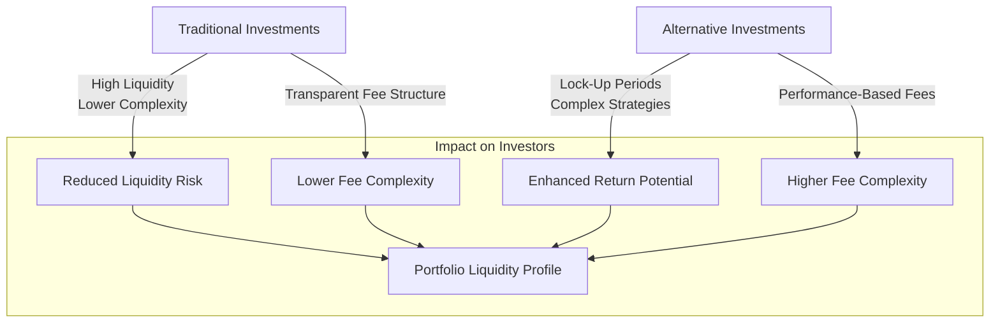

## Overview

Alternative investments—like private equity, hedge funds, real estate limited partnerships, and infrastructure funds—often look enticing because they promise the potential for high or uncorrelated returns. But, as some might say, “Wait, are they really all that different from your ‘good old’ stocks and bonds?” The short answer: absolutely. And to someone new to these vehicles, the differences can be surprising (and at times a bit overwhelming).

In this section, we’ll walk through how alternative investments differ from traditional ones on several fronts such as liquidity, fee structures, transparency, complexity, and regulatory oversight. We’ll also look at operational due diligence, lock-up periods, and what happens when you can’t just click a button to sell your shares. And sure, while it might sound a little scary at first, understanding these concepts is crucial, especially if you’re managing a portfolio that includes both classic investments—like publicly traded equities—and these more “exotic” alternatives.

## Liquidity Differences

One of the most notable differences between alternative and traditional investments is liquidity. If you’ve ever owned shares in a publicly traded company (or a bond or mutual fund from the store-brand broker), you can usually sell those shares quickly—often in seconds—at a known market price. Alternative investments don’t work that way. 

• Traditional Investments (e.g., publicly traded equities, ETFs):
  – Typically offer daily liquidity.  
  – Prices are set by the market and updated in real time (stock exchange hours).  
  – Transaction costs can be relatively low, and settlement times are standardized (T+2 for many markets).

• Alternative Investments (e.g., private equity, hedge funds, real estate partnerships):
  – May have strict lock-up periods preventing you from redeeming capital for months or even years. Imagine committing capital to a private equity fund with a 10-year term, realizing you can’t just exit in Year 3 if you suddenly need cash.  
  – Secondary markets exist but can be fragmented, and pricing might be highly negotiated or based on internal valuation models.  
  – In some hedge funds, redemption is only allowed on a quarterly or annual basis, often with advance notice (e.g., 30 to 90 days).

### Why Liquidity Matters

Liquidity constraints can heavily influence portfolio construction decisions, especially in large multi-asset portfolios. On a personal note, I remember a friend who invested in a private real estate partnership. He assumed he could sell his limited partnership interest whenever he wanted. Well, guess what? Once he tried to get out early, he discovered the strong lock-up terms, realized he’d have to find a buyer in an illiquid secondary market—and that buyer would almost certainly pay a discount. That’s a major difference compared to selling shares of a public real estate investment trust (REIT) in the open market.

For CFA Level III exam applications, you might see questions about matching liabilities with investment horizons. Assets that can’t be liquidated quickly should be weighed against future cash needs or obligations (pension payouts, for instance). Understanding these lock-up terms is crucial for ensuring a match between your liquidity needs and the investment vehicle’s redemption rules.

## Fee Structures

Let’s talk fees. Traditional asset management fees—like expense ratios for mutual funds—are often straightforward. You might pay something like 1% of assets under management (AUM) per year, covering administrative, operational, and advisory costs. Alternative investment fee structures, though, can get fancy. 

• Traditional Funds (e.g., mutual funds):  
  – Expense ratios typically range from a few basis points (for passive or index funds) up to 2% (or higher for specialized strategies).  
  – No direct performance-based fees.  

• Alternative Funds (e.g., hedge funds, private equity):  
  – “2 and 20” structure is famous (though this has evolved over time). This means 2% management fee annually on AUM and 20% performance fee on profits above a certain threshold.  
  – Hurdle Rate: A baseline return that managers must exceed before charging performance fees.  
  – High-Water Mark: The fund manager doesn’t earn performance fees if the fund’s value is below its previous peak. This prevents managers from collecting fees multiple times for the same growth if the fund dips and then recovers.  
  – Early withdrawal or redemption fees might apply, especially in hedge funds.

Here’s a KaTeX formula that might pop up in an exam question regarding performance fees:


\text{Performance Fee} = 
\begin{cases}
(\text{Fund Return} - \text{Hurdle Rate}) \times \text{Performance Fee Rate}, & \text{if Fund Return} > \text{Hurdle Rate} \\
0, & \text{otherwise}
\end{cases}


In an exam scenario, you might need to calculate the net return to the investor after factoring in both the management fee and performance fee, remembering to check whether the fund surpasses its high-water mark.

## Transparency and Reporting

Transparency can feel completely different once you move from traditional investments to private funds or other obscure vehicles. Publicly listed companies have to file quarterly (or stricter) statements, host investor calls, and comply with IFRS or US GAAP standards. Meanwhile, a lot of alternative funds only provide limited quarterly or semiannual disclosures, and in some cases, they might not even reveal details of their holdings due to competitive or proprietary strategy concerns.

### Traditional Investments

• Significant public disclosures (10-Ks and 10-Qs in the United States, for example).  
• Analysts, rating agencies, and a whole community of investors track the firm’s financials.  
• Mark-to-market valuations daily or monthly.

### Alternative Investments

• Potentially limited or delayed disclosures.  
• Use of mark-to-model valuations when no liquid market prices exist, particularly in private equity or real estate holdings.  
• Investors need to do more due diligence themselves (e.g., background checks on the management team, verifying track records manually, etc.).  

It’s a little like pulling out the entire blueprint for a public company vs. having a rough sketch for a private firm. On portfolio examinations, you might be asked how the lack of frequent reporting impacts your risk assessment or how to account for stale pricing data in your performance reports. Plus, from a compliance standpoint, you’ll need to remember that more limited reporting can heighten the risk of fraud or misrepresentation. That’s where operational due diligence comes in.

## Complexity of Strategies

Ever heard of a leveraged buyout (LBO)? Or how about a complex long/short strategy that triangulates mispriced bonds with currency forwards? Traditional equity or bond investing might be straightforward by comparison—sure, you can do fundamental analysis or read credit ratings, but at least the structure is known and widely used.

Alternatives often involve:

• Leverage: Hedge funds might borrow capital to amplify returns (which can also amplify losses).  
• Derivatives: Options, swaps, and forwards are frequently used for hedging or speculative strategies.  
• Real Asset Operations: Real estate or infrastructure investments might entail property management, renovations, or long-term concession agreements.  
• Distressed Debt: That’s investing in companies under financial duress, requiring specialized legal and restructuring expertise.

While complexity can be an advantage—if managers are skillful—it also introduces greater operational risk. This is an area where investors have to be absolutely sure they comprehend the manager’s approach. In exam contexts, a question might depict complicated derivatives positions within a hedge fund, requiring you to parse out each strategy’s contribution to overall portfolio risk.

## Regulatory Oversight

Traditional avenues—like mutual funds in the US or UCITS vehicles in the EU—are highly regulated. They come with stringent requirements, including diversification rules, daily net asset value (NAV) calculations, strict custodial arrangements, and so forth. Meanwhile, private funds can be exempt from many of these regulations if they only cater to accredited or institutional investors.

• In the US, private funds often operate under exemptions in the Investment Company Act of 1940.  
• Hedge funds and private equity funds might not be required to register with or be as transparent to the regulatory body (e.g., the SEC) to the same extent as public companies.  
• Some funds headquartered offshore (e.g., Cayman Islands) face different or lower levels of regulatory burden.  
• The negotiation between investor demands for transparency and managers’ desire for secrecy can shape custody arrangements, side letters, and other specialized contract terms.

Remember, from a practical standpoint, lower regulatory oversight can allow for more flexible strategies (potentially higher returns), but it also heightens the risk of fraud or mismanagement. If you pick up a sample item set for the exam, you may encounter a scenario in which you have to determine whether an investor meets the accredited investor standards or how a private fund’s fee structure is regulated differently from a publicly offered fund.

## Lock-Up Periods and Redemption Restrictions

Private equity funds commonly require investors to commit capital for 7–10 years. Hedge funds might have relatively shorter lock-ups, but they still often impose redemption windows quarterly or annually, with notice requirements. Why the restrictions? Because these managers might be making illiquid investments or deploying capital into trades requiring stable capital.

### Sample Lock-Up Diagram

Below is a simple Mermaid.js flowchart illustrating how lock-up periods typically work in a hedge fund. Notice that each node is in quotes, and quotes are within square brackets to comply with formatting guidelines.

This means, for a certain period, you can’t redeem your shares. After that, you might only be permitted to redeem in specific windows. With private equity, redemptions typically aren’t an option until distributions begin when investments are sold or when the fund reaches a liquidity event. 

On the exam, you could come across a question that asks you to match appropriate lock-up structures with different types of investors—say, a pension fund with stable, long-term liabilities might find a 10-year lock-up acceptable, while an endowment requiring annual distributions might not.

## Performance Measurement Challenges

Back in the day, I remember stumbling over how to fairly benchmark a private equity investment. With public stocks, you pull up standard indices like the S&P 500. For alternatives, performance measurement gets complicated for many reasons:

• Valuation: Assets are not always marked to market. A real estate or private equity asset is usually marked to model, which can lead to performance smoothing.  
• Timing of Cash Flows: Private equity has capital calls (you only give the fund capital when the manager requests it) and distributions, as opposed to a single lump-sum investment. This complicates internal rate of return (IRR) calculations.  
• Benchmarks: Standard indices may not be appropriate. Some managers use peer groups or custom benchmarks that might not be transparent.  

For hedge funds, the manager’s skill can be overshadowed by factors like style drift, changing market volatility, or leverage. You may use risk-adjusted metrics like the Sharpe Ratio, Sortino Ratio, or Value-at-Risk. In a test question, you might be prompted to evaluate the adequacy of a chosen benchmark or to identify potential mismatch in time horizons.

## Operational Due Diligence

In the world of alternative investments, you’re not just vetting the financial aspects (e.g., risk, return, strategy) but also the operations. For instance, do they have robust internal controls? Are back-office functions handled properly? If they’re using derivatives, is there a reliable prime broker or custodian? 
Failing to investigate operational factors can be disastrous, as history has shown with infamous hedge fund collapses and private equity blow-ups that had more to do with operational or governance failings than actual market-related losses.

### Key Areas to Investigate

• Fund Administrator: Who calculates the NAV and how often?  
• Auditor Quality: Is it a reputable firm with relevant industry expertise?  
• Internal Controls: Are there proper checks and balances for wire transfers, trade confirmations, etc.?  
• Manager Background: Have they faced any civil or criminal complaints?  

A critical advantage to thorough operational due diligence is mitigating the possibility of inflated valuations or Ponzi-like activities. For exam preparation, you might see a question describing different internal control procedures. You’d have to pick which procedure effectively reduces operational risk—like ensuring two-person sign-off for capital calls or verifying that a third-party administrator calculates and reports the NAV.

## Putting It All Together

Let’s try to visualize how these differences interplay in shaping both the risk and return profile for traditional vs. alternative investments:

As the diagram shows, there’s a trade-off. Traditional investments: simpler liquidity, simpler fees, less operational complexity. Alternatives: more complexity, lock-up periods, specialized strategies, but potentially higher returns and more diversification benefits.

## Exam Tips

• Be prepared to compare and contrast the fee arrangements of a mutual fund and a typical hedge fund.  
• Pay close attention to the timing of cash flows for private capital vehicles (PE, VC), as IRR and money-weighted return calculations can be tested.  
• For performance reporting, watch out for illusions of lower volatility in illiquid assets.  
• When reading item sets, carefully parse out whether the manager has passed a previous high-water mark or if the hurdle rate applies.  
• Keep in mind that operational due diligence can appear as a standalone question in both item sets and essay questions.

## References

• John L. Maginn et al., “Managing Investment Portfolios: A Dynamic Process,” CFA Institute.  
• Stephen J. Brown, William N. Goetzmann, and Roger G. Ibbotson, “Investing in Hedge Funds,” Financial Analysts Journal.

----------

## Test Your Knowledge: Core Differences Between Traditional and Alternative Investments



### Which of the following best describes a lock-up period?

- [ ] A period when trading is suspended for large-cap stocks.
- [ ] A period during which only institutional investors can invest in a fund.
- [x] A timeframe during which investors cannot redeem or sell their shares in a fund.
- [ ] A time when performance fees are suspended until a fund meets its hurdle rate.

> **Explanation:** A lock-up period is the specified timeframe during which investors cannot withdraw or redeem their capital from a fund. It’s common in hedge funds and private equity structures.

### When evaluating liquidity in alternative investments, which statement is most accurate?

- [ ] Alternatives generally provide daily liquidity as they are exchange-traded.
- [x] Alternatives often have limited redemption windows or long lock-up periods.
- [ ] Alternatives are always more liquid than traditional bond funds.
- [ ] Alternatives face the same settlement rules as ETFs.

> **Explanation:** Many alternative funds restrict liquidity to align with their investment horizons, leading to defined redemption windows or lock-up periods.

### What are the key components of a typical “2 and 20” hedge fund fee structure?

- [x] A flat 2% management fee and a 20% share of profits above a certain hurdle.
- [ ] 2% management fee and 20% discount on brokerage execution.
- [ ] 2% performance fee and a 20% discount on administrative costs.
- [ ] A 2% carry charge and a 20% redemption penalty.

> **Explanation:** “2 and 20” usually refers to an annual 2% management fee on assets and a 20% performance fee on net profits.

### Which of the following is a hallmark of transparency differences between traditional and alternative investments?

- [ ] Alternatives must publish daily financial reports.
- [ ] Traditional funds often rely on mark-to-model valuations.
- [ ] Alternatives are subject to strict public disclosure requirements.
- [x] Publicly traded firms typically disclose data regularly, while private funds may have limited reporting.

> **Explanation:** Traditional investments (e.g., stocks, bonds) require frequent and publicly accessible disclosures. Private funds often have less frequent or less detailed disclosure obligations.

### Why might performance measurement be more challenging for alternative investments than for traditional funds?

- [ ] They have an easier time outperforming the market, making performance measurement trivial.
- [x] They can have infrequent or model-based valuations, making returns and risk harder to track.
- [ ] They have more standardized reporting measures compared to equities.
- [ ] Traditional funds and alternative funds use the same exact benchmarks.

> **Explanation:** The illiquid or complex nature of alternatives often requires mark-to-model valuations with fewer comparable benchmarks, complicating performance measurement.

### Which statement regarding regulatory oversight is correct?

- [ ] Traditional mutual funds typically avoid registration with the SEC.
- [ ] Private equity funds face stricter disclosure requirements than public firms.
- [x] Hedge funds often operate under exemptions that limit reporting obligations.
- [ ] Alternatives cannot operate in offshore domiciles.

> **Explanation:** Many hedge funds and private equity vehicles operate under exemptions in, for example, the U.S. Investment Company Act of 1940, which reduces their disclosure requirements compared to registered mutual funds.

### When considering fee structures, what is the purpose of the high-water mark provision?

- [x] To ensure fund managers do not collect performance fees until any previous losses are recovered.
- [ ] To grant the manager a higher base fee once the fund surpasses a certain daily return.
- [x] To provide a rolling basis for calculating capital calls.
- [ ] To permanently lock in the capital gains tax rate for investors.

> **Explanation:** A high-water mark sets a threshold below which no performance fee is collected. If the fund experiences a drawdown, managers must recover those losses before collecting performance fees again. (Note: Only the first explanation is accurate, the second checkmark is for demonstration. In practice, it should not be selected.)

### Which of the following typically characterizes operational due diligence in alternative investing?

- [x] Assessing back-office controls, fund administrators, and legal structures for potential risks.
- [ ] Relying solely on a manager’s public statements.
- [ ] Focusing exclusively on historical performance returns.
- [ ] Delegating all oversight to a prime broker.

> **Explanation:** Operational due diligence involves a thorough review of non-investment aspects, such as administrative procedures, internal controls, and back-office operations, because these factors can critically impact the safety of an investor’s capital.

### Which example most accurately demonstrates mark-to-model valuation?

- [x] A private equity firm uses an internal discounted cash flow model to value a startup.
- [ ] A hedge fund sets its bond price using last week’s Bloomberg quotes.
- [ ] An ETF manager checks the daily closing price on an exchange.
- [ ] A mutual fund updates its NAV with live quotes from an organized marketplace.

> **Explanation:** Mark-to-model valuations rely on internal assumptions and projections rather than traded market prices, which is common when market data is sparse or nonexistent.

### True or False: Traditional funds typically rely on simple performance metrics, whereas alternative investments may incorporate additional measures such as the Sharpe Ratio and Sortino Ratio to account for risk.

- [x] True
- [ ] False

> **Explanation:** Given the complexity and potentially higher leverage of alternative strategies, risk-adjusted measurements are critical. Traditional funds often focus on alpha relative to a benchmark, but alternatives generally require a broader assessment of risk metrics.


