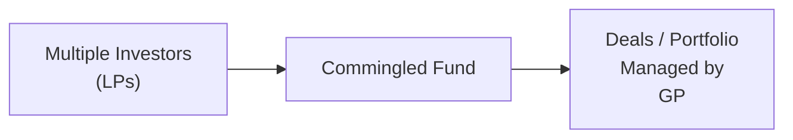
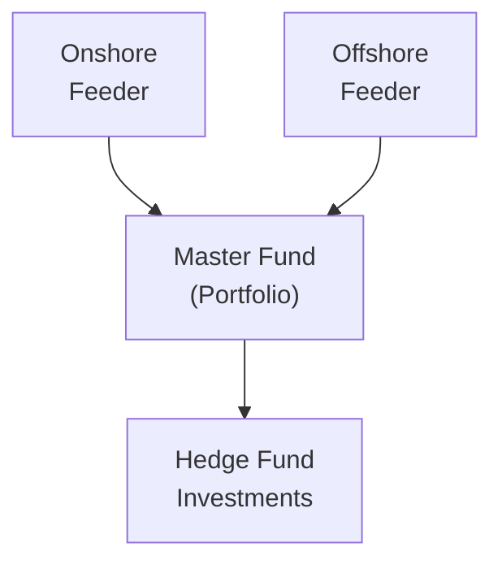

## Introduction

If you’ve ever chatted with friends or colleagues about investing in private funds, you might have noticed how many different “vehicles” and “structures” exist in the alternatives world. It’s like stepping into a massive parking lot, with everything from sleek limited partnerships to rugged separately managed accounts, and you’re just trying to figure out which ride takes you to your desired financial destination. In this section, we’ll cover the principal structures, methods, and vehicles that define alternative investments. We’ll also dig into why onshore versus offshore matters, explore roles of fund participants (like the GP and LP), and look at leveraging strategies that amplify (or hedge!) returns.

Rather than overwhelming you with jargon, we’ll keep things straightforward and tie everything back to real-world examples. Hopefully, by the time you finish reading, you’ll feel more comfortable identifying which approach aligns best with your own risk tolerance, objectives, and style.

---

## Common Legal Structures

### Limited Partnerships and Limited Liability Companies

At its core, a Limited Partnership (LP) is a fundamental tool for structuring private investment funds—especially in private equity and sometimes hedge funds. In an LP, you have a General Partner (GP) who oversees the whole operation (day-to-day management, investment decisions) and the Limited Partners (LPs) who supply the bulk of the capital. The “limited” part refers to the liability protection offered to these capital providers; their risk is capped at the amount of capital they put in. This protects them from being personally responsible if the fund runs into trouble.

• General Partner (GP): Makes decisions, manages investments, has unlimited liability (in many jurisdictions) for the partnership’s obligations.  
• Limited Partners (LPs): Contribute capital, typically have limited say in daily operations, enjoy protection from losses exceeding their investment.

Meanwhile, a Limited Liability Company (LLC) is another popular structure, often used to manage separate deals or as a platform for certain hedge fund or real estate investments. LLC owners (members) benefit from limited liability, and the entity is flexible in terms of management and taxation. For instance, an LLC can elect a “pass-through” tax treatment, where the profits or losses flow directly to the owners.

---

## Commingled Funds, Separately Managed Accounts, and Co-Investments

Alternative investment managers typically pool money from multiple investors into a single fund (commingled fund). This structure spreads costs over many participants and allows for larger, diversified portfolios.

• Commingled Funds: Multiple investors, one portfolio. You invest in the fund as a whole, sharing returns and risks pro-rata.  
• Separately Managed Accounts (SMAs): A specialized arrangement where one investor owns an entire portfolio. It’s like having your own personal chef instead of a buffet. In an SMA, you see exactly what’s held, you can customize certain restrictions (e.g., exclude tobacco stocks), and maintain greater control over fees and leverage. On the flip side, SMAs often require a higher minimum investment.  
• Co-Investments: Investors can also place additional capital alongside the main fund. Let’s say the GP finds an attractive opportunity that requires more equity—existing investors may get a chance to invest directly in that specific opportunity. This can sometimes come with lower or no additional management fees or carried interest, but also higher concentration risk.

### Diagram: Typical Commingled Fund Setup

---

## Roles of General Partners (GPs) and Limited Partners (LPs)

The GP in an LP structure isn’t just an administrative figure; they’re the brain behind the operation. Think of them as the head chef deciding which ingredients to buy, how to prepare them, and when to serve. The LPs are akin to diners providing funding for the meal. Sure, the chef (GP) might invite some feedback, but ultimately the chef decides on the recipe.

• General Partner (GP):  
  – Takes the lead in the fund’s overall strategy, daily management, and final investment decisions.  
  – Bears significant liability (in many structures) and costs if things go south.  
  – Usually invests personal capital (“skin in the game”) to align interests with LPs.  

• Limited Partners (LPs):  
  – Provide most of the fund’s capital.  
  – Have limited liability, restricted to their invested capital.  
  – Typically receive an annual or quarterly update on performance, plus a share of the gains (minus fees).

---

## Onshore vs. Offshore Fund Structures

You might have heard talk of “Cayman funds” or “Luxembourg vehicles.” This is about domiciling a fund in a jurisdiction different from where the investors (or manager) reside. Now, why do that?

1. **Tax Efficiency**: Offshore funds are set up in locations (think Cayman Islands, Bermuda, Luxembourg) with favorable or neutral tax regimes. Instead of paying an extra layer of local taxes, the fund’s returns can be passed along more efficiently to investors, who then pay taxes in their home country.  
2. **Regulatory Environment**: Some offshore jurisdictions have streamlined regulation, which can offer more flexibility or fewer constraints compared to certain onshore regulations.  
3. **Investor Access**: Non-U.S. investors often prefer these offshore structures to avoid complicated U.S. filing and tax obligations.  

This doesn’t mean it’s a big free-for-all in the Caribbean; many compliance and investor protection rules still exist. But the environment can be more business-friendly for global capital.

---

## Methods of Leverage: Margin, Derivatives, and Structured Products

Just as you might add a little hot sauce to your meal to spice things up, managers often apply leverage to enhance returns. Leverage means borrowing money or using financial instruments (like derivatives) to magnify the gains on a position. Of course, it also magnifies losses.

• **Margin Borrowing**: This is when an investor uses broker-provided debt to purchase additional securities beyond what could be purchased with their own cash.  
• **Derivatives**: Futures, forwards, swaps, and options allow you to gain (or hedge) exposure without paying the full asset price upfront. A fraction of the notional amount is posted as margin collateral.  
• **Structured Products**: Here, banks or specialized entities create instruments that package exposure to various assets or indices. These might embed options or credit derivatives to tailor the payoff profile (e.g., you might buy a note that returns 2× the S&P 500 up to a certain cap).

While leverage can be exhilarating when markets move in your favor, it can produce staggering losses if positions turn sour, so risk monitoring is essential.

---

## Fund of Funds (FoF)

Don’t want to pick a single hedge fund or private equity manager? Enter Fund of Funds (FoF). These vehicles invest in multiple underlying funds, offering built-in diversification. It’s a bit like ordering a combo platter: you get a taste of multiple (hopefully well-selected) strategies in one purchase.

• **Benefits**:  
  – Diversification across multiple GPs.  
  – Access to top-tier funds that may be closed to new direct investors.  
  – Professional selection and due diligence by FoF managers.  
• **Drawbacks**:  
  – Double layer of fees (management and performance fees at both the FoF level and underlying fund level).  
  – Less direct control or understanding of individual fund holdings.

---

## Other Popular Investment Vehicles

### Business Development Companies (BDCs)

BDCs are essentially closed-end investment companies that finance small to mid-sized private businesses. They’re particularly popular in the U.S., where they follow a specific regulatory framework under the Investment Company Act of 1940. A BDC must distribute at least 90% of its taxable income to shareholders, so it behaves somewhat like a REIT—but focusing on corporate lending or equity stakes in off-the-beaten-path companies.

### Master-Feeder Funds

Let’s say you manage a global hedge fund. You’ve got U.S. investors who might prefer to invest in a domestic, onshore vehicle, while international investors might prefer an offshore fund to avoid certain U.S. tax complexities. One solution is a Master-Feeder setup:

• **Feeder Funds**: Onshore feeder collects capital from U.S. investors; offshore feeder collects capital from global investors.  
• **Master Fund**: The feeders both invest in the master fund, which holds the actual portfolio of assets.  

This structure merges capital into a single pot, improving scale and efficiency.

### Real Estate Investment Trusts (REITs)

A REIT is a company that owns, operates, or finances income-producing real estate. REITs help you invest in large-scale, income-generating real estate (like office buildings, shopping centers, or apartments) without having to buy property outright. In many jurisdictions, REITs must pay out most of their taxable income (e.g., 90% in the U.S.) as dividends each year to maintain special tax advantages.

---

## Direct Ownership vs. Pooled Fund Participation

Picture yourself deciding whether to buy an entire apartment complex on your own or invest in a real estate fund with 20 other participants. Each approach has pros and cons:

• **Direct Ownership**  
  – You have full control over renovations, tenant selection, and financing.  
  – Potentially higher returns (or total losses) if you’re an expert operator and can find unique deals.  
  – Large capital outlay, less diversification, more hands-on property management (or you have to hire someone to do it).  

• **Pooled Fund**  
  – Lower upfront capital and immediate diversification across multiple properties/sectors.  
  – Professional asset management by GPs with specialized expertise.  
  – Fees, less direct control, potential for misalignment of interests with fund managers.

Sometimes, the best path is a balanced approach: direct deals in areas where you have a competitive edge (e.g., you know the local property market) and participation in pooled vehicles for broader diversification.

---

## Example: How a Private Equity Deal Might Be Structured

Imagine you’re investing in a private equity buyout fund. The structure might look like this:

1. **Sponsor/GP**: ABC Capital sets up a Limited Partnership.  
2. **LP Commitments**: Ten institutional investors commit $50 million each, totaling $500 million in commitments.  
3. **Capital Calls**: Over 3-5 years, ABC Capital “calls” portions of this committed capital to fund acquisitions or expansions.  
4. **Investment Period**: ABC capital invests in 10 target companies, restructures them for growth or cost improvements.  
5. **Exit**: After about 5-7 years, they sell the portfolio companies via IPOs, secondary sales, or strategic buyouts.  
6. **Distribution**: The proceeds flow back to the LPs, minus management fees and carried interest (performance fee), if applicable.

Such structure matters because it spells out the fund’s lifespan, the terms governing the distribution of profits, and the rights/responsibilities of both GPs and LPs.

---

## Practical Financial Example: Leverage with Derivatives

Let’s say you have $1 million in your fund. You decide to gain exposure to $3 million worth of equity index futures. You post $150,000 margin, which is about 5% of the notional amount. Suddenly, your portfolio has 3× leverage with minimal cash outlay. If the market moves up 10%, you might see a 30% gain on your initial $1 million (minus fees, etc.). If it drops 10%, you might face 30% losses, plus the possibility of margin calls to top up your collateral. This is why strong risk policies and daily monitoring are crucial in leveraged strategies.

---

## Mermaid Diagram: Master-Feeder Fund Structure

In the diagram above:  
• The onshore feeder (A) collects money from U.S. investors.  
• The offshore feeder (C) gathers money from non-U.S. or tax-exempt entities.  
• Both invest in the master fund (B), which centralizes portfolio management.  
• The master fund invests in capital markets or alternative strategies (D).

---

## Best Practices and Considerations

• **Alignment of Interests**: You want a GP who invests personal capital or has performance-based fees so their success is tied to investor returns.  
• **Regulatory Compliance**: Offshore doesn’t mean unregulated. Managers must abide by anti-money-laundering (AML), know-your-customer (KYC), and local securities laws.  
• **Tax Structuring**: For large investors or institutional LPs, the difference between onshore vs. offshore can be huge, especially if you’re dealing with tax-exempt groups like pension funds.  
• **Diversification**: Spreading capital across multiple structures, strategies, or asset classes can tame volatility and reduce single-strategy blow-ups.  
• **Operational Due Diligence**: Assess your manager’s ability to handle margin calls, set up robust controls, and provide timely reporting.  
• **Exit Flexibility**: Direct ownership might require deeper pockets and a longer time horizon, while commingled funds typically have set redemption schedules or lock-up periods.

---

## Exam Tips and Pitfalls

1. **Double Check Fee Layers**: In Fund of Funds, watch out for double fees. The exam often tests your awareness that you might pay both a management fee at the FoF level and at each underlying fund.  
2. **Distinguish Onshore vs. Offshore**: Know which structures cater to U.S. taxable investors vs. global or tax-exempt investors.  
3. **Leverage Impact**: Practice calculating how returns (and losses) get magnified when margin or derivatives are involved. The test might ask you to dissect a simple scenario where a manager invests in futures with a certain margin ratio.  
4. **Look for Key Terms**: Recognize GP, LP, Master-Feeder, BDC, REIT, and how each might operate in typical question vignettes.  
5. **Regulatory Environment**: Even if it’s an offshore fund, certain securities laws or reporting requirements might still apply.  
6. **Liquidity and Lock-Up**: Understand how lock-up periods, notice periods, and gate provisions can restrict redemptions.  
7. **Charging Carried Interest**: Many questions revolve around how the GP takes a performance fee (“carry”) based on fund profits, typically after meeting a hurdle rate or “preferred return.”

---

## References

• Keith Black, Donald R. Chambers, and Hossein Kazemi, “Alternative Investments,” CAIA Level I.  
• “Forming and Operating a Private Fund,” CFA Institute.  

---

## Test Your Knowledge: Structures, Methods, and Vehicles Quiz



### Which of the following is the most common legal structure for private equity funds?

- [ ] Limited Liability Company (LLC)
- [ ] C-Corporation
- [x] Limited Partnership (LP)
- [ ] Sole Proprietorship

> **Explanation:** Limited Partnerships (LPs) are widely used in private equity because they combine centralized management by the General Partner with limited liability for Limited Partners.

### A key advantage of a separately managed account (SMA) compared to a commingled fund is:

- [ ] Lower minimum investment requirements
- [x] Customization of portfolio assets
- [ ] Tax deferral across multiple jurisdictions
- [ ] Regulatory exemption from disclosures

> **Explanation:** SMAs allow the investor direct ownership of the assets and can accommodate specific investment preferences or restrictions. However, SMAs typically require larger minimum investments.

### One primary reason hedge funds often use offshore domiciles such as the Cayman Islands is:

- [ ] Decreased operational flexibility
- [ ] Lower overall returns
- [x] Potential for tax efficiency and simplified regulatory requirements
- [ ] Restricted access to global investors

> **Explanation:** Offshore structures can offer tax neutrality and reduce certain regulatory burdens, making them attractive to both fund managers and non-U.S. investors.

### In a master-feeder fund structure, the Feeder Funds typically:

- [x] Aggregate capital from different types of investors before investing in the Master Fund
- [ ] Directly hold the portfolio of underlying investments
- [ ] Are prohibited from pooling assets from institutional investors
- [ ] Each manage separate portfolios independently

> **Explanation:** Master-feeder arrangements let multiple feeders (e.g., onshore and offshore) invest jointly in a single master fund that holds the assets, reducing duplication and costs.

### Which investment vehicle primarily provides financing to small and mid-sized businesses under U.S. regulation?

- [ ] Real Estate Investment Trust (REIT)
- [ ] Offshore Feeder Fund
- [ ] Fund of Funds
- [x] Business Development Company (BDC)

> **Explanation:** BDCs, regulated under the Investment Company Act of 1940, focus on financing smaller businesses, often through loans or private equity stakes.

### The use of derivatives to gain multiplied exposure to an asset with a fraction of the capital is primarily an example of:

- [ ] Active management
- [x] Leverage
- [ ] Diversification
- [ ] Value investing

> **Explanation:** Derivatives enable investors to assume a larger notional position than their capital might otherwise permit, introducing leverage.

### An investor who wants to spread investments across multiple private equity or hedge fund managers, without selecting them individually, would likely use:

- [x] A Fund of Funds (FoF)
- [ ] A master-feeder fund
- [x] A co-investment structure
- [ ] A single GP stake

> **Explanation:** A Fund of Funds (FoF) invests in a range of underlying funds, offering diversification and professional manager selection.

### Under a typical Limited Partnership fund structure, the party responsible for making investment decisions and bearing unlimited liability is:

- [x] The General Partner (GP)
- [ ] The Limited Partners (LPs)
- [ ] The Custodian
- [ ] The Auditor

> **Explanation:** The GP manages the fund’s operations and investments, while LPs contribute capital with limited liability.

### Which structure allows an investor to directly own the underlying portfolio assets, rather than owning shares in a comingled vehicle?

- [ ] Limited Partnership fund
- [x] Separately Managed Account (SMA)
- [ ] Fund of Funds
- [ ] Business Development Company (BDC)

> **Explanation:** An SMA grants direct ownership and transparency, whereas commingled vehicles typically pool assets and allow only a pro rata claim.

### True or False: Real Estate Investment Trusts (REITs) are required to pay out most of their taxable income to investors as dividends to maintain their tax-advantaged status.

- [x] True
- [ ] False

> **Explanation:** In many jurisdictions (e.g., U.S.), REITs must distribute a high percentage (e.g., 90%) of taxable income in dividends, qualifying them for special tax treatment.


