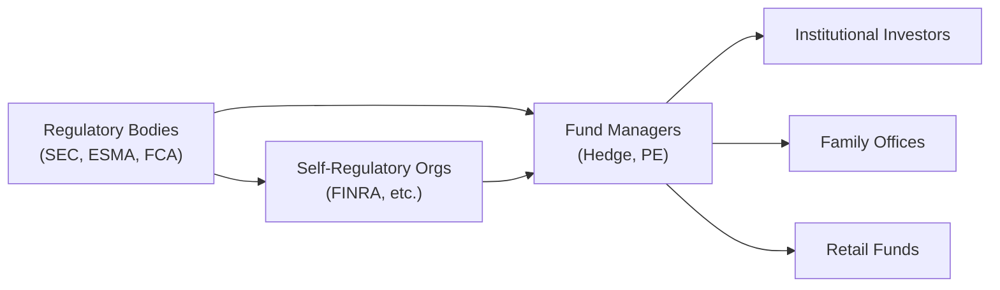

## The Regulatory Landscape in Alternative Investments

Regulation and compliance in alternative investments often feels like a maze, right? Managers must contend with different rules in different jurisdictions, clients expect clarity on data protection, and regulators demand transparency (well, at least more than in the past). But it’s not always as intimidating as it sounds. By understanding the major regulatory bodies, industry guidelines, and participant roles, you’ll be better prepared to navigate the cross-border complexities that accompany hedge funds, private equity, and other non-traditional asset classes.

In more traditional markets—like public equities—compliance and disclosure requirements are fairly visible. Meanwhile, alternative investment structures sometimes thrive in a more opaque environment. That’s precisely why things like AML (Anti-Money Laundering) and KYC (Know Your Customer) guidelines are constantly evolving, aiming to strengthen investor protection and preserve market integrity.

Below, we’ll break down the major regulatory bodies, explore registration obligations, and cast some light on who the big players are in this domain. Let’s jump in.

## Major Regulatory Bodies

Regulatory structures differ around the globe, but a few organizations stand out due to their broad reach and significant influence on how alternative investments are managed and marketed.

### The U.S. Securities and Exchange Commission (SEC)

The SEC is the primary federal regulatory agency overseeing the U.S. securities markets. Its remit includes enforcing securities laws to protect investors, maintaining fair and efficient markets, and facilitating capital formation. Although hedge funds and private equity funds are often exempt from certain public registration requirements (for instance, operating under Regulation D or Section 3(c)(1) and 3(c)(7) of the Investment Company Act of 1940), many advisors must still register under the Investment Advisers Act of 1940 once they reach specified thresholds (commonly $150 million of regulatory assets under management for private fund managers).

I remember joking with one manager who told me: “We started with $100 million under management, so we thought, hey, let’s keep it under the threshold and avoid an SEC conversation.” That might sound tempting, but it’s risky business—most reputable groups aim to comply as soon as they anticipate crossing those lines.

### European Securities and Markets Authority (ESMA)

Across the Atlantic, ESMA is in charge of safeguarding the stability of the EU’s financial system. ESMA works to promote a standard set of rules, known as the single rulebook, so that relevant players (investment managers, banks, etc.) operate under harmonized criteria. One of its primary responsibilities is protecting retail investors and ensuring proper conduct of financial institutions under directives such as MiFID II (Markets in Financial Instruments Directive).

Within alternative investments specifically, ESMA plays a crucial role under the Alternative Investment Fund Managers Directive (AIFMD). The AIFMD imposes rules on capital requirements, reporting, and risk management for managers of alternative investment funds (AIFs). Once a manager is authorized under AIFMD in one EU member state, that manager typically gains the “marketing passport” that allows fund distribution throughout the European Economic Area (EEA). The passporting regime does come with plenty of cross-border compliance checks though, so always tread carefully.

### Other Key National and Regional Regulators

• Financial Conduct Authority (FCA) in the UK  
• Monetary Authority of Singapore (MAS)  
• Securities and Futures Commission (SFC) in Hong Kong  
• Australian Securities and Investments Commission (ASIC)  

All these regulators share a common goal: protect investors and maintain market integrity. However, each implements its own set of rules and guidelines, leading to a global patchwork. This patchwork can be tough to handle if you’re marketing a fund simultaneously across multiple continents. But hey, that’s where a good counsel or compliance team becomes your best friend.

## Registration Requirements and Compliance Standards

### Hedge Fund and Private Equity Compliance

The typical image of a hedge fund is that of a nimble investment vehicle, sometimes lightly regulated due to the sophistication of its investor base (usually high-net-worth individuals, institutions, etc.). While that perception has some historical validity, regulatory authority and compliance expectations have grown significantly post-2008.

In the U.S., hedge fund advisors with over $150 million in assets under management must generally register with the SEC as investment advisers. They’re also subject to periodic examinations, must file Form ADV, and comply with the Investment Advisers Act, which includes fiduciary duties related to disclosures, potential conflicts of interest, and best execution. For private equity (PE) managers, the situation is similar: once you grow to a certain size, the same registration thresholds apply.

### Exemptions and Thresholds

Managers of smaller funds or certain specialized strategies may qualify for exemptions. In the U.S., there are “Exempt Reporting Advisers” if you’re strictly a venture capital fund manager or are under certain AUM thresholds for private funds. However, being exempt doesn’t mean you’re scot-free. You still may have to complete some form of periodic reporting and remain subject to anti-fraud provisions.

In the EU, the AIFMD sets the bar for fund registration, though small AIFMs (managers below certain thresholds, e.g., €100 million in open-ended strategies or €500 million for closed-ended no-leverage strategies) may enjoy reduced regulatory burdens. But many eventually “opt in” to full compliance so they can market to institutional investors more freely across the EEA.

## Self-Regulatory Organizations (SROs) and Industry Associations

### Role of SROs

In some markets, self-regulatory organizations form an integral part of the regulatory framework. For instance, in the U.S., FINRA (Financial Industry Regulatory Authority) oversees broker-dealers, making sure they adhere to fair practice rules. SRO responsibilities typically include:

• Writing and enforcing rules that govern member activities.  
• Examining member firms for compliance.  
• Educating investors and providing data transparency.  

While SROs don’t replace national regulators, they share the oversight burden and often handle day-to-day supervision in specialized niches.

### Industry Associations

Beyond formal SROs, groups such as the Alternative Investment Management Association (AIMA) and the CAIA Association function as advocates and educators. They issue best practice guidelines and codes of conduct. AIMA, for example, publishes due diligence questionnaires, offering practical frameworks for hedge fund operational risk or private credit investing. These associations build consensus on industry standards, ultimately complementing regulatory initiatives.

## Key Market Participants

In alternative investments, many parties come to the table, each with distinct motivations and regulatory obligations.

### Fund Managers

• Hedge Fund Managers: Typically overseeing broad or niche alternative strategies (e.g., long/short equity, global macro, CTA). They face compliance duties based on fund location and the location of investors.  
• Private Equity Managers: Specialize in leveraged buyouts, growth equity investments, or venture capital. PE managers also juggle compliance, investor relations, and portfolio oversight.  

### Institutional Investors

Institutions—like pension funds, insurance companies, and university endowments—provide a significant chunk of capital for alternative strategies. These entities usually have their own compliance frameworks to ensure they invest in appropriate vehicles that match their risk tolerance and meet their fiduciary duties.

### Family Offices

Family offices often manage wealth for a single or small group of families. They may have wide latitude, unconstrained by the same public disclosures that hamper, say, a publicly listed asset manager. However, larger family offices can face more scrutiny in certain jurisdictions, especially if they manage outside capital or if they cross certain registration thresholds.

### Sovereign Wealth Funds (SWFs)

SWFs are government-sponsored investment vehicles that can deploy substantial capital. High-profile SWFs include Norway’s Government Pension Fund Global (GPFG) and the Abu Dhabi Investment Authority (ADIA). These entities typically invest across all asset classes, including alternatives, but also must respect local regulations in the regions where they operate or raise capital.

### Retail Funds

While it’s historically been less common for retail investors to access hedge funds and private equity, “retailization” of alternatives is on the rise. Various structures, like ‘40 Act interval funds in the U.S. or liquid alternatives under UCITS compliance in Europe, have emerged to meet this growing demand. But along with this expansion, regulators have placed additional emphasis on investor protection measures (e.g., limitations on leverage, daily liquidity requirements), ensuring that less-experienced investors are not unduly exposed to complex, illiquid strategies.

## AIFMD and Other Reporting Standards

The Alternative Investment Fund Managers Directive (AIFMD) in the EU is a hallmark legislative framework that lays out broad rules on capital requirements, risk management, and disclosure for managers of “alternative investment funds,” which basically covers hedge funds, private equity funds, and real estate funds. Under AIFMD:

• Managers must register/license with an EEA regulator.  
• Firms submit regulatory reports (Annex IV reporting) detailing leverage, risk metrics, portfolio exposures.  
• Depositary and custodian arrangements must be established, ensuring robust safeguarding of fund assets.  

Similarly, other regions have instituted comparable guidelines or taken cues from AIFMD to shape their own frameworks. For global managers, aligning compliance forms and processes across multiple standards can be tricky, but many rely on specialized service providers and compliance consultants to streamline data submission.

## AML and KYC Rules

Wherever you go, you’ll find anti-money laundering (AML) and know-your-customer (KYC) rules. They’re basically universal. Financial institutions and fund managers have to verify investor identities, understand the source of funds, and monitor ongoing transactions for suspicious activity. In the U.S., these requirements come from the Bank Secrecy Act and follow-up legislation such as the Patriot Act. In Europe, the EU Anti-Money Laundering Directives set the stage, periodically updated to tighten loopholes.

Beyond regulatory compliance, strong AML/KYC procedures also help protect a fund’s reputation. Managers definitely don’t want to discover they were inadvertently complicit in money laundering or terror financing. And from what I’ve observed, a lapse in AML/KYC is one of the more common catalysts for enforcement actions.

## Global Coordination (or Lack Thereof)

Regulators worldwide attempt to share data and collaborate, but it’s far from seamless. Complexities arise because certain countries have stricter bank secrecy laws, some emphasize investor protection more than others, and local political frameworks can slow global agreements. For example, it’s not always straightforward for a U.S.-based manager to “passport” funds into Asia, or an EU manager to bring their products directly into the U.S. exempt market. Each case demands a thorough approach to distribution laws, marketing rules, and cross-border payment flows.

If you plan to raise capital globally, it helps to either:

1. Use third-party placement agents who have the proper licenses.  
2. Establish local partnerships to handle compliance on the ground.  
3. Create separately domiciled funds (e.g., Luxembourg “SICAV” or Cayman Islands “Master-Feeder”) that meet the norms of target jurisdictions.  

## Ongoing Regulatory Trends

### Increasing Transparency

Remember the post-financial-crisis environment when governments aimed to clamp down on shadow banking and the opaque corners of the financial system? Well, that mood hasn’t entirely disappeared. Even as regulations evolve, the push for more transparency in alternative investments remains strong. Regulators want better data on leverage, fund performance, and liquidity risk, partly to mitigate systemic risk.

### ESG Disclosure Requirements

Environmental, social, and governance (ESG) considerations are picking up serious momentum everywhere. Regulators in Europe (through regulations like the Sustainable Finance Disclosure Regulation, SFDR) and elsewhere are mandating more robust ESG disclosure. This means alternative managers need to define and measure their ESG risks and impacts, which can be tricky if you’re holding niche assets like distressed credit or farmland.

### Tech-Driven Compliance

Technology is leveling the playing field. From automated KYC checks to blockchain-based solutions for investor onboarding, the compliance function is gradually becoming more digitized. Managers who adopt advanced RegTech solutions can reduce administrative burdens, although they need to ensure that data privacy laws are respected in the process.

## Visualizing Regulatory Interactions

Below is a simple Mermaid diagram illustrating the flow of interactions among regulators, SROs, fund managers, and investors:

The arrows show how regulators and SROs oversee fund managers, who in turn interact with various investor segments. Regulatory oversight flows from both official bodies and self-regulating entities.

## Common Pitfalls and Best Practices

• Neglecting Registration Thresholds: Don’t underestimate the importance of monitoring AUM growth. Cross a limit without proper registration, and you’re in hot water.  
• Inconsistent AML/KYC Controls: Even small oversights can lead to reputational damage or sanctions.  
• Communication Gaps: If you’re launching cross-border funds, ensure local counsel reviews marketing materials and distribution channels for compliance with local guidelines.  
• Overlooking ESG Demands: Failure to provide transparent ESG data can reduce your appeal to institutional investors and lead to regulatory scrutiny.  

Best practices include creating a comprehensive compliance manual, employing in-house or outsourced compliance officers, and maintaining consistent dialogue with regulators. In my experience, open communication can preempt a lot of potential issues.  

## Exam Relevance and Study Tips

On the CFA exam, you might see scenario-based questions where you’ll be asked to determine whether a private equity fund needs to register in the U.S. or what steps a hedge fund must follow to comply with AIFMD if it’s distributed in Europe. Be prepared to:

• Cite key regulatory thresholds (like $150 million AUM in the U.S.).  
• Discuss the roles of SROs vs. official regulatory bodies.  
• Understand cross-border implications of fundraising.  
• Identify compliance triggers for AML, KYC, and repeated investor disclosures.

Time management is crucial, especially for multi-part item sets that combine compliance, risk mitigation, and portfolio strategy. Treat each sub-question systematically—quickly gather the relevant details from the scenario to identify the best response, referencing the correct regulation or standard.

## References for Further Exploration

- CFA Institute, “Regulatory and Compliance Guidelines for Alternative Funds.”  
- Philippe Jorion, “Risk Management for Hedge Funds,” CAIA Association Journal.  
- Alternative Investment Management Association (AIMA) Website: https://www.aima.org  
- European Securities and Markets Authority (ESMA): https://www.esma.europa.eu  
- U.S. Securities and Exchange Commission (SEC): https://www.sec.gov  

They’re all great starting points if you want to dive even deeper into these topics.

---

## Test Your Knowledge: Key Regulatory and Market Participants Concepts



### Which regulatory body is primarily responsible for enforcing securities laws in the United States?

- [ ] FINRA
- [x] SEC
- [ ] FCA
- [ ] ESMA

> **Explanation:** FINRA is a self-regulatory organization, whereas the U.S. Securities and Exchange Commission (SEC) is the primary federal agency enforcing securities laws in the U.S.

### Under the U.S. Investment Advisers Act, what is the commonly noted asset threshold beyond which private fund managers generally must register with the SEC?

- [ ] $50 million in AUM
- [ ] $100 million in AUM
- [x] $150 million in AUM
- [ ] $500 million in AUM

> **Explanation:** In the U.S., many private fund managers with over $150 million in regulatory assets under management must register with the SEC.

### What does the AIFMD “marketing passport” allow an alternative investment manager to do?

- [x] Distribute their funds freely throughout the EEA once registered in one member state
- [ ] Avoid all registration requirements in Europe
- [ ] Market funds only in the manager’s home country
- [ ] Bypass AML and KYC regulations in Europe

> **Explanation:** The AIFMD passport allows managers to market alternative investment funds throughout the European Economic Area once they have the appropriate authorization in one member state.

### Which organization provides due diligence questionnaires and best practice guidelines specifically aimed at hedge funds and private credit managers?

- [ ] SEC
- [x] AIMA
- [ ] SEC & ESMA Joint Committee
- [ ] CAIA Association

> **Explanation:** The Alternative Investment Management Association (AIMA) is known for its best practice guides and industry-standard due diligence questionnaires.

### Which of the following is NOT typically considered a key participant in the alternative investments market?

- [ ] Institutional Investors
- [ ] Family Offices
- [ ] Sovereign Wealth Funds
- [x] Credit Rating Agencies

> **Explanation:** Credit rating agencies are important in capital markets generally, but they are not direct participants in alternative investments such as hedge funds or private equity in the same way institutional investors or family offices are.

### Which compliance framework in Europe imposes specific depositary and custodian requirements on alternative fund managers?

- [ ] MiFID II
- [ ] UCITS
- [ ] SFDR
- [x] AIFMD

> **Explanation:** Under the Alternative Investment Fund Managers Directive (AIFMD), alternative fund managers must appoint a depositary to safeguard the fund’s assets and provide oversight.

### What is the main global objective of KYC rules?

- [x] To verify customer identity and prevent money laundering
- [ ] To maximize fund returns
- [ ] To reduce manager operational costs
- [ ] To ensure funds can avoid distribution restrictions

> **Explanation:** KYC (Know Your Customer) guidelines primarily exist to identify customers, verify the source of their funds, and prevent fraudulent or illegal activities.

### Which entity in the United States acts as an SRO overseeing broker-dealer firms?

- [x] FINRA
- [ ] SEC
- [ ] ESMA
- [ ] AIMA

> **Explanation:** The Financial Industry Regulatory Authority (FINRA) is a self-regulatory organization that regulates brokerage firms and exchange markets in the U.S.

### Under the EU’s AIFMD, which is one of the primary data submissions required from fund managers?

- [ ] A daily net asset value forecast
- [ ] Comprehensive investor credit checks
- [x] Annex IV regulatory reporting
- [ ] AML risk scoring for every investor

> **Explanation:** AIFMD requires Annex IV reporting, which involves details on exposures, leverage, and risk management metrics.

### When it comes to cross-border coordination among regulators, which of the following statements is TRUE?

- [x] Global coordination is beneficial but often fragmented due to differing local and national interests.
- [ ] Cross-border distribution always follows a single universal standard.
- [ ] Regulation is harmonized worldwide through a single global authority.
- [ ] Most regulators forbid any communication with foreign authorities.

> **Explanation:** While regulators strive for collaboration, there is no single global authority, and local regulations can vary significantly, making global coordination a challenge.


