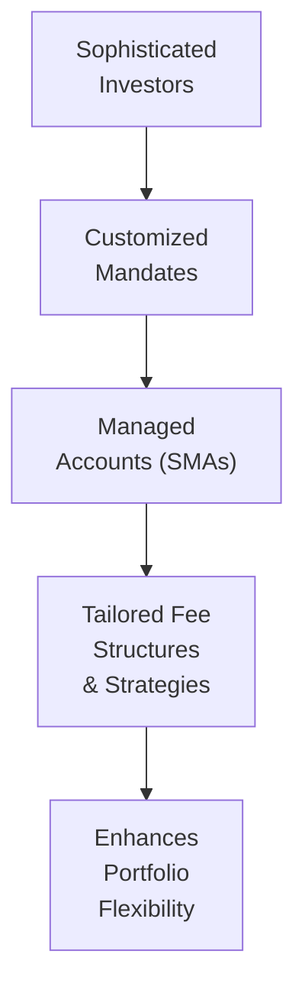

## Introduction

Sometimes, when I reflect on my early days in finance, I can’t help but recall that moment when a colleague first mentioned “alternative investments.” I remember scratching my head, thinking it all sounded super fancy—buyouts, hedge funds, private credit, real estate, farmland. But as you dig deeper, you realize that alternatives have been part of investment portfolios for centuries, just not in the mainstream spotlight. Now, with interest rates sometimes hovering near zero, rapidly changing market structures, and a thirst for new sources of yield, alternatives have become a major discussion topic for both large institutions and everyday investors.

In this section, we’ll explore how the alternative investments industry has grown, what major trends are fueling its popularity, and why many folks (myself included) have found them increasingly compelling. We’ll address everything from macroeconomic drivers and demographic shifts to fintech innovation, retail access, and even changes in global wealth distribution. By the end, you should have a solid grasp of the forces shaping alternative investments today—and maybe feel just a little more excited about where this industry is headed.

## Historical Growth in Alternative Investments

The expansion of alternative asset classes has been particularly pronounced over the last couple of decades. According to data from sources like Preqin Global Reports and other industry trackers, total assets under management (AUM) in traditional private equity, hedge funds, private credit, and real estate have grown from the low trillions in the early 2000s to well over $10 trillion today.

Why this meteoric rise? One key factor is that interest rates hit historically low levels in many developed markets—from around 2008 all the way through the mid-2020s. Suddenly, the yields from government bonds and high-grade credit hardly helped pension funds and other institutional players meet their long-term liabilities. And so, they looked for new frontiers—private equity, distressed debt, infrastructure, farmland, and pretty much any alternative that could promise more robust returns or stable income.

Even within the alternatives space itself, there’s been a shift in emphasis. For instance:
• Private equity has branched into growth equity and minority investments.  
• Real estate has evolved to include specialized sectors like data centers, cell towers, and social infrastructure.  
• Hedge funds have developed new strategies, from event-driven to multi-factor systematic approaches.

Investors often cite increased diversification and higher return potential as reasons for their growing interest. Sure, these assets usually demand more complex due diligence and have liquidity constraints, but for many, this trade-off is worthwhile.

## Macroeconomic Drivers

### Low-Interest-Rate Environments

Let’s talk about rock-bottom interest rates—anyone who’s chased yield has probably sighed in frustration when they see their bond coupons. Central banks worldwide lowered rates substantially post-2008 to spur economic growth. That strategy made borrowing cheap but also left yield-hungry investors with fewer ways to get those juicy returns. Alternatives, offering non-traditional, higher-yielding strategies, suddenly looked a whole lot more appealing. Private credit, in particular, benefited as it provided yields higher than typical corporate bonds. 

### Shifts in Pension Strategies

On the institutional side, **pension strategies** began to incorporate alternatives in a big way. Some large pension funds now dedicate 30% or more of their portfolios to private markets, seeking the stable cash flows of infrastructure or the high growth potential of venture capital. They’ve found that these allocations can help bridge funding gaps, hedge against inflation (especially in real assets), and smooth out overall portfolio volatility if appropriately selected.

### Global Economic Cycles

Economic expansions and contractions also play a role in fueling interest in alternatives. For example, in downturns, distressed debt and restructuring strategies can flourish. In expansions, buyouts and growth equity might see more action. In other words, regardless of the cycle, there’s usually at least one corner of the alternatives market that’s ripe for opportunity.

Below is a simplified diagram that illustrates how macroeconomic factors feed into the expansion of alternative investments:

## Technology & Innovation

When we talk about **fintech (financial technology)**, it’s not all about fancy apps or blockchain hype. From automated investment platforms to digitized access to private securities, fintech has significantly lowered barriers to entry for both investors and fund managers. This innovation is driving growth in alternatives in a few ways:

• **Online Platforms and Syndication**: Crowdfunding and syndicate investing let individual investors participate in deals that were once the exclusive domain of large venture capital or private equity players.  
• **Operational Efficiency**: Technology solutions help managers run their funds more cheaply, automating things like compliance, accounting, and investor reporting. With lower costs, managers can target smaller deals or provide services to a broader client base.  
• **Data and Analytics**: AI and advanced analytics help identify market trends, perform due diligence, and manage risk more effectively across various alternative strategies.

So, you no longer have to be a massive institutional investor to access opportunities in real estate or venture capital. That’s a big deal—fintech solutions have democratized at least a slice of the alternative universe.

## Demographic Shifts

Demographics often feel like the slowest-moving factor in investing, but they can have huge impacts:

• **Aging Populations**: In many developed markets, pension plans and insurance companies must generate stable returns for retirees. Because government bonds may not be enough, these institutions keep turning to alternatives—like infrastructure (for its steady income) and private credit (for higher yields).  
• **Millennial and Gen Z Investors**: Younger generations often prioritize **impact investing** (investments targeting social and environmental benefits, alongside financial returns). This tilt toward “invest with a purpose” helps fuel demand for ESG (Environmental, Social, and Governance) strategies and ethically conscious private funds.  
• **Global Wealth Distribution**: Economies in Asia, the Middle East, and parts of Africa are seeing strong growth in household wealth. As wealth accumulates, new investors look to diversify, creating rising demand for alternative assets in **emerging markets** and beyond.

## Institutional Investors’ Search for Yield

### Increased Allocations to Private Credit

We might all have that friend who complains about paltry bond returns. Institutional investors feel the same—just on a much bigger scale. That’s why **private credit** has exploded. Private debt—often provided by non-bank lenders—carries higher interest rates than conventional bonds because it targets smaller or riskier borrowers. The payoff? Higher returns, albeit with more liquidity risk or operational complexities.

### Infrastructure

Let’s not forget **infrastructure**—renewable energy farms, toll roads, airports, and telecom towers. Institutions love the stable and often inflation-linked cash flows from infrastructure assets. In many cases, governments offload or partner with the private sector to meet public funding needs. Large sovereign wealth funds or pension plans, in turn, see infrastructure as a way to diversify, lower correlation, and hedge inflation risk over decades.

## Emerging Markets & Global Expansion

We’d be missing a big chunk if we didn’t talk about **emerging markets**. Interestingly, many investors are exploring private opportunities in areas like Southeast Asia, Latin America, and Sub-Saharan Africa. These regions sometimes offer faster economic growth, though each has its own regulatory complexities and geopolitical risks. In private equity, emerging markets can present deals at lower entry valuations compared to, say, the frothy U.S. market. 

Raising capital in these locales is greener than in more mature economies. However, funds that succeed can find new pools of limited partners (LPs) and unique investment opportunities. And because these economies are still developing, the growth potential can be substantial, contributing to the industry’s overall expansion.

## Retail Access & Distribution Channels

It used to be that alternatives were “deep-pocket only.” Today, thanks to structured products like **interval funds** or **liquid alternatives**, retail investors have more ways to participate:

• **Interval Funds**: These offer limited redemption windows, giving managers more leeway to invest in illiquid assets. In return, everyday investors get access to strategies that might provide returns not tightly correlated with public markets.  
• **Liquid Alternatives**: These mimic hedge fund or private equity strategies but package them in mutual fund or ETF wrappers. They typically offer daily or weekly liquidity, though with less potential alpha and sometimes higher fees.

Moreover, broker-dealers, private banks, and even robo-advisors have stepped up initiatives to make alternative investments more accessible to people with modest net worths. This channel expansion is a key driver of industry growth.

## Managed Accounts & Customized Mandates

Among sophisticated investors—like family offices or large endowments—there’s an increasing preference for **customized mandates**. Instead of committing to a commingled fund with a standard set of terms, these investors negotiate separately managed accounts (SMAs) where the investment strategy and fee structures are tailored to their needs. SMAs can:

• Provide clarity on underlying holdings, which is especially important for institutional clients sensitive to environmental or social considerations.  
• Enable quick rebalancing decisions to adapt to changing market conditions.  
• Offer flexible liquidity terms, so the investor can scale up or down more easily.

Managers also find it beneficial because large committed capital from a single or small group of investors can be more stable in the long run, reducing marketing overhead and lock-up complexities.

## ESG & Impact Investing

These days, you almost can’t talk about finance without mentioning **ESG**. With the rise in conscious consumerism and regulatory pushes for better corporate disclosure, asset owners (like pension funds) increasingly adopt responsible investing mandates. This shift toward ESG can take many forms:

• **Screening**: Excluding companies that fail certain environmental or social standards.  
• **Engagement**: Encouraging better governance or greener practices through active ownership.  
• **Impact Investing**: Targeting solutions to societal challenges—like clean energy, affordable housing, or healthcare innovations.

**Impact investing** is especially attractive to those who see alpha opportunities in addressing large-scale social or environmental problems. For instance, a private equity firm might invest in sustainable agriculture in emerging markets, capturing growth while also supporting local communities.

This tilt toward ESG also influences fundraising. Investors increasingly question managers about their ESG frameworks and track records. Funds that can demonstrate robust ESG policies often enjoy an advantage in attracting capital. Similarly, regulators worldwide continue to refine disclosure requirements, providing more transparency and building investor confidence in these strategies.

## Conclusion

Take a step back, and it’s clear that alternative investments are no longer a niche. Between low interest rates, technology breakthroughs, demographic changes, the insatiable search for yield, and the moral imperative (and opportunity) of ESG, the industry’s upward trajectory looks set to continue.

If you’re an investor, this means more strategies, more structures, and more possibilities—though complexity, fees, and due diligence requirements also abound. For policymakers and regulators, it implies ensuring that broader access doesn’t lead to systemic risk or misinformed investors. And for those just getting started with alternatives, understanding these trends—like the push toward customized mandates or the rise of impact investing—helps you appreciate where the industry stands today and what might come next.

## Final Exam Tips

• Know the **macro link**: Understand how low interest rates and economic cycles push institutions to alternatives.  
• Pay attention to **ESG** and **impact investing**: Examiners might test your grasp of how ESG scoring impacts portfolio construction or how impact investing goes beyond simple screening.  
• Stay updated on **fintech trends**: You could see exam questions about new distribution channels or how technology reduces operational costs in private equity or hedge funds.  
• Memorize the key attributes of **interval funds** and **liquid alternatives**: These fund structures have unique redemption rules and risk profiles.  
• Practice **scenario analysis**: The exam might give you a scenario where an investor needs yield, low correlation, or impact objectives, and you’ll have to recommend an alternative product.  
• Understand the **risk-return profile** of **private credit** vs. typical bond portfolios.

## References

• Preqin Global Reports on “Private Equity & Venture Capital” and “Hedge Funds.”  
• “ESG Integration in Europe, the Middle East, and Africa,” CFA Institute Research Foundation.

---

## Test Your Knowledge: Industry Trends and Growth Drivers in Alternative Investments



### Which macroeconomic factor has most prominently driven institutional investors toward alternative investments in the past decade?

- [ ] High inflation rates
- [ ] Significant tax increases on capital gains
- [x] Persistently low interest rates
- [ ] Elevated sovereign credit ratings worldwide

> **Explanation:** Low yields on traditional investments have pushed institutions to explore higher-return segments like private credit and private equity.

### Which of the following investment vehicles typically allows limited periodic redemptions rather than daily liquidity?

- [ ] Liquid alternative fund
- [x] Interval fund
- [ ] Hedge fund side pocket
- [ ] Mutual fund

> **Explanation:** Interval funds provide a gated liquidity structure, offering redemptions to investors at specified intervals.

### What is one key driver for the rise in private credit allocations among institutional investors?

- [ ] Declining cost of capital for banks
- [x] The search for yield in a low-interest-rate environment
- [ ] Strict regulatory caps on private equity allocations
- [ ] Permanent high-volatility expectations in global markets

> **Explanation:** Private credit often yields higher returns than standard corporate bonds, making it attractive when interest rates are near historical lows.

### How is fintech changing the alternative investment landscape?

- [ ] Raising tax barriers for retail investors
- [ ] Eliminating the need for limited partners
- [ ] Reducing transparency for institutional investors
- [x] Lowering barriers to entry and enhancing operational efficiencies

> **Explanation:** Technological advances—from online platforms to advanced analytics—facilitate easier access and more efficient fund management.

### Which demographic shift is likely to increase demand for stable or income-generating alternatives?

- [ ] Decreasing life expectancy
- [x] Aging populations in developed markets
- [ ] Massive youth unemployment
- [ ] Smaller wealth gaps

> **Explanation:** Aging populations require stable retirement incomes, driving interest in income-focused alternative assets such as infrastructure and private credit.

### Which of the following structures is typically marketed as a way for retail investors to access hedge fund–like strategies with more frequent liquidity?

- [ ] Blind-pool private equity funds
- [x] Liquid alternatives
- [ ] Real Estate Investment Trusts (REITs)
- [ ] Special-purpose acquisition companies (SPACs)

> **Explanation:** “Liquid alternatives” are mutual funds or ETFs employing hedge fund strategies, offering greater liquidity than traditional hedge funds.

### If an investor wants a portfolio strategy tailored to their specific ESG guidelines and liquidity preferences, which option might be most suitable?

- [ ] Standard commingled buyout fund
- [ ] VC fund-of-funds
- [x] Separately managed account (SMA) or customized mandate
- [ ] Passive index fund

> **Explanation:** SMAs or customized mandates can be designed to meet the investor’s unique requirements, including ESG alignment or liquidity needs.

### Which statement best describes the impact of emerging markets on alternative investment fundraising?

- [x] They provide new pools of capital and fresh investment opportunities.
- [ ] They have no effect on global capital flows.
- [ ] Their regulatory systems are universally identical to those in developed markets.
- [ ] They are suitable only for short-term hedge fund strategies.

> **Explanation:** Emerging markets often present growing wealth bases and diverse opportunities, although each market has unique regulations and risk factors.

### One major appeal of infrastructure investments for institutional portfolios is:

- [ ] Highly volatile returns
- [ ] No regulatory oversight
- [x] Stable, often inflation-linked cash flows
- [ ] Immediate liquidity

> **Explanation:** Infrastructure assets such as toll roads or utilities can provide reliable long-term income streams that may keep up with inflation.

### True or False: ESG and impact investing are largely unrelated to the broader growth trends in alternative investments.

- [ ] False
- [x] True (in the sense that ESG and impact investing are integral drivers of growth)
  
> **Explanation:** ESG and impact investing have become significant considerations for many institutional and retail investors, contributing to the growth of the alternatives sector.


