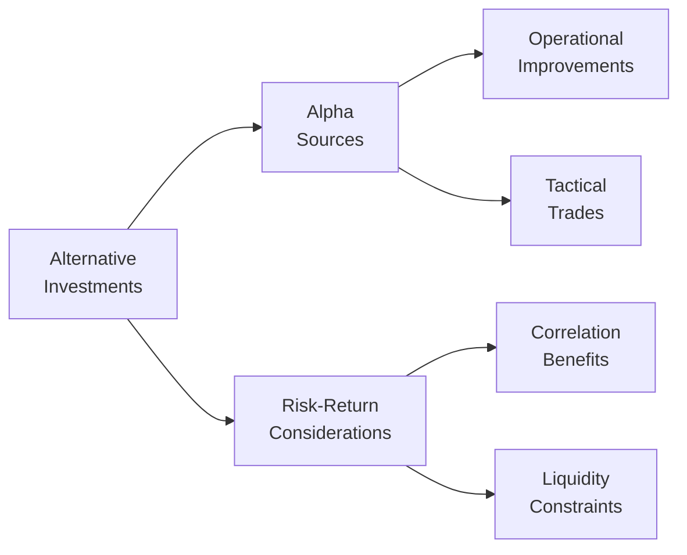

## Introduction

So, you’ve heard about alternative investments, right? And you’re probably wondering how they match up across different strategies—like private equity, real estate, hedge funds, and all that fun stuff. I remember someone once telling me, “If you’ve seen one alternative investment, you’ve seen...one alternative investment.” Each category—be it real estate, infrastructure, commodities, or venture capital—has a unique personality, especially when it comes to risk, returns, and ways to generate alpha. But don’t worry! We’ll walk through the major alternative assets, compare their risk-return profiles, talk about time horizons, and discuss correlations and performance metrics. By the end, you’ll see how they fit into a broader multi-asset portfolio and, hopefully, which one might be your new best friend when it comes to diversification.

## Risk-Return Overview

Most of us start by asking: “Okay, what’s the potential upside, and what do I have to lose?” This is the heart of comparing asset classes. Traditional assets—like bonds and equities—have fairly transparent performance histories, effective benchmarking, and daily liquidity (in many cases). Alternatives, on the other hand, can sometimes feel like a puzzle, primarily because many of them have:
• Unique valuation methodologies (think real estate appraisals or Level 3 assets).  
• Illiquid structures and lock-up periods (especially in private equity and venture capital).  
• Specialized risk factors (commodity storage costs, operational improvement risk, etc.).

Below is a rough spectrum of typical risk-return expectations for popular alternative asset classes, from lower to potentially higher risk-return:

• Infrastructure, core real estate  
• Real estate value-add/opportunistic, large buyout private equity  
• Distressed debt, mid-market private equity  
• Hedge funds (varies widely by strategy)  
• Venture capital  
• Commodities (varies with market cycles)

“When you take on more risk, you might earn higher returns—but it’s never guaranteed.” That’s the slightly uncomfortable truth behind all investments, alternative or not.

## Time Horizon Considerations

Speaking of truth, let’s talk about time horizons. In any alternative investment, your capital can be locked up for years—even a decade or longer. This means you’ve got to align your liquidity needs with the structure of the investment. If you’re ultra-patient and aiming for meaningful capital appreciation, private equity or venture capital might be a fit. They often require holding periods of at least five to seven years (and sometimes longer if exit markets are slow).

On the other side, certain hedge fund strategies, especially those with relatively liquid underlying assets, may allow quarterly or annual redemptions. Commodities—traded on futures exchanges—can be more liquid, but their short-term price movements can be volatile. Infrastructure, in many cases, requires a similarly long time horizon since large construction projects and government concessions can span decades.

## Correlation Patterns and Diversification

Let’s face it: Many investors look to alternatives because they want something that “zigs when everything else zags.” Well, that’s partly true, but the correlation story can get complicated:

• Private Equity & Public Equity: Usually relatively high correlations over longer periods (because both are equity-related), but in the short run, reported returns for private equity lag or “smooth out” due to appraisal-based valuations.  
• Real Estate & Equities (or Bonds): Often moderate correlation, but can rise in times of economic stress.  
• Commodities & Equities/Bonds: Historical correlations can be low (and sometimes negative), offering interesting diversification benefits—though certain commodities (e.g., energy) may correlate with equities in inflationary or growth-driven environments.  
• Hedge Funds & Traditional Assets: Depends on the strategy. A market-neutral or global macro hedge fund might exhibit lower correlation with equities, while long/short equity strategies may show moderate correlation with the market.  
• Infrastructure & Equities: Infrastructure might have moderate correlation to equity markets, but it can differ significantly based on whether the underlying investments are regulated utilities, toll roads, or emerging market airports.

A quick practical snippet in Python to illustrate how one could compute correlation if you had daily returns data for two investments:

```python
import numpy as np

returnsA = np.array([0.03, 0.05, 0.01, 0.07])
returnsB = np.array([0.02, 0.04, 0.02, 0.06])

correlation = np.corrcoef(returnsA, returnsB)[0, 1]
print("Correlation:", correlation)
```

This snippet calculates correlation between two sets of returns (returnsA and returnsB) to see how closely they move together.

## Key Performance Metrics

When you evaluate the success (or failure) of an alternative strategy, you might (and should) look beyond raw returns. Let’s highlight a few essential performance metrics:

• Sharpe Ratio:  
  
  \text{Sharpe Ratio} = \frac{R_p - R_f}{\sigma_p}
    
  This measures how much return you get per unit of (total) volatility. For example, if a private equity fund returned 15%, the risk-free rate was 3%, and the standard deviation was 10%, the Sharpe Ratio would be (0.15 – 0.03) / 0.10 = 1.2. 

• Sortino Ratio: Similar to the Sharpe Ratio, but it focuses on downside deviation instead of total standard deviation. This can be especially relevant for alternative strategies that have asymmetric return profiles.

• Information Ratio: Measures the fund’s active return relative to its tracking error. This is popular with hedge funds that have a benchmark (like an equity index or a custom index) and try to surpass that through active management.

Meanwhile, correlations and maximum drawdowns also form a huge part of the conversation. In alternative investments, drawdowns can be tricky to estimate. For example, private equity’s net asset value is typically appraised infrequently, so a “drawdown” doesn’t show up the same way it does in a public equity fund.

## Unique Sources of Alpha

One of the coolest parts of alternative investing is that each type can generate “alpha” (investor skill-based returns) differently.

• Private Equity: Often tries to achieve alpha through “operational improvements,” such as revamping a company’s supply chain or professionalizing family-run businesses.  
• Hedge Funds: Some rely on “tactical trades”—short-term opportunities around market dislocations or even event-driven strategies (like merger arbitrage). Others (e.g., global macro funds) use macroeconomic insights.  
• Real Estate: Potential alpha can come from purchasing undervalued properties, repositioning them (e.g., converting office to residential), or upgrading amenities to increase rents.  
• Commodities: Some managers attempt alpha through active futures trading strategies, exploiting market inefficiencies, roll yield enhancements, and fundamental supply-demand imbalances.  
• Infrastructure: Alpha can stem from securing favorable contract terms, achieving operational efficiencies, and leveraging stable cash flows from regulated or quasi-monopolistic assets.  
• Venture Capital: Focuses on early-stage companies, with alpha derived from identifying “the next big thing” and supporting rapid growth.

Anyway, it’s not that any single approach is better by definition. It’s about which alpha source resonates with your investment thesis, risk appetite, and due diligence capabilities.

To visualize the concept of how these pieces connect:



## Liquidity and Exit Options

You might be used to daily redemptions in mutual funds, but alternatives can be a very different ballgame.  
• Private Equity & Venture Capital: Typically have LP (Limited Partnership) structures with capital calls and distributions over a 7–10+ year horizon. Secondary markets can offer partial liquidity but often at a discount.  
• Hedge Funds: Some require lock-ups of 1–3 years, plus quarterly or annual redemption windows. Others might impose gates if too many investors want out at once.  
• Real Estate: Private real estate funds are somewhat illiquid, but publicly traded REITs (Real Estate Investment Trusts) provide daily liquidity (though with higher correlation to stock markets).  
• Commodities: Can be relatively liquid depending on whether you’re investing through futures or exchange-traded funds (ETFs). Holding physical commodities (like gold bars) has different liquidity profiles entirely.  
• Infrastructure: Usually illiquid. Projects are long term, so typical exit routes involve selling stakes to another investor or bringing the asset to a public listing if it’s large enough.

So, in short, always match your liquidity needs with the right alternative investment. It can be heartbreaking (and costly) to have to exit early at a discount because you needed the cash unexpectedly.

## Impact of External Market Factors

External market factors—like interest rates, inflation, geopolitical events—hit different alternative assets in different ways.  
• Rising Interest Rates: Tends to reduce valuations for real estate and infrastructure assets (if leveraged) but might also hamper buyout activity in private equity as the cost of debt financing rises.  
• Inflation: Commodities often do well in inflationary environments as they reflect the rising prices of raw materials. Real estate can adjust rents over time, offering a partial hedge. Private equity portfolio companies may experience margin compression if input costs rise faster than they can increase prices.  
• Geopolitical Tensions: Might create short-term trading opportunities for certain hedge funds (e.g., global macro), while supply chain disruptions can really affect farmland or commodities. Infrastructure projects—particularly in emerging markets—might be exposed to political interference.  

## Scenario Analysis and Stress Testing

Given these variables, scenario analysis and stress testing (even though it sounds boring) can be super helpful. You basically ask, “What if interest rates spike 3%? What if there’s a recession or a sudden oil shock?” Then you model how each alternative asset might respond.

• In Real Estate, you might test vacancy increases, drops in rental rates, or rising cap rates.  
• In Hedge Funds, you could examine how a sharp market downturn affects leveraged strategies (e.g., long/short equity) or how a specific macro event influences currency trades.  
• In Private Equity, you might analyze how a recession impacts portfolio company revenues and the future exit multiples.  
• For Commodities, you could model extreme price swings or disruptions in supply (e.g., a weather catastrophe for agricultural products).

It’s not perfect—it’s hypothetical—but it gives you a sense of resilience or vulnerability across these different asset classes.

## Best Practices and Challenges

• Conduct Thorough Due Diligence: With illiquid assets, data can be harder to come by and you’re often reliant on sponsor-provided materials.  
• Mind the Fees: Private equity funds can have hefty fees (management + carried interest), and hedge funds typically charge “2 and 20” (2% management fee + 20% performance fee). Always compare net vs. gross returns.  
• Monitor Correlations Over Time: It’s easy to assume certain assets are always a great diversifier, but correlations can shift, especially during market turmoil.  
• Manage Liquidity Risk: Consider how quickly you can exit your positions, or if you even can.  
• Watch for Overlap in Underlying Assets: Multiple alternative funds in your portfolio may own the same type of asset or even the same company in extreme cases.

## Summary

Comparing alternative investments is about more than just “which one has the highest returns?” You want to consider time horizon, liquidity, potential alpha sources, volatility, correlation, and how external market forces can impact each segment. In my opinion, the real power of alternatives comes from how they can complement traditional stock and bond portfolios—lowering overall portfolio volatility or providing unique growth opportunities. Just remember: A fancy name doesn’t mean lower risk. So do your homework, stay diversified, and always align your investments with your financial goals and constraints.

## Final Exam Tips

• Be prepared to discuss how and why correlations among alternatives and traditional assets may shift in extreme market environments.  
• Practice calculating Sharpe Ratios, Sortino Ratios, and other performance metrics using hypothetical data.  
• Clearly understand the trade-offs between liquidity and potential returns in each alternative asset class.  
• Develop an awareness of how external factors (interest rates, inflation, geopolitical risks) can either enhance or erode the value of alternative investments.  
• Always relate your responses back to the investor’s objectives, constraints, and overall portfolio context—this is especially crucial in essay-style questions.

## References and Further Reading

• Robert Greer, “The Nature of Commodity Index Returns,” Journal of Alternative Investments.  
• Frank K. Reilly & Keith C. Brown, “Investment Analysis and Portfolio Management.”  
• CFA Institute Curriculum, Level I and Level II readings on Alternative Investments and Portfolio Management.  
• Additional recommended reading:  
  – “Private Equity Demystified” by John Gilligan & Mike Wright  
  – “Hedge Fund Market Wizards” by Jack D. Schwager  

## Test Your Knowledge: Comparative Asset Class Analysis



### Which of the following alternative asset classes typically requires the longest lock-up period for investors?

- [ ] Hedge funds
- [ ] Real estate investment trusts (REITs)
- [x] Private equity buyout funds
- [ ] Commodity ETFs

> **Explanation:** Private equity buyout funds often require multiple years before an exit event occurs (such as a merger or IPO), tying up investor capital longer than many other alternatives.

### Which performance metric focuses specifically on downside risk rather than overall volatility?

- [ ] Sharpe Ratio
- [x] Sortino Ratio
- [ ] Information Ratio
- [ ] Treynor Ratio

> **Explanation:** The Sortino Ratio replaces standard deviation with downside deviation in the denominator, providing a more targeted view of risk focusing on negative returns.

### In which stage of a private equity or venture capital investment is the ability to quickly redeem capital typically most restricted?

- [x] Initial investment stage
- [ ] Post-exit stage
- [ ] Secondary market transaction stage
- [ ] Seed funding stage

> **Explanation:** Early in the fund’s life, lock-ups and funding commitments limit investor liquidity. Only when portfolio companies exit do distributions occur, freeing investor capital.

### A fund that employs short-term macroeconomic predictions and rapid trades in currencies and interest rate futures is likely pursuing what type of strategy?

- [ ] Real estate value-add
- [x] Global macro hedge fund
- [ ] Core infrastructure
- [ ] Long/short equity hedge fund

> **Explanation:** A global macro hedge fund seeks to profit through macroeconomic cycles and typically uses currencies, bonds, commodities, and interest rates as primary trading instruments.

### If a hedge fund’s return streams are highly correlated with the S&P 500 Index, which of the following statements is most likely true?

- [ ] The hedge fund is providing more diversification benefits.
- [x] The hedge fund’s strategy might be closely tied to equity market performance.
- [ ] The hedge fund’s risk is entirely uncorrelated with equities.
- [ ] The hedge fund must be using a market-neutral approach.

> **Explanation:** A high correlation with the S&P 500 suggests the fund’s performance moves in tandem with equities, which reduces diversification potential and indicates the fund’s exposures resemble those of the broader market.

### Which of the following can be considered a primary source of alpha in private equity funds?

- [ ] Index tracking
- [ ] Passive bond investing
- [ ] Commodity roll yield
- [x] Operational improvements in portfolio companies

> **Explanation:** Private equity managers often seek to improve operations and profitability in their portfolio companies, which can generate excess returns beyond simple market exposure.

### Which external factor is most likely to have a notably positive impact on commodity prices within a portfolio?

- [ ] Decreasing inflation
- [ ] Tightening monetary policy
- [x] High inflation and rising raw material costs
- [ ] A stable geopolitical environment

> **Explanation:** Elevated inflation often contributes to rising commodity prices because raw material costs increase, potentially boosting returns for investors in commodity positions.

### In scenario analysis for an infrastructure project, which of the following is an example of a key sensitivity to test?

- [x] A significant increase in operating expenses for toll road maintenance
- [ ] A rumored private equity takeover of a competing venture capital fund
- [ ] A minor fluctuation in short-term foreign exchange rates
- [ ] Historically low interest rates that remain unchanged

> **Explanation:** Infrastructure investments often require ongoing capital expenditures for maintenance. An unforeseen rise in these costs can dramatically affect returns and therefore is essential to test in scenario analysis.

### During stress testing, an investment manager notices that hedge fund returns plummet during periods of dramatic equity market downturns. Which statement is most accurate?

- [x] The hedge fund strategy may not offer true downside protection in severe markets.
- [ ] The hedge fund’s returns are likely uncorrelated with equities.
- [ ] The hedge fund fails to offer any diversification benefit even in normal markets.
- [ ] The stress test is irrelevant because hedge funds are always uncorrelated with stocks.

> **Explanation:** The stress test indicates that under extreme equity downturns, the hedge fund tends to suffer similar losses, meaning it doesn’t provide the hoped-for hedge or downside protection in certain market conditions.

### True or False: Infrastructure tends to have a shorter investment horizon than venture capital because infrastructure assets are typically easier to build and exit.

- [ ] True
- [x] False

> **Explanation:** Infrastructure projects often need large initial capital expenditures and long operational periods, sometimes lasting decades. Venture capital can also have multi-year horizons, but infrastructure is not necessarily shorter.


