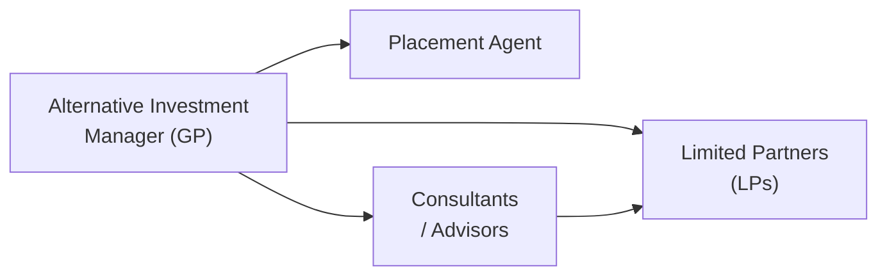

## Introduction
Ethics in alternative investments can be a bit tricky—trust me, I’ve been there. When you start dealing with less regulated markets, opaque valuation methods, and complex fund structures, everyone involved has to be extra vigilant. Of course, the CFA Institute Code of Ethics and Standards of Professional Conduct (the “Code and Standards”) remains pivotal in guiding how we uphold professionalism and integrity. In the context of alternatives—whether private equity, real estate, hedge funds, or digital assets—professionals encounter forms of information asymmetry, valuation intricacies, and potential conflicts of interest that require deeper ethical scrutiny.  

In my early days of working in a hedge fund, I remember feeling a sense of excitement about how creative you could be with investment strategies. At the same time, I learned that this creativity opens the door to potential ethical lapses if you’re not careful. So let’s walk through the fundamentals, highlight common pitfalls, and reinforce best practices for ethical conduct in the alternatives space.  

## Relevance of the CFA Institute Code of Ethics in Alternatives
The Code and Standards is the bedrock of professional conduct for investment practitioners. Specifically in alternatives, the stakes are often higher because of the relatively opaque nature of underlying assets and the presence of non-traditional structures. Practitioners might be tempted to push boundaries—but a robust ethical framework ensures that decisions reflect the highest standard of integrity.

• Client First: Even in a private equity fund, where a General Partner (GP) has wide discretion, maintaining a client-first mentality is crucial.  
• Independence and Objectivity: The fluid, sometimes illiquid, nature of alternative assets can translate into a greater reliance on subjective judgment. Independence of thought and a steadfast commitment to objectivity are essential to keep biases at bay.  
• Integrity of Capital Markets: Alternatives often operate with limited disclosure requirements, which can lead to insider trading or misrepresentation if parties aren’t vigilant.  

## Common Ethical Dilemmas in Alternatives
Several ethical minefields present themselves in alternative investments, and it’s not unusual for professionals to face tough calls. Here are the big ones:  

### Conflicts of Interest
Conflicts of interest might occur when a GP has personal incentives not aligned with Limited Partners (LPs), or in real estate deals where the sponsor stands to gain more by choosing a certain property manager. Some situations:

• Side Letters: Certain investors negotiate preferential terms (e.g., lower fees) that are undisclosed to others.  
• Self-Dealing: A GP may steer a prime investment toward a side vehicle in which they have a greater stake.  

### Valuation Manipulation
Investors in private capital and hedge funds rely on reported valuations to gauge performance. There’s often limited market pricing available for illiquid assets. If managers systematically inflate valuations, they’re effectively providing inaccurate performance pictures:

• Overstating Valuations: This can attract new investors or inflate performance fees.  
• Understating Valuations: In certain scenarios, managers might downplay valuations to manage expectations or manipulate capital call timing.  

### Insider Trading
Alternative investment managers frequently interact with companies, real estate developers, or data from private deals. Doing a quick we-shouldn’t-do-this scenario check is critical:

• Access to Non-Public Information: Hedge fund analysts who talk to mid-level executives at target companies must ensure they’re not gleaning material non-public info.  
• Industry Conferences: Managers might inadvertently share or overhear sensitive information relevant to a pending merger.  

### Limited Transparency
The complexity of alternative fund structures can lead to insufficient or unclear disclosures:

• Complex Fee Arrangements: Performance-based fees, carve-outs, and multi-layer structures can hide real costs from investors.  
• Opaque Investment Process: Some funds disclose minimal details about trading strategies and risk exposures, leaving LPs in the dark about how decisions are actually made.  

## Best Practices in Disclosure
Disclosure is a cornerstone of ethical conduct. Investors deserve an accurate and full picture of what they’re buying into. A robust disclosure policy often involves:

• Clear Explanation of Fees: Spell out management fees, performance fees, and any pass-through expenses.  
• Portfolio Holdings and Valuations: Provide at least periodic transparency into top positions, sector exposures, or aggregated value.  
• Potential Conflicts: Declare them openly. Maintaining a conflict-of-interest policy to guide employees and managers is a must.  

Consider a short anecdote: My team once prepared an investor pitch for a private debt fund, and during the diligence process, a prospective investor asked, “What if the deal sponsor is also a part-owner of the brokerage we intend to use?” We realized we had to state that conflict plainly in the offering materials, ensuring clarity on how we’d handle broker selection.  

## Protecting Confidential Information
Alternative investments often revolve around proprietary strategies, private company insights, or sensitive negotiation details. A manager’s duty to preserve confidentiality is both ethical and strategic:

• Use of Non-Disclosure Agreements (NDAs): Standard practice before delving into due diligence of a target company.  
• Encryption and Data Security: Hedge funds, especially those with algorithmic strategies, must invest in robust cybersecurity protocols to prevent data leaks.  
• Internal Walls: For multi-strategy platforms, establishing “information barriers” ensures that material non-public data does not flow to teams that could misuse it.  

## Role of Third Parties and the Necessity for Unbiased Advice
Third-party relationships—placement agents, consultants, prime brokers—are integral to alternative investing. Yet these relationships sometimes carry the risk of persuasion or undisclosed compensation:

• Placement Agents: They help raise capital but might pressure GPs to offer sweeteners or special deals to large investors.  
• Consultants: Ideally, they provide objective advice, but conflicts can arise if they receive “consulting fees” from both managers and investors.

It might help to visualize how these parties interact:

As you see, these intermediaries (C and D) bridge the gap between Managers (A) and Investors (B). Maintaining transparency about referral fees and potential conflicts keeps the chain of trust intact.

## Governance Structures andFair Treatment of Investors
High-quality governance can help mitigate conflicts of interest and ensure accountability. Governance frameworks typically include:

• Independent Boards or Committees: They provide oversight on valuations, strategic decisions, and conflict resolutions.  
• Audit and Valuation Committees: Especially critical in real estate or private equity funds that invest in difficult-to-price assets.  
• Rotation of Service Providers: Periodic changes of auditors or third-party valuation agents can bolster objectivity.  

## Fiduciary Duties: Loyalty, Care, and Full Disclosure
General Partners are frequently bound by fiduciary duties—legal or ethical obligations to act in the best interests of Limited Partners:

• Duty of Loyalty: Refrain from self-dealing or conflicts that put personal interests ahead of the fund’s interests.  
• Duty of Care: Carry out a prudent due diligence process and maintain high professional standards.  
• Duty of Full Disclosure: Provide sufficient, accurate, and timely information so that investors can make informed decisions.  

At many private funds, the partnership agreement formalizes these duties, referencing the Code and Standards for additional guidance. Violations can lead to lawsuits, regulatory action, and an exodus of unhappy investors.

## Reputational and Regulatory Consequences
Ethical lapses can quickly spiral into major reputational damage. One well-known example is the fallout from insider trading cases where alternative managers faced heavy fines and lost investor confidence—practically overnight. Regulatory bodies worldwide keep increasing their focus on hedge funds, private equity, and other alternative entities.  

• Negative Press: Media coverage of ethical violations (like hidden fees or inflated valuations) can lead to investor redemptions.  
• Enforcement Actions: Regulators can impose bans from the industry, or even criminal penalties in severe cases.  

## Practical Steps to Uphold Ethical Standards
Formal codes and frameworks are only as strong as the actions they inspire. To mitigate risks:  

• Conduct In-Person or Virtual Training: Regular staff sessions on confidentiality, insider trading, conflict management, and compliance.  
• Maintain Up-to-Date Policies: Address new trends, such as digital token valuation or ESG disclosure.  
• Encourage Whistleblower Protections: Ensure employees feel safe reporting issues without fear of retribution.  
• Document Everything: From compliance checks to conflict resolution, a culture of thorough record-keeping is a robust deterrent to wrongdoing.

## A Personal Reflection
Maybe you’re thinking, “This is all obvious, right?” But in real practice, it’s quite easy to rationalize small slips. For me, a tricky moment happened when I was analyzing a Series B funding round for a private tech company. I received a call from a friend who worked at the startup, offhandedly mentioning a potential acquisition deal. Now, of course, I was excited. But that was precisely the moment I knew I couldn’t let my emotions overshadow the code—I politely ended the call, reminded my friend not to reveal information that wasn’t public, and immediately informed our compliance officer. It felt a little awkward, but that’s what the Code is there for.

## Conclusion
Ethical and professional conduct in alternative investments is not an optional ideal; it’s downright essential. Alternative assets—by nature—present unique challenges, including illiquidity, limited oversight, and often complex fee and return structures. By adhering to the CFA Institute Code and Standards, implementing strong governance, and nurturing a culture of disclosure and confidentiality, market participants reinforce the integrity and credibility of the entire ecosystem.  

Professionalism is a marathon, not a sprint. Perhaps we might slip occasionally, but by fortifying ourselves with solid ethical principles, we’re better positioned to serve clients, uphold market integrity, and preserve our reputations for the long haul.

## References
• CFA Institute. “Code of Ethics and Standards of Professional Conduct.”  
• CAIA Association Journal. “Revisiting Ethics in Alternative Investments.”  

## Test Your Knowledge: Ethical and Professional Conduct in Alternatives



### Which core principle in the CFA Institute Code and Standards ensures that client needs are paramount for investment professionals?

- [ ] Independence and Objectivity
- [x] Putting Client Interests First
- [ ] Confidentiality of Information
- [ ] Integrity of Capital Markets

> **Explanation:** The principle referring to placing client interests first explicitly states that investment professionals must prioritize the welfare of clients above personal or firm interests.

### Which of the following is an example of potential valuation manipulation in a private equity fund?

- [ ] Obtaining third-party appraisals
- [ ] Using discounts for lack of marketability
- [x] Overstating valuations to attract new investors
- [ ] Conducting a sensitivity analysis for risk factors

> **Explanation:** Overstating valuations to attract new investors misrepresents the fund's performance and can be considered unethical and misleading.

### A hedge fund analyst receives non-public, price-sensitive information from a company executive. Trading on this information would most likely be:

- [x] Illegal insider trading
- [ ] Permissible if disclosed in marketing materials
- [ ] Considered fair game under standard industry practice
- [ ] A minor violation with no consequences

> **Explanation:** Using material non-public information to trade is textbook insider trading and violates both regulatory requirements and the CFA Code of Ethics.

### Which of the following best describes a conflict of interest that could arise between a GP and LPs in a private equity fund?

- [ ] GP invests personal capital in the fund
- [ ] GP discloses the fund’s largest holdings to LPs
- [x] GP routes superior deals to a side vehicle for higher personal gain
- [ ] GP provides in-depth risk analysis throughout the life of the fund

> **Explanation:** Routing superior deals to a side vehicle or a related party over the main fund violates the duty of loyalty and results in an undisclosed conflict of interest.

### Why is transparency around fees important in alternative investment funds?

- [x] It enables investors to make informed decisions and prevents hidden costs.
- [x] It aligns with fiduciary responsibilities under the Code and Standards.
- [ ] It helps keep transactions anonymous from regulators.
- [ ] It reduces compliance costs for the manager.

> **Explanation:** Transparent fee disclosures allow investors to understand, monitor, and evaluate costs accurately. It’s also an essential component of adhering to fiduciary duties.

### Which governance measure helps ensure independence and fairness in valuing illiquid assets in a hedge fund?

- [x] Using an external valuation committee
- [ ] Letting the fund manager single-handedly verify prices
- [ ] Relying on the rating agency’s single credit opinion
- [ ] Introducing a performance fee only if valuations exceed cost

> **Explanation:** An external or independent valuation committee adds objectivity and reduces the risk that a manager will inflate or deflate asset values.

### Which scenario best illustrates the importance of whistleblower protections?

- [x] A junior team member identifies a suspicious conflict of interest and can safely escalate it
- [ ] A portfolio manager announces a new strategy at an investor dinner
- [x] An oversight committee openly discusses new compensation plans
- [ ] A marketing director privately revises a media release to correct a minor mistake

> **Explanation:** Whistleblower protections allow employees to report ethical or legal concerns without fear, fostering transparency and accountability.

### A general partner charges investors an undisclosed administrative fee, in addition to the disclosed 2% management fee. This practice is:

- [x] A serious violation of ethical conduct
- [ ] Acceptable if kept below 1%
- [ ] Only concerning if exceeding management fees
- [ ] Automatically permissible due to partnership agreements

> **Explanation:** Undisclosed fees violate the principle of full disclosure, and GPs have a fiduciary duty to inform investors about any additional charges.

### Which option is a primary reason regulators heavily scrutinize insider trading in alternative investments?

- [x] It undermines market integrity and creates unfair advantages
- [ ] It allows large investors to trade at unfavorable prices
- [ ] It helps small investors secure better entry points
- [ ] It ensures that employees trade more frequently

> **Explanation:** Insider trading undermines confidence in capital markets and grants unfair benefits to those with privileged information.

### True or False: A placement agent receiving hidden fees from a GP without disclosing them to the LPs is an ethical, but not a legal, violation.

- [x] True
- [ ] False

> **Explanation:** Hidden fees can violate both ethical and legal standards. Lack of disclosure directly conflicts with the duty of loyalty and the requirement to inform investors of all material information.


