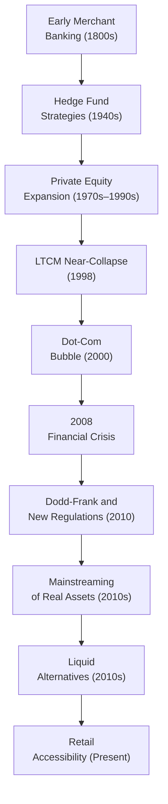

## Origins of Alternative Investments

To understand how alternative investments gained traction in the financial world, it helps to start with the earliest known form of what we now refer to as private equity. This was merchant banking, and it really set the stage for modern alternative strategies. Think of merchant bankers in the 19th century—like the Rothschilds in Europe—financing trade expeditions and early industrial ventures. They provided capital in exchange for a share of profits. It was alternative investing in its infancy: relatively unregulated, relationship-driven, and reliant on specialized networks of wealthy individuals (often families) rather than broad public markets.

I recall reading about how these merchants not only offered loans but also took equity stakes in companies. Pretty bold for that time, right? Yet it was this exact model—aligning capital providers with entrepreneurs—that provided the core blueprint for everything from traditional venture capital (VC) to private equity buyouts. Even though we now have far more sophisticated structures, it’s remarkable how many fundamental principles carry forward from this era.

## The Emergence of Hedge Funds

Hedge funds, too, trace their origins back to a rather intriguing period: the 1940s. The story typically spotlights Alfred Winslow Jones, who is credited with creating one of the first “hedged” strategies. Essentially, Jones tried to neutralize (or “hedge”) some market risk by combining long equity positions with short positions. It was a simple idea—limit broad market downside while still capturing individual stock selection gains.

Over the subsequent decades, many hedge funds experimented with unique methods, from arbitrage to global macro bets. As technology advanced—electronic trading, real-time data feeds—these managers gained the ability to trade globally and employ all sorts of quantitative strategies. Some of the earliest funds might have been whimsical experiments, but they ultimately inspired the gargantuan multi-strategy hedge funds we see today. It’s kind of neat to think that a small operation in the 1940s launched a financial revolution that now spans every asset class and geography imaginable.

## Growth of Private Equity: 1970s–1990s

Let’s fast forward to the 1970s and 1980s. If you were an investor in those days, you might have noticed that large institutional players—pension funds, university endowments—began allocating capital to specialized investment partnerships. The modern private equity ecosystem got rolling, with big names like KKR (Kohlberg Kravis Roberts) and TPG (Texas Pacific Group) pioneering leveraged buyouts (LBOs). In an LBO, the fund acquires a target company, using a combination of equity and debt, then attempts to enhance value through operational improvements or restructuring.

• 1970s–1980s: Private equity moves from being a niche financing mechanism to a more structured approach; the partnerships are formal and the limited-partner (LP)/general-partner (GP) model emerges.  
• 1990s: Significant proliferation of buyout funds, accompanied by more robust regulatory frameworks around fundraising and disclosure.

Venture capital saw a similar trajectory. Early successes (e.g., financing technology in Silicon Valley) drew in more capital and more specialized VC funds. By the 1990s, it was common for major institutional portfolios to have a slice allocated to private equity and venture capital, often in pursuit of higher returns than what traditional equities or bonds could offer.

## Major Regulatory Milestones

Regulation plays an outsized role in shaping alternative investments. While it can sometimes feel a bit complex, understanding a few key pieces of legislation can help:

• U.S. Investment Company Act of 1940: Although it primarily governed mutual funds and other registered products, it laid the foundation for how investment vehicles are structured—defining investor protection standards, disclosures, and permissible investment approaches.  
• ERISA (Employee Retirement Income Security Act, 1974): This was huge for pension funds. It set fiduciary standards that guided how pension assets could be invested. As ERISA evolved and clarifications emerged, more pension money could flow into alternatives, fueling growth.  
• Dodd-Frank Act (2010): Passed in response to the 2008 global financial crisis, it introduced sweeping reforms (like heightened oversight of derivatives, restrictions on bank proprietary trading, and new regulatory bodies), all of which affected hedge funds and private equity.

Additionally, the evolution of these laws varied across different regions. In Europe, for instance, the Alternatives Investment Fund Managers Directive (AIFMD) shaped how managers in the EU registered, marketed, and reported their activities. Over the decades, regulations shaped marketing rules, transparency standards, and risk disclosures, helping transform what was once a murky corner of finance into a more institutional, structured industry.

## Pivotal Market Events

It’s impossible to talk about the history of alternatives without mentioning a few major market blow-ups. One that still sends chills down the spine of many industry veterans (myself included) is the near-collapse of Long-Term Capital Management (LTCM) in 1998. LTCM was a hedge fund run by a group of highly respected academics and traders. Their advanced quantitative models were successful—until they weren’t. An unforeseen series of Russian debt default events severely stung LTCM’s highly leveraged positions, leading to a systemic risk situation that forced the Federal Reserve to coordinate a bailout.

The LTCM fiasco underscored how hedge fund strategies could pose broader financial risks, advancing calls for greater oversight and risk management protocols. Investors realized that no matter how fancy the math or how famous the PhDs, leverage can amplify small mispricings into catastrophic losses.

Then there was the 2008 Financial Crisis, triggered by subprime mortgage exposure. At that time, hedge funds and private equity funds faced epic liquidity and valuation problems. The meltdown also drew farmland, timberland, and real assets into the spotlight—some considered them safe havens or reliable long-term holdings, at least in theory. The crisis fundamentally changed the industry, prompting the Dodd-Frank Act and spurring more rigorous investor due diligence processes.

## Technological Advancements Fuel Complexity

If you compare trading floors from the 1980s to those today, you’ll see a completely different environment. Modern technology has revolutionized how alternative managers operate. Electronic trading platforms, high-frequency trading (HFT) algorithms, and big data analytics allow funds to analyze massive amounts of information at lightning speed.

• Data Analytics: Hedge funds and private equity firms rely heavily on data. Everything from satellite imagery (to track retail parking lot traffic) to advanced natural language processing (to parse sentiment from earnings calls) can provide an informational edge.  
• Electronic Trading: Automated order execution across global markets means strategies can be deployed 24/7. This fosters cross-asset arbitrage, complex layering of derivatives, and quicker reaction times.  
• Cloud Computing: Fund managers can spin up powerful computational resources on-demand, analyzing risk profiles, backtesting strategies, or modeling thousands of scenarios in near real-time.

These tools have given birth to new categories of alternative strategies: systematic macro, machine-learning-based equity trading, and exotic derivatives structures. Of course, with increased complexity often comes increased risk, so regulators pay close attention to the potential for technology-driven disruptions.

## Mainstreaming of Real Assets

While private equity and hedge funds often get the media spotlight, real assets such as farmland and timberland have steadily moved into institutional portfolios. Historically, farmland was a family business or a direct commercial enterprise. Over time, large pension funds and endowments realized farmland offered relatively stable income and potential inflation protection. Ditto for timberland, where you can harvest timber at strategic intervals depending on price conditions.

Infrastructure—roads, airports, utilities—added another dimension of stable, long-term yields to institutional portfolios. Many of these assets feature regulated, monopoly-like revenue structures. In other words, you have a relatively predictable cash flow that’s not always correlated with equity markets’ ups and downs.

Energy assets, including oil, natural gas, and renewables, also saw heightened interest. For some, energy was a form of hedge against inflation or certain geopolitical risks. The rise of environmental, social, and governance (ESG) investing has also made alternative energy sources more relevant in many portfolios. The shift has been gradual, but you now find farmland and infrastructure subcategories in major endowment and pension portfolios—demonstrating just how inclusive the alternative sector has become.

## Role of Academic Research

One key reason alternatives have gained acceptance is the foundation laid by academic research—especially Modern Portfolio Theory (MPT). Introduced in the 1950s by Harry Markowitz, MPT showed that combining assets with low correlations can improve a portfolio’s risk-return profile. Over time, as more asset classes were tested and studied, researchers found that private equity, hedge funds, and real assets might help diversify traditional equity-bond portfolios.

This growing body of research, plus endorsements from influential universities and research institutions, gave many alternatives a sort of legitimacy they once lacked. Eventually, the Yale Endowment model (pioneered by David Swensen) became a blueprint: aggressively invest in alternatives—private equity, hedge funds, real estate—to reduce market correlation and enhance returns.

## Expanding Access and Liquid Alternatives

A few decades ago, alternatives were a playground mostly for institutional investors and high-net-worth individuals. But the industry realized there was a big, untapped market of retail investors looking for returns beyond the standard mutual fund offerings. Hence the rise of liquid alternatives: funds structured as registered investment companies (e.g., under the Investment Company Act of 1940 in the U.S.) that mimic certain hedge fund or private equity strategies, but with some liquidity provisions and lower minimums.

While the scope of these “liquid alts” is still somewhat limited (managers have to manage with daily or periodic liquidity constraints), they mark a significant democratization of alternatives. Whether you think that’s good or risky probably depends on how you weigh the potential for higher returns (and complexity) against average retail investors’ ability to understand these products fully. Still, it’s clear that alternatives are no longer just for big players.

## Timeline Flowchart of Key Milestones

Below is a mermaid flowchart summarizing a few major milestones in the historical evolution of the alternative investments landscape. Notice how each event builds on or responds to the one before it:

## Practical Insights, Challenges, and Best Practices

• Leverage and Risk: LTCM and the 2008 crisis teach us that high leverage can implode suddenly. Lesson: diligence, stress testing, and prudent leverage usage remain crucial.  
• Regulatory Hurdles: Navigating the Dodd-Frank Act, AIFMD, and other frameworks requires strong compliance and legal teams. For exam preparedness, learn the major rules and how they affect capital flows, marketing, and transparency.  
• Technology: Don’t underestimate how rapidly new tools can disrupt entire strategies. Familiarize yourself with big data approaches, machine learning, and how they integrate into classical investment theories.  
• ESG Considerations: Real assets and private equity dealmaking increasingly require an ESG lens. Institutional investors are paying attention to environmental footprints, governance, and social impact—and so are regulators.  
• Investor Relations: Complexity in alternatives demands robust client education and transparency. Limited partners now expect frequent updates, clarity on fees, and timely communication of portfolio risks.  
• Complexity vs. Liquidity: Liquid alternatives have opened the door to more investors, but daily liquidity can conflict with long-duration strategies. Part of due diligence is verifying the strategy’s underlying liquidity profile matches the product’s structure.

## Exam Relevance and Final Tips

1. Be prepared to discuss how alternative investments evolved over time, including key legislation (e.g., U.S. Investment Company Act of 1940, Dodd-Frank Act).  
2. Know the major events that shaped investor perceptions (LTCM, 2008 crisis). You might be asked to evaluate how these impacted risk management or portfolio construction.  
3. Memorize the fundamental structures (LP-GP model) and the timeline of academic theories (MPT, diversification benefits). You should be able to articulate how these theories support alternative allocations in multi-asset class portfolios.  
4. Familiarize yourself with the details of farmland or infrastructure investing. They could appear in scenario-based questions testing your knowledge of illiquidity premiums, inflation hedges, or correlation benefits.  
5. Understand the notion of “liquid alts” and how they differ from traditional alternative funds in terms of structure, liquidity, and regulatory frameworks.

Ultimately, the historical evolution underscores that the alternative investments space has moved from a niche or “elite” corner of finance to a core component of global portfolios—including an ever-growing audience of non-institutional investors. From merchant banking to DeFi applications, the journey is continuous, and the industry is still maturing. That said, a strong understanding of where we’ve come from provides valuable context as we navigate where alternatives might go next.

## References

• “The Evolution of the Private Equity Market,” Harvard Business Review  
• “A History of Hedge Funds,” CFA Institute Research Foundation  
• Markowitz, H. M. (1952). “Portfolio Selection.” The Journal of Finance, 7(1), 77–91.  
• Swensen, D. (2000). Pioneering Portfolio Management. New York: Free Press.  

--------------------------------------------------------------------------------

## Test Your Knowledge: Historical Evolution of the Alternative Investments Landscape Quiz



### Which concept best describes the early form of private equity financing in the 19th century, involving trade finance and corporate investment?

- [ ] Insurance underwriting
- [x] Merchant banking
- [ ] Securitization
- [ ] Government bonds

> **Explanation:** Merchant banking activities were among the earliest forms of private equity, where merchants provided capital to finance trade and ventures in return for profit participation.

### In which decade did Alfred Winslow Jones introduce one of the first “hedged” investment strategies, commonly viewed as the precursor to hedge funds?

- [ ] 1920s
- [ ] 1930s
- [x] 1940s
- [ ] 1950s

> **Explanation:** Alfred Winslow Jones established one of the first true hedge funds in the 1940s, combining long and short positions to hedge market risk.

### What major regulatory act was passed in 2010 largely in response to the 2008 Financial Crisis, aiming to improve the stability of the financial system?

- [ ] Glass-Steagall Act
- [ ] Sarbanes-Oxley Act
- [x] Dodd-Frank Act
- [ ] Gramm-Leach-Bliley Act

> **Explanation:** The Dodd-Frank Wall Street Reform and Consumer Protection Act of 2010 imposed new regulations on banks, hedge funds, and various market participants following the crisis.

### Which of the following events most directly highlighted the systemic risks posed by highly leveraged hedge funds, resulting in a coordinated rescue?

- [x] The near-collapse of Long-Term Capital Management in 1998
- [ ] The 1987 stock market crash
- [ ] The fall of Enron
- [ ] The dot-com bubble in 2000

> **Explanation:** LTCM’s near-collapse in 1998 underscored how a single fund’s leveraged positions could threaten the broader market, prompting the Federal Reserve to intervene.

### Which framework introduced by Harry Markowitz in the 1950s helped legitimize the role of alternative assets in a diversified portfolio?

- [ ] Efficient Market Hypothesis
- [ ] Arbitrage Pricing Theory
- [x] Modern Portfolio Theory (MPT)
- [ ] Black-Scholes Model

> **Explanation:** Modern Portfolio Theory showed that including low-correlated assets (including certain alternatives) can improve portfolio risk-return profiles.

### Farmland and timberland are considered part of which broader category of investments?

- [ ] Derivative instruments
- [x] Real assets
- [ ] Traditional equities
- [ ] Structured products

> **Explanation:** Real assets include physical or tangible assets like farmland, timberland, real estate, and infrastructure, often offering inflation-hedging benefits.

### Which event catalyzed the introduction of the AIFMD (Alternative Investment Fund Managers Directive) in the European Union?

- [ ] The 1987 Black Monday
- [x] The 2008 Financial Crisis
- [ ] The 2011 sovereign debt crisis
- [ ] The Euro introduction in 1999

> **Explanation:** The 2008 crisis underscored the need for better oversight in hedge funds and private equity, which led to the AIFMD, among other regulatory changes in the EU.

### Liquid alternatives typically differ from traditional alternative vehicles in which key way?

- [ ] They use more leverage.
- [x] They offer more frequent liquidity to investors.
- [ ] They are exclusively for institutional investors.
- [ ] Their fee structures are higher.

> **Explanation:** Liquid alternatives, often structured under registered funds (e.g., mutual funds), allow more frequent liquidity—on a daily or periodic basis—to retail investors.

### Which of the following best describes a stable, long-term revenue structure that makes infrastructure assets appealing to institutional investors?

- [ ] Option-based payouts
- [ ] Short-term trading profits
- [ ] Random rent payments
- [x] Regulated, monopoly-like cash flow

> **Explanation:** Infrastructure assets often involve regulated pricing (e.g., toll roads, utilities), which can provide predictable, steady cash flows over long periods.

### True or False: The LTCM crisis confirmed that high academic credentials alone can fully eliminate all market and leverage risks in a hedge fund.

- [x] True
- [ ] False

> **Explanation:** Despite LTCM’s team of Nobel laureates and sophisticated models, unexpected market movements and high leverage led to a significant near-collapse, illustrating that expertise does not fully negate risk.


