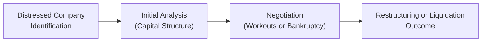

## Introduction

Distressed investing can feel a bit like riding a roller coaster in the dark—you sense all the ups and downs, but the path ahead isn’t always crystal clear. Still, for investment professionals who do their homework, distressed opportunities can provide outsized returns when approached with a structured framework, strong legal understanding, and meticulous analysis. We’ll explore the full continuum of distressed investing, from spotting early warning signals to handling formal bankruptcy cases, and (hopefully) coming out on the other side with a positive recovery.

## Lifecycle of a Distressed Investment

It’s useful to picture how a distressed investment generally proceeds, because the ride can be bumpy and unpredictable. Below is a simple diagram offering a broad overview:

• Identification: Investors begin by examining signs of distress (like plummeting cash flows, persistent covenant breaches, or management turnover).  
• Initial Analysis: A deep dive into the company’s capital structure, debt repayment schedule, and strategic positioning.  
• Negotiation: Depending on the severity of the situation, negotiations can unfold privately (out-of-court workout) or under a court-supervised process (e.g., Chapter 11 in the United States).  
• Restructuring or Liquidation: The process culminates in either a rehabilitation of the company (in which stakeholders potentially receive restructured securities) or liquidation (where asset sale proceeds are used to repay creditors).

## Spotting Early Warning Signals

Investors often find it easier to spot problems in hindsight. But in practice, you know, the signs can be really subtle—like when a previously profitable firm suddenly starts missing internal revenue targets or burning through its credit lines. Some of the key indicators:

• Deteriorating Cash Flows: Persistent negative operating cash flows can erode liquidity quickly.  
• Covenant Breaches: Violations tied to debt covenants—especially coverage or leverage ratios—suggest the firm might struggle to meet obligations.  
• Rising Interest Expense: This could indicate the firm is stretching its capital structure, relying on more expensive forms of capital.  
• Credit Downgrades: Rating agency actions can often foreshadow trouble.  
• Operational Disruptions: Management shakeups, lawsuits, or supply chain crises may also push firms into distress.

One time, I personally analyzed a mid-sized trucking company that was behind on its interest payments—its super-high accident claims actually turned out to be the real culprit. They were losing insurance coverage faster than they could negotiate new deals. Astute analysis of increasing insurance premiums and legal fees revealed the unraveling well before official announcements.

## Key Legal Frameworks in Distressed Situations

Perhaps the biggest challenge with distressed debt is dealing with jurisdiction-specific laws and regulations. In the U.S., Chapter 11 of the Bankruptcy Code is front and center, but other countries have their own procedures, each with unique nuances.

### Chapter 11 (U.S.)

Under Chapter 11, a debtor can continue operating its business as a “Debtor in Possession” (DIP). DIP financing gets priority in the capital stack—meaning these new lenders often step in ahead of existing creditors, making the stakes high for senior secured holders who assumed they were first in line. The bankruptcy court oversees the entire process, ultimately approving a reorganization plan if it meets certain statutory criteria, including fairness and feasibility.

### Debtor-in-Possession (DIP) Financing

DIP financing is lifeblood for a company that’s still operating but short on cash. Lenders providing DIP financing tend to demand stringent terms. For instance, they often require strict milestones for plan development or sale of assets, plus real-time financial updates. If you’re on the other side of the negotiation as an existing creditor, DIP financing can dilute or subordinate your claim. Hence, the structure of DIP financing is frequently hotly contested in court hearings.

### Other Jurisdictions

In Europe, procedures like the U.K.’s administration or Europe-wide frameworks under the EU Restructuring Directive can guide reorganization. Asia and Latin America have their own legal intricacies, which sometimes require additional cross-border coordination. This growing globalization of distressed assets means investors must be aware of local legal reorganization timelines, creditor rights, and country-specific enforcement risks.

## Evaluating Distressed Companies

At the heart of distressed investing is rigorous credit analysis. The question, basically, is: “What is the real hair-on-fire scenario for this company, and can it still repay most or all of its obligations?” Let’s highlight a few considerations:

### Capital Structure Analysis

Understanding the company’s layers of debt and equity is crucial. Review everything—senior secured loans, bonds, subordinated notes, preferred shares, and common equity. Identify where you might invest along that hierarchy:

• Senior Secured: Highest priority on assets.  
• Senior Unsecured: Behind secured claims but ahead of subordinated debt.  
• Subordinated Debt: Receives residual claims once senior creditors are satisfied.  
• Equity: Typically last in line for recoveries.

A useful formula in capital structure analysis is the approximate recovery rate. You might see it expressed as:


\text{Recovery Rate} = \frac{\text{Estimated Value of Restructured Company or Liquidation Proceeds}}{\text{Relevant Claim}}


where “Relevant Claim” is your debt principal or par value. Because of the wide range of outcomes in distress, you might run multiple scenarios (best, base, worst) to see how changes in business valuation or priority of claims affect your slice of the pie.

### Recovery Rates and Default Probabilities

Let’s say you’re evaluating a distressed bond. You’d want to estimate the probability of a default event within a certain time horizon and the expected recovery in that scenario. For example:

• Probability of default (PD) might be gleaned from credit ratings or structural analysis.  
• Recovery (R) can be estimated from comparable reorganizations.  
• Expected Loss (EL) can be approximated:  
  
  \text{EL} = \text{PD} \times (1 - \text{R})
  

This type of math may seem basic, but in distressed situations, the real trick is figuring out the right PD and R in an environment of great uncertainty. You can’t rely solely on rating agencies—they often lag behind reality, especially for mid-market or unrated firms.

## Out-of-Court Workouts vs. Formal Bankruptcy

Investors need to balance time, complexity, and costs when deciding to push for an out-of-court solution versus official bankruptcy proceedings.

### Out-of-Court Workout

An out-of-court workout is basically a private negotiation among the company and major creditors. If it’s successful, everyone saves time and money by avoiding the lengthy court process. However, out-of-court deals can be tough to coordinate, especially when you have diverse creditor groups or holdouts who believe they can get a better deal in court.

Pros:  
• Faster, cheaper, more flexible.  
• Greater confidentiality, helping preserve a company’s brand image.  

Cons:  
• May not be legally binding if all major creditors don’t agree.  
• Minority stakeholders can create hurdles, seeking to hold out for better terms.

### Formal Bankruptcy Proceedings

Once a company files for bankruptcy, an automatic stay halts most creditor collection actions. A reorganized plan can bind dissenting creditors if it meets the legal requirements. This process can be expensive, but it may be the only route if disagreements are insurmountable.

Pros:  
• Protects debtor from aggressive creditors.  
• Court has power to finalize a plan, even over some dissenters.  

Cons:  
• High legal fees, lengthy time frame.  
• Ongoing public scrutiny can damage brand equity.

## Importance of Securing Seniority

Being near the top of the capital stack is generally the best place to be in a distressed scenario—assuming the assets have enough value to cover your claim. Sometimes you’ll see investors buy up senior secured debt precisely to ensure they have the biggest say at the negotiation table. After all, those at the top of the stack may be able to “prime” lower-tier creditors or negotiate better concessions. This interplay often leads to complicated jockeying among creditor groups as they look to shore up or improve their claims’ seniority.

## Distressed Market Trends and Cross-Border Nuances

Global markets are seeing more private credit funds stepping into distressed situations. These funds may take a hybrid approach, offering bridge loans or participating in DIP financing. Cross-border distress is also on the rise as corporations expand internationally. This presents additional legal complexity, since local courts in different jurisdictions might have competing claims on assets. For instance, a Brazilian firm with bondholders in Europe may complicate an out-of-court workout if some bondholders push for enforcement according to local laws. 

Anyway, the overarching idea is that the distressed investor must pay careful attention to cross-border insolvency frameworks such as the UNCITRAL Model Law on Cross-Border Insolvency. Familiarity with these frameworks can make or break an investment’s success.

## ESG in Distressed Scenarios

Environmental, Social, and Governance (ESG) factors have begun to shape the distressed universe in surprising ways. A company with serious environmental liabilities (like contamination or toxic boilers, you name it) can face inflated cleanup costs—or risk regulator interventions. Social issues might lead to expensive lawsuits or brand damage. Corporate governance is also in the spotlight, especially if the problems that led to distress were exacerbated by poor controls or fraud. Investors might see an opportunity to turn around a firm’s ESG profile by implementing better oversight and sustainability measures—which could enhance the firm’s perceived long-term value post-restructuring.

## Modeling Tools for Restructuring Scenarios

Financial modeling for distressed investing often requires scenario analysis: “What if the company’s sales don’t fully recover?” or “What if we have to liquidate certain assets?” Generally, you might build a few distinct models:

• Reorganization Model: Projects the firm’s free cash flows under a restructured capital structure and perhaps new management assumptions (like lower overhead or improved pricing). This is typically a multi-year discounted cash flow (DCF) analysis.  
• Liquidation Model: Breaks down the firm’s assets and estimates how much each could fetch under a forced-sale scenario. Then you allocate proceeds across the capital structure based on seniority.  
• DIP-Enhanced Model: If the company obtains DIP financing, run a scenario that includes new priority loans plus any changes to the old capital structure.  

You might occasionally do a partial liquidation model—where the firm sells selected non-core assets to raise liquidity but retains its main operations. The goal is to compare these different approaches, weigh them against an investor’s entry price, and decide if there’s enough cushion to handle unexpected adversity.

## Implementation Tips and Common Pitfalls

• Over-reliance on management statements: Management may paint a rosy picture, so always do independent fact-finding (e.g., talk to suppliers and check reputational risk).  
• Failing to factor in legal costs: Bankruptcy-related fees can pile up, reducing the pot available to creditors.  
• Underestimating DIP financing risk: DIP lenders might impose restrictive covenants that hamper operations or subordinate existing claims.  
• Timing: Distressed scenarios can drag on for months—if not years—testing the patience and liquidity of investors.

## Exam Tips for CFA Candidates

• Be ready to demonstrate how to calculate recovery rates, expected losses, and probabilities of default for distressed securities.  
• Show you can articulate differences between out-of-court workouts and formal proceedings.  
• For constructed-response (essay) questions, practice short, concise explanations of legal frameworks like Chapter 11 or DIP financing and how they influence capital structure outcomes.  
• Time management is crucial: Distressed investing questions often cover multiple subtopics. Address each part with a clear structure—start with definitions and assumptions, then provide calculations or reasoned arguments.  
• Don’t forget the ethical angle. The CFA Institute Code and Standards encourage thorough due diligence and fair treatment—particularly relevant if you’re trading in volatile, potentially illiquid distressed instruments.

## References

- Moyer, S. G. (2018). Distressed Debt Analysis: Strategies for Speculative Investors.  
- Altman, E. I. (2019). Credit Risk and High Yield Junk Bonds.  
- American Bankruptcy Institute: https://www.abi.org  
- Turnaround Management Association: https://turnaround.org  

--------------------------------------------------------------------------------

## Practice Questions: Distressed Investing and Restructuring Opportunities



### Which of the following early warning signals most strongly indicates a firm is in the early stages of financial distress?

- [ ] Growth in retained earnings
- [ ] High return on assets (ROA)
- [x] Consistently deteriorating cash flows
- [ ] Strong current ratio

> **Explanation:** Persistent deterioration in cash flows signals the firm may be unable to generate sufficient operating income to cover obligations, often the clearest red flag in early financial distress.

---

### In the context of U.S. bankruptcy law, which statement best describes Debtor-in-Possession (DIP) financing?

- [ ] DIP financing is always subordinate to existing secured debt.
- [x] DIP financing typically has priority over pre-petition claims.
- [ ] DIP financing can only be provided by the government.
- [ ] DIP financing is not allowed in Chapter 11 cases.

> **Explanation:** DIP financing is a specialized funding that ranks above pre-petition claims, offering protection to new creditors who support a company undergoing Chapter 11 reorganization.

---

### An out-of-court workout can be preferable to formal bankruptcy proceedings primarily because:

- [ ] It can bind minority creditors more effectively.
- [ ] It requires unlimited disclosure of internal company information.
- [x] It generally leads to lower transaction costs and fosters confidentiality.
- [ ] It applies only to large, publicly traded firms.

> **Explanation:** Out-of-court workouts often avoid the complexity and publicity of formal bankruptcy, saving on high legal costs, although they lack some of the binding powers of court-based proceedings.

---

### In a distressed scenario, senior secured creditors:

- [ ] Have the same priority as subordinated bondholders.
- [ ] Automatically lose their claim if DIP financing is introduced.
- [ ] Are always paid in full, regardless of asset values.
- [x] Usually hold the highest priority claim on specific collateral.

> **Explanation:** Senior secured creditors have a lien on specific collateral, placing them ahead of unsecured and subordinated creditors in the priority hierarchy.

---

### Which factor most accurately characterizes the main difference between a reorganization model and a liquidation model in distressed valuations?

- [ ] Reorganization models ignore operating cash flows.
- [x] Liquidation models focus on asset sale proceeds instead of ongoing free cash flows.
- [ ] Liquidation models usually assume the company’s growth rate will be robust.
- [ ] Reorganization models do not consider capital structures.

> **Explanation:** In a liquidation model, assets are sold off, whereas a reorganization model typically values ongoing operations and future cash flows under a revised capital structure.

---

### In a distressed debt analysis, calculating the expected recovery rate typically involves:

- [x] Estimating the proceeds from asset sales or reorganization and dividing by the principal claim.
- [ ] Using simple interest formulas to forecast future coupon payments.
- [ ] Only assessing interest coverage without factoring in future operations.
- [ ] Relying on credit agency ratings to determine a standard recovery percentage.

> **Explanation:** Recovery rate is the ratio of the present value of what creditors expect to receive (through liquidation or reorganization) to the original claim amount.

---

### Which of these cross-border insolvency challenges might complicate a distressed situation involving a multinational firm?

- [x] Differing bankruptcy regimes and priorities in each jurisdiction.
- [ ] Uniform application of the U.S. Chapter 11 code worldwide.
- [ ] Automatic subordination of all foreign bondholders to domestic lenders.
- [ ] A single, universal approach that places equity first in the recovery waterfall.

> **Explanation:** When companies operate in multiple countries, they face disparate legal systems, creditor rights, and enforcement mechanisms, leading to potential complexity in a restructuring.

---

### ESG considerations in a distressed scenario may primarily affect the firm’s:

- [ ] Coupon payment schedule on outstanding bonds.
- [ ] Legal right to file for bankruptcy protection.
- [x] Liability exposures (environmental or social) that can influence valuation.
- [ ] Status as a senior lender in DIP financing.

> **Explanation:** Poor environmental or social practices can trigger liabilities—cleanup expenses, lawsuits, reputational harm—that reduce the firm’s overall value in a restructuring or liquidation.

---

### When performing a restructuring model for a distressed firm, one key difference from a standard corporate valuation model is:

- [ ] Ignoring future cash flows and focusing on past performance only.
- [x] Factoring in new capital structures, DIP financing terms, or partial asset sales.
- [ ] Excluding discount rates or cost of capital calculations.
- [ ] Expanding the model to an indefinite time horizon without projected statements.

> **Explanation:** In distressed modeling, analysts often integrate changing capital structures (e.g., DIP financing, partial liquidations), which can drastically alter the pro forma balance sheet and cash flow projections.

---

### True or False: Ongoing legal fees and administrative costs in bankruptcy can reduce the pool of funds available for creditors, thus lowering potential recovery rates.

- [x] True
- [ ] False

> **Explanation:** Professional fees and legal expenses can consume significant cash during bankruptcy, directly impacting the funds available to repay creditor claims.


