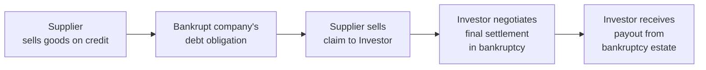

## Introduction
In the world of special situations and event-driven investment strategies, trade claims might not sound like the most riveting topic. Honestly, it's not something most of us casually discuss at weekend barbecues. But trade claims—and the secondary market that has sprouted around them—can be downright fascinating when you think about the interplay between creditors, bankrupt companies, and savvy investment funds. If you’ve ever known someone who’s been stuck waiting to get paid by a bankrupt counterparty, then you know how frustrating the entire process can be. I have a friend who owned a small logistics firm, and after one of his big customers went under, he spent months in limbo wondering if he'd ever see any money. Secondary market participants are often the folks who swoop in, offer immediate cash, and then try to turn a profit by collecting on those claims in the future.

Below, we’ll dive into the nuts and bolts of how the secondary market for trade claims works, why it exists, and who benefits from it.

## Defining Trade Claims and the Secondary Market
Trade claims are essentially debt obligations owed by a bankrupt or distressed company to its suppliers, service providers, or vendors. These claims represent money the bankrupt entity owes for goods delivered or services performed prior to the bankruptcy filing. Once a company files for bankruptcy, the legal avenues for collecting on those debts can become complicated and time-consuming.

Enter the secondary market: a platform or network—often facilitated by specialized brokers or direct negotiations—where original claimants (like suppliers) can sell these claims to investors. By selling, the suppliers get quick cash (admittedly, at a discount), while buyers anticipate a profit if the eventual court-approved payout exceeds what they paid.

### Connection to Distressed Investing
You might have read in earlier sections—particularly in the broader discussion on distressed investing (see “10.1 Distressed Investing and Restructuring Opportunities”)—that some funds thrive on purchasing troubled debt or equity at discounted prices. Trade claims fit into the same ecosystem. They’re just another form of obligation or financing arrangement that can be scooped up at a bargain, often promising higher returns if the investing firm navigates the legal process effectively.

## Why a Secondary Market Exists
Think of it like this: If you’re a supplier, you might be fine waiting three or four years to collect your money (or some part of it). But for many businesses, that’s just not possible. They have pressing cash-flow needs, payroll to meet, or new inventory to buy. So, the original claimant might prefer to sell that claim for immediate money—perhaps 60 or 70 cents on the dollar—rather than wait for an uncertain payout down the road.

From an investor’s standpoint, purchasing these claims can be lucrative because:
• The claims might ultimately pay out at a higher rate than the initial acquisition cost (e.g., 80 or 90 cents on the dollar after legal proceedings).  
• Experienced funds can employ legal expertise and negotiation to improve the recovery rate.  
• These claims, however illiquid, can be combined in a portfolio with other distressed assets, promising potentially uncorrelated returns relative to traditional bonds or equities.

## Key Concepts in Trade Claim Valuation
Valuing a trade claim is no simple matter. It’s not like there’s a well-known market price ticker on every single trade claim out there. Instead, specialized investors try to estimate how much of that claim will eventually be recovered, when it will be recovered, and how much time and money they’ll have to spend to see that recovery happen.

Below are some of the major drivers:

1. **Expected Recovery**  
   This is the big one. Investors will make an educated guess about what portion of the original claim amount they can recoup from the bankruptcy estate. Complexities such as the company’s liquidity, remaining assets, priority of claims, and the broader restructuring plan all factor into the assessment.

2. **Priority Level**  
   Trade claims often fall under the category of unsecured claims, which can be junior to secured debt or other forms of senior obligations. Because of this, the expected payout might be lower, and it might take longer to receive. But then again, if the company has enough assets—or if there’s a strong likelihood of a reorganization—trade claims might fare reasonably well.

3. **Legal and Setoff Rights**  
   Sometimes the bankrupt company might have setoff rights. For instance, if the supplier also owed money back to the debtor, the net claim might be reduced. Trade claim buyers have to carefully verify the legitimacy of the claim and ensure that priority or setoff complications are understood before buying.

4. **Time Frame for Payout**  
   Bankruptcy proceedings and post-petition negotiations can drag on for years (and that’s not an exaggeration—some big corporate bankruptcies can last half a decade or more). Investors will discount the claim’s estimated cash flow by an appropriate rate, factoring in the opportunity cost and risk over time.

5. **Legal Costs and Negotiation**  
   Let’s not forget legal fees can be large. If you plan to actively negotiate with the debtor or other stakeholders, you’ll incur legal expenses. These costs must be weighed against the potential upside to ensure the net proceeds are still attractive.

### A Simple Formula
A broad-strokes approach to valuing one of these claims might look like:


\text{Trade Claim Value} = \frac{\text{Expected Recovery Amount}}{(1 + r)^t} - \text{Legal Costs}


Where:
• \\( \text{Expected Recovery Amount} \\) is the potential payout in nominal terms.  
• \\( r \\) is the discount rate reflecting both the time value of money and the risk of non-payment.  
• \\( t \\) is the estimated number of years before the claim is settled.  
• \\(\text{Legal Costs}\\) represent the expected legal and administrative expenses associated with collecting (if the buyer has to fight for it).

This formula is obviously a simplification. In practice, each of these components gets hammered out through negotiation, due diligence, and an evaluation of the bankrupt entity’s overall capital structure.

## The Due Diligence Process
Picture yourself as a distressed debt hedge fund manager—perhaps leaning back in your chair with a big binder on your desk labeled “Trade Claim #4257.” What do you look for?

1. **Authenticity and Documentation**  
   First, you check the invoice records, proof of delivery, and any relevant purchase orders to ensure the claim is real. If there’s a discrepancy in the amounts or outstanding balances, that’s a red flag.

2. **Claim Priority**  
   You’ll investigate where this trade claim sits in the queue of creditors. Is it an unsecured claim, or does it have some sort of guarantee? Are there circumstances that might elevate its ranking in the hierarchy (e.g., administrative expense priority in some jurisdictions)?

3. **Setoff or Counterclaims**  
   If the bankrupt entity was also doing business with the creditor in some reciprocal arrangement, the net claim might be smaller than it appears on paper. You don’t want to find out about a big setoff after you’ve bought the claim at a premium.

4. **Court Filings and Docket Review**  
   Bankruptcy proceedings leave a paper trail—lots of it. Checking court documents, reading the docket, and understanding the reorganization plan will help you see how creditors are likely to be treated. Any pending motions or litigation that affects your claim’s payout schedule also needs attention.

5. **Negotiated Settlement History**  
   Has the debtor made any settlement offers to general unsecured creditors? Have large noteholders or other big players in the capital structure indicated a direction for the plan of reorganization? This context can help you gauge whether the claim is likely to realize a good percentage of face value.

## Liquidity and Immediate Cash
For many suppliers and original claimants, immediate liquidity is the magic phrase. I remember the heartbreak of my friend in the logistics industry, who had to lay off staff while waiting on a large overdue invoice from a (now bankrupt) company. Luckily, he eventually found an opportunity to sell his right to that invoice. Even though he only got about 50 cents on the dollar, it let him keep his business alive. That’s the real advantage of having a secondary market for trade claims—it’s an outlet for those in dire need of cash flow to exit a precarious position sooner rather than later.

### Diagram: How a Trade Claim Transfers in the Secondary Market

In this flow:
• The supplier initially sells goods or services and is left unpaid when the company declares bankruptcy.  
• The secondary market investor purchases the claim at a discount.  
• The investor then heads into the bankruptcy proceedings, eventually collecting some return.

## Typical Market Participants
Several kinds of players populate this market:

- **Hedge Funds and Distress-Focused Funds**  
  These are the heavy hitters. They have the capital, legal muscle, and risk appetite to buy up large volumes of trade claims—sometimes from multiple suppliers—to accumulate meaningful influence in the bankruptcy negotiations.

- **Specialized Brokerage Platforms**  
  Some platforms cater specifically to connecting trade claim sellers and buyers. These can operate similarly to an over-the-counter marketplace, charging a transaction fee.

- **Banks and Financial Institutions**  
  Though less common, certain investment banks or specialized financial firms might facilitate the purchase and sale of trade claims, especially if they see an opportunity for synergy with other distressed investments.

- **Individual Investors**  
  Typically, individuals aren’t heavily involved unless they’re accredited investors or have some specialized knowledge. The due diligence burden and legal complexities are substantial, so this corner of the market tends to favor institutional players.

## Legal and Negotiation Tactics
One of the trickiest parts of investing in trade claims is navigating the legal process. In many jurisdictions, bankruptcy proceedings adhere to complex sets of rules—for example, Chapter 11 in the United States or the Administration/Company Voluntary Arrangement (CVA) in the UK. Skilled attorneys or restructuring specialists can significantly influence the settlement for these claims.

- **Ad Hoc Creditor Committees**  
  Sometimes, claim holders band together to form committees that represent their collective interests. If you control a sizeable portion of unsecured trade claims, you might have leverage in negotiations with the debtor.

- **Litigation Maneuvers**  
  Investors might pursue litigation if they believe some aspects of the claim should be treated as a priority or if they think the debtor is not disclosing all available assets.

- **Negotiated Settlements**  
  Very often, rather than letting the court process drag on, claim holders and the debtor will come to some out-of-court arrangement (subject to court approval). A buyer with strong negotiation skills can tilt the final distribution in their favor.

## Risk Management and Potential Hazards
This market can be quite rewarding—if you know what you’re doing. If not, well, you can wind up with a claim that’s basically worthless. Here are a few pitfalls to watch out for:

1. **Uncertain Recovery**  
   Because so many variables affect the final payout, future distributions are rarely guaranteed. One negative court ruling can drastically reduce a claim’s value.

2. **Long Time Horizon**  
   The wait for resolution can be excruciatingly long. Even if you manage the legal complexities well, your capital might be tied up for years, limiting your flexibility.

3. **Illiquidity**  
   Let’s say you purchase a claim and realize you suddenly need your cash back in six months for another opportunity. That may not be possible. The secondary market is relatively small and specialized, and your claim might not be readily resold at a fair price.

4. **Unexpected Administrative Costs**  
   Legal fees, advisory costs, and potential bribes—kidding about the bribes, of course!—but all sorts of fees can mount, shrinking what you get at the end.

5. **Counterparty and Documentation Risk**  
   If the initial documentation is flawed, or if the claim was recently transferred multiple times, verifying authenticity becomes a challenge. Discrepancies or disputes can lead to delays or disallowed claims.

## A Practical Example
Imagine a supplier called “TechParts Inc.” that sold \$500,000 worth of components to a large electronics chain. The chain goes bankrupt, leaving TechParts with an unsecured claim of \$500,000. A distress-focused hedge fund approaches TechParts and offers \$200,000 (i.e., 40 cents on the dollar) to purchase the claim outright.

• TechParts, strapped for cash, says yes and takes the \$200,000 immediately.  
• The hedge fund invests resources to evaluate the bankruptcy docket, consult attorneys, and negotiate with the debtor.  
• Ultimately, two years later, the reorganization plan is approved, and the allowed claim is paid at 60 cents on the dollar (or \$300,000).  
• The hedge fund’s net investment was \$200,000 plus \$20,000 in legal fees. Its total payout is \$300,000, for a profit of \$80,000—equivalent to a 40% return over two years (not accounting for time value of money).  
• TechParts might have missed out on that additional \$100,000, but it saved itself two years of uncertainty and the risk of receiving even less.

## Integrating Concepts for Exam Success
From a CFA perspective, the secondary market for trade claims sits at the intersection of distressed debt, risk management, and event-driven strategies. You’ll want to remember the key points for the exam:

- **Cross-Asset Correlations**: These claims might have lower correlation with traditional equities or corporate bonds, highlighting potential diversification benefits.  
- **Legal Complexity**: Mastering the jargon around bankruptcy (creditor hierarchies, setoff rights, etc.) is crucial.  
- **Need for Solid Due Diligence**: You can’t just roll into a trade claim purchase without verifying all details—one slip, and you’re stuck with an unenforceable or heavily reduced claim.

For more on advanced strategies involving bankruptcies and organizational restructuring, you might cross-reference “10.1 Distressed Investing and Restructuring Opportunities.” The techniques explained there often dovetail neatly with trade claim investing—especially the emphasis on capital structure analysis and legal contingencies.

## References and Further Reading
- Mohrman, E., & Throckmorton, C. (2019). “The Trade Claims Market: A Primer.”  
- American Bankruptcy Institute Journal: [https://www.abi.org/abi-journal](https://www.abi.org/abi-journal)  
- Brokerage platforms specializing in trade claim transactions (e.g., SecondMarket, Teneo Capital).  
- “Distress-Focused Funds” discussion in Chapter 3 and Chapter 10 of this volume.  
- Relevant sections on risk and return calculations found in “Chapter 2: Alternative Investment Performance and Returns.”

## Final Exam Tips
1. **Know the Capital Structure**: Understanding how an unsecured trade claim fits into the hierarchy is key.  
2. **Distinguish Time-Weighted vs. Money-Weighted Returns**: For exam calculations, be sure you apply the right performance measure for the potential waiting period. Refer back to “Chapter 2.7: Time-Weighted vs. Money-Weighted Returns.”  
3. **Review Bankruptcy Law Basics**: Basic legal knowledge can be tested, especially in scenario-based questions.  
4. **Stay Organized**: For essay-style questions, outline your approach: define the claim, discuss the valuation approach, mention risk factors, and propose how you’d hedge or mitigate those risks.

-----

## Test Your Knowledge: Secondary Market for Trade Claims



### In a bankruptcy scenario, which term refers to legal entitlements allowing a debtor to offset claims against amounts owed to the creditor?
- [ ] Priority rights
- [ ] Transferable rights
- [x] Setoff rights
- [ ] Conversion rights

> **Explanation:** Setoff rights permit the debtor to reduce the net amount owed by offsetting any counterclaims it holds against the creditor. This can impact the size and value of a traded claim.

### What is the primary motivation for a supplier to sell its trade claim in the secondary market?
- [ ] To capture a higher final settlement
- [x] To gain immediate liquidity
- [ ] To increase legal leverage in the bankruptcy process
- [ ] To enhance its credit rating

> **Explanation:** Suppliers often lack the cash flow to wait out a lengthy bankruptcy resolution, so selling at a discount grants them immediate funds—though it means forfeiting any potential higher payout in the future.

### Which of the following statements is most accurate regarding the liquidity of trade claims?
- [x] Trade claims can be highly illiquid, particularly if no buyer is available at a reasonable price.
- [ ] Trade claims are extremely liquid and traded on a centralized, regulated exchange.
- [ ] Once purchased, trade claims must be held to maturity with no option for resale.
- [ ] Liquidity of trade claims is identical to that of high-yield corporate bonds.

> **Explanation:** While there is a secondary market for trade claims, it is not nearly as active or transparent as the markets for many other securities, making these claims relatively illiquid.

### Which factor most directly affects the discount rate used to value a trade claim?
- [x] The probability of receiving a payout plus the overall time horizon and risk
- [ ] The company’s credit rating alone
- [ ] The age of the account receivable
- [ ] Fees paid to the originating supplier

> **Explanation:** The discount rate is influenced by the risk factors (both default and legal) and the time value of money. A higher perceived risk or a longer timeline naturally increases the discount rate.

### In the valuation of trade claims, what is the standard approach to calculate the “expected recovery amount”?
- [x] Estimate how much the bankruptcy court will approve and distribute to unsecured creditors.
- [ ] Always assume the nominal face value of the trade claim.
- [ ] Subtract attorney fees from the claim’s principal.
- [ ] Take the original invoice value and add accrued interest.

> **Explanation:** The expected recovery is based on actual disbursements that might come from the bankruptcy estate, which is rarely the same as the nominal face value.

### What is the primary reason a trade claim’s ranking in the capital structure matters?
- [x] Priority level determines the order of payment and thus the expected payout.
- [ ] High-ranking claims are illegal in most jurisdictions.
- [ ] Senior trade claims are always paid dividends first.
- [ ] Capital structure is irrelevant in bankruptcy outcomes.

> **Explanation:** Higher-ranked creditors typically receive distributions before lower-ranked creditors, which directly influences the percentage of face value recovered.

### Which participant is most typical in the secondary market for trade claims?
- [x] Distress-focused hedge funds
- [ ] Individual retail investors with limited capital
- [ ] Passive index funds
- [ ] Traditional venture capitalists

> **Explanation:** Distressed hedge funds and specialized institutional investors are most active in this niche segment, leveraging their legal expertise and risk capital.

### If a trade claim has a face value of $500,000 and the buyer estimates a 60% recovery in 3 years, ignoring legal fees, what is the undiscounted payout?
- [x] $300,000
- [ ] $500,000
- [ ] $30,000
- [ ] $200,000

> **Explanation:** 60% of $500,000 is $300,000. That figure is the potential payout before any discounting for time or risk.

### In determining whether to purchase a trade claim, which of the following sets of factors is most relevant?
- [ ] The debtor’s per-share dividend track record
- [ ] The claimant’s internal auditing and governance practices
- [x] The legitimacy of the claim, the bankruptcy’s capital structure, and any setoff rights
- [ ] The supplier’s late delivery penalties

> **Explanation:** Legitimacy, seniority or priority in the capital structure, and setoff rights have a significant impact on how much and when the buyer might get paid.

### True or False: Because of volatility and uncertainty, trade claims are entirely unsuitable for adding diversification to a portfolio.
- [ ] True
- [x] False

> **Explanation:** Although they carry higher uncertainty, trade claims often behave differently from traditional equities or bonds, offering potential diversification benefits to sufficiently sophisticated investors.


